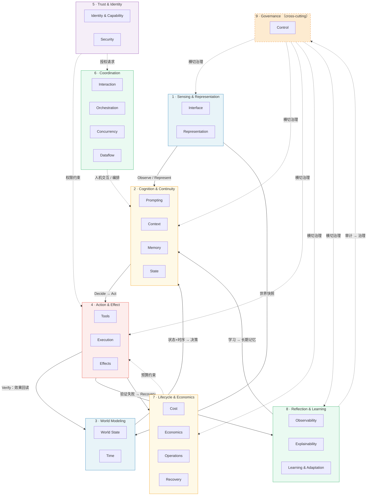
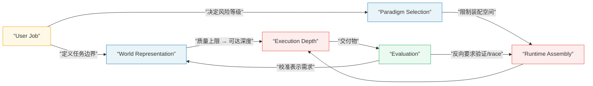
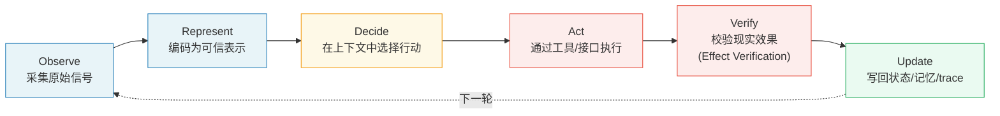
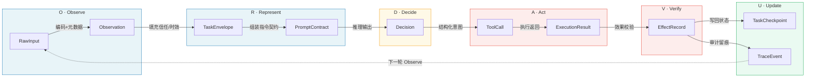
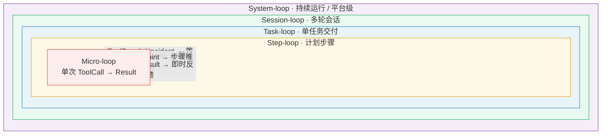
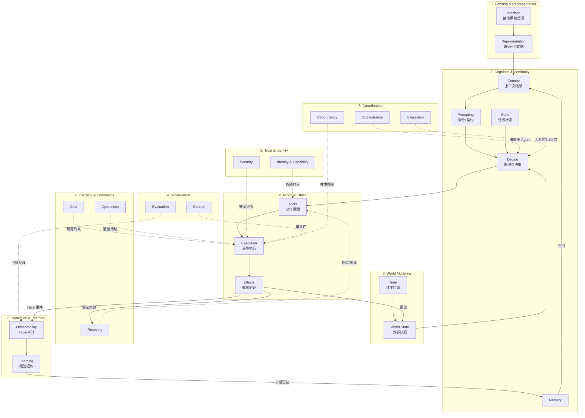

# AI Agent 架构总纲

> **Evidence Status** — synthesized. 跨项目观察归纳，品类架构、运行时 plane、参考代码骨架与 eval-runner 的综合抽象。

> **代码定位**：本 skill 中的 starter-kit、eval-runner 和源码观察摘录是参考性代码资产，用于解释架构对象如何衔接；它们不是生产框架，也不是使用本 skill 的必要依赖。

本文是架构总纲：核心命题、产品公式、ORDA-VU 闭环、域分组、数据资产。使用入口和导航见 [SKILL.md](SKILL.md)。

> **本文定位**：这是架构的深度参考，不是入口。任务分流请回 [START-HERE.md](START-HERE.md)，速查请用 [SKILL.md](SKILL.md)。

### 9 域 25 Plane 全景图



## 核心命题

Agent 的核心定义见 [SKILL.md](./SKILL.md)。本文档聚焦架构展开。

设计一个完整的 Agent 架构，必须同时回答九个问题：

1. 用户真正要完成的 job 和交付物是什么？
2. 现实如何进入系统，原始引用是否保留？
3. 现实被编码成什么表示，表示的信任、时效和置信度是什么？
4. 采用哪种范式组织推理、记忆、工具、协作和控制？
5. 模型在什么上下文中做决策，哪些信息被排除在上下文外？
6. 决策如何变成受控行动，行动是否越过身份、权限和安全边界？
7. 行动是否真的改变了外部世界，而不仅是工具返回成功？
8. 失败、部分效果、不可验证效果和用户中断如何恢复？
9. 系统如何被评估、观测、运维和持续改进？

## Agent 产品的约束关系

Agent 产品不是模块的简单加法或乘法。用户任务、世界表示、范式选择、运行时能力和评估标准之间是**相互约束**关系——任何一个要素的质量都会限制或扩展其他要素的可达空间。

| 要素 A | 约束 → 要素 B | 约束方式 |
|---|---|---|
| User Job | → World Representation | 任务决定需要观察什么、表示什么 |
| User Job | → Required Depth | 任务风险和复杂度决定最低执行深度 |
| World Representation 质量 | → 可达 Execution Depth 上限 | 表示不可靠，深度再高也无意义 |
| Paradigm Selection | → Runtime Assembly 空间 | 范式限制可装配的模块 |
| Evaluation 标准 | → 需要的验证和 trace | 评估反向要求运行时能力 |
| Evaluation 结果 | → World Representation 校准 | 交付偏差暴露表示缺陷，驱动表示改进 |

闭环路径：Observe → Represent → Decide → Act → Verify → Update。每一步的输出质量都受上游约束、反馈给下游。



### 使用前提

贯穿整个知识库的前提：

- 模型处理的是**表示**，不是现实本身。
- 闭环必经接口、工具、执行环境、传感器与效果验证，缺一不可。
- 生产 Agent 是受控的表示-决策-行动-验证-交互-回归系统，不是”模型 + 工具”的拼接。
- 范式先于模块：先选构建思路，再装配模块，再落到品类架构。
- 本 skill 是无状态知识库，不依赖发布标签或日期包名。
- 代码片段仅用于说明架构概念；采用前须按目标系统重新设计接口、安全、测试和运维。

知识树层级和入口导航见 [SKILL.md 主干层级](SKILL.md#主干层级)。

## ORDA-VU 闭环

无论多复杂的 Agent，运行时的核心骨架都是：

```text
Observe → Represent → Decide → Act → Verify → Update
```



### ORDA-VU 数据流：核心数据对象的流转

下图展示 ORDA-VU 各阶段产出的数据对象及其流转关系。每个节点标注所属阶段：



### 闭环粒度

ORDA-VU 可以嵌套；不是每次 tool call 都要完整跑一轮大循环：

| 粒度 | 范围 | 典型产物 | 何时使用 |
|---|---|---|---|
| Micro-loop | 单次工具调用或单个观察 | ToolCall、ExecutionResult | 工具结果直接影响下一步时 |
| Step-loop | 计划中的一个步骤 | StepCheckpoint、EffectRecord | Plan-and-Execute 或 coding 子任务 |
| Task-loop | 完成一个用户任务 | TaskEnvelope、Deliverable | 大多数交付型 Agent |
| Session-loop | 多轮会话或长任务 | TaskState、Memory candidate | 用户纠错、跨轮上下文、长期协作 |
| System-loop | 持续运行系统 | EvalResult、Incident、Learning candidate | Ops/SRE、agent platform、长期 memory 系统 |

五层粒度从内到外嵌套，内层循环频率高、延迟低，外层循环跨度大、反馈慢：



### Effect Verification 不可达时的退化

效果验证（Effect Verification）并不总是可直接观测。成熟 Agent 需要显式退化，而不是假装已验证。注意区分三类验证：效果验证（行动是否改变了外部世界）、表示验证（输入编码是否准确可信）、安全验证（操作是否越过权限边界）。本节聚焦效果验证：

| 验证状态 | 含义 | 允许交付 |
|---|---|---|
| verified | 有 readback/test/external ack/sensor/human confirm | 可声明完成 |
| partially_verified | 部分后置条件可验证，部分不可达 | 声明已验证部分和剩余风险 |
| unverifiable_by_agent | Agent 无法直接观测现实效果 | 请求人类确认或交付待确认状态 |
| failed | 后置条件不成立 | 进入 Recovery，不得声明完成 |
| blocked | 权限、策略、成本或安全边界阻止验证 | 解释阻塞，给出可行动下一步 |

### Update 更新什么

Update 不是一句“记住结果”。不同对象有不同更新路径：

| 更新对象 | 何时更新 | 不应做什么 |
|---|---|---|
| TaskState | 任务进展、open question、checkpoint 变化 | 不把外部事实存在任务状态里 |
| WorldStateSnapshot | 外部对象被重新观察 | 不让长期记忆覆盖当前快照 |
| EffectRecord | 验证状态变化 | 不用工具成功替代效果验证 |
| Memory / Learning Candidate | 有可复用、经验证的经验 | 不写入一次性状态或未验证猜测 |
| InteractionEvent | 用户审批、纠错、教学、中断 | 不把普通消息直接当授权 |
| Trace / Eval Candidate | 关键路径、失败、恢复 | 不丢失 evidence refs |

## 运行时职责拓扑

```text
External Reality
  → Intake & Representation
  → Cognition & Continuity
  → Governance Gates
  → Action & Effect
  → Interaction & Collaboration
  → Recovery / Update / Evaluation
  → Deliver or Continue
```

治理不是“最顶层的事后检查”，而是贯穿每条边界的横切关注点：Control、Security、Cost、Observability、Operations、Identity、Recovery 和 Learning 在不同阶段都可能介入。

## 域分组（Domain Grouping）

25 个 plane 按 9 个域分组，收敛入口。每个域内的 plane 保持独立文档，通过域入口统一索引：

| 域 | 包含的 Plane | 主要问题 |
|---|---|---|
| **1. Sensing & Representation** | Interface, Representation | 现实如何进入系统？如何编码为可信表示？ |
| **2. Cognition & Continuity** | Prompting, Context, Memory, State | 如何决策？如何维持任务连续性？ |
| **3. World Modeling** | World State, Time | 外部世界的当前状态和时序约束是什么？ |
| **4. Action & Effect** | Tools, Execution, Effects | 如何执行动作？如何验证现实效果？ |
| **5. Trust & Identity** | Identity & Capability, Security | 谁在操作？权限和攻击面是什么？ |
| **6. Coordination** | Interaction, Orchestration, Concurrency, Dataflow | 人、Agent、并发和数据流如何协同？ |
| **7. Lifecycle & Economics** | Cost, Economics, Operations, Recovery | 成本、SLO、上线、故障恢复如何管理？ |
| **8. Reflection & Learning** | Observability, Explainability, Learning & Adaptation | 如何审计、解释、从经验中学习？ |
| **9. Governance** (cross-cutting) | Control, Evaluation (via ADR) | 如何授权、审批、验证、回归？ |

```mermaid
graph TB
  subgraph G1["1. Sensing & Representation"]
    P_Interface["Interface"]
    P_Repr["Representation"]
  end
  subgraph G2["2. Cognition & Continuity"]
    P_Prompt["Prompting"]
    P_Ctx["Context"]
    P_Mem["Memory"]
    P_State["State"]
  end
  subgraph G3["3. World Modeling"]
    P_WS["World State"]
    P_Time["Time"]
  end
  subgraph G4["4. Action & Effect"]
    P_Tools["Tools"]
    P_Exec["Execution"]
    P_Eff["Effects"]
  end
  subgraph G5["5. Trust & Identity"]
    P_IdCap["Identity & Capability"]
    P_Sec["Security"]
  end
  subgraph G6["6. Coordination"]
    P_Inter["Interaction"]
    P_Orch["Orchestration"]
    P_Conc["Concurrency"]
    P_DF["Dataflow"]
  end
  subgraph G7["7. Lifecycle & Economics"]
    P_Cost["Cost"]
    P_Econ["Economics"]
    P_Ops["Operations"]
    P_Rec["Recovery"]
  end
  subgraph G8["8. Reflection & Learning"]
    P_Obs["Observability"]
    P_Expl["Explainability"]
    P_Learn["Learning & Adaptation"]
  end
  subgraph G9["9. Governance &#40;cross-cutting&#41;"]
    P_Ctrl["Control"]
    P_Eval["Evaluation"]
  end

  G1 -->|"表示不可用 → 拒绝执行"| G2
  G1 -->|"表示不可用 → 拒绝执行"| G3
  G3 -->|"状态过期 → 刷新或暂停"| G4
  G4 -->|"效果验证失败 → Recovery"| G7
  G5 -->|"权限不可用 → 拒绝执行"| G4
  G5 -->|"权限不可用 → 请求授权"| G6
  G6 -->|"通信中断 → 单 Agent 降级"| G2
  G7 -->|"预算耗尽 → advisory 模式"| G4
  G8 -->|"trace 不可用 → 提高人工审查"| G9
  G9 -.->|"横切治理"| G1
  G9 -.->|"横切治理"| G2
  G9 -.->|"横切治理"| G4
```



### 9 域交互全景图

下图以数据流和约束关系展示 9 个域之间的交互全景。实线为主数据流（信号从感知到效果），虚线为约束和反馈关系：



### 域间交叉设计

25 个 plane 之间的交叉设计问题（如 Memory × Security、Paradigm × Cost）已独立文档化。详见 `architecture/cross-cutting/README.md`。

### 域间故障传播

plane-interaction-matrix 描述域间读写关系；下表补充"故障时如何降级"：

| 故障源域 | 受影响域 | 降级策略 |
|---|---|---|
| Sensing & Representation | Cognition, World Modeling | 表示不可用 → 拒绝执行，不猜测 |
| World Modeling | Action & Effect | 世界状态过期 → 强制 refresh 或暂停写动作 |
| Action & Effect | Lifecycle & Economics | 效果验证失败 → 进入 Recovery，记录 FailureRecord |
| Trust & Identity | Action & Effect, Coordination | 身份/权限不可用 → 拒绝执行，请求人工授权 |
| Coordination | Cognition | 多 Agent 通信中断 → 单 Agent 降级运行 |
| Lifecycle & Economics | Action & Effect | 预算耗尽 → 降级为 advisory（C0） |
| Reflection & Learning | Governance | trace 不可用 → 标记为不可审计，提高人工审查频率 |

完整读写矩阵见 `architecture/plane-interaction-matrix.md`。复杂度分级见 `architecture/complexity-levels.md`。

## 范式选择层

在装配模块之前，先选择范式：

| 范式族 | 核心问题 | 入口 |
|---|---|---|
| 推理范式 | direct、ReAct、Plan-Execute、Reflection、ORDA-VU 如何选择？ | `paradigms/reasoning-paradigms.md` |
| 记忆范式 | In-context、RAG、Disclosure、分层记忆、图记忆如何取舍？ | `paradigms/memory-paradigms.md` |
| 工具范式 | 静态工具、动态发现、MCP、code-as-tool 如何组合？ | `paradigms/tool-paradigms.md` |
| 协作范式 | 单 Agent、Subagent、Worker、Peer、事件驱动如何选择？ | `paradigms/collaboration-paradigms.md` |
| 控制范式 | rule、judge、hook、sandbox、approval、verification gate 如何互补？ | `paradigms/control-paradigms.md` |
| 推理模型集成 | 推理模型如何影响范式选择和成本？ | `paradigms/reasoning-model-integration.md` |
| 方法论 | 产品画布、自治等级、执行深度、最小可行 Agent | `design-space/methodology/` |

ORDA-VU 是推荐的外层闭环；ReAct、Plan-and-Execute、Reflection、RAG、Disclosure、Worker Orchestration 等是局部策略。运行时动态切换范式见 `paradigms/paradigm-routing.md`。

## 核心数据资产

| 数据对象 | 单一事实来源 | 作用 |
|---|---|---|
| RawInputRef | Interface | 原始输入引用，保证可回查 |
| Observation | Representation | 来源、时效、信任、置信度、转换链 |
| TaskEnvelope | Intake / Depth Controller | 任务边界、权限、风险、成功标准 |
| ContextPack | Context | 当前模型能看见的信息子集 |
| PromptContract | Prompting | 指令结构、示例、输出契约 |
| Decision | Harness（即 Agent 运行时外壳） | 当前选择、理由、引用依据 |
| CapabilityGrant | Identity & Capability | 谁授权 Agent 做什么 |
| ToolCall | Tools | 结构化行动意图 |
| ExecutionResult | Execution | 工具或命令返回结果 |
| EffectRecord | Effects | 预期效果、验证状态、补偿策略 |
| WorldStateSnapshot | World State | 外部对象带时效快照 |
| FailureRecord | Recovery | 失败分类、恢复策略、状态 |
| InteractionEvent | Interaction | 审批、纠错、教学、中断、进度 |
| AgentMessage | Orchestration | 多 Agent 结构化消息 |
| TraceEvent | Observability | 可回放、可评估、可审计的运行事件 |

数据流和生命周期见 `architecture/runtime-data-flow.md`，schema 细节见 `architecture/runtime-data-model.md`。

## 最小设计问题集

```text
[ ] 用户 job 和最终交付物是什么？
[ ] Agent 需要操作哪些外部对象？哪些动作会产生外部效果？
[ ] 原始输入是否可回查？表示是否有 trust / freshness / confidence？
[ ] 任务需要什么 Execution Depth 和 Complexity Level？
[ ] 推理、记忆、工具、协作、控制范式如何选择？
[ ] Prompt、Context、Memory、State、World State 边界是否清楚？
[ ] 身份和能力授权是否有来源、范围、期限和审计字段？
[ ] 工具动作是否有 precondition、postcondition 和 risk profile？
[ ] 写动作是否有 EffectRecord 和验证方法？
[ ] 验证不可达时如何退化交付？
[ ] 失败时如何分类、恢复、补偿或停止？
[ ] 用户何时参与：澄清、审批、纠错、教学、进度或中断？
[ ] 多 Agent 场景是否有消息协议、共享世界模型和仲裁？
[ ] 并发、取消、超时、回压是否有统一语义？
[ ] 成本预算、模型路由、缓存策略是否在设计阶段定义？
[ ] 安全边界是否区分 instruction lane、data lane、tool output、memory projection？
[ ] 安全是否采用混合纵深防御（policy engine + guard model + model hardening + assurance）？
[ ] 高 stakes 任务是否使用 Contract 模式（明确验收标准、可协商、可拆分子契约）？
[ ] 记忆系统的形态（token/parametric/latent）和动态（formation/evolution/retrieval）是否匹配任务需求？
[ ] 能否 mock 外部世界、重放 trace、从失败提炼 eval fixture？
[ ] 轨迹评估是否覆盖 precision、recall、order match、tool coverage？
[ ] 是否需要多模型架构？各模型角色、置信度聚合和同源偏差是否被处理？
[ ] 长期运行的 Agent 是否有演化策略——模型升级、价值漂移检测、退役机制？
[ ] 主观性任务（审美/情感/创造）的验证是否采用了超越 postcondition 的评估方式？
[ ] 是否需要推理模型？Planner/Executor/Critic 的模型分配是否明确？
[ ] 协议栈选择是否覆盖工具（MCP）、Agent 间（A2A）、用户（AG-UI）三层？
[ ] 评估基准是否有对抗测试防护（Reward Hacking）？是否使用 pass^k 作为可靠性指标？
```

## 无状态知识库原则

本 skill 是无状态知识库。使用时读取当前文件内容，按 Evidence Status 和任务需求选择范式与模块；无需给 skill 自身制造版本号或发布标签。

对 Agent 运行时做配置指纹、行为追踪和回归评估是系统工程能力；对知识库本身制造状态标签则引入不必要的依赖。

## 实战校验

本架构框架已在以下项目中得到不同程度的校验：

| 项目 | 主要验证域 / Plane | 关注点 |
|---|---|---|
| **Claude Code** | Trust & Identity, Cognition, Action & Effect | 权限模型、上下文管理、工具系统的闭环设计 |
| **Codex** | Action & Effect, Governance, Lifecycle | 沙箱隔离、Guardian 安全门、任务状态机 |
| **OpenCode** | Cognition, Action & Effect, Trust & Identity | 函数式 DI、权限引擎、多策略编辑 |
| **GenericAgent** | Cognition & Continuity, Reflection & Learning, Lifecycle & Economics | 记忆分层、自进化循环、token 效率控制 |
| **Hermes** | Coordination, Sensing & Representation, Reflection & Learning | 多平台网关、Skill 系统、运行时学习循环 |

这些校验覆盖了主要运行时模块，但并非每个模块都在每个项目中得到充分验证。项目证据见 `projects/`，跨项目抽象见 `synthesis/`，评估入口见 `evaluation/`。
