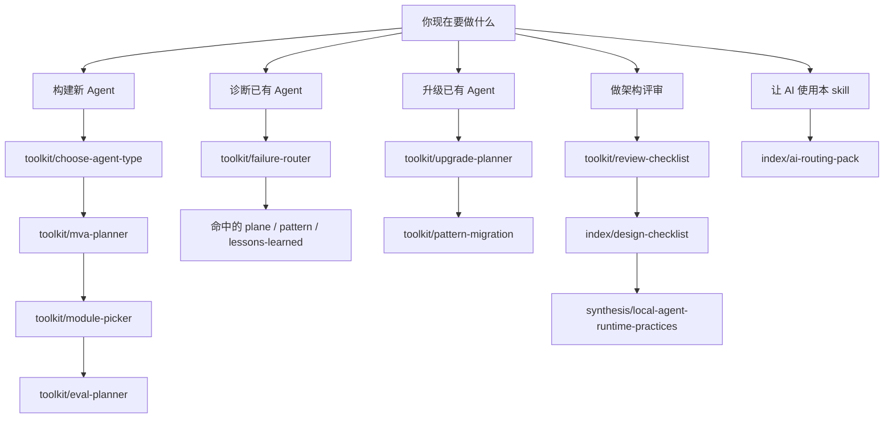

# Start Here

> **Evidence Status** — synthesized. 本页只做入口分流，不承载新的架构判断。

**这是本知识库的唯一入口。** 先按任务选择最短路径；需要系统学习时再进入 `index/mainline-map.md`。



## 路径 0 — 我想从零理解 Agent

`concepts/what-is-agent.md` → `SKILL.md` → `index/mainline-map.md`

## A. 构建一个新 Agent

四步走：选品类 → 定 MVA 级别 → 选最小模块 → 设计验收。

入口：`toolkit/choose-agent-type.md` → `toolkit/mva-planner.md` → `toolkit/module-picker.md` → `toolkit/eval-planner.md`

## B. 诊断一个已有 Agent

从症状出发，不要先重写架构。

入口：`toolkit/failure-router.md`

## C. 升级一个已有 Agent

只根据真实失败信号升级一级，避免大爆炸式重构。

入口：`toolkit/upgrade-planner.md` → `toolkit/pattern-migration.md`

## D. 做架构评审

先扫 checklist，再对照真实项目经验。

入口：`toolkit/review-checklist.md` → `index/design-checklist.md` → `synthesis/local-agent-runtime-practices.md`

如果要从哲学原则反推工程义务，走：

```text
concepts/foundations/principle-obligation-eval-map.md
  → toolkit/review-checklist.md
  → toolkit/eval-planner.md
```

## E. AI 使用本 skill

按用户意图路由到最少必要文件，不要整库展开。

入口：`index/ai-routing-pack.md`

## 以上都不符合？

- 按意图搜索（80+ 条目）：`index/intent-navigation.md`
- 系统学习路线（4 条推荐路径）：`index/mainline-map.md`
- 跨项目横向对比：`synthesis/cross-project-patterns.md`

## 知识库层级

主干图只维护在 `index/mainline-map.md`。本页只给压缩版：

```text
哲学/概念 → 认知架构 → 范式 → 品类 → 运行时 → 项目证据/综合/评估
```

证据与评估入口：`projects/`、`synthesis/`、`evaluation/`。
