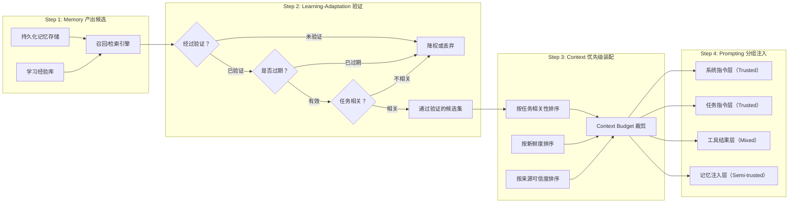

# Context x Memory x Prompting 交叉设计

> **Evidence Status** — synthesized.
> 知识库映射: Sensing&Repr (Plane 1-3) x World Modeling (Plane 7-9) x Reflection&Learning (Plane 19-20)

## 为什么需要这篇文档

Context Engineering、Memory 和 Prompting 在知识库中分别归属不同的 Plane，但在实际 Agent 系统中，三者的边界正在模糊和重叠。Anthropic 在 2026 年提出的 Context Engineering 框架明确指出："Context Engineering 是架构选择，不是 Prompt 技巧。"传统的 Prompt Engineering 已不足以描述生产级 Agent 的信息管理问题。

关键证据：
- **Anthropic 三策略**: System Prompt Goldilocks Zone + Just-In-Time 检索 + 结构化笔记，三者跨越了 Prompting/Context/Memory 的传统边界
- **Context Rot**: 上下文窗口利用率超过 70% 后，准确率下降曲线陡峭化（transformer n^2 关系）
- **Compaction API**: 在上下文极限处摘要消息历史，保留架构决策、丢弃冗余输出。这是 Context 和 Memory 的融合操作
- Agent 工作负载的上下文缩放可达 **64x** 成本放大（128K vs 8K 窗口）

本文档重新定义三个 Plane 在 Agent 系统中的边界，并建立信息在三层间的流转协议。

---

## 交叉点识别

| 交叉点 | Context 侧关注 | Memory 侧关注 | Prompting 侧关注 | 三方张力 | 设计要求 |
|--------|--------------|--------------|----------------|---------|---------|
| 信息注入时机 | 运行时按需加载 | 持久化存储后按需检索 | 编译时静态嵌入 | 动态 vs 静态 vs 持久 | Just-In-Time 策略 |
| 信息保留决策 | 上下文窗口内保留 | 跨会话持久保留 | Prompt 模板固定保留 | 窗口限制 vs 永久性 vs 固定性 | 分级保留策略 |
| 信息压缩 | Compaction（摘要旧上下文） | 记忆摘要（长期压缩） | Prompt 精简（人工优化） | 自动 vs 自动 vs 手动 | 压缩质量保障 |
| 信息来源信任 | 工具返回/Agent 产出 | 历史记忆/外部知识 | 开发者编写 | 动态信任 vs 历史信任 vs 静态信任 | 来源感知的信任分级 |
| 信息淘汰 | 上下文窗口滑动淘汰 | 时间衰减/相关性淘汰 | 版本迭代淘汰 | 自动 vs 策略 vs 人工 | 协调淘汰策略 |
| 信息检索 | 当前会话内搜索 | 跨会话语义检索 | 不涉及（静态） | 短期精确 vs 长期语义 | 融合检索层 |

---

## 三个 Plane 的边界重定义

### 传统边界（模糊且重叠）

```
Prompting: System Prompt + Few-shot 示例 + 格式指令
Context:   当前对话历史 + 工具返回 + 检索文档
Memory:    跨会话持久化的信息（用户偏好、历史摘要）
```

**问题**: 在实际 Agent 系统中，System Prompt 可能包含动态检索的信息（Context 侵入 Prompting），对话历史可能被摘要后持久化（Context 流向 Memory），历史记忆在每个新会话开始时注入上下文（Memory 流向 Context）。边界模糊导致：
- 安全策略不一致（对 Memory 来源的信息用 Prompting 级信任）
- 压缩策略冲突（Context Compaction 和 Memory Summarization 可能同时运行）
- 成本重复（同一信息在多个层重复存储和处理）

### 重定义后的边界

| 层 | 重定义职责 | 存储位置 | 生命周期 | 信任等级 | 压缩策略 |
|----|----------|---------|---------|---------|---------|
| **Prompting 层** | 不变的行为规范和能力声明 | 编译时静态/版本化模板 | 跨所有会话不变 | Trusted（开发者编写） | 人工优化 |
| **Context 层** | 当前任务的工作记忆 | 上下文窗口内 | 单会话/单任务 | 混合（来源标注） | Compaction API |
| **Memory 层** | 跨会话持久化的学习和偏好 | 外部存储（DB/文件） | 跨会话持久 | Semi-trusted（可能被投毒） | 记忆摘要 + 安全扫描 |

### 关键设计原则

1. **信息流方向受限**: Memory → Context 需安全检查；Context → Memory 需写入验证；Prompting 层只读
2. **信任不可向上传递**: Memory 层信息注入 Context 时，不自动获得 Prompting 层的信任等级
3. **压缩操作原子性**: Context Compaction 和 Memory Summarization 是独立操作，输入输出互不干扰

### 操作职责矩阵

三个 Plane 各做什么、不做什么：

| 操作 | Prompting | Context | Memory |
|---|---|---|---|
| 定义指令结构和输出 schema | **负责** | 不参与 | 不参与 |
| 选择推理模式（ReAct/Plan/Reflect） | **负责** | 不参与 | 不参与 |
| 定义 few-shot 选择策略 | **负责**（策略） | **负责**（装配） | **负责**（候选提供） |
| 决定当前窗口放什么 | 不参与 | **负责** | 不参与 |
| 应用 trust lane 标记 | 不参与 | **负责** | 不参与 |
| 执行 compaction / offloading | 不参与 | **负责** | 不参与 |
| 存储跨会话主张 | 不参与 | 不参与 | **负责** |
| 管理 provenance 和失效 | 不参与 | 不参与 | **负责** |
| 记忆注入前安全检查 | 不参与 | **参与**（信任降级） | **参与**（来源验证） |

**口诀**：Prompting 定规则不看内容，Context 管装配不改规则，Memory 管历史不决定呈现。

---

## 实战裁决规则：内容进入上下文的工作流

生产级 Agent 系统中，信息经过一条四步流水线进入上下文，每一步都有明确的裁决逻辑。

### Memory → Context → Prompting 四步流转协议

1. **Memory 产出候选内容**：召回结果、学习到的经验、历史决策
2. **Learning-Adaptation 验证候选**：是否经过验证、是否过期、是否与当前任务相关
3. **Context 按优先级装配**：任务相关性 > 新鲜度 > 来源可信度
4. **Prompting 按指令层分组**：系统指令 / 任务指令 / 工具结果 / 记忆注入



### 项目实证：四步流转的具体实现

| 流转步骤 | Claude Code | Hermes | GenericAgent | OpenCode |
|---------|-------------|--------|-------------|----------|
| **Step 1: 候选产出** | 内存文件（CLAUDE.md）+ Git 状态 | memory_manager 存储 + skills 库 | L2 事实库 + L3 SOP 库 | Config 配置 + 历史状态 |
| **Step 2: 验证过滤** | 自适应 compact 判断信息是否仍有效 | PLATFORM_HINTS 平台感知过滤 | 索引层（L1, ~30行）预筛选 | Bus event 触发状态刷新 |
| **Step 3: 优先级装配** | 静态系统上下文 → 动态用户上下文 → compact 结果 | SOUL.md → AGENTS.md → PLATFORM_HINTS → memory → skills | L1 索引 → L2 事实 → L3 SOP → `_get_anchor_prompt` 装配 | Config → Permission state → Agent selection |
| **Step 4: 分组注入** | 系统 prompt（规则）+ 用户 prompt（任务）+ 工具输出 + 内存注入 | 按角色分层：灵魂 / 代理定义 / 平台 / 记忆 / 技能 | anchor_prompt 按层拼装，显式区分指令层级 | 规则 schema → 工具列表 → 对话历史 |

**项目对照**：

- **Claude Code 的三级上下文**：静态系统上下文（Git 仓库信息、规则文件）作为不变基础；动态用户上下文（内存文件、当前编辑）按需加载；自适应 compact 在窗口压力下自动压缩低优先级内容。三级严格对应 Step 3 的优先级排序。
- **Hermes 的五层注入**：SOUL.md（不变的角色定义）→ AGENTS.md（代理能力声明）→ PLATFORM_HINTS（运行时平台感知）→ memory_manager（持久化记忆）→ skills（可用技能），层级越靠后信任越低、变化越频繁。
- **GenericAgent 的索引-事实-SOP 三级**：L1 索引仅 ~30 行，作为"目录"帮助 Agent 决定是否需要加载 L2 事实或 L3 SOP。这是 JIT 检索的极端实现：先查目录，按需加载全文。
- **OpenCode 的事件驱动装配**：Config 变更、Bus event、Permission 状态变化都会触发上下文重新装配，而非只在会话开始时一次性加载，使 Context 层能实时响应环境变化。

---

## 信息在三层间的流转协议

### 流转全景图

```
[Prompting 层] ←── 版本化更新（人工/CI）
     |
     ↓ 静态注入（每次会话开始）
     |
[Context 层] ←── 工具返回、Agent 推理、用户输入
     |           ↑
     |     Memory → Context: 会话开始时注入相关记忆
     |           （安全检查 + 信任标注）
     ↓
     |     Context → Memory: 会话结束/Compaction 时持久化
     |           （写入验证 + 来源追踪）
     ↓
[Memory 层] ←── 外部知识导入（RAG 索引）
                 （安全扫描 + 隔离存储）
```

### 流转协议 1: Prompting → Context（静态注入）

```
触发时机: 每次会话/任务开始
流转内容: System Prompt + 工具定义 + 行为规范
信任处理: 原样注入，保持 Trusted 等级
压缩规则: Prompting 层内容不参与 Context Compaction
成本考虑: System Prompt 是 Prompt Caching 的主要目标（-90% 缓存 token）
```

**Anthropic 的 System Prompt Goldilocks Zone**:
- 足够具体以指导行为，但不脆弱到变成 if-else 逻辑
- 工具定义应最小化：重叠/歧义工具浪费 token 在决策上
- "更聪明的模型需要更少的规定性工程"

### 流转协议 2: Memory → Context（记忆注入）

```
触发时机: 会话开始 + 任务切换 + 显式检索
流转内容: 相关历史记忆、用户偏好、先前决策
信任处理: 降级为 Semi-trusted；添加来源标注
压缩规则: 记忆注入量受 Context Budget 约束
安全检查:
  1. 来源验证（检查 provenance 字段）
  2. 安全扫描（检查指令注入模式）
  3. 时间衰减（老旧记忆降权）
  4. 信任感知排序（高信任记忆优先注入）
```

**关键约束**: 记忆注入不应占用超过 Context 窗口的 20-30%。Anthropic 建议使用"轻量标识符 + 运行时动态检索"（JIT 检索），而非将全部记忆加载到上下文中。

### 流转协议 3: Context → Memory（持久化）

```
触发时机: 会话结束 / Context Compaction 触发 / 显式保存指令
流转内容: 架构决策、关键发现、用户偏好变更
过滤规则:
  保留: 高价值推理结果、新发现的用户偏好、重要工具调用结果
  丢弃: 冗余对话、重复工具输出、临时调试信息
信任处理: 标注为 agent_reasoning 来源；Semi-trusted
写入验证: 完整执行写入验证协议（见 memory-x-security.md）
```

**Anthropic Compaction 的设计哲学**:
- 保留架构决策，丢弃冗余输出
- "结构化笔记" 模式：Agent 维护外部记忆文件（如 NOTES.md），跨上下文重置持久化
- Sub-Agent 架构：专用 Agent 处理聚焦任务，返回精炼摘要（1000-2000 token）

### 流转协议 4: 外部 → Memory（知识导入）

```
触发时机: RAG 索引更新 / 知识库导入 / 外部数据同步
流转内容: 文档、数据库记录、外部知识
信任处理: 标注为 external_content；Untrusted
安全检查: 完整安全扫描 + 隔离区存储
压缩规则: 导入时即进行摘要/索引，不存储原始大文档
```

---

## Context Rot: 上下文衰减的量化模型

### Context Rot 定义

随着上下文窗口填充率增加，Agent 的准确率、召回率和决策质量逐步下降的现象。

### 衰减曲线特征

| 填充率 | 表现 | 建议操作 |
|--------|------|---------|
| 0-40% | 正常区间，性能稳定 | 无需干预 |
| 40-60% | 轻微衰减，长距离引用准确率下降 | 启动 JIT 检索替代全量加载 |
| 60-70% | 显著衰减，开始遗忘早期指令 | 触发 Context Compaction |
| 70-85% | 严重衰减，决策质量明显下降 | 强制 Compaction + 子任务拆分 |
| 85-100% | 危险区间，可能丢失关键指令 | 紧急 Compaction 或会话重置 |

### Context Rot 与成本的关系

- 128K 窗口 vs 8K 窗口：注意力成本 **64x**（attention 矩阵 n^2 缩放）
- 实际有效信息密度随填充率增加而递减
- Compaction 可延长有效会话 **2-3x**
- 子 Agent 架构将长上下文拆分为多个短上下文，每个子 Agent 返回精炼摘要

### 三层协调的抗衰减策略

| 策略 | 涉及层 | 效果 | 实现 |
|------|-------|------|------|
| Prompt Caching | Prompting + Context | 系统 Prompt 不占用"有效上下文" | Anthropic prefix caching（0.1x） |
| JIT 检索 | Memory + Context | 按需加载替代全量预载 | 轻量标识符 + 运行时检索 |
| Context Compaction | Context → Memory | 压缩旧上下文，释放窗口空间 | Anthropic Compaction API |
| 结构化笔记 | Context → Memory | 关键信息外化到文件，减少上下文依赖 | NOTES.md 模式 |
| Sub-Agent 架构 | Context | 长任务拆分为短上下文子任务 | 每个子 Agent 1000-2000 token 摘要 |
| 记忆索引化 | Memory | 检索时返回摘要而非原文 | 向量索引 + 摘要存储 |

---

## 设计决策矩阵

### 信息管理策略选择

| 信息类型 | 存储层 | 注入策略 | 压缩策略 | 淘汰策略 |
|---------|-------|---------|---------|---------|
| 行为规范/安全约束 | Prompting | 每次会话静态注入 | 人工精简 | 版本化替换 |
| 工具定义 | Prompting/Context | 静态核心 + JIT 扩展 | 动态工具发现（-30-50% context） | 未使用工具淘汰 |
| 当前任务上下文 | Context | 实时累积 | Compaction API | 任务结束清理 |
| 工具调用结果 | Context | 工具返回即注入 | 结果摘要（保留关键数据） | 结果消费后可压缩 |
| 用户偏好 | Memory | 会话开始注入相关子集 | 偏好合并/更新 | 长期不访问衰减 |
| 历史决策 | Memory | JIT 检索（相关时加载） | 决策链摘要 | 时间衰减 + 相关性 |
| 外部知识 | Memory | RAG 检索 | 索引化摘要 | 更新替换 |
| 会话间状态 | Memory | 结构化笔记注入 | 笔记精简 | 任务完成后归档 |

### Anthropic 三策略的统一实现

| Anthropic 策略 | 对应层 | 实现要点 | 成本影响 |
|---------------|-------|---------|---------|
| System Prompt Goldilocks Zone | Prompting | 足够具体但不脆弱；Prompt Caching 生效 | -90%（缓存 token） |
| Just-In-Time 检索 | Memory → Context | 轻量标识符 + 按需检索；避免全量预载 | -30-50%（减少上下文占用） |
| 结构化笔记 | Context → Memory | Agent 维护外部文件；跨重置持久化 | 延长有效会话 2-3x |

---

## 常见错误与案例

### 错误 1: 将全部记忆注入上下文

**表现**: 会话开始时将所有用户历史记忆加载到上下文窗口
**数据**: 上下文窗口填充率 >70% 后准确率陡降；128K vs 8K 成本差 64x
**修正**: 采用 JIT 检索：加载轻量标识符，仅在需要时检索完整记忆

### 错误 2: Compaction 不区分信息价值

**表现**: Context Compaction 均匀压缩所有历史消息
**风险**: 架构决策和安全约束被过度压缩，关键信息丢失
**修正**: Compaction 应有保留优先级：安全约束 > 架构决策 > 关键发现 > 对话细节 > 工具原始输出

### 错误 3: 记忆注入不标注信任等级

**表现**: 历史记忆注入上下文时不附带来源信息，Agent 将其视为系统指令
**案例**: 记忆投毒攻击，投毒记忆在后续会话中作为系统指令自动注入（84.3% 攻击成功率）
**修正**: 所有 Memory → Context 流转必须附带来源标注和信任等级

### 错误 4: System Prompt 过度膨胀

**表现**: 不断向 System Prompt 添加规则，导致 System Prompt 占用大量上下文窗口
**数据**: "更聪明的模型需要更少的规定性工程"，过度规定反而降低模型表现
**修正**: System Prompt Goldilocks Zone + 将动态规则移至 Context/Memory 层

### 错误 5: 三层压缩策略不协调

**表现**: Context Compaction 和 Memory Summarization 同时运行，产生重复摘要或信息丢失
**风险**: 同一信息被两个系统同时压缩，一个保留了细节而另一个丢弃了
**修正**: 定义明确的压缩职责边界：Context Compaction 负责会话内信息，Memory Summarization 负责跨会话信息

---

## 设计启发

1. **Context Engineering 是架构选择，不是 Prompt 技巧**。信息的存储层、注入时机、压缩策略、淘汰规则都属于架构级决策。
2. **三层边界必须明确，但流转必须顺畅**。边界模糊导致安全策略不一致和成本重复；但过度隔离会阻碍信息流动。关键是定义清晰的流转协议和信任规则。
3. **"做最简单的有效方案"**。Anthropic 的设计哲学适用于三层信息管理，应避免过度工程化的记忆系统或过度复杂的 Context 管理。
4. **JIT 检索是解决 Context Rot 的核心策略**。Agent 应使用轻量标识符 + 运行时检索，而非预载全部信息。
5. **Compaction 是 Context 和 Memory 的桥梁**。Compaction 的作用不限于上下文压缩，同时也是从短期工作记忆到长期记忆的选择性持久化过程。
6. **信任等级在流转中只能降低，不能升高**。Prompting 层信息（Trusted）流入 Context 保持 Trusted；Memory 层信息（Semi-trusted）流入 Context 保持 Semi-trusted。
7. **上下文窗口是昂贵的稀缺资源**。n^2 缩放意味着每增加 1 token 的边际成本在递增。信息管理的核心目标是"使期望结果概率最大化的最小高信号 token 集合"。
8. **子 Agent 架构同时解决上下文和成本**。将长任务拆分为聚焦子任务，每个子 Agent 在短上下文中工作并返回精炼摘要（1000-2000 token），避免单一上下文膨胀。

---

## 与知识库的映射

| 本文档章节 | 映射到的 Plane / 文档 | 关系说明 |
|-----------|---------------------|---------|
| 三层边界重定义 | Plane 1-3 (Sensing&Repr) + Plane 7-9 (World Modeling) + Plane 19-20 (Reflection&Learning) | 三个 Plane 的边界重定义 |
| 流转协议 2 (Memory→Context) | `memory-x-security.md` | 记忆注入的安全检查 |
| Context Rot | Plane 4-6 (Cognition) | 上下文衰减影响推理质量 |
| Anthropic 三策略 | `agent-evaluation-cost-corpus` 3.3 节 | Context Engineering 核心原则 |
| Compaction | Plane 17-18 (Lifecycle&Economics) | Compaction 的成本影响 |
| Sub-Agent 架构 | `architecture/multi-model/` | 多模型架构中的子 Agent 设计 |
| JIT 检索 | `paradigm-x-cost.md` | JIT 检索对成本的影响 |
| 信任流转规则 | `protocol-x-security.md` | 信任传递链的跨层映射 |
