# Control x Identity x Security 边界设计

> **Evidence Status** — synthesized.
> 知识库映射: Governance (Control) x Trust&Identity (Identity-Capability, Security)

## 为什么需要这篇文档

Control、Identity-Capability 和 Security 三个 Plane 都在回答"谁能做什么"，但从不同角度：

- **Identity-Capability**：WHO + WHAT — 谁在操作、凭什么授权、能力范围多大
- **Control**：WHETHER + WHEN — 这个动作在当前上下文中是否放行、需不需要审批
- **Security**：AGAINST WHAT — 攻击面在哪里、注入防护、sandbox 隔离

三者独立维护，但每个高风险动作都需要经过全部三层。本文档明确它们的介入时序、数据依赖和常见混淆。

---

## 职责边界

| 问题 | Identity-Capability | Control | Security |
|---|---|---|---|
| 发起者是谁？ | **定义**（subject, delegation_chain） | 读取 | 读取 |
| 有没有权限做这件事？ | **定义**（CapabilityGrant.scope） | **判定**（allow/deny/approval） | 读取 |
| 这个动作的风险多高？ | 记录（resource sensitivity） | **应用**（risk gate） | **评估**（攻击面、泄漏风险） |
| 工具输出是否可信？ | 标记（tool identity, trust_level） | 不参与 | **检查**（注入检测、输出消毒） |
| 审计归因谁？ | **记录**（audit_context） | **记录**（verdict、approval_ref） | **记录**（security_event） |
| 第三方声明的能力？ | **限制**（只约束该 server 自身） | 不自动扩展为本地权限 | **检查**（Confused Deputy 防护） |

## 介入时序

一个工具调用从 Decide 到执行的完整检查链：

```text
1. Decide 产生 ToolCall 意图
     ↓
2. Identity 解析 subject → 查 CapabilityGrant → 输出 AllowedCapabilitySet
     ↓
3. Control 检查 ToolCall ∈ AllowedCapabilitySet？
     ├─ 不在 → deny + 解释
     ├─ 在，低风险 → allow
     └─ 在，高风险 → approval_required → 等待 InteractionEvent
     ↓
4. Security 检查
     ├─ 工具输入参数是否含注入 payload
     ├─ 目标资源是否在 sandbox 内
     └─ 执行环境是否满足隔离要求
     ↓
5. 全部通过 → 执行 → 工具返回
     ↓
6. Security 对工具输出做消毒（untrusted data lane 标记）
     ↓
7. Control 对效果做验证（postcondition check）
     ↓
8. Identity 记录 audit_context
```

## 项目实证对照

上述 8 步检查链在不同项目中的具体实现方式：

| 检查步骤 | Claude Code | Codex | OpenCode |
|---------|-------------|-------|----------|
| **Step 2: Identity 解析** | 规则来源 7 层分级：企业策略 → 项目 CLAUDE.md → 用户全局设置 → 运行时参数，层级决定信任等级 | ExecApprovalRequirement 定义执行审批需求，区分 sandbox 内外身份 | Rule schema 定义规则结构，区分系统规则和用户自定义规则 |
| **Step 3: Control 判定** | hooks 拦截机制 + bash_classifier 分类器联合判定：PreToolUse hook 按工具类型分派，分类器给出 risk 等级 | Guardian 风险评估（0-100 分值），超阈值触发审批流程，评估维度包括网络访问、文件写入、代码执行 | Wildcard 模式匹配：allow/deny 列表 + 通配符，匹配到 deny 则直接移除该工具可用性 |
| **Step 4: Security 检查** | bash_classifier 识别高危命令模式（rm -rf、curl | sh 等），高危命令强制用户确认 | 沙箱隔离（macOS Seatbelt / Linux Landlock），进程级强制限制文件系统和网络访问 | permission deny 匹配后直接从可用工具列表中移除该工具，从源头消除执行可能 |
| **Step 6: 输出消毒** | 工具结果大小限制，超大输出截断 + 摘要，防止上下文污染 | 截断数据会增加 Guardian 风险分（信息不完整 → 判断不确定性上升 → 风险保守处理） | Truncate.output 截断机制，对所有工具输出统一截断处理 |
| **Step 8: 审计记录** | 拒绝追踪：每次 deny 记录原因、触发规则、上下文，用于后续规则优化 | GuardianAssessmentEvent 事件记录完整评估链，包含风险分、评估维度、最终决定 | Bus event publish 机制，所有安全相关决策通过事件总线广播，可被多个消费者记录 |

### 检查链的 mermaid 实现对比

```mermaid
flowchart TD
    subgraph Claude_Code["Claude Code 检查链"]
        CC1["规则来源 7 层分级<br/>企业→项目→用户→运行时"]
        CC2["hooks 拦截<br/>PreToolUse 分派"]
        CC3["bash_classifier<br/>命令模式识别"]
        CC4["输出大小限制<br/>截断 + 摘要"]
        CC5["拒绝追踪<br/>deny 原因记录"]
        CC1 --> CC2 --> CC3 --> CC4 --> CC5
    end

    subgraph Codex["Codex 检查链"]
        CX1["ExecApprovalRequirement<br/>执行审批需求定义"]
        CX2["Guardian 风险评估<br/>0-100 评分"]
        CX3["Seatbelt / Landlock<br/>进程级沙箱隔离"]
        CX4["截断数据<br/>增加风险分"]
        CX5["GuardianAssessmentEvent<br/>完整评估链记录"]
        CX1 --> CX2 --> CX3 --> CX4 --> CX5
    end

    subgraph OpenCode["OpenCode 检查链"]
        OC1["Rule schema<br/>规则结构定义"]
        OC2["Wildcard 匹配<br/>allow/deny 列表"]
        OC3["permission deny<br/>移除工具可用性"]
        OC4["Truncate.output<br/>统一截断"]
        OC5["Bus event publish<br/>事件总线广播"]
        OC1 --> OC2 --> OC3 --> OC4 --> OC5
    end
```



### 三种安全模型的设计取舍

| 维度 | Claude Code（分类器模型） | Codex（沙箱模型） | OpenCode（规则模型） |
|------|------------------------|------------------|-------------------|
| **核心思路** | 运行时动态分类，按风险等级分派处理 | 进程级强制隔离，不信任 Agent 自律 | 静态规则匹配，从源头移除不允许的能力 |
| **灵活性** | 高——新工具只需声明 risk_level | 中——沙箱规则需预定义 | 低——需要维护 allow/deny 列表 |
| **安全强度** | 中——依赖分类器准确性 | 高——OS 级强制执行 | 中——规则覆盖度决定安全性 |
| **用户体验** | 高危操作弹确认，低危静默通过 | 沙箱内透明执行，沙箱外禁止 | 不允许的工具直接不可见 |
| **适用场景** | 交互式开发（CLI 中人在回路） | 批处理/自动化（无人值守） | 配置驱动的受控环境 |

## 常见混淆

| 混淆 | 表现 | 修正 |
|---|---|---|
| 把权限检查散在工具代码里 | 工具 A 检查权限用一套逻辑，工具 B 用另一套 | 权限统一在 Control 层，工具只声明 risk_level |
| Identity 和 Control 合为一体 | "有权限"和"被放行"不区分 | 有权限（Identity）+ 当前上下文允许（Control）是两个判断 |
| Security 只管攻击不管输出 | 工具输出直接进入 trusted 上下文 | 工具输出默认 untrusted data lane，Security 做消毒 |
| 审批等同于授权 | 用户审批了一个动作 = 用户授予了该类所有动作的权限 | 审批是单次，授权（CapabilityGrant）有范围和期限 |
| 第三方能力声明被信任 | MCP server 声称能做 X → Agent 认为自己也能做 X | 第三方声明只约束该 server，本地能力来自用户/系统授权 |

## 何时可以简化

不是每个 Agent 都需要三层完整展开：

| 场景 | 可简化为 | 条件 |
|---|---|---|
| 单用户 + 只读 + 无外部工具 | Control 做基本 risk gate 即可 | 没有身份复杂度，没有攻击面 |
| 单用户 + 可逆写 + 可信工具 | Control + 最小 Identity（单一 subject） | 不需要委托链或多租户 |
| 多用户 / 多租户 / 第三方工具 | 三层完整 | 身份、权限、攻击面都需要独立处理 |

## 延伸阅读

- `../planes/control/overview.md` — Control 的完整设计
- `../planes/identity-capability/overview.md` — Identity & Capability 的完整设计
- `../planes/security/overview.md` — Security 的完整设计
- `./protocol-x-security.md` — 协议层的信任边界（Confused Deputy 的协议级表现）
- `./multi-model-trust-boundary.md` — 多模型间的信任边界
