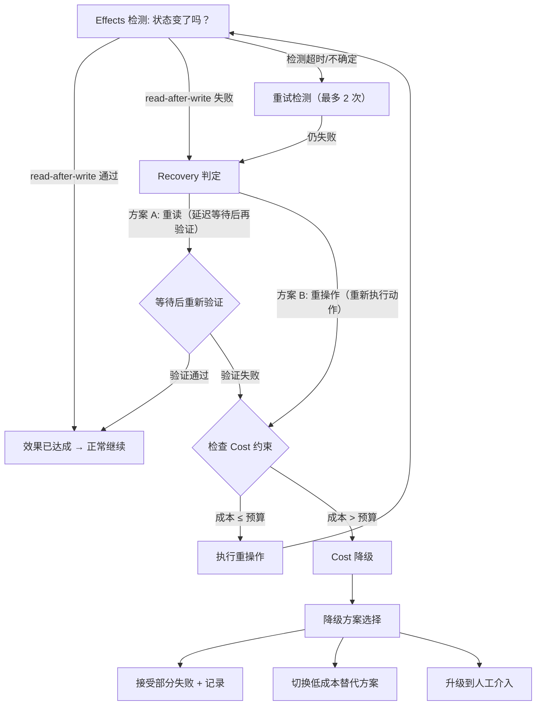

# Effects x Recovery 交叉设计

> **Evidence Status** — grounded.
> 知识库映射: Action&Effect (Plane — Effects) x Lifecycle&Economics (Plane — Recovery) x Governance (Plane — Control)

## 为什么需要这篇文档

Effect 验证失败后，Recovery Plane 的默认直觉是"补偿回去"。但生产经验反复证明：**补偿本身可能比原始失败更危险、更昂贵、更不可预测。**

Agent 场景的独特复杂性在于："事务"跨越异构外部系统，补偿路径不对称；某些效果天然不可逆；效果验证可能超时而非明确失败。Replit snapshot engine 的经验表明，有确定性回滚点的系统恢复效率远高于逐步补偿。本文档建立效果验证失败时的决策矩阵，明确"何时补偿、何时接受、何时升级"的边界。

---

## 交叉点识别

| 交叉点 | Effects 侧关注 | Recovery 侧关注 | 冲突/张力 | 设计要求 |
|--------|---------------|----------------|----------|---------|
| 验证失败 | 后置条件不成立，效果未达标 | 选择恢复策略：补偿/重试/升级 | 快速恢复 vs 恢复安全性 | 决策矩阵 + 风险评估 |
| 部分效果 | 多步操作中部分成功 | 是否补偿已成功部分 | 一致性 vs 补偿成本 | 选择性补偿策略 |
| 异步验证 | 验证结果延迟到达 | 超时后是否触发恢复 | 等待耐心 vs 资源占用 | 截止时间 + 升级规则 |
| 不可逆效果 | 效果无法撤销 | 补偿路径不存在 | 恢复期望 vs 物理限制 | 明确"不补偿"决策 |
| 补偿副作用 | 补偿动作本身产生新效果 | 补偿失败需要二级恢复 | 恢复深度 vs 失控风险 | 补偿深度上限 |
| 成本权衡 | 效果损失有成本 | 补偿有成本（金融/声誉/数据） | 损失接受 vs 补偿投入 | 成本比较决策 |

---

## 决策矩阵

### 效果验证失败时的恢复决策

决策由四个维度联合决定：效果类型 x 可逆性 x 影响半径 x 执行后经过时间。

| 效果类型 | 可逆性 | 影响半径 | 时间窗口 | 推荐决策 |
|---------|--------|---------|---------|---------|
| 数据写入 | reversible | 单对象 | <1min | **重试**：刷新前提条件，重新执行 |
| 数据写入 | reversible | 多对象 | <5min | **选择性补偿**：回滚失败对象，保留成功对象 |
| 数据写入 | reversible | 多对象 | >5min | **补偿**：完整回滚 + 通知相关方 |
| 状态变更 | compensable | 单对象 | <1min | **重试**：检查版本，条件重试 |
| 状态变更 | compensable | 多对象 | 任意 | **补偿**：反向操作 + 状态一致性验证 |
| 通知/发送 | irreversible | 外部人员 | 任意 | **接受 + 追加**：发送更正通知 |
| 部署/上线 | compensable | 生产系统 | <5min | **回滚**：使用已知良好版本 |
| 部署/上线 | compensable | 生产系统 | >5min | **升级**：人工评估回滚风险 |
| 资金操作 | irreversible | 财务系统 | 任意 | **升级**：强制人工介入 |
| 删除操作 | irreversible | 数据资产 | 任意 | **升级**：检查备份可恢复性 |

### 决策流程图

```text
Effect Verification Failed
  │
  ├─ 效果是否可逆？
  │   ├─ reversible → 影响半径？
  │   │   ├─ 单对象 → 重试（刷新前提 + 版本门控）
  │   │   └─ 多对象 → 经过时间？
  │   │       ├─ <5min → 选择性补偿
  │   │       └─ >5min → 完整补偿
  │   ├─ compensable → 补偿成本 vs 失败损失？
  │   │   ├─ 补偿成本 < 损失 → 补偿
  │   │   └─ 补偿成本 >= 损失 → 接受 + 记录
  │   └─ irreversible → 升级到人工
  │
  └─ 验证超时（pending 状态）？
      ├─ 截止时间内 → 等待 + 轮询
      └─ 超过截止时间 → 升级
```

---

## 实战裁决规则：Effects → Recovery → Cost 优先级链

生产系统中，Effects 验证失败后的处理并非只看决策矩阵——而是一条三阶段优先级链：

1. **Effects 检测**：确认"状态到底变没变"（read-after-write / 测试验证）
2. **Recovery 判定**：决定是重读（可能延迟但安全）还是重操作（可能成本高但快速）
3. **Cost 约束**：如果 Recovery 判定重操作但成本超预算，强制降级到更低成本方案

### 优先级链裁决流程



### 项目实证：连续失败的升级策略

不同项目对连续失败的处理形成了一致的"渐进升级"模式：

| 失败次数 | GenericAgent | OpenCode | Claude Code | Codex |
|---------|-------------|----------|-------------|-------|
| 第 1 次 | 理解失败原因，调整参数 | 正常重试 | PostToolUseFailure hook 触发重试 | sandbox outcome 不等于 effect verified，触发测试回读 |
| 第 2 次 | 探测环境（检查前提条件） | 累计失败计数 | hook 可选择补救路径 | 仍需测试/回读验证 |
| 第 3 次 | 换方案或请求人工介入 | Doom Loop 检测触发 compact 或停止 | 分类为持续失败，限制重试 | 风险评分提升，Guardian 介入 |
| ≥4 次 | 强制停止 + 人工报告 | 强制会话重置 | 升级到用户确认 | 中止执行 + 审计记录 |

**关键洞察**：

- **Codex**：sandbox 内执行成功 ≠ effect verified。即使工具返回 success，仍需通过测试或 read-after-write 确认实际效果。这将 Effects 检测从"工具返回值检查"升级为"独立验证"。
- **Claude Code**：`PostToolUseFailure` hook 提供了结构化的失败处理入口——可以选择重试、补救、或升级，而不是简单的"再来一次"。
- **OpenCode**：Doom Loop 检测（连续 ≥3 次相同模式的失败）是一个重要的安全阀——它识别的不是"单次失败"，而是"系统性无法解决的问题"，此时继续重试只会浪费 token。
- **GenericAgent**：三阶段升级（理解→探测→换方案）体现了 Recovery 应该是"学习型"的——每次失败都应该增加对问题的理解，而不是盲目重复。

---

## 部分效果处理

### 多步操作的部分成功场景

多步操作中，部分步骤成功、部分失败是最复杂的恢复场景。核心问题：是否回滚已成功的步骤？

| 部分效果模式 | 描述 | 推荐策略 |
|------------|------|---------|
| **前缀成功** | 步骤 1-3 成功，步骤 4 失败 | 评估 1-3 的独立价值；有价值则保留 + 部分交付 |
| **交叉成功** | 步骤 1,3 成功，步骤 2,4 失败 | 检查依赖关系；无依赖的成功步骤保留 |
| **核心失败** | 非核心步骤成功，核心步骤失败 | 补偿全部已成功步骤 |
| **最终步骤失败** | 所有准备步骤成功，提交步骤失败 | 评估提交是否可重试；不可重试则补偿 |

### 选择性补偿协议

```text
Partial Effect Detected
  → 枚举所有已执行步骤及其 EffectRecord
  → 对每个已成功步骤评估：
     1. 该步骤是否依赖失败步骤的结果？
        → 是 → 标记为 needs_compensation
     2. 该步骤的效果是否独立有价值？
        → 是 → 标记为 keep
     3. 该步骤的效果是否在失败步骤未完成时造成不一致？
        → 是 → 标记为 needs_compensation
  → 执行 needs_compensation 步骤的反向操作
  → 保留 keep 步骤 + 部分交付
  → 记录未完成项和补偿结果
```

---

## 异步验证超时

效果验证不总是同步的。延迟从 API 回读的 <1s 到人工审批的数天不等。每种异步验证必须有默认超时（API 5s、最终一致 60s、消息送达 5min、部署健康 15min、人工审批按 SLA），超时后进入升级协议。

### 截止时间升级协议

```yaml
deadline_escalation:
  soft_deadline: duration    # 超过后发出提醒
  hard_deadline: duration    # 超过后强制决策
  escalation_path:
    - level: agent_retry     # 自动重试验证
    - level: agent_replan    # 尝试替代验证方式
    - level: human_notify    # 通知人类关注
    - level: human_decide    # 要求人类做出决策
    - level: auto_abort      # 自动中止 + 补偿
```

---

## 何时不应补偿

补偿不是"免费的撤销"。每次补偿都有隐性成本：金融（退款手续费）、声誉（用户看到反复修改）、数据（级联写入）、时间（Recovery Budget 消耗）、信任（系统可靠性感知下降）。

| 场景 | 理由 | 替代做法 |
|------|------|---------|
| 已发送的邮件/消息 | 不可逆，补偿只能追加更正 | 发送更正通知 + 记录 |
| 低影响失败 | 补偿成本超过失败损失 | 接受 + 记录 + 下次改进 |
| 补偿会引发更大级联 | 回滚触发下游系统不一致 | 升级到人工评估 |
| 已超过业务窗口 | 补偿已无业务意义 | 接受 + 事后报告 |
| 补偿本身高风险 | 反向操作可能失败或产生新问题 | 升级到人工 + 冻结状态 |

**关键原则：恢复动作本身也是效果——必须被验证。** 补偿后外部对象需回到可接受状态；回滚后 health check 需通过。恢复验证失败时进入二级恢复，但补偿深度不超过 `max_compensation_steps: 5`。

---

## 常见错误与案例

### 错误 1: 所有失败都触发补偿

**表现**: Effect 验证失败后无条件执行补偿事务
**后果**: 低影响失败被过度补偿；补偿成本远超失败损失；频繁补偿降低系统可信度
**修正**: 使用决策矩阵，补偿前评估 cost_of_compensation vs cost_of_failure

### 错误 2: 忽略补偿的副作用

**表现**: 补偿动作被视为"撤销"，不对其做效果验证
**后果**: 补偿本身失败但未被检测，系统处于不一致状态
**修正**: 补偿动作必须有独立的 EffectRecord 和 verification；补偿失败进入二级恢复

### 错误 3: 部分效果时全量回滚

**表现**: 多步操作中一步失败，回滚所有已成功步骤
**后果**: 浪费已成功步骤的工作；用户看到反复操作；可能无法完美回滚
**修正**: 评估已成功步骤的独立价值和依赖关系，选择性补偿而非全量回滚

### 错误 4: 异步验证无截止时间

**表现**: 等待效果验证结果时无超时机制
**后果**: 任务无限挂起；Recovery Budget 被静默耗尽；资源泄漏
**修正**: 所有异步验证必须有 hard_deadline；超时后按截止时间升级协议处理

---

## 设计启发

1. **补偿是有成本的动作，不是免费的撤销。** 每次补偿决策前都应评估：补偿成本（金融 + 声誉 + 数据 + 时间）是否低于接受失败的损失。
2. **不可逆效果改变了恢复策略空间。** 发送邮件、发布公告、执行资金转移后，"补偿"只能是追加动作而非撤销。设计时必须标注效果的 reversibility。
3. **部分效果需要选择性补偿，而非全量回滚。** 已成功步骤的独立价值应被保留，除非它们依赖于失败步骤的结果。
4. **异步验证的截止时间是强制性的。** pending 状态不能无限持续——必须有从自动重试到人工决策的升级路径。
5. **恢复深度必须有上限。** 补偿失败 → 补偿补偿 → 补偿补偿的补偿——这条路径必须在 `max_compensation_steps` 处硬停止。
6. **确定性回滚点优于逐步补偿。** Replit snapshot engine 的经验表明，能回到已知良好状态的系统，恢复效率远高于逐步反向操作的系统。
7. **频繁补偿是系统设计问题的信号。** 如果补偿频率超过阈值，应追溯到 Effects 层的前置条件检查是否充分，而非继续优化补偿路径。

---

## 与知识库的映射

| 本文档章节 | 映射到的 Plane / 文档 | 关系说明 |
|-----------|---------------------|---------|
| 决策矩阵 | `architecture/planes/effects/overview.md` | EffectRecord 的 reversibility 和 verification_status 字段 |
| 决策矩阵 | `architecture/planes/recovery/overview.md` | FailureRecord 的 recovery_action 和 reversibility 字段 |
| 部分效果处理 | `architecture/planes/recovery/overview.md` — partial_effect | compensation stack 的详细定义 |
| 异步验证超时 | `architecture/planes/effects/overview.md` — external_ack | send/notify 类动作的验证策略 |
| 补偿成本 | `architecture/planes/recovery/overview.md` — Recovery Budget | max_compensation_steps 和 escalation_after |
| 五层防御集成 | `architecture/planes/recovery/overview.md` — 恢复动作的验证 | 恢复动作本身的验证方式 |
| 确定性回滚 | `architecture/planes/state/overview.md` — Checkpoint | Checkpoint Hydration 模式 |
| 不可逆效果 | `architecture/planes/effects/overview.md` — Irreversible Misfire | staged approval + dry-run 预防 |
