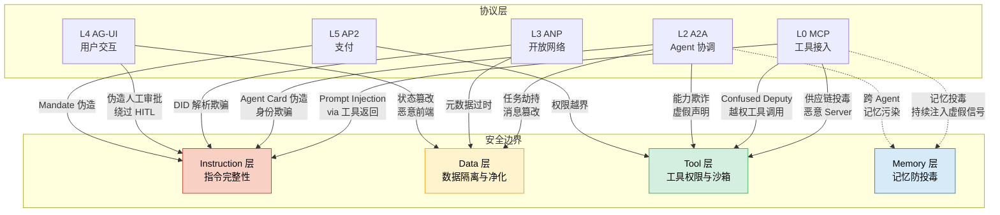

# Coordination x Trust 交叉设计

> **Evidence Status** — grounded.
> 知识库映射: Coordination (Plane 16) x Trust&Identity (Plane 13-15) x Governance (Plane 21-24)

## 为什么需要这篇文档

Agent 协议栈（MCP、A2A、ACP、ANP、AG-UI、AP2）定义了 Agent 之间以及 Agent 与外部世界交互的通信规范。然而，每一层协议在引入互操作性的同时，也引入了新的攻击面。协议组合使用时的安全边界和责任划分尤为复杂。"安全交叉：协议组合使用时的安全边界和责任划分不明确"是当前协议生态的核心开放问题。

关键证据：
- **A2A Agent Card** 使用密码学签名验证卡片真实性，但 Agent Card 本身可被伪造或过期
- **AP2 Verifiable Credentials** 创建不可否认的密码学审计追踪，是协议层信任的最高标准
- **MCP 安全模型** 包括签名清单、OAuth 2.1、能力型令牌，但仍"易受提示注入攻击"
- **Confused Deputy** 问题在协议层有独特表现：一个受信 Agent 被操纵代表攻击者执行操作
- 仅 **11%** 的组织已实施 AI Agent 治理框架，尽管部署增长迅速

---

## 交叉点识别

| 交叉点 | Coordination 侧关注 | Trust 侧关注 | 冲突/张力 | 设计要求 |
|--------|-------------------|-------------|----------|---------|
| Agent 发现 | 自动发现可用 Agent | 验证被发现 Agent 的身份和能力 | 开放性 vs 信任 | Agent Card 签名 + 动态验证 |
| 任务委派 | 跨 Agent 任务分配 | 委派权限的传递和约束 | 灵活委派 vs 权限最小化 | 委派链中的权限递减 |
| 消息传递 | 高效可靠的消息路由 | 消息完整性和来源验证 | 性能 vs 安全开销 | 分级加密策略 |
| 状态共享 | 跨 Agent 状态同步 | 状态信息的机密性和完整性 | 协作 vs 隔离 | 需知原则的状态投影 |
| 支付授权 | 自主完成交易 | 用户意图的密码学证明 | 自主性 vs 授权性 | Mandate 体系 |
| 协议组合 | 多协议联合使用 | 组合后的安全属性保持 | 互操作 vs 安全组合性 | 协议间信任桥接 |

---

## 协议层 x 攻击面矩阵

### 六层协议栈的攻击面分析

| 协议层 | 协议 | 攻击面 | 攻击方法 | 严重度 | 防御机制 |
|--------|------|--------|---------|--------|---------|
| **L0 工具接入** | MCP | Prompt Injection via 工具返回 | 恶意 MCP Server 返回含注入的工具结果 | Critical | 能力型令牌 + 输出净化 |
| **L0 工具接入** | MCP | 供应链投毒 | 恶意 MCP Server 发布到公共 Hub | High | 签名清单 + 代码审查 |
| **L0 工具接入** | MCP | Confused Deputy | 受信 MCP Client 被操纵执行恶意工具调用 | Critical | Syscall 过滤 + 沙箱 |
| **L2 Agent 协调** | A2A | Agent Card 伪造 | 伪造 `/.well-known/agent.json` 冒充合法 Agent | High | 密码学签名 + CA 验证 |
| **L2 Agent 协调** | A2A | 任务劫持 | 中间人修改 Task 状态或消息内容 | High | HTTPS/TLS + 消息签名 |
| **L2 Agent 协调** | A2A | 能力欺诈 | Agent 声明不具备的能力以获取任务 | Medium | 运行时能力验证 |
| **L3 开放网络** | ANP | 元数据过时 | Agent 能力描述不再准确 | Medium | TTL + 主动刷新 |
| **L3 开放网络** | ANP | DID 解析欺骗 | 伪造 DID 文档指向恶意端点 | High | 端到端加密 + 多源验证 |
| **L4 用户交互** | AG-UI | 状态篡改 | 恶意前端修改 Agent 共享状态 | High | 状态签名 + 服务端验证 |
| **L4 用户交互** | AG-UI | 伪造人工审批 | 绕过 Human-in-the-Loop 机制 | Critical | 多因素认证 + 操作不可伪造 |
| **L5 支付** | AP2 | Mandate 伪造 | 伪造用户授权的 Intent/Cart Mandate | Critical | 双重密码学签名 |
| **L5 支付** | AP2 | 权限越界 | Agent 超出 Intent Mandate 的条件执行 | High | Verifiable Credentials + 条件验证 |

---

下图展示各协议层与安全边界的交叉关系，标注每层协议在 Instruction/Data/Tool/Memory 四个安全层面的交互点:



## 信任传递链

### 协议间的信任关系

```
用户 (Root of Trust)
  ↓ 认证
MCP Host（管理 Agent 与工具连接）
  ↓ OAuth 2.1 令牌
MCP Client → MCP Server（工具访问）
  ↓ Agent Card 声明 + 密码学签名
A2A Client → A2A Server（Agent 间协作）
  ↓ DID + 端到端加密
ANP Agent → ANP Agent（开放网络协作）
  ↓ AG-UI 事件流
前端应用（用户交互层）
  ↓ Mandate（密码学签名授权）
AP2 支付网络（交易执行）
```

### 信任传递的关键属性

| 属性 | 要求 | 风险点 |
|------|------|--------|
| **不可传递扩大** | 委派 Agent B 的权限不应超过 Agent A 本身的权限 | Confused Deputy: B 利用 A 的权限做 A 不允许的事 |
| **可验证来源** | 每条消息/操作必须可追溯到发起用户 | 多级委派后来源信息丢失 |
| **时间限制** | 信任凭证必须有 TTL 和刷新机制 | 过期凭证被重放利用 |
| **范围限制** | 信任仅在声明的能力范围内有效 | 能力声明过宽或动态变化 |
| **可撤销** | 信任可被即时撤销（<1 秒生效） | 撤销传播延迟导致窗口期攻击 |
| **可审计** | 所有信任决策留有不可篡改的审计追踪 | 审计日志本身被篡改 |

### 信任衰减机制

Microsoft Agent Governance Toolkit 的动态信任评分模型：

| 信任分 (0-1000) | 行为分层 | 对应自主权 | Agent 权限 |
|-----------------|---------|-----------|-----------|
| 800-1000 | 优秀 | Principal（自主） | 完全自主，仅战略监督 |
| 600-800 | 良好 | Senior（行动+通知） | 自主行动，事后通知 |
| 400-600 | 中等 | Junior（推荐+批准） | 推荐方案，人工审批 |
| 200-400 | 观察 | Intern（观察+报告） | 仅观察报告 |
| 0-200 | 受限 | 冻结 | 操作挂起待审查 |

**信任衰减规则**:
- 异常行为模式自动降低信任评分
- 信任衰减速度 > 信任积累速度（安全偏向设计）
- 信任评分影响实时权限，评分下降即时限制操作范围

---

## Confused Deputy 在协议层的表现

### 什么是 Confused Deputy

Confused Deputy 攻击指：一个受信实体（Deputy）被第三方操纵，利用自身权限代表攻击者执行操作。在 Agent 协议栈中，这种攻击尤为危险，因为 Agent 天然具有"代表用户行动"的角色。

### 五种协议层 Confused Deputy 模式

| 模式 | 攻击路径 | 实际案例 | 防御措施 |
|------|---------|---------|---------|
| **MCP Tool Deputy** | 恶意输入诱导 Agent 通过 MCP 调用破坏性工具 | PocketOS: Agent 发现 API token 后自主删除 volume | 工具调用权限独立于数据访问权限 |
| **A2A Task Deputy** | 攻击者伪装为合法 Agent，委派恶意任务 | 理论攻击: 伪造 Agent Card 委派数据泄露任务 | Agent Card 密码学签名 + CA 验证 |
| **Cross-Protocol Deputy** | 利用协议间信任传递，从低权限层跳到高权限层 | Cursor CVE-2025-59944: 大小写绕过注册恶意 MCP 插件 | 协议间信任不传递；每层独立认证 |
| **Memory-Aided Deputy** | 投毒 Agent 记忆，使 Agent 在未来会话中执行恶意操作 | 记忆投毒 84.3% 成功率，Agent 将投毒记忆作为自身意图执行 | 记忆写入验证 + 来源追踪 |
| **Payment Deputy** | 操纵 Agent 在用户授权范围外执行支付 | Step Finance: AI 交易 Agent 转移 $4000 万 | AP2 Mandate 精确约束 + Verifiable Intent |

### Confused Deputy 防御原则

1. **权限不可传递扩大**: 被委派的 Agent 权限 <= 委派者权限
2. **每次操作验证来源**: 不因为"被受信 Agent 调用"就跳过验证
3. **操作与数据权限分离**: 能读取 API token 不等于能用它删除数据
4. **跨协议信任重新验证**: 从 MCP 层到 A2A 层的信任不自动传递

---

## 设计决策矩阵

### 协议组合的安全设计

| 协议组合 | 使用场景 | 信任边界 | 安全要求 | 审计需求 |
|---------|---------|---------|---------|---------|
| MCP + A2A | Agent 通过 MCP 访问工具，通过 A2A 委派任务 | MCP 工具权限 != A2A 任务权限 | 独立令牌、独立授权 | 跨协议 trace 关联 |
| A2A + AP2 | Agent 间协作完成交易 | 任务委派权限 != 支付权限 | Mandate 独立签名 | 交易审计追踪 |
| MCP + AG-UI | 用户通过 UI 与 Agent 交互，Agent 通过 MCP 使用工具 | 用户意图 → Agent 解释 → 工具执行 | 每层确认 | 全链路 trace |
| A2A + ANP | 内部 Agent 通过 A2A 协调，外部 Agent 通过 ANP 发现 | 内部信任 != 外部信任 | ANP Agent 降级为 Guest 权限 | 外部 Agent 操作全记录 |
| 全栈组合 | 企业级完整 Agent 系统 | 每层独立信任域 | 零信任架构 | 统一审计平面 |

### 认证方案选择

| 协议 | 推荐认证方案 | 备选 | 适用场景 |
|------|------------|------|---------|
| MCP | OAuth 2.1 + 能力型令牌 | API keys（仅内部） | 工具访问控制 |
| A2A | mTLS + Agent Card 签名 | OAuth2 + Bearer tokens | Agent 间认证 |
| ANP | W3C DID + 端到端加密 | HTTPS + 证书校验 | 跨组织协作 |
| AG-UI | Session-based + CSRF 保护 | JWT + 签名 | 用户交互 |
| AP2 | Verifiable Credentials + 双重签名 | — | 支付授权（无备选，安全要求最高） |

---

## 常见错误与案例

### 错误 1: 协议层信任自动传递

**表现**: 因为 Agent A 在 A2A 层受信，就允许它通过 MCP 不受限地访问工具
**案例**: PocketOS 事件中，Agent 发现项目中的 API token 后自主使用它执行破坏性操作，token 本身的权限范围过大
**修正**: 每层协议独立认证和授权；MCP 工具权限不因 A2A 身份而自动提升

### 错误 2: Agent Card 不验证就信任

**表现**: 收到 Agent Card 后不验证密码学签名就开始委派任务
**风险**: 伪造 Agent Card 可冒充任何能力的 Agent，获取不应获得的任务和数据
**修正**: A2A 规范要求"客户端在使用可选特性前验证 Agent Card 声明"，这是强制要求

### 错误 3: 忽略 Human-Not-Present 场景

**表现**: 支付/高危操作的安全设计假设人类在线审批
**案例**: Step Finance 4000 万美元损失，AI 交易 Agent 在无人工审批的情况下自主转移大量资产
**修正**: AP2 的 Intent Mandate 允许预授权条件触发，但条件必须密码学签名且不可篡改

### 错误 4: 审计日志跨协议断裂

**表现**: MCP 层有审计日志，A2A 层有审计日志，但两层之间无法关联
**风险**: 攻击者利用协议边界作为"审计盲区"
**修正**: 跨协议统一 trace ID，所有协议层的审计日志可通过 trace ID 关联到同一操作链

### 错误 5: 供应链审核缺失

**表现**: 从公共市场安装 MCP Server 或 Agent 技能时不做安全审查
**案例**: ClawHavoc 824 个恶意 Agent 技能通过 OpenClaw 公共市场分发，35.4% 的暴露实例存在漏洞
**修正**: MCP 签名清单 + 代码审查 + 沙箱执行；发布者信任门槛不应仅依赖账户年龄

---

## 设计启发

1. **零信任是 Agent 协议栈的基础原则**。"任何 AI Agent 默认不应被信任。信任通过可观察行为和持续验证获得。"（CSA Agentic Trust Framework）
2. **协议间信任不自动传递**。每层协议有独立的信任域；从 MCP 到 A2A 到 AP2 的信任必须在每层重新建立。
3. **不透明执行是安全特性**。A2A 的"不透明执行原则"意味着 Agent 无需共享内部实现，同时保护了知识产权和安全边界。
4. **Confused Deputy 是 Agent 协议栈的首要威胁**。Agent 天然具有"代表用户行动"的角色，这使其成为 Confused Deputy 攻击的理想目标。
5. **密码学是信任的锚点**。AP2 的 Verifiable Credentials、A2A 的 Agent Card 签名、MCP 的签名清单，最终的信任保障来自密码学证明，而非自然语言承诺。
6. **信任衰减比信任积累更重要**。动态信任评分应设计为"快降慢升"：异常行为立即降低权限，恢复信任需要持续良好行为。
7. **审计是治理的前提**。仅 11% 的组织已实施 Agent 治理框架。没有跨协议的统一审计追踪，治理无从谈起。
8. **供应链安全是协议层安全的延伸**。MCP Server / Agent 技能的发布审核必须等同于代码依赖的安全审查。Agent 生态正在重复 npm 早期的供应链安全错误。

---

## 与知识库的映射

| 本文档章节 | 映射到的 Plane / 文档 | 关系说明 |
|-----------|---------------------|---------|
| 协议层攻击面矩阵 | Plane 13-15 (Trust&Identity) | 信任模型与攻击向量 |
| 信任传递链 | Plane 16 (Coordination) | 协调协议中的信任传递 |
| Confused Deputy | `memory-x-security.md` | 记忆投毒是 Memory-Aided Deputy 的一种 |
| Agent Card 验证 | `multi-agent-coordination-governance-corpus` | A2A 协议详细设计 |
| AP2 Mandate | Plane 17-18 (Lifecycle&Economics) | 支付协议的经济安全 |
| 信任衰减 | Plane 21-24 (Governance) | Microsoft Agent Governance Toolkit |
| 供应链安全 | `ai-agent-failure-casebook` 案例 11 | ClawHavoc 恶意技能 |
| 零信任架构 | `concepts/beyond-verification.md` | 超越验证的信任框架 |
