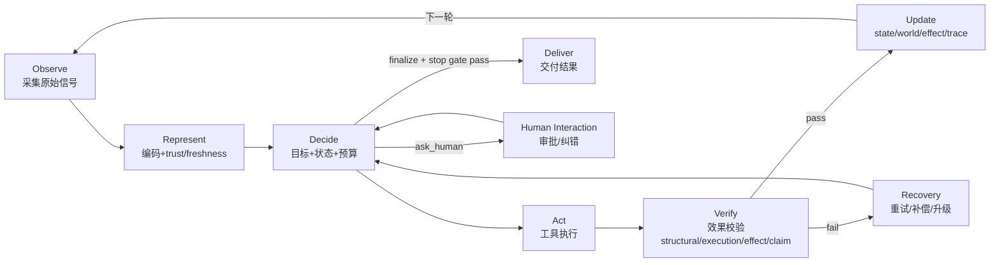
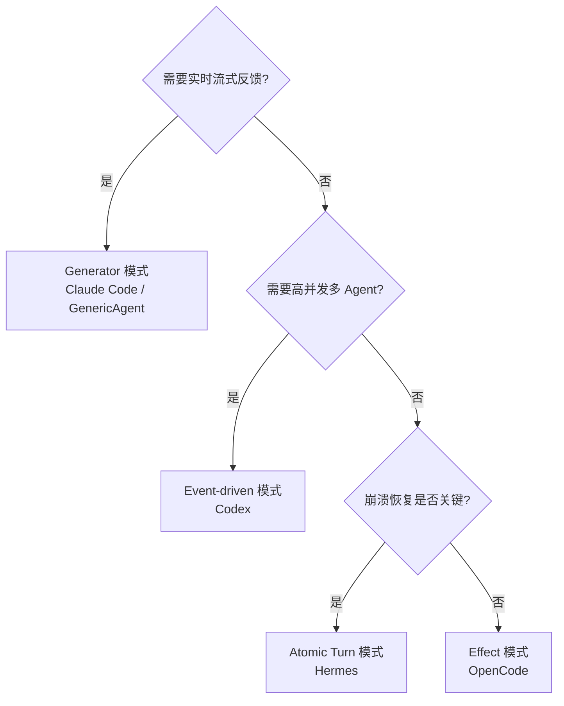

# Agent Loop

> **Evidence Status** — grounded. 基于 Claude Code、OpenCode、Codex 等系统对 query loop、compaction、权限控制、subtask、重试的实际实现归纳。

## 问题

如何让 LLM 不只是“回一句话”，而是持续把任务推进到**可验证完成**？

最小答案是循环；生产级答案是：**把循环嵌入现实闭环。**

## 最小闭环

单看模型，最小循环可以写成 TAO：Thought → Action → Observation。

但生产系统里，TAO 还不够，因为它没有显式回答：
- 观察到的东西是什么表示？
- 这个表示是否可靠、新鲜、可回查？
- 动作想改变什么外部对象？
- 工具成功后，现实是否真的改变？

因此更完整的主循环应写成：

```text
Observe → Represent → Decide → Act → Sense / Verify → Update
```

## 六步解释

### 1. Observe
采集当前任务相关的原始世界切片：用户输入、文件、网页、日志、DOM、数据库记录、传感器事件、工具回读。

### 2. Represent
将原始输入转成可处理表示，并记录：
- raw ref
- parser / transform chain
- confidence
- freshness
- trust tier
- lossy / replayable

### 3. Decide
结合目标、状态、预算、约束、world state 和记忆，决定下一步。Decide 的输入包含 PromptContract 中指定的 `reasoning_mode`，输出是一个结构化 Decision：

```yaml
decision:
  type: tool_call | tool_call_batch | plan_step | reflection | delegation | ask_human | finalize | stop_with_evidence
  reasoning_mode: direct | react | plan_execute | reflection | critique
  payload: {}          # 按 type 不同携带不同内容
  confidence: float
  rationale: string
```

不同范式产生不同的 decision type 分布：

| 范式 | 主要 decision types | Kernel 行为差异 |
|---|---|---|
| Direct | tool_call, finalize | 单步决策，无中间状态 |
| ReAct | tool_call, tool_call（嵌套） | 每次 tool_call 结果重新进入 Decide |
| Plan-Execute | plan_step → tool_call（逐步） | 先输出 plan，再逐步执行 |
| Reflection | tool_call → reflection → tool_call | Verify 后回到 Decide 做自检修正 |
| Delegation | delegation | 创建子任务，等待子 Agent 返回 |

Kernel 本身不实现范式逻辑——它根据 decision.type 调度到对应的执行路径，范式选择由 Prompting Plane 的 `reasoning_mode` 驱动。

### 4. Act
通过 Tool Runtime 和 Execution Host 发起动作，并显式声明：
- intended_effect
- target world objects
- preconditions
- postconditions
- verification method

### 5. Sense / Verify
对动作结果做四层验证：
- structural verification
- execution verification
- effect verification
- claim verification

### 6. Update
更新：
- task state
- world state snapshots
- effect ledger
- decision log
- trace / eval events
- recovery route

### ORDA-VU 完整数据流

下图展示主循环的完整数据流，包含正常路径和失败恢复路径：



## 伪代码

```python
from dataclasses import dataclass
from typing import Any

@dataclass
class LoopState:
    task: dict
    context: dict
    task_state: dict
    world_state: dict
    pending_effects: list[dict]
    budgets: dict
    trace_id: str


def agent_loop(task_envelope: dict, runtime: Any, max_steps: int) -> dict:
    state = runtime.bootstrap(task_envelope)

    for step in range(max_steps):
        # ── Observe & Represent ──
        raw_inputs = runtime.observe(state)
        observations = runtime.representation.build(raw_inputs)

        # ── Governance Pre-check ──
        verdict = runtime.control.precheck(
            observations=observations,
            world_state=state.world_state,
            budgets=state.budgets,
        )
        if verdict == "refresh_required":
            state.world_state = runtime.world_state.refresh(state)
            continue
        if verdict == "blocked":
            return runtime.finish_blocked(state)

        # ── Build Context ──
        context_pack = runtime.context.build(
            task=state.task,
            observations=observations,
            task_state=state.task_state,
            world_state=state.world_state,
        )

        # ── Decide（范式无关：reasoning_mode 由 PromptContract 指定）──
        decision = runtime.kernel.decide(context_pack)

        # ── 按 decision.type 分发 ──
        if decision.type == "finalize":
            if runtime.control.stop_gate(state):
                return runtime.finish_success(state)
            # stop gate 不满足时，要求补充验证而非直接结束
            decision = runtime.kernel.plan_next_verification(context_pack)

        if decision.type in ("tool_call", "tool_call_batch"):
            calls = decision.tool_calls if decision.type == "tool_call_batch" else [decision.tool_call]
            for call in calls:
                tool_result = runtime.tools.execute(call)
                effect_record = runtime.effects.record(call, tool_result)
                runtime.observability.emit(tool_result, effect_record)
                verification = runtime.control.verify(
                    tool_result=tool_result,
                    effect_record=effect_record,
                    verification_method=call.get("verification_method"),
                )
                state = runtime.state.update(
                    state=state, observations=observations,
                    tool_result=tool_result, effect_record=effect_record,
                    verification=verification,
                )
                if verification.needs_recovery:
                    state = runtime.controllers.recover(state, verification)
                    break  # 恢复后重新进入主循环

        elif decision.type == "plan_step":
            # Plan-Execute 范式：将计划存入 task_state，下一轮执行第一步
            state.task_state["plan"] = decision.plan
            state.task_state["current_step"] = 0

        elif decision.type == "reflection":
            # Reflection 范式：自检后修正策略，不产生外部效果
            state.task_state["reflection_log"] = decision.reflection
            # 下一轮 Decide 会看到 reflection_log 并调整行为

        elif decision.type == "delegation":
            # 多 Agent：创建子任务并等待
            sub_result = runtime.orchestration.delegate(decision.sub_task, state)
            state = runtime.state.merge_sub_result(state, sub_result)

        elif decision.type == "ask_human":
            return runtime.finish_waiting_approval(state, decision)

        elif decision.type == "stop_with_evidence":
            return runtime.finish_partial(state)

    return runtime.finish_budget_exhausted(state)
```

## Stop Gate：什么时候能停

成熟 Agent 不应因为“模型说 done”就结束。通常至少满足：

```text
required_depth reached
+ key deliverables present
+ critical representation issues resolved
+ critical world state fresh enough
+ required effects verified
+ remaining risks explained
```

## 生产级保护机制

### 1. 多层预算
- step budget
- tool budget
- token / context budget
- retry budget
- approval budget
- risk budget

### 2. 循环检测
- 相同工具连续重复
- 相同 world state 上反复动作
- 相同失败模式无新证据重试

### 3. 状态外置
- checkpoint
- decision log
- effect ledger
- world state snapshot

### 4. stale state 防护
- 写动作前 refresh 关键 world object
- 最终交付前重新读回关键状态
- eventual consistency 场景采用 poll / backoff

### 5. 不可信输入隔离
- tool output / web page / email / log 默认进入 untrusted lane
- 不能直接升级为可执行 instruction

## 与经典循环的关系

| 形态 | 适用 | 局限 |
|---|---|---|
| TAO / ReAct | 简单探索、demo、低风险任务 | 没有显式表示层、world state、effect verification |
| Plan-then-Execute | 结构清晰、可审查 | 遇到新观察时计划可能过时 |
| ORDA-VU（Observe → Represent → Decide → Act → Verify → Update） | 生产级任务闭环 | 复杂度更高，需要更多运行时模块 |

## 从参考项目学到的生产细节

### Claude Code
- generator 式 query loop 支持流式事件和提前终止
- 循环内做多层 compaction
- 把 trace、状态、权限检查织进主循环，而不是散在工具外

### OpenCode
- subtask / compaction / normal processing 有显式优先级
- doom loop 检测进入权限系统
- retry / backoff 与错误类型绑定

### Codex
- execution sandbox 和 guardian policy 不是主循环外设，而是循环能否放开执行深度的前提

## 常见反模式

| 反模式 | 表现 | 修复 |
|---|---|---|
| Chat Loop Disguised as Agent | 看似多轮，其实没有状态和效果验证 | 补 state / effects / stop gate |
| Action Without Representation | 没确认输入质量就开做 | representation gate |
| Tool Success = Task Success | 工具成功就宣布完成 | effect verification |
| Memory-as-Context Dump | 把记忆直接全塞上下文 | disclosure + trust lanes |
| Retry Until Budget Dies | 无新证据重复尝试 | failure-mode-aware recovery |

## 实现模式分类

不同 Agent 系统对主循环的工程实现采用了截然不同的模式。以下四种在生产项目中被验证过：

| 模式 | 代表项目 | 核心机制 | 适用场景 |
|------|---------|---------|---------|
| Generator/流式生成器 | Claude Code, GenericAgent | async generator yield 每个 token/chunk | 需要实时 UI 反馈、可暂停恢复 |
| Event-driven/事件驱动 | Codex | Submission→Event 通道，多路分发 | 高并发、多 Agent 协调、分布式追踪 |
| Atomic Turn/原子轮次 | Hermes | 每轮完整请求-响应，轮间持久化 | 崩溃恢复优先、多维预算控制 |
| Effect/函数式 | OpenCode | Effect.js Layer + DI，不可变状态容器 | 类型安全、可测试性、声明式组合 |

### Generator 模式细节

核心机制是将主循环实现为异步生成器（async generator / yield），每个 token 或 chunk 到达时即刻 yield 给消费者。

关键特征：
- 消费者可随时暂停/恢复（背压控制）
- 内存高效——无需等待完整响应再处理
- 工具调用本身也可以是嵌套生成器（如 code_run 逐行 yield 执行输出）
- 中断支持天然——检查 abort signal 后 return 即可

Claude Code 实现：`QueryEngine.submitMessage()` 是 async generator，yield 流式 token 和工具进度。
GenericAgent 实现：`agent_runner_loop()` 是 Python generator，yield from 嵌套委托工具生成器。

权衡：
- 调试困难——生成器的调用栈不如同步代码直观
- 状态管理复杂——生成器恢复时需确保上下文一致
- 不适合需要原子性保证的场景（崩溃时 yield 的中间状态可能不一致）



## 参考实现

- `projects/coding-agents/claude-code/query-loop.md` — 生产系统主循环观察
- `projects/coding-agents/opencode/orchestration.md` — Effect.js 循环 + Doom Loop 检测
- `projects/coding-agents/codex/orchestrator.md` — 编排与受控执行
