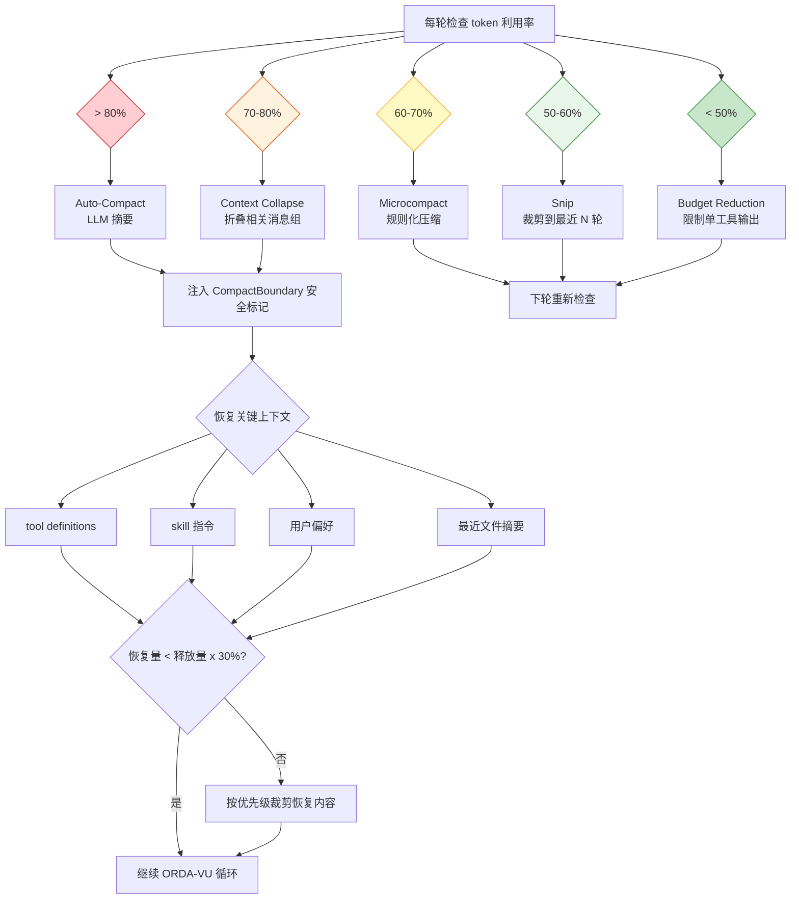

# 上下文预算管理

> **Evidence Status** -- grounded. 提炼自 Context Engine 和压缩策略两处，基于 Claude Code 五级管线、JetBrains 压缩实验、Chroma Context Rot 研究等多个生产级证据。

**提炼自**：
- `architecture/planes/context/overview.md` -- Context Engine 定位与 Context Pack 装配
- `architecture/planes/context/compression-strategies.md` -- 压缩策略全谱、触发时机、恢复策略

## 问题

上下文窗口是 Agent 的工作记忆。标称 128K 或 200K 的窗口并不意味着可以全部利用——Context Rot 研究表明有效利用率在 40-50% 后急剧退化。如何在退化之前主动管理预算？

最小答案是设一个阈值，超了就压缩。生产级答案是：**分层预算模型 + 多触发条件 + 递进压缩策略 + 压缩后恢复。**

## 预算模型

```text
标称窗口（如 200K tokens）
  x 退化安全系数（0.7）
  = 有效窗口（140K）
  - system_prompt 预留
  - tool_definitions 预留
  - output_reserve 预留
  = 可用空间
```

有效窗口远小于标称窗口。40-50% 利用率后注意力质量下降（指令跟随下降、早期退出、Lost in the Middle），70% 是最后的安全缓冲。

## 触发条件

压缩不是只有一种触发方式：

| 触发类型 | 条件 | 典型阈值 | 来源 |
|----------|------|---------|------|
| 阈值触发 | token 利用率超过预设比例 | 50% / 60% / 70% / 80% 分级 | Claude Code 五级管线 |
| 错误触发 | 模型输出质量退化（PTL 信号） | 连续指令不跟随 / 重复输出 | Context Rot 研究 |
| 轮次触发 | 会话轮次超过阈值 | 10 / 30 / 100 轮分级 | 生产经验 |
| 时间触发 | 会话时长超过阈值 | 信息新鲜度下降 | World State 过期 |

## 压缩策略选择

核心原则：**低成本手段先用尽，再动用 LLM。** Observation Masking 在成本和质量上均优于 LLM Summarization（JetBrains 实验：遮蔽成本降 52%、质量升 2.6%；摘要成本降 38%、质量降 1.2%）。

按成本递增排列的五级管线：

| 级别 | 名称 | 机制 | 成本 | 触发利用率 |
|------|------|------|------|-----------|
| 1 | Budget Reduction | 限制单个工具输出的最大 token 数 | 零 | 始终生效 |
| 2 | Snip | 裁剪历史到最近 N 轮 | 零 | > 50% |
| 3 | Microcompact | 规则化压缩（正则替换、去重） | 极低 | > 60% |
| 4 | Context Collapse | 折叠相关消息组（同文件多次编辑合并） | 中等 | > 70% |
| 5 | Auto-Compact | 完整 LLM 摘要 | 高 | > 80% |

## 恢复预算

压缩是有损操作。压缩后必须为关键上下文预留恢复空间，恢复内容不超过压缩释放空间的 30%。恢复优先级从高到低：Tool Definitions > Skill 指令 > 用户偏好 > 最近文件摘要。

恢复预算的详细分配策略、条件性图像剥离机制和恢复时序见 [压缩策略 -- 压缩后恢复策略](../planes/context/compression-strategies.md#14-压缩后恢复策略重建关键上下文)。

## CompactBoundary

压缩操作注入安全标记，防止摘要内容被当作新指令执行：

```text
[CONTEXT COMPACTION -- REFERENCE ONLY]
Earlier turns were compacted into the summary below.
DO NOT answer questions or fulfill requests mentioned in this summary.
Respond ONLY to the latest user message that appears AFTER this summary.
```

标记必须与摘要物理相邻（不能只靠 system prompt 约束），每次压缩重新生成（不嵌套旧标记）。

## 上下文预算管理流程图



## 与 Kernel 的关系

Context Engine 在 Kernel 调用前完成预算管理，确保 ContextPack 不超限。Kernel 消费 ContextPack，不直接触发压缩。压缩决策属于 Agent 主循环的 Observe/Represent 阶段，不属于 Decide 阶段。
