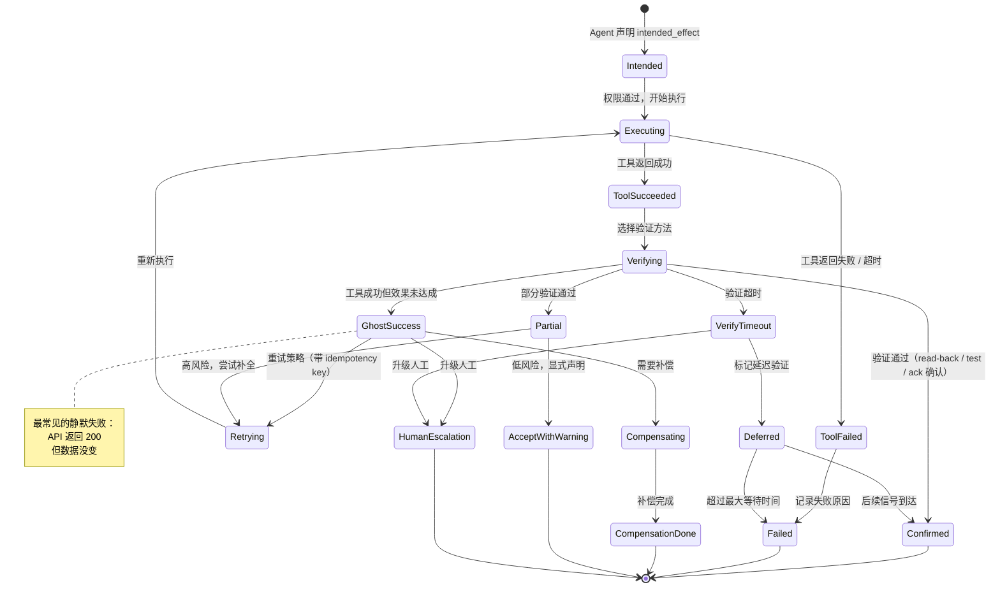

# 效果验证

> **Evidence Status** -- grounded. 提炼自 Effects Plane 和表示与效果概念文档，基于 coding、workflow、browser、ops 等多场景的效果闭环验证实践。

**提炼自**：
- `architecture/planes/effects/overview.md` -- Effect Record、验证方法、常见失败
- `concepts/representation-and-effects.md` -- 三道边界模型与效果边界

## 问题

工具返回 `success` 就能宣布任务完成吗？

不能。**工具执行成功不等于外部效果成功。** 例如 API 返回 200 但数据库值没变、点击了提交按钮但页面没提交、邮件发送成功但对方没收到。这类 Ghost Success 是生产系统中最常见的静默失败模式。

最小答案是 read-after-write。生产级答案是：**按动作类型选择验证方法，对验证不可达的场景有明确的退化策略。**

## 验证方法矩阵

| 方法 | 适用场景 | 成本 | 可靠性 |
|------|---------|------|--------|
| read-after-write | 文件系统、数据库、Git、CRM、DOM | 低 | 高 |
| test | 代码修改、配置变更 | 中 | 高 |
| external_ack | 邮件、消息队列、第三方 API | 中 | 中（依赖对方） |
| log_check | 日志输出、构建产物 | 低 | 中 |
| state_poll | 异步操作、部署、CI | 中 | 中（需超时） |
| human_confirm | 不可感知的业务变化、线下操作 | 高 | 最高 |
| sensor_confirm | 机器人、IoT、物理环境 | 高 | 依设备而定 |

不同动作类型的默认验证策略：

| 动作类型 | 默认策略 |
|----------|---------|
| read | 无需 effect 记录，记录 observation 即可 |
| write | intended_effect + read-after-write |
| send / notify | 需要 outbox / ack / bounce 信息 |
| delete | 必须声明 reversibility 和确认策略 |
| deploy | rollout signal + health check + rollback plan |
| purchase / transfer | 强制人工确认 + 双重验证 |

## EffectRecord

每个产生副作用的工具调用生成一条 EffectRecord：

```yaml
effect_record:
  effect_id: string
  tool_call_id: string
  intention: string              # 期望改变什么
  world_object_refs: []          # 涉及的外部对象
  preconditions_checked: []      # 执行前验证的前提
  execution_result: {}           # 工具返回的原始结果
  verification_method: string    # 选用的验证方法
  verification_status: unverified | verified | failed | partially_verified
  verification_evidence: []      # 验证的具体证据
  confidence: float              # 验证置信度
  compensation: string | null    # 补偿方案（如果有）
```

## 验证不可达时的退化策略

并非所有效果都能即时验证。退化策略按可靠性递减排列：

| 策略 | 适用场景 | 风险 |
|------|---------|------|
| best-effort | 验证方法存在但结果不确定 | 可能误判为成功 |
| deferred | 异步操作，需等待后续信号 | 中间状态下决策可能出错 |
| human-escalation | 自动验证不可行 | 阻塞等待人工响应 |
| accept-with-warning | 低风险操作，验证成本过高 | 显式声明未验证，记入审计 |

## 补偿事务

当效果验证失败时，需要补偿机制：

| 机制 | 说明 |
|------|------|
| idempotency key | 防止重试导致重复副作用（重复发送、重复扣费） |
| compensation transaction | 多步流程部分成功时，对已完成步骤做反向操作 |
| staged approval + dry-run | 不可逆操作先在 staging 环境验证，再请求正式执行 |

## 效果验证状态机



### GhostSuccess 检测后的决策分支

状态机中 GhostSuccess 是最需要结构化处理的分支：工具报告成功，但 readback 发现外部状态未改变。以下伪代码展示验证完成后的决策逻辑：

```python
match verification.status:
    case "confirmed":
        record.finalize()
    case "ghost_success":
        # 工具返回成功但效果未达成，按资源情况逐级降级
        if retry_budget > 0:
            retry_with_different_params()
        elif compensation_available:
            execute_compensation()
        else:
            escalate_to_human("工具返回成功但效果未达成")
    case "partial":
        log_partial_effect()
        if acceptable_partial(record):
            record.accept_with_warning()
        else:
            retry_remaining_effects()
    case "failed":
        enter_recovery_decision_tree()
```

`ghost_success` 分支的三条路径对应状态机中 GhostSuccess 的三个出边（Retrying / Compensating / HumanEscalation）。`failed` 分支进入恢复决策树（见 `../../architecture/planes/recovery/recovery-decision-tree.md`）。

### Eval Fixtures（待创建）

以下 eval fixture 用于自动化测试效果验证逻辑的三个关键失败路径：

| Fixture | 场景 | 预期行为 | 状态 |
|---------|------|---------|------|
| `ghost_success` | API 返回 200 ok 但 read-after-write 发现状态未变更 | 进入 GhostSuccess 分支，按 retry → compensate → escalate 逐级降级 | 待创建 |
| `partial_effect` | read-after-write 显示部分字段写入成功、部分未生效 | 进入 Partial 分支，根据风险等级决定 accept-with-warning 或 retry-remaining | 待创建 |
| `external_ack_timeout` | 发送操作完成但外部确认（ack / webhook / bounce）超时未到达 | 进入 VerifyTimeout 分支，按 deferred → human-escalation 降级 | 待创建 |

Fixture 文件预期位置：`evaluation/fixtures/`。创建后应在 `evaluation/execution-depth-evals.md` 中注册引用。

## 与 Kernel 的关系

Kernel 在 `ToolCall` 意图中声明 `intended_effect` 和 `verification_method`。效果验证由 Agent 主循环的 Verify 阶段执行，结果通过 Update 阶段写入 Effect Ledger。Kernel 在下一轮决策时通过 ContextPack 看到验证结果，据此调整策略。Kernel 不直接执行验证。
