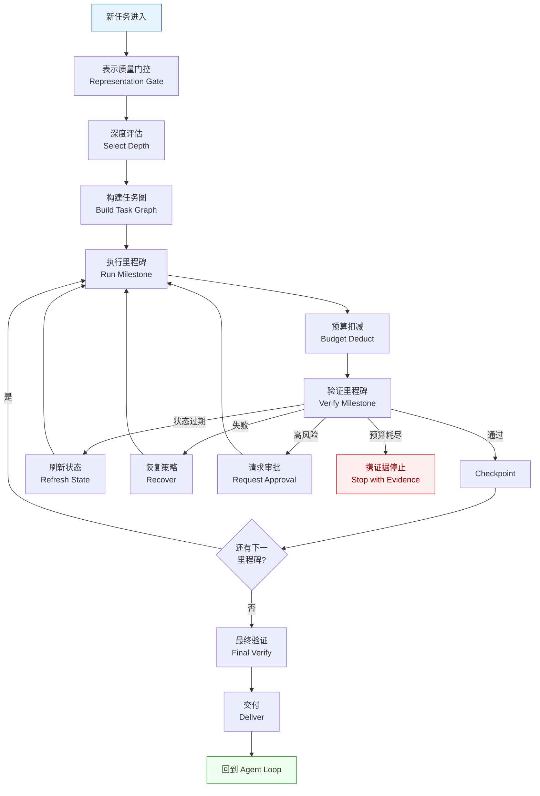
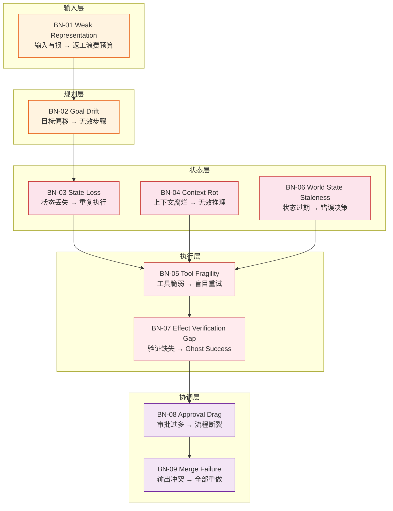

# Execution Depth

> **Evidence Status** — synthesized. coding-agent、research-agent、workflow-agent 参考项目在 inspect / draft / execute / verify / recover 上的真实差异；this repository 的 D0-D6 深度框架与 controller 词汇表。

- Use as: 架构决策工具，不同产品可调整阈值。

## 1. 为什么需要执行深度

很多 Agent 表面上“完成了”，实际只完成浅层工作：
- 用户要修 bug，它只给解法；
- 用户要研究结论，它只总结材料；
- 用户要推进流程，它只列待办；
- 用户要修改外部系统，它只调用了 API 却没验证状态变化。

执行深度定义：**Agent 需要做到哪一步，才算真的完成用户任务。**

```text
Execution Depth = Goal Persistence × Representation Quality × State Continuity × Tool Chain Reliability × Effect Verification × Recovery
```

## 2. D0-D6 分级

| 深度 | 名称 | Agent 做什么 | 完成证据 |
|---|---|---|---|
| D0 | Answer | 只回答、解释、总结 | 文本答案 |
| D1 | Observe / Inspect | 读取关键输入、形成可靠表示 | 来源/文件/观察清单 |
| D2 | Plan | 拆解任务、识别风险、定义 world refs 和 success criteria | 计划、假设、风险清单 |
| D3 | Draft | 生成草稿、patch、报告、配置 | 可审查产物 |
| D4 | Execute | 调用工具执行真实动作 | 工具结果、effect candidates |
| D5 | Verify & Recover | 验证结果，失败后迭代修复 | 测试/检查/回读/恢复证据 |
| D6 | Long-running Autonomy | 多阶段长时运行、自主推进、阶段汇报 | checkpoint、里程碑、最终交付 |

### 执行深度 ≠ 自主性

| 维度 | 问题 | 示例 |
|---|---|---|
| 自主性 | Agent 是否允许自己执行？ | 是否能自动发邮件 |
| 执行深度 | Agent 要做到哪一步？ | 是否必须起草、发送、回读 outbox、确认送达状态 |

可以低自主 + 高深度：Agent 深入分析、修改、验证，但最终高风险动作仍需确认。

## 3. Deep Execution Controller

Controller 负责决定 Agent 应该继续深入、验证、恢复、请求审批，还是停止交付。

```text
NEW_TASK
  ↓
REPRESENTATION_GATE
  ↓
SELECT_DEPTH
  ↓
BUILD_TASK_GRAPH
  ↓
RUN_MILESTONE
  ↓
VERIFY_MILESTONE
  ├─ pass → CHECKPOINT → NEXT_MILESTONE
  ├─ world_state_stale → REFRESH_STATE → RUN_MILESTONE
  ├─ fail → RECOVER → RUN_MILESTONE
  ├─ risky → REQUEST_APPROVAL → RUN_MILESTONE
  └─ budget_exhausted → STOP_WITH_EVIDENCE
  ↓
FINAL_VERIFY (claim + effect + risk)
  ↓
DELIVER
```

下图展示执行深度控制环——任务进入后经深度评估、预算扣减、里程碑执行与验证，最终收束回 Agent Loop:



### Controller 职责

| 职责 | 说明 |
|---|---|
| Representation Gate | 判断当前输入表示是否足够可靠到能进入计划/执行 |
| Depth Selection | 根据任务类型、风险、工具可用性选择 required_depth |
| Task Graph Management | 维护 milestone、subtask、依赖、success criteria 和 world refs |
| Budget Control | 管理 step/tool/token/risk/time/retry/attention/human budget |
| Gatekeeping | 决定是否进入下一层深度或下一 milestone |
| Recovery Routing | 根据 failure taxonomy 选择恢复策略 |
| Effect Accounting | 检查 intended effect 是否有 verification status |
| Stop Decision | 判断继续执行、升级给用户、还是停止交付 |

### Task State Schema

```yaml
task_id: string
product_type: coding_agent | research_agent | workflow_agent | memory_agent | companion_agent | agent_platform
intent: string
required_depth: D0 | D1 | D2 | D3 | D4 | D5 | D6
current_depth: D0 | D1 | D2 | D3 | D4 | D5 | D6
goal: string
success_criteria: []
constraints: []
representation_quality: sufficient | weak | stale | conflicting
world_refs: []
current_milestone: string
milestones:
  - id: string
    objective: string
    status: pending | running | passed | failed | blocked | skipped
    world_objects: []
    exit_criteria: []
    verification: [structural, execution, effect, claim]
budgets:
  steps_remaining: int
  tools_remaining: int
  retries_remaining: int
  attention_remaining: int
  human_interruptions_remaining: int
  risk_budget: safe | check | approval
artifacts: []
key_decisions: []
failed_attempts: []
open_questions: []
evidence: []
pending_effects: []
```

### 决策伪代码

```python
def decide_next_action(task, state, policy):
    if state.representation_quality in {"weak", "stale", "conflicting"}:
        return "repair_or_refresh_representation"

    required = policy.required_depth(task.product_type, task.intent)
    if state.current_depth < required:
        return "continue_to_next_depth"

    if state.has_unverified_effects():
        return "verify_effects"

    if not state.has_required_evidence():
        return "collect_missing_evidence"

    if state.verification_failed and policy.allow_recovery:
        return "recover_and_retry"

    if state.next_action_risky():
        return "request_approval"

    if state.budget_exhausted():
        return "stop_with_evidence_and_limits"

    return "deliver"
```

## 4. 每层进入 / 退出条件

| 层 | 进入条件 | 退出条件 |
|---|---|---|
| D1 | 需要事实基础 | 已读取关键来源并记录表示质量 |
| D2 | 多步骤或有风险 | 有步骤、风险、依赖、success criteria、world refs |
| D3 | 需要产物 | 产物可审查，假设清楚 |
| D4 | 工具可用且权限满足 | 工具结果被记录并产生 effect candidate |
| D5 | 结果需要验证 | claim / execution / effect 验证通过，或阻塞点清楚 |
| D6 | 跨阶段推进 | 每阶段有 checkpoint、状态刷新和报告 |

## 5. 深度预算

| 预算 | 说明 |
|---|---|
| Tool Budget | 最多工具调用次数 |
| Time Budget | 最长运行时间 |
| Token Budget | 上下文和输出预算 |
| Risk Budget | 允许的最大风险动作等级 |
| Retry Budget | 最大失败重试次数 |
| Human Budget | 允许打扰用户的次数 |
| Branch Budget | 最多并行分支或 worker 数 |
| Freshness Budget | 多久必须刷新一次 world state |

预算的目的是避免”无限深入、无限修复、无限分支、无限 stale state”等退化循环。

## 6. 执行深度的 9 个瓶颈

| 瓶颈 | 表现 | 修复 |
|---|---|---|
| Weak Representation | 输入本身有损或歧义 | representation contract + confidence + raw ref |
| Goal Drift | 执行几步后偏离目标 | 每个 step 绑定 `goal_id`、`success_criteria`、`current_milestone` |
| State Loss | 工具结果、失败尝试、用户约束丢失 | State Engine 记录 plan/done/failed/open/next |
| Context Rot | 关键事实被上下文噪音淹没 | milestone 级 compaction + decision log |
| Tool Fragility | 工具失败后重复尝试或卡住 | failure_mode/recoverable/suggested_recovery |
| World State Staleness | 外部对象状态过期 | refresh policy + read-before-write |
| Effect Verification Gap | 执行了动作，但没证明正确 | postcondition + read-after-write + effect ledger |
| Approval Drag | 审批太多导致执行断裂 | 风险动作批量/分级审批 |
| Merge Failure | 多 Worker 输出冲突 | output contract/conflict policy/merge strategy |

### 9 个瓶颈编号索引与 BR-01 关联

以下为 9 个瓶颈的统一编号，每个瓶颈均体现原则 **BR-01（Agent 必须在显式资源预算下运行）** 的不同侧面：资源有限意味着每个瓶颈都可能导致预算浪费或耗尽。

| 编号 | 瓶颈名称 | BR-01 关联说明 |
|------|---------|---------------|
| BN-01 | Weak Representation | 输入表示有损导致后续步骤返工，浪费 token 和工具预算 |
| BN-02 | Goal Drift | 目标偏移导致无效步骤消耗预算，违反"预算内够好"原则 |
| BN-03 | State Loss | 状态丢失迫使重复执行已完成工作，直接消耗 step/tool 预算 |
| BN-04 | Context Rot | 上下文腐烂导致关键信息被噪音淹没，增加无效推理的 token 成本 |
| BN-05 | Tool Fragility | 工具失败后盲目重试耗尽 retry 预算，未能触发策略切换 |
| BN-06 | World State Staleness | 依赖过期状态做出错误决策，导致动作失败和预算浪费 |
| BN-07 | Effect Verification Gap | 缺少效果验证导致 Ghost Success 累积，后期修复成本远高于即时验证 |
| BN-08 | Approval Drag | 审批过多导致 human budget 耗尽，执行流程断裂 |
| BN-09 | Merge Failure | 多 Worker 输出冲突消耗额外协调预算，严重时需要全部重做 |

原则详情见 [`concepts/foundations/PRINCIPLE-INDEX.md`](../../../concepts/foundations/PRINCIPLE-INDEX.md)。

下图展示 BN-01 至 BN-09 九个瓶颈在执行链路中的分布——从输入表示到多 Worker 合并，每个环节都可能耗尽预算:



## 7. 最小深执行闭环

```text
Task Goal
  ↓
Representation Gate
  ↓
Required Depth
  ↓
Task Graph / Milestones
  ↓
Depth Budget
  ↓
Tool Execution
  ↓
Verification Gate
  ↓
Effect Verification
  ↓
Checkpoint + Decision Log
  ↓
Recovery or Final Delivery
```

## 8. 结束模板

```text
Requested depth: D5
Reached depth: D5
Representation quality: sufficient
Artifacts: ...
Effect verification: ...
Recovered failures: ...
Remaining risks: ...
Next suggested action: ...
```

## 9. 关联模式

- `design-space/patterns/depth-budgeting.md`
- `design-space/patterns/milestone-gated-execution.md`
- `design-space/patterns/decision-log.md`
- `design-space/patterns/effect-ledger.md`
- `evaluation/execution-depth-evals.md`
