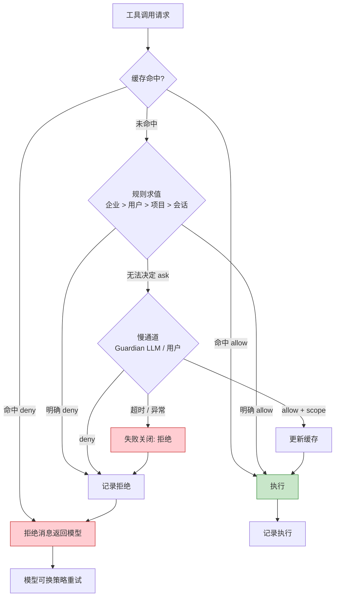

# 权限决策

> **Evidence Status** -- grounded. 提炼自 Control Plane、Permission Models、Approval Cache 三处在多个生产系统中反复验证的共性机制。

**提炼自**：
- `architecture/planes/control/overview.md` -- 验证层级与信任边界
- `architecture/planes/control/permission-models.md` -- 三种权限范式与快慢双通道
- `design-space/patterns/approval-cache.md` -- 按参数键缓存审批决策

## 问题

Agent 每一步都可能产生副作用。谁来决定"这一步能不能做"？

最小答案是三态输出：allow / deny / ask。生产级答案是：**把三态判断放入一个与 Agent 循环解耦的决策管线，让快路径覆盖 90% 的调用，慢路径兜底剩余 10%。**

## 三态输出

权限系统的输出是三态（allow / deny / ask），而非简单的布尔值：

| 输出 | 含义 | 后续动作 |
|------|------|---------|
| **allow** | 规则明确允许 | 直接执行 |
| **deny** | 规则明确禁止 | 拒绝作为一级消息返回模型，模型可换策略重试 |
| **ask** | 规则无法决定 | 路由到慢通道（Guardian LLM / 用户审批） |

关键设计：deny 属于正常控制流。模型收到 deny 消息后应能优雅调整策略。

## 多源规则堆叠

权限规则来自多个层级，按优先级从高到低：

```text
企业策略（不可覆盖）
  > 用户设置（全局偏好）
    > 项目设置（AGENTS.md / .claude/settings）
      > 会话规则（运行时动态追加）
```

核心原则：**deny 优先于 allow**。高优先级的 deny 永远不被低优先级的 allow 覆盖。规则求值采用 findLast 语义，从后向前匹配最近的规则。

## 权限缓存

缓存键必须按**参数键**而非工具名构建：

```text
错误: cache_key = "Bash"                  -- 批准 Bash 后所有命令放行
正确: cache_key = "Bash:python:test_*.py" -- 只批准特定命令前缀
```

缓存的四种决策级别：

| 级别 | 作用域 | 典型场景 |
|------|--------|---------|
| ApprovedForSession | 本次会话内同类操作自动放行 | 用户批准 `Write:src/` 后 |
| ApprovedOnce | 仅本次放行 | 一次性高风险操作 |
| Denied | 本次拒绝 | 单次阻止 |
| DeniedForSession | 本次会话内同类操作自动拒绝 | 明确禁止某类命令 |

**关键约束**：缓存严格绑定会话生命周期，跨会话放行必须走策略配置。

## 与 Agent 循环的解耦

权限决策独立于 Agent 主循环运行。审批请求异步发出，Agent 不阻塞等待。决策来源可以是用户或 Guardian LLM，调用方无需区分：

```text
Agent Loop                     Permission Pipeline
    |                                |
    +-- tool_call 意图 ------------>  快通道（规则/分类器，毫秒级）
    |                                |
    |   <-- allow ------------------|  命中 -> 直接放行
    |   <-- deny -------------------|  命中 -> 拒绝消息返回模型
    |                                |
    |                                +-- 未命中 -> 慢通道
    |                                |   （LLM 审核 / 用户询问，秒级）
    |   <-- allow / deny ------------|
    |                                |
    +-- 继续循环                     +-- 更新缓存
```

## 拒绝跟踪

所有 deny 决策必须记录，用于审计和策略优化：

| 记录字段 | 用途 |
|----------|------|
| tool_name + args_key | 定位被拒绝的具体操作 |
| rule_source | 哪条规则触发了拒绝 |
| timestamp | 时序分析 |
| session_id | 会话级聚合 |
| model_reaction | 模型收到拒绝后的后续动作 |

当 Agent 反复触发同类 deny 时（审批疲劳信号），系统可建议用户追加永久规则。

## 权限决策流程图



## 关联原则

| 原则编号 | 原则名称 | 本文对应机制 |
|---------|---------|------------|
| EM-03 | 环境塑造并约束可能的行动 | 权限规则多源堆叠（企业 > 用户 > 项目 > 会话），动态情境决定 Agent 能做什么 |
| MC-02 | 自我监控使提前终止和策略切换成为可能 | 权限缓存严格绑定会话生命周期，不跨会话放行；deny 作为正常控制流返回模型触发策略切换 |
| AV-02 | 无证据不放行 | 慢通道超时/异常时失败关闭（deny），不以缺失证据默认放行 |

原则详情见 [`concepts/foundations/PRINCIPLE-INDEX.md`](../../concepts/foundations/PRINCIPLE-INDEX.md)。

## 与 Kernel 的关系

Kernel 输出 `ToolCall` 意图，权限决策管线对意图做前置检查。所有 Decision 必须通过权限管线。权限管线是 Kernel 的约束层，而非 Kernel 的内部组件。
