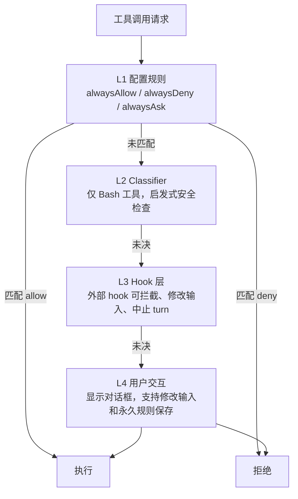
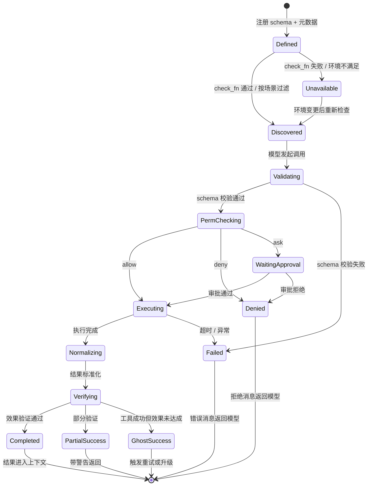

# 工具生命周期

> **Evidence Status** -- grounded. 提炼自 Tool Use Pattern、Concurrent Tool Partition、Tool Registry 三处跨多个生产系统验证的共性机制。

**提炼自**：
- `architecture/planes/tools/tool-use.md` -- 工具调用流水线与并发分区
- `design-space/patterns/concurrent-tool-partition.md` -- 基于声明的并发安全分区
- `design-space/patterns/tool-registry.md` -- 中心化注册与动态发现

## 问题

Agent 调用工具是一条从定义到结果回收的完整管线。管线中任何一环断裂（schema 不匹配、权限未检查、结果未截断）都会导致静默失败或安全隐患。

最小答案是 `execute(tool, args) -> result`。生产级答案是：**五阶段生命周期，每个阶段有明确的输入、输出和失败处理。**

## 五阶段生命周期

### 1. 定义阶段

工具在注册时声明完整元数据：

| 元数据 | 说明 |
|--------|------|
| schema | JSON Schema，定义参数类型和约束 |
| toolset | 所属工具集，支持嵌套组合 |
| isConcurrencySafe | 是否可并发执行（可基于输入参数动态判定） |
| destructive | 是否有不可逆副作用 |
| maxResultSize | 结果最大 token 数 |
| check_fn | 运行时可用性检查（如依赖的环境变量是否存在） |

关键设计：`isConcurrencySafe` 基于输入参数动态判定，而非静态标签。同一个 Bash 工具，`ls` 可以并发，`rm` 不行。

### 2. 发现阶段

三种发现机制按复杂度递增：

| 机制 | 适用场景 | 典型实现 |
|------|---------|---------|
| 静态注册 | 工具少于 10 个，入口点显式导入 | Hermes `register()` |
| 动态发现 | 工具多、需按场景组合 | OpenCode 文件扫描 + Provider 过滤 |
| 延迟加载 | MCP 等外部工具源 | 首次使用时获取 schema |

发现阶段执行 `check_fn` 过滤不可用工具，结果缓存避免重复调用。互斥工具在此阶段处理（有 `edit` 则不暴露 `apply_patch`）。

#### 工具数量的设计权衡

工具数量取决于"意图表达清晰度"和"权限粒度"之间的平衡：

| 项目 | 工具数 | 设计原则 |
|------|-------|---------|
| GenericAgent | 9 | 每个工具对应一个明确意图，LLM 不需要联合调用来表达操作 |
| Claude Code | ~30 | 平衡意图清晰度和功能覆盖 |
| Hermes | 40+ | 多领域覆盖，通过 toolset 分组和 check_fn 动态可用性管理复杂度 |

下界：少于 N 个时，LLM 被迫用通用工具（如 code_run）模拟特定操作，token 浪费在解释意图上。
上界：每个新工具都需要权限决策、错误处理、与其他工具的交互逻辑，复杂度指数增长。

### 3. 执行阶段

```text
验证 → 权限 → 执行 → 标准化 → 后验证
```

- **验证**：args 按 schema 校验，类型错误立即返回结构化错误
- **权限**：进入权限决策管线（见 `permission-decision.md`），三态输出
- **执行**：handler 在受控环境中执行，超时 / 异常统一处理
- **标准化**：原始结果转为统一格式 `{ status, summary, evidence, error_type }`
- **后验证**：效果验证（见 `effect-verification.md`），工具成功不等于效果成功

#### 权限评估管线

来自 Claude Code PermissionContext 的 4 层架构：



每层的设计目的：
- L1（最快）：离线决策，零延迟
- L2（可选）：仅 Bash，AI 辅助安全判断
- L3（可编程）：企业级 hook，可自定义拦截逻辑，支持 interrupt 中止整个 turn
- L4（最终）：用户决策，支持永久化规则（persist to config）

对比 OpenCode 的 deny > ask > allow 模型：
- 默认动作是 ask（询问用户），而非 deny（拒绝）
- 设计取向：信任主体优于信任规则。未知操作交给人判断，而非一刀切拒绝

执行阶段的完整流程用伪代码表示：

```python
async def execute_tool(call: ToolCall, ctx: Context) -> ToolResult:
    # 1. Schema 验证
    validated = call.schema.validate(call.arguments)
    if not validated.ok:
        return ToolResult.validation_error(validated.error)

    # 2. 权限检查（异步，不阻塞主循环）
    permission = await ctx.permission_engine.check(call)
    if permission.behavior == "deny":
        return ToolResult.denied(permission.reason)
    if permission.behavior == "ask":
        decision = await ctx.ask_user(call, permission)
        if decision == "deny":
            return ToolResult.denied("user_rejected")

    # 3. 执行（受控环境，统一超时 / 异常处理）
    try:
        raw_result = await call.handler.execute(call.arguments, ctx)
    except (TimeoutError, ExecutionError) as exc:
        return ToolResult.failed(exc)

    # 4. 结果标准化 —— 转为 { status, summary, evidence, error_type }
    normalized = normalize_result(raw_result, call.max_result_size)

    # 5. 效果后验证（如果工具声明了 verify 方法）
    if call.handler.has_verify():
        verification = await call.handler.verify(normalized, ctx)
        normalized.verification_status = verification.status

    return normalized
```

### 4. 并发阶段

#### 工具并发调度

并发安全按每次调用的输入动态判定，而非按工具类型静态决定：

```
isConcurrencySafe(input) → true:  加入并发批次
                        → false: 独占执行
```

调度策略：连续的 read-only 工具并发执行（最大并发数默认 10），遇到 write 工具则独占。

示例：grep + ls + glob → 并发；git push → 独占；file_write → 独占。

来源：Claude Code toolOrchestration.ts 的批分区机制。

当单轮产生多个工具调用时，运行时按声明的并发安全性分区：

```text
输入序列: [Read, Grep, Read, Write, Read, Glob]
分区结果:
  Batch 1 (并行): [Read, Grep, Read]
  Batch 2 (串行): [Write]
  Batch 3 (并行): [Read, Glob]
```

分区算法遍历调用序列，将相邻的 `isConcurrencySafe=true` 调用合并为并行批次，遇到 `false` 则隔离为串行块。

**上下文修改器排队**：并发批次内的 Context Modifier 不立即应用，收集后按原始顺序统一应用，避免竞态条件。串行块的修改器立即应用。

### 5. 结果阶段

工具结果回收到上下文前的处理：

| 策略 | 触发条件 | 处理方式 |
|------|---------|---------|
| 截断 | 结果超过 maxResultSize | 按 schema 截断，保留关键信息 |
| 外部化 | 大输出（代码搜索结果、日志） | 写文件，上下文只保留摘要 + 路径引用 |
| 上下文修改 | 工具改变了环境状态 | 通过 Context Modifier 更新上下文快照 |

#### 工具结果预算

工具返回值可能很大（如读取大文件）。结果预算独立于上下文压缩：

- 每个工具有 maxResultSizeChars 限制
- 超限时替换为占位符，原始内容存入 sessionStorage
- Fallback 时已队列的工具结果需全部清空（StreamingToolExecutor.discard()）

来源：Claude Code toolExecution.ts 的 applyToolResultBudget。

## 工具生命周期状态机



## 与 Kernel 的关系

Kernel 输出 `ToolCall` 意图（工具名、参数、intended_effect、verification_method）。生命周期管线接收意图并推进到 Completed 或 Failed 状态。Kernel 不直接执行工具、不持有执行权限，所有执行走 Tool Runtime。
