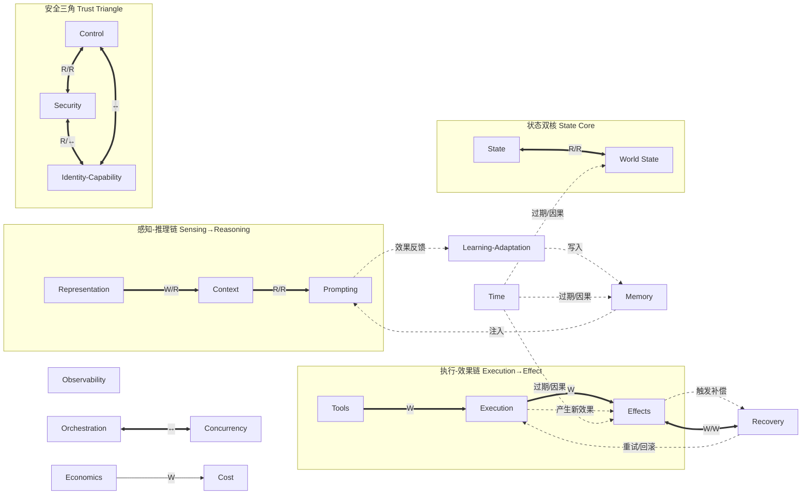

# Plane Interaction Matrix

> **Evidence Status** — synthesized. 本知识库 25 个运行时 plane 的边界文档、module-boundaries、runtime-data-model 和 reference-topologies 的综合；用于把"哪些模块互相依赖"从隐含知识变成可审查矩阵。

## 读法

- `R`：读取该 plane 产物；
- `W`：写入或生成该 plane 产物；
- `G`：经过该 plane 的 gate；
- `↔`：双向交互或回调；
- 空白：不应有直接依赖，应通过中间数据对象或 trace 间接连接。

## 核心矩阵

| From \ To | Interface | Representation | Prompting | Context | Memory | State | World State | Tools | Execution | Effects | Interaction | Orchestration | Control | Security | Cost | Observability | Recovery | Concurrency | Dataflow | Economics | Explainability | Identity-Capability | Learning-Adaptation | Operations | Time |
|---|---:|---:|---:|---:|---:|---:|---:|---:|---:|---:|---:|---:|---:|---:|---:|---:|---:|---:|---:|---:|---:|---:|---:|---:|---:|
| Interface |  | W |  |  |  |  |  |  |  |  | W |  | G | G |  | W |  |  |  |  |  | G |  |  |  |
| Representation | R |  | R | W | R | R | R |  |  |  |  |  | G | G |  | W |  |  | W |  | W | G |  |  | R |
| Prompting |  | R |  | R | R | R | R |  |  |  |  |  | G | G | G | W |  |  |  |  | W | G |  |  | R |
| Context |  | R | R |  | R | R | R |  |  |  |  |  | G | G | G | W |  |  |  |  | W | G |  |  | R |
| Memory |  | R |  | W |  | R |  |  |  |  |  |  | G | G |  | W | W |  |  |  |  | G |  |  | R |
| State |  | R |  | R | R |  | R |  |  | W | W | R | G |  | R | W | W | R |  |  |  | G |  |  | R |
| World State |  | R |  | W |  | R |  | R |  | W |  | R | G | G |  | W | W |  |  |  |  | G |  |  | R |
| Tools |  |  | R |  |  | R | R |  | W | W |  |  | G | G | G | W | W | G | W |  | W | G |  |  |  |
| Execution |  |  |  |  |  | R | R | R |  | W |  |  | G | G | G | W | W | G | W |  | W | G |  |  | W |
| Effects |  | R |  |  |  | W | W | R | R |  | W |  | G | G |  | W | W |  |  |  | W | G |  |  | W |
| Interaction | R |  |  | W | W | W |  |  |  | R |  | ↔ | G | G | R | W | W |  |  |  | R | G |  |  |  |
| Orchestration |  | R |  | R | R | W | R | W |  | R | ↔ |  | G | G | G | W | W | ↔ | R |  |  | G |  |  | R |
| Control | R | R | R | R | R | R | R | R | R | R | R | R |  | R | R | W | W | G |  | R |  | R |  | R |  |
| Security | R | R | R | R | R | R | R | R | R | R | R | R | R |  |  | W | W |  |  |  |  | R |  |  |  |
| Cost |  | R | R | R |  | R |  | R | R |  | R | R | G |  |  | W | W |  |  | R |  | G |  |  | R |
| Observability | R | R | R | R | R | R | R | R | R | R | R | R | R | R | R |  | R |  |  |  | W | R |  | W |  |
| Recovery |  | R | R | W | R | W | W | R | R | W | W | W | G | G | G | W |  |  |  |  |  | G |  |  | R |
| Concurrency |  |  |  |  |  | R |  | R | ↔ |  |  | ↔ | G |  | R | W |  |  |  |  |  | G |  |  | R |
| Dataflow |  | R |  |  |  | ↔ |  | R | R | R |  | R | G |  |  | W | W | R |  |  |  |  |  | R |  |
| Economics |  |  |  |  |  |  |  |  |  |  |  |  | R |  | W | R |  |  |  |  |  | R |  | R |  |
| Explainability |  |  |  |  | W |  |  |  |  | R | W |  |  |  |  | R |  |  |  |  |  |  | W |  |  |
| Identity-Capability | R | R |  | R |  | R |  | G | G | R | R | R | ↔ | ↔ |  | W |  |  |  |  |  |  |  |  | R |
| Learning-Adaptation |  |  | W |  | W |  |  |  |  |  |  |  | G | G |  | R |  |  |  |  |  |  |  | R | R |
| Operations |  |  | R |  |  | R |  | R |  |  |  | R | W | R | R | R | W | R |  | R |  |  | R |  |  |
| Time |  |  |  | R | R | R | R |  |  | R |  |  |  |  | R | W |  | R |  |  |  | R |  |  |  |

## 强耦合链路

| 链路 | 为什么强耦合 | 降耦方式 |
|---|---|---|
| Representation → Context → Prompting | 表示质量直接影响模型决策 | 用 Observation schema 和 ContextPack contract 明确边界 |
| Tools → Execution → Effects | 工具调用、执行结果和外部效果容易被混淆 | 分别记录 ToolCall、ExecutionResult、EffectRecord |
| State ↔ World State | 长任务进度依赖外部对象新鲜度 | TaskState 只记录任务进展，WorldStateSnapshot 记录外部事实 |
| Control ↔ Security ↔ Identity-Capability | 权限、攻击面、身份归因必须同时判定 | CapabilityGrant + PolicyVerdict + SecurityVerdict |
| Recovery ↔ Effects | 部分效果和失败补偿需要闭环 | FailureRecord + CompensationAction |
| Observability ↔ Evaluation (feedback layer) | 没有 trace 就无法回归；Evaluation 作为横跨所有 Plane 的反馈层依赖 Observability 提供 trace | 统一 TraceEvent schema 和 fixture extraction |
| Orchestration ↔ Concurrency | 谁做什么和同时做多少不能分开决定 | ConcurrencyPolicy 约束 Orchestration 的 fanout |
| Economics → Cost | 租户配额注入单次任务预算 | Economics 设配额上限，Cost 管运行时预算 |
| Time → World State / Memory / Effects | 过期和因果关系横切多个 plane | ValidityWindow + StalenessPolicy 统一接口 |
| Learning-Adaptation → Memory / Prompting | 学习结果写入 Memory 和 Prompt 模板 | CandidateRecord 经验证后才激活 |

## 强耦合数据流与反馈环

> **图注**：实线/粗箭头 = 强依赖（运行时必须同步协调）；虚线 = 反馈环或横切依赖（异步或延迟生效）。三个显著反馈环：(1) Effects → Recovery → Execution → Effects（故障补偿闭环）；(2) Learning → Memory → Prompting → Learning（学习激活闭环）；(3) Time 横切 World State / Memory / Effects（过期与因果）。

## 禁止耦合

| 禁止链路 | 原因 |
|---|---|
| Kernel / Prompting 直接写外部世界 | 绕过 Tool、Execution、Effects 和 Control |
| Memory 直接覆盖 World State | 记忆不等于当前事实 |
| Interaction 直接放行高危工具 | 用户消息必须转成授权事件并过 Control gate |
| Orchestration 共享裸上下文 | 多 Agent 应共享结构化 AgentMessage 和 refs |
| Cost 只读账单不影响决策 | 成本必须是策略输入，而不是事后统计 |
| Learning-Adaptation 跳过验证直接激活 | 未验证的学习结果可能固化幻觉或安全绕过 |
| Economics 直接控制单次执行 | Economics 设配额，Cost 管执行预算，不应越级 |
| Explainability 编造未发生的推理过程 | 解释必须引用实际 TraceEvent，不能事后合理化 |

相关文件：`module-boundaries.md`、`runtime-data-model.md`、`blueprint.md`、`planes/recovery/overview.md`、`planes/identity-capability/overview.md`。
