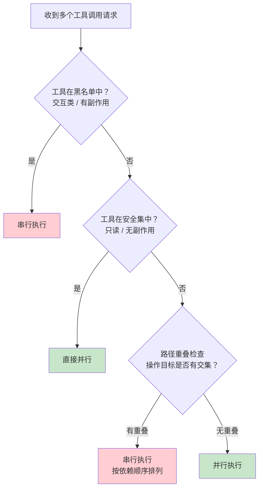

# Concurrency Plane
>
> **所属域**：6. Coordination — 并发、超时与取消
>
> **Evidence Status** — synthesized. 工具并发、worker orchestration、长任务取消、streaming Agent 的生产需求。

**Principle Refs**: BR-01, IS-03 — 预算约束按线程独立核算；并发状态可能彼此偏离导致竞态

当多个工具调用、多个 Worker 或多个 Agent 同时运行时，并发控制（Concurrency）决定系统是否稳定。缺少它，重试风暴、竞态写入和丢失取消都会变成生产事故。

## 1. 定义

Concurrency Plane 负责并发上限、事件排序、超时、取消、中断、重试和资源竞争。

它不是 Orchestration：Orchestration 决定谁做什么；Concurrency 决定同时做多少、何时取消、失败如何传播。

## 2. 核心对象

```yaml
concurrency_policy:
  max_parallel_tool_calls: integer
  max_parallel_workers: integer
  timeout_by_tool: object
  cancellation_propagation: parent_to_child | bidirectional | manual
  retry_policy:
    max_attempts: integer
    requires_new_evidence: true
  ordering:
    event_order: logical_clock | timestamp | causal_chain
```

## 3. 取消语义

| 取消来源 | 处理 |
|---|---|
| 用户取消 | 停止新动作，补偿已执行 effect，交付当前状态 |
| Policy block | 停止危险分支，保留安全分支 |
| Budget exhausted | 停止高成本步骤，触发 budget_choice |
| Parent task failed | 子任务收到 cancellation token |
| Stale world state（即 [Map-Territory Gap](../../../concepts/glossary.md#map-territory-gap)） | 暂停写动作，先 refresh |

## 4. 并发反模式

- Unbounded Workers：worker 数量无上限。
- Retry Storm：失败后多个分支同时重试同一工具。
- Lost Cancellation：用户取消后后台任务继续写外部系统。
- Race-to-Write：多个 Agent 写同一对象无锁或仲裁。
- Timestamp-only Ordering：只按时间排序，不考虑因果关系。

## 4.5 生产验证：工具并行化决策流程

> **Evidence Status** — production-validated. 路径重叠检查已在 hermes-agent 落地；层级限制已在 Codex 落地。

并非所有工具调用都能并行。生产系统中，工具并行化需要一个显式的决策流程，而非"模型说并行就并行"。

### 决策流程



### 三层分类

| 分类 | 规则 | 示例工具 |
|---|---|---|
| **黑名单（强制串行）** | 交互类工具、会修改全局状态的工具 | `delegate`、`execute_code`、`human_input`、`memory_write` |
| **安全集（直接并行）** | 只读工具、无副作用 | `Read`、`Grep`、`Glob`、`WebSearch` |
| **灰区（需路径重叠检查）** | 可能有副作用但不确定 | `Bash`、`Edit`、`Write`（需检查操作的文件路径是否有交集） |

### 路径重叠检查（hermes-agent 实现）

hermes-agent 在派发并行工具调用前，提取每个工具调用的目标路径（文件路径、URL、数据库 key 等），检查是否存在交集：

- **无交集**：安全并行。例如 `Edit(/src/a.ts)` 和 `Edit(/src/b.ts)` 可以并行。
- **有交集**：降级为串行。例如 `Edit(/src/a.ts)` 和 `Read(/src/a.ts)` 必须串行（写后读依赖）。
- **无法判断**：降级为串行。安全优先原则。

### 层级限制（Codex 实现）

Codex 通过 `max_depth` + `max_threads` 实现层级化的并发控制：

```yaml
codex_concurrency:
  max_depth: 3          # 最大递归委派深度
  max_threads: 5        # 每层最大并行线程数
  total_budget: 15      # 全局最大并行数 = 跨所有层级的线程总和
```

**设计启示**：`max_depth` 防止无限递归委派（Agent A 委派 Agent B 再委派 Agent C……），`max_threads` 防止单层扇出过宽。两者结合限制了并发的"面积"（depth × threads），而非仅限制单一维度。

## 5. 并发模型选择

不同并发模型适用于不同的 Agent 拓扑和资源约束。选型依据：共享状态的粒度、失败域的隔离需求、开发团队对模型的熟悉度。

| 模型 | 核心机制 | 适用场景 | 限制 |
|---|---|---|---|
| **互斥锁（Mutex）** | 临界区独占 | 单进程内少量共享资源（如 session state、token counter） | 粒度粗时吞吐骤降；跨进程需分布式锁，引入额外故障点 |
| **信号量（Semaphore）** | 计数型并发上限 | 控制并行工具调用数、API rate limiting、worker pool | 无法表达优先级；高争用时公平性难保证 |
| **Actor** | 消息传递 + 私有状态 | 多 Agent 系统中每个 Agent 作为独立 Actor；事件驱动工作流 | 消息顺序依赖 mailbox 策略；调试链路长；背压设计复杂 |
| **CSP（Communicating Sequential Processes）** | 有类型 channel + 同步通信 | 流水线式工具链；需要严格顺序保证的多步推理 | channel 容量需精确调优；动态拓扑变更成本高 |

**选型启发式**：
- 共享状态 < 3 个对象 → Mutex / Semaphore 足够。
- Agent 数量 > 5 或需要跨网络 → Actor 模型。
- 工具链有明确阶段且需背压 → CSP。
- 混合模式常见：Actor 间通信 + Actor 内部 Mutex 保护局部状态。

## 6. 取消语义详解

### 6.1 Cooperative Cancellation

Agent 系统的取消必须是协作式的，不能 kill 正在写外部系统的工具调用。

```text
CancellationToken 传播链：
  User → Orchestrator → Worker → Tool Call
  每层检查 token.isCancelled 后决定：
    - 立即停止（无副作用操作）
    - 完成当前原子步骤后停止（有副作用操作）
    - 执行补偿逻辑后停止（已产生外部 effect）
```

### 6.2 Timeout Propagation

超时需要分层传播，而非到时间直接终止：

| 层级 | 超时策略 | 示例 |
|---|---|---|
| 任务级 | 整体 deadline，所有子任务共享剩余时间 | 用户设定 120s 完成整个任务 |
| 步骤级 | 单步超时，超时后降级或跳过 | 单次 API 调用 30s |
| 工具级 | 工具自身的硬超时 + Agent 侧的软超时 | 浏览器操作 60s 硬超时 |

**关键规则**：子任务的超时之和不能超过父任务剩余时间。Orchestrator 在分派时需计算 `remaining_budget = parent_deadline - elapsed - safety_margin`。

### 6.3 Partial Result Handling

取消或超时后，已完成的部分结果仍有价值：

- **保留策略**：将已完成步骤的输出标记为 `partial: true`，交付给用户。
- **丢弃策略**：如果部分结果可能误导（如只完成了搜索未完成验证），标记为 `discarded` 并说明原因。
- **合并策略**：多个 worker 的部分结果可以合并，前提是它们之间没有数据依赖。

## 7. 多 Agent 场景的并发挑战

当系统从单 Agent 扩展到多 Agent，并发问题会非线性放大。

### 7.1 共享状态冲突

多个 Agent 读写同一个外部资源（文件、数据库、API 状态）时：

- **乐观并发**：每个 Agent 带版本号写入，冲突时重试。适用于低冲突率场景。
- **悲观并发**：写前获取锁。适用于高冲突率或 effect 不可逆场景。
- **CRDT（Conflict-free Replicated Data Types）**：无锁合并。适用于多 Agent 协作编辑同一文档等场景，但表达力有限。

### 7.2 消息顺序

分布式 Agent 之间的消息到达顺序不可假设。解决方案：

- **逻辑时钟（Lamport / Vector Clock）**：建立因果序，而非物理时间序。
- **Causal Broadcast**：保证因果相关的消息按序到达。
- **事件溯源（Event Sourcing）**：所有状态变更通过有序事件日志重放，冲突在日志层解决。

### 7.3 死锁检测

多 Agent 系统中死锁表现为循环等待：Agent A 等 Agent B 的输出，Agent B 等 Agent A 的确认。

- **静态检测**：在 DAG 编排中分析依赖图，拒绝包含环的编排。
- **运行时检测**：Orchestrator 维护等待图（wait-for graph），检测环后强制取消最低优先级的等待边。
- **超时兜底**：所有跨 Agent 等待必须有超时，超时即视为对端失败。

## 8. 生产数据

来自多 Agent 系统的生产观测和学术研究：

| 指标 | 数值 | 来源 / 上下文 |
|---|---|---|
| 多 Agent 错误放大倍数 | **17.2x** | 分布式多 Agent 系统中，单点错误通过级联传播后，整体失败率是单 Agent 的 17.2 倍 |
| 集中式编排错误放大倍数 | **4.4x** | 集中式 Orchestrator 模式下，错误传播被 Orchestrator 拦截，放大倍数显著降低 |
| 并行工具调用最优上限 | **3-5** | 超过 5 个并行工具调用后，模型对结果的整合质量下降；超过 8 个时错误率陡增 |
| 取消信号平均延迟 | **200-800ms** | 从用户取消到最深层工具调用停止的端到端延迟，取决于编排层数 |
| 重试风暴触发阈值 | **>60% 失败率** | 当工具调用失败率超过 60% 时，无熔断的重试策略会在 3 轮内耗尽 token 预算 |

多 Agent 系统必须在架构层控制错误传播，仅靠单点重试和超时不足以保证稳定性。集中式 Orchestrator 是降低错误放大的最直接手段，但会引入单点瓶颈，需要在错误放大（17.2x → 4.4x）和吞吐之间权衡。

## 9. 与知识库的映射

Concurrency Plane 与知识库其他部分的关联：

| 关联对象 | 关系 | 说明 |
|---|---|---|
| **Orchestration Plane** | 互补 | Orchestration 决定任务分配，Concurrency 决定执行约束。两者共同决定多 Agent 系统的运行时行为 |
| **Budget Plane (BR-01)** | 约束输入 | 并发上限直接影响 token / 时间 / API 消耗速率；预算耗尽是取消的触发源之一 |
| **Integrity Plane (IS-03)** | 竞态防护 | 并发写入可能导致状态不一致；Concurrency 提供锁和排序机制，Integrity 提供校验和回滚机制 |
| **Observability Plane** | 可观测性 | 并发行为需要 trace 支持——每个并行分支需独立 span，合并点需关联 span |
| **Error Handling Plane** | 失败传播 | 并发环境下的错误传播路径比串行复杂；需要与 Error Handling 的熔断、降级策略协同 |
| **patterns/circuit-breaker** | 模式复用 | 熔断器是防止并发场景下重试风暴的关键模式 |
| **design-space/frontier/long-horizon-runtime** | 前沿方向 | 长时任务的并发管理是未解决的前沿问题，涉及跨 session 的 cancellation token 持久化 |
