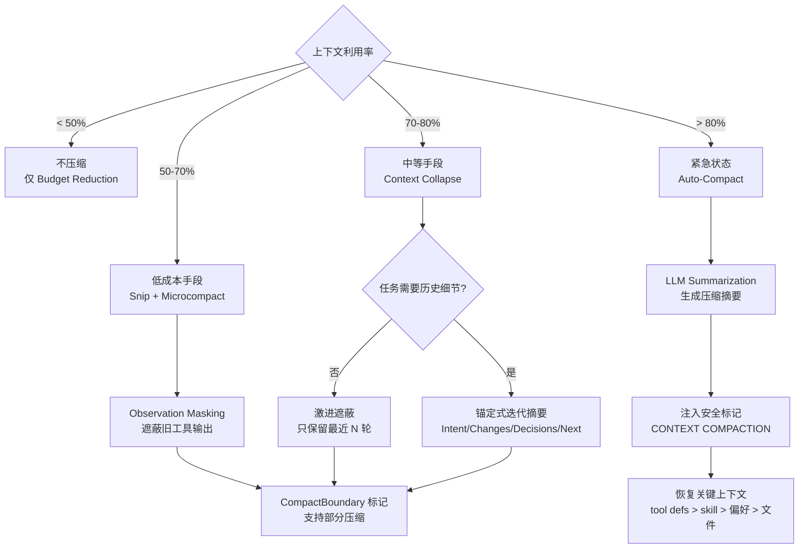
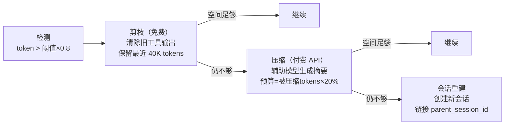
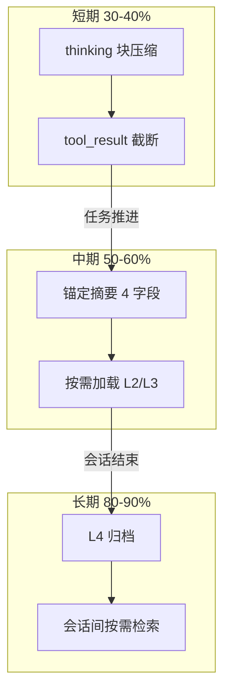

# 上下文压缩策略——从观测遮蔽到渐进管线

> **所属域**：2. Cognition & Continuity — 上下文压缩与容量管理
>
> **Evidence Status** — grounded. JetBrains 2025 Coding Agent 压缩实验、Factory.ai 锚定式迭代摘要、ACON（OpenReview）失败驱动指南优化、Anthropic API 三原语（Compaction / Tool-Result Clearing / Memory Tool）、Manus 文件系统扩展记忆模式。

**Principle Refs**: BR-02, BR-01 — 上下文信息随时间退化；窗口受显式资源预算约束。

---

## 1. 为什么压缩不可避免

即使上下文窗口标称 128K 或 200K，Context Rot 研究表明有效利用率在 40-50% 之后急剧退化（参见 `context-rot-model.md`）。生产 Agent 需要在注意力退化之前主动压缩上下文。

压缩的核心矛盾是**信息保留 vs. 空间释放**——压太多丢信息，压太少浪费注意力。不同技术在这条光谱上占据不同位置。

---

## 2. 两大流派：Observation Masking vs. LLM Summarization

JetBrains 在 2025 年的 Coding Agent 压缩实验中对比了两种根本不同的策略：

| 维度 | Observation Masking（遮蔽） | LLM Summarization（摘要） |
|---|---|---|
| 机制 | 将工具输出替换为占位符或截断标记 | 用 LLM 生成压缩摘要 |
| 成本 | 零额外 LLM 调用 | 每次压缩消耗一次 LLM 调用 |
| 延迟 | 无 | 摘要生成需要时间 |
| 信息损失模式 | 粗粒度——整个输出被遮蔽 | 细粒度但有幻觉风险 |
| Cache 影响 | 不影响后续 cache（遮蔽是稳定操作） | 摘要内容每次不同，可能破坏 cache |

### JetBrains 实验结果

```text
Observation Masking:
  - 成本减少: 52%
  - 质量变化: +2.6%（提升）

LLM Summarization:
  - 成本减少: 38%
  - 质量变化: -1.2%（下降）
```

**反直觉发现**：遮蔽不仅更便宜，质量反而更好。原因是：

1. 遮蔽减少了无关信息对注意力的稀释
2. LLM 摘要可能引入微妙的信息失真
3. 遮蔽后的上下文更短，模型推理更聚焦

**设计启发**：**先用遮蔽穷尽低成本手段，再动用 LLM 摘要**。这与 Claude Code 的分层压缩思想一致。

---

## 3. Anthropic API 三原语

Anthropic 在 API 层面提供了三个互补的上下文管理原语：

### 3.1 Compaction（compact_20260112）

| 属性 | 说明 |
|---|---|
| 触发条件 | 上下文接近窗口限制时自动或手动触发 |
| 机制 | LLM 对历史消息生成结构化摘要 |
| 保留策略 | 架构决策、约束、用户偏好标记为不可压缩 |
| 输出 | 摘要替换原始历史，最近 N 轮保持原样 |
| 效果 | 有效会话长度延长 2-3x |

**使用要点**：

- Compaction 是**有损操作**——必须仔细定义"不可压缩"集合
- 与 Prompt Caching 配合使用效果最佳：摘要稳定后成为新的 cache 前缀
- 连续压缩有质量下降风险（摘要的摘要）——应设置最大连续压缩次数

### 3.2 Tool-Result Clearing（clear_tool_uses_20250919）

| 属性 | 说明 |
|---|---|
| 触发条件 | 工具结果已被处理且不再需要原始内容时 |
| 机制 | 将工具调用的 result 字段清空，保留调用记录 |
| 保留策略 | 保留"调用了什么工具、传了什么参数"，清除返回值 |
| 效果 | 工具输出通常占上下文的 40-60%，清除后释放大量空间 |

**与 Observation Masking 的关系**：Tool-Result Clearing 是 Anthropic 对 Observation Masking 的 API 级实现。它比自定义遮蔽更标准化，且保留了工具调用的结构信息。

### 3.3 Memory Tool（memory_20250818）

| 属性 | 说明 |
|---|---|
| 触发条件 | Agent 识别出值得长期保存的信息时 |
| 机制 | Agent 主动调用 memory 工具写入持久化存储 |
| 保留策略 | 选择性写入——只保存高价值信息 |
| 效果 | 信息从上下文窗口迁移到持久层，下次可按需检索 |

**三原语的协作模式**：

```text
工具输出进入上下文
    ↓
Agent 处理并提取关键信息
    ↓
关键信息 → Memory Tool（持久化）
    ↓
工具结果 → Tool-Result Clearing（释放空间）
    ↓
历史消息膨胀 → Compaction（结构化摘要）
```

---

## 4. Factory.ai 锚定式迭代摘要

Factory.ai 提出的 Anchored Iterative Summarization 模式，核心思想是用**固定结构的摘要锚点**替代自由格式的摘要：

### 4.1 四个持久字段

| 字段 | 内容 | 更新策略 |
|---|---|---|
| **Intent** | 用户的原始意图和当前目标 | 仅在目标变更时更新 |
| **Changes** | 已完成的修改列表 | 增量追加 |
| **Decisions** | 关键设计决策及理由 | 增量追加 |
| **Next Steps** | 待完成的行动项 | 每轮更新 |

### 4.2 增量合并机制

```text
第 N 轮摘要:
  Intent:    "重构用户认证模块"
  Changes:   ["抽取 AuthService 类", "添加 JWT 验证"]
  Decisions: ["选择 JWT 而非 Session，因为需要无状态"]
  Next:      ["添加 refresh token 逻辑"]

第 N+1 轮新信息: "完成了 refresh token，发现需要处理并发刷新"

第 N+1 轮摘要（增量合并）:
  Intent:    "重构用户认证模块"               ← 不变
  Changes:   [... + "实现 refresh token"]      ← 追加
  Decisions: [... + "用锁机制防止并发刷新"]     ← 追加
  Next:      ["编写并发刷新的测试"]             ← 替换
```

**优势**：

- 结构固定 → 摘要质量稳定，不会随着压缩次数增加而退化
- 增量合并 → 每次只处理新信息，压缩成本低
- 四字段覆盖了 Agent 任务的核心维度——不会漏掉关键信息类型

---

## 5. ACON 失败驱动指南优化

ACON（Adaptive CONtext，OpenReview）提出了一种将失败经验自动压缩为决策指南的方法：

| 维度 | 说明 |
|---|---|
| 核心思想 | 从 Agent 的失败案例中提取"下次遇到类似情况应该怎么做"的指南 |
| 存储形式 | 简短的 if-then 规则，而非完整的失败历史 |
| 效果 | 内存减少 26-54%，准确率保持 95%+ |
| 更新机制 | 新失败 → 提取 → 与现有指南合并或覆盖 |

**示例**：

```text
失败历史（原始，800 tokens）:
  - 第 3 轮：调用 grep 搜索 "config" 返回 500 行
  - 第 4 轮：上下文膨胀，忘记了搜索目标
  - 第 5 轮：重复调用 grep，最终超时

压缩为指南（40 tokens）:
  - "当 grep 返回 > 50 行时，先用 --max-count 限制输出，
     再逐步细化搜索条件。避免一次性加载大量结果。"
```

ACON 的启示是：**最好的压缩不是保留原始信息的子集，而是提取原始信息的决策价值**。

---

## 6. 按内容类型的压缩比指南

不同类型的内容有不同的最优压缩比：

| 内容类型 | 推荐压缩比 | 策略 | 理由 |
|---|---|---|---|
| System Prompt | **永不压缩** | — | 角色定义和约束不可丢失 |
| 最近 2-3 轮消息 | **不压缩** | — | 当前推理的直接上下文 |
| 历史对话 | 3:1 - 5:1 | 结构化摘要 | 保留决策和结果，丢弃中间推理 |
| 工具输出（代码/文本） | 10:1 - 20:1 | 遮蔽 + 摘要 | 保留关键发现，丢弃原始内容 |
| 工具输出（搜索结果） | 20:1 - 50:1 | 遮蔽 | 只保留相关条目 |
| 错误日志 | 5:1 - 10:1 | 提取关键行 | 保留错误类型、位置、消息 |
| 子 Agent 返回 | 2:1 - 3:1 | Narrative Reframing | 保留结论和发现 |

**重要约束**：压缩比是指导值，不是硬规则。关键信息即使在高压缩比类别中也应被保留。

---

## 7. Claude Code 五级渐进管线

Claude Code 实现了业界最完整的分层压缩管线，按成本递增、侵入性递增排列：

| 级别 | 名称 | 机制 | 成本 | 触发条件 |
|---|---|---|---|---|
| 1 | **Budget Reduction** | 限制单个工具输出的最大 token 数 | 零 | 始终生效 |
| 2 | **Snip** | 裁剪历史到最近 N 轮 | 零 | 利用率 > 50% |
| 3 | **Microcompact** | 对工具输出做规则化压缩（正则替换、去重） | 极低 | 利用率 > 60% |
| 4 | **Context Collapse** | 折叠相关消息组（同一文件的多次编辑合并） | 中等 | 利用率 > 70% |
| 5 | **Auto-Compact** | 完整 LLM 摘要 | 高 | 利用率 > 80% |

### 管线执行逻辑

```text
check_utilization():
  ratio = current_tokens / max_tokens

  if ratio > 0.80:
    auto_compact()      ← 最后手段
  elif ratio > 0.70:
    context_collapse()  ← 中等手段
  elif ratio > 0.60:
    microcompact()      ← 低成本手段
  elif ratio > 0.50:
    snip()              ← 零成本手段
  else:
    budget_reduction()  ← 始终生效的预防措施
```

**设计原则**：低成本手段先用尽，再动用 LLM。这与 JetBrains 的实验结论一致——遮蔽类操作在成本和质量上都优于 LLM 摘要。

---

## 8. 文件系统作为扩展记忆

Manus 团队将文件系统作为上下文窗口的扩展层：

```text
上下文窗口（热层）
  ↕ 读/写
文件系统（温层）：todo.md、notes.md、scratchpad.md
  ↕ 按需
持久存储（冷层）：数据库、向量存储
```

### 关键模式

| 模式 | 说明 |
|---|---|
| **Write-to-File** | 长输出写文件，上下文只保留摘要 + 文件路径 |
| **Read-on-Demand** | 需要时再读取文件内容，不预加载 |
| **todo.md 作为注意力锚** | 每轮结束更新 todo，下轮开始读取，保持目标聚焦 |
| **Scratchpad 持久化** | 推理中间状态写入临时文件，上下文只保留结论 |

**与 Anthropic Memory Tool 的关系**：文件系统模式是 Memory Tool 的轻量替代方案。Memory Tool 适合结构化的长期知识，文件系统适合任务级的临时信息。两者可以共存。

---

## 9. 触发时机：为什么是 70%

综合 Chroma 的 Context Rot 研究和 Claude Code 的生产经验：

| 利用率 | 状态 | 行动 |
|---|---|---|
| < 40% | 安全区间 | 仅 budget reduction |
| 40-60% | 预警区间 | 开始 snip + microcompact |
| **60-70%** | **压缩窗口** | **必须在此区间完成主要压缩** |
| 70-80% | 危险区间 | context collapse + auto-compact |
| > 80% | 紧急状态 | 强制 auto-compact 或上下文重置 |

**为什么 70% 是关键触发点**：

1. Chroma 研究显示 40-50% 后退化加速——70% 是最后的安全缓冲
2. 压缩本身消耗空间——摘要输出需要约 15-20% 的预留空间
3. 30K tokens 是经验阈值——超过此量级后退化从量变到质变

```text
安全操作公式:
  有效窗口 = 标称窗口 × 0.7（退化安全系数）
  可用空间 = 有效窗口 - system_prompt - tool_defs - output_reserve
  压缩触发 = 可用空间 × 0.7（压缩缓冲系数）
```

---

## 10. 压缩策略选择矩阵

| 场景 | 推荐策略 | 理由 |
|---|---|---|
| 短会话（< 10 轮） | Budget Reduction 即可 | 不需要复杂压缩 |
| 中等会话（10-30 轮） | Snip + Tool-Result Clearing | 释放工具输出空间通常足够 |
| 长会话（30-100 轮） | 完整五级管线 | 需要分层应对 |
| 多 Agent 协作 | Narrative Reframing + Memory Tool | 上下文隔离 + 持久化 |
| 调试循环 | 锚定式迭代摘要 | 需要保留决策历史和错误模式 |
| 批量自动化 | ACON 指南提取 | 将失败经验压缩为可复用规则 |

### 压缩策略决策树



---

## 11. 三层成本梯度——从免费到付费的溢出应对管线

生产系统中，压缩不是单一动作，而是一条成本递增的管线。核心逻辑：**能用免费手段解决的不花钱，花钱能解决的不重建会话**。



| 层级 | 动作 | 成本 | 触发条件 | 来源 |
|---|---|---|---|---|
| **检测** | token 计数 > 阈值 × 0.8 | 零 | 每轮检查 | 通用 |
| **剪枝** | 清除旧工具输出，保留最近 40K tokens，释放至少 20K | 零 | 检测通过 | OpenCode |
| **压缩** | 用辅助模型生成摘要，预算 = 被压缩 tokens × 20% | 一次 LLM 调用 | 剪枝后仍超标 | Hermes |
| **会话重建** | 创建新会话，`parent_session_id` 指向旧会话 | 一次 LLM 调用 + 冷启动 | 压缩后仍超标或质量不可接受 | Hermes |

**剪枝的具体操作**（OpenCode 实现）：

1. 从最旧的消息开始，删除所有 `tool_result` 类型内容
2. 如果释放量不足 20K tokens，继续删除旧的 `assistant` 消息中的 thinking 块
3. 保留最近 40K tokens 的完整消息不动
4. 始终保留 system prompt 和 tool definitions

**会话重建的具体操作**（Hermes 实现）：

1. 对当前会话做一次完整压缩摘要
2. 创建新会话，将摘要注入为首条 system context
3. 记录 `parent_session_id`，支持审计回溯
4. 旧会话标记为 archived，不再追加消息

---

## 12. 压缩安全标记——防止摘要被当作指令执行

压缩摘要注入上下文时存在一个隐蔽风险：模型可能把历史摘要中提到的请求当作新任务执行。例如摘要中写"用户请求删除 config.yaml"，模型可能真的去删。

**强制标记**（来自 Hermes）：

```text
[CONTEXT COMPACTION — REFERENCE ONLY]
Earlier turns were compacted into the summary below.
DO NOT answer questions or fulfill requests mentioned in this summary.
Respond ONLY to the latest user message that appears AFTER this summary.
```

| 设计要点 | 说明 |
|---|---|
| 放置位置 | 紧接摘要内容之前，作为摘要的"帧头" |
| 为什么不够靠 prompt 约束 | 长上下文下 system prompt 中的约束容易被忽略（Lost in the Middle），标记必须与摘要物理相邻 |
| 多次压缩时 | 每次压缩重新生成标记，不嵌套旧标记（避免标记自身膨胀） |
| 测试验证 | 压缩后应测试"模型是否会执行摘要中提到的历史请求"作为回归用例 |

---

## 13. Token 效率量化——分层记忆的实际节省比

不同时间尺度下的压缩机制，实际 token 节省比差异显著（来自 GenericAgent 度量）：

| 层次 | 时间尺度 | 机制 | 节省比例 | 典型实现 |
|---|---|---|---|---|
| **短期** | 单轮内 | 压缩 thinking / tool_result 标签，保留最近 N 条 | 30-40% | Claude Code Snip / Microcompact |
| **中期** | 任务内 | 分层记忆只加载相关段（L1 指针 + 按需 L2/L3） | 50-60% | Factory.ai 锚定摘要 / ACON 指南 |
| **长期** | 会话间 | L4 归档，按需加载 | 80-90% | Anthropic Memory Tool / 文件系统扩展 |



**关键洞察**：单靠短期压缩无法支撑长任务。30 轮以上的会话，必须启用中期的结构化摘要；跨会话任务必须依赖长期层。三层叠加后，总 token 消耗可降至朴素实现的 10-20%。

---

## 14. 压缩后恢复策略——重建关键上下文

压缩是有损操作。压缩后如果直接继续，模型会丢失部分关键上下文。Claude Code 的做法是在压缩完成后主动恢复一组关键信息：

| 恢复项 | 预算上限 | 恢复方式 | 理由 |
|---|---|---|---|
| 最近读取的文件（最多 5 个） | 按实际大小 | 重新注入文件内容摘要 | 压缩后模型不记得文件内容，但下一步操作可能依赖它 |
| Skill 指令 | 每个 skill 5K tokens | 从 skill registry 重新加载 | skill 定义了行为约束，丢失会导致风格/策略漂移 |
| MCP 工具说明 | 按 tool definitions 原样 | 不压缩，始终保留 | 工具调用的基础，压缩后必须可用 |
| 用户偏好和项目约定 | 2-3K tokens | 从 memory / config 文件重新注入 | 格式偏好、语言偏好、代码风格等 |

**恢复时序**：

```text
压缩完成
  ↓
注入 [CONTEXT COMPACTION] 标记 + 摘要     ← §12 的安全标记
  ↓
恢复 tool definitions（如果被压缩影响）
  ↓
恢复 skill 指令
  ↓
恢复最近文件摘要
  ↓
恢复用户偏好
  ↓
继续正常 ORDA-VU 循环
```

**恢复预算约束**：恢复内容的总量不应超过压缩释放空间的 30%。如果恢复本身占用过多空间，优先级为：tool definitions > skill 指令 > 用户偏好 > 文件摘要。

---

## 15. 压缩后恢复预算

压缩是有损操作，但损失可以通过**主动恢复**来弥补。关键认知：压缩不只是删除旧消息，还需要为关键上下文预留恢复空间——否则压缩后模型因缺少文件上下文而产生错误的工具调用，反而比不压缩更危险。

### 15.1 Claude Code 的恢复预算分配

| 恢复类别 | 预算上限 | 数量限制 | 说明 |
|---|---|---|---|
| 文件恢复 | 50K tokens | 最多 5 个文件，每个约 5K | 压缩前最近读取/编辑的文件，按访问时间排序 |
| 技能恢复 | 25K tokens | 每个技能最多 5K | 从 skill registry 重新加载行为约束 |
| 工具定义 | 按原样保留 | 不压缩 | 工具调用的基础，始终完整保留 |
| 用户偏好 | 2-3K tokens | — | 格式、语言、代码风格等从 config 重新注入 |

### 15.2 条件性图像剥离

压缩输入前移除图像内容——图像对摘要生成无用，但占用大量 token。移除时为每个图像留下文本标记（如 `[image: screenshot of error dialog]`），确保摘要中保留"此处曾有图像"的语义锚点。

### 15.3 设计原则

```text
恢复预算公式:
  压缩释放空间 = compressed_tokens - summary_tokens
  恢复占用空间 = file_recovery + skill_recovery + preference_recovery
  安全约束:    恢复占用 < 压缩释放 × 0.3

  违反安全约束时，按优先级裁剪:
    tool_definitions > skill 指令 > 用户偏好 > 文件摘要
```

核心原则：

1. **恢复预算应低于压缩释放的空间** — 恢复占用不超过释放量的 30%，留足安全余量
2. **恢复有优先级** — tool definitions 永远保留；文件摘要是最后恢复项，在预算不足时首先裁剪
3. **恢复目的是防止错误工具调用** — 压缩后模型不记得文件内容，但下一步操作可能依赖它；缺少上下文的工具调用比缺少历史更危险
4. **图像剥离是零成本优化** — 图像对 LLM 摘要无贡献，剥离后释放的空间可直接用于恢复预算

> **来源**：Claude Code compaction 实现（`autoCompact.ts` / `compact.ts`）。参见 `../../../projects/coding-agents/claude-code/compaction.md`。

---

## 相关文件

| 主题 | 文件路径 |
|---|---|
| Context Plane 总览 | `overview.md` |
| 上下文组装算法 | `context-assembly-algorithm.md` |
| Context Rot 退化模型 | `context-rot-model.md` |
| Compaction 模式 | `../../../design-space/patterns/compaction.md` |
| Tool Output Offloading | `../../../design-space/patterns/tool-output-offloading.md` |
| Context Engineering 概念 | `../../../concepts/context-engineering.md` |
| 工作记忆动力学 | `../../../cognitive-architecture/working-memory-dynamics.md` |
| Memory Plane | `../memory/overview.md` |
