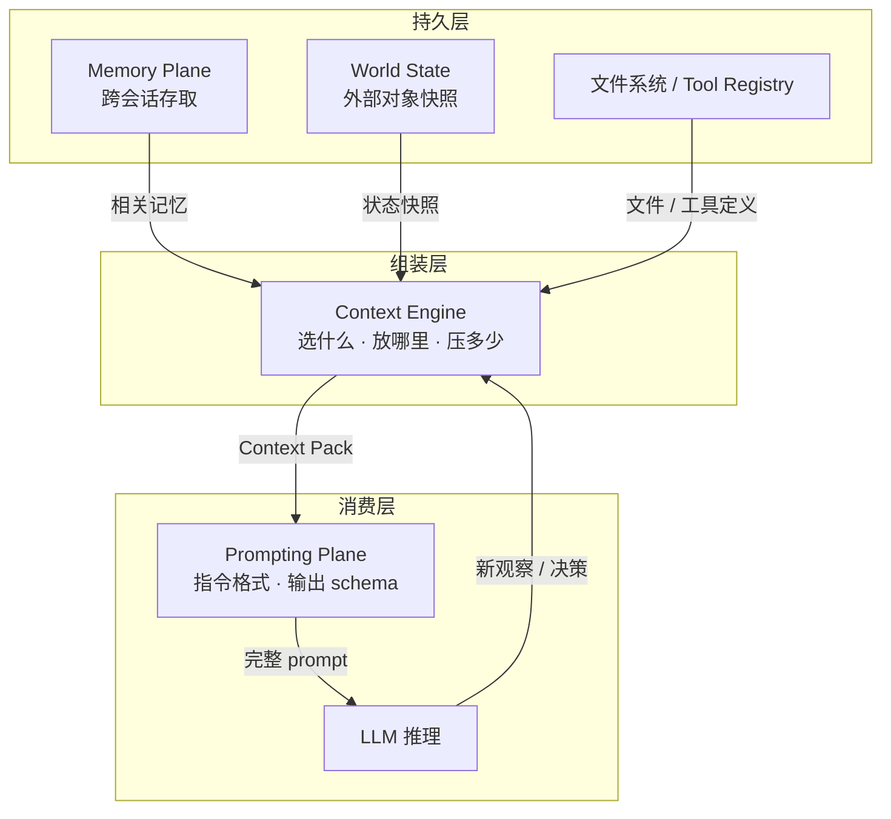
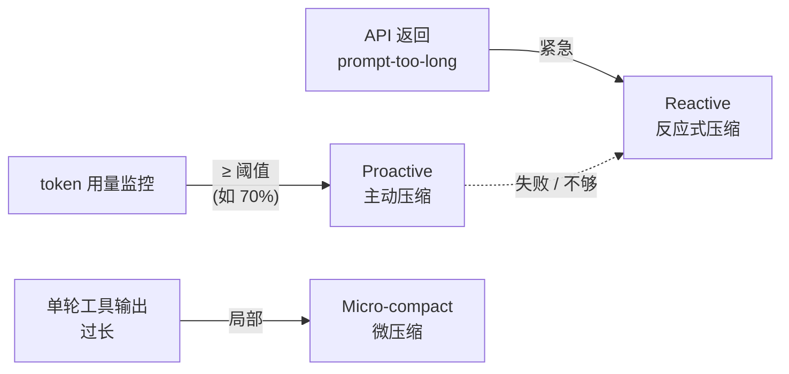
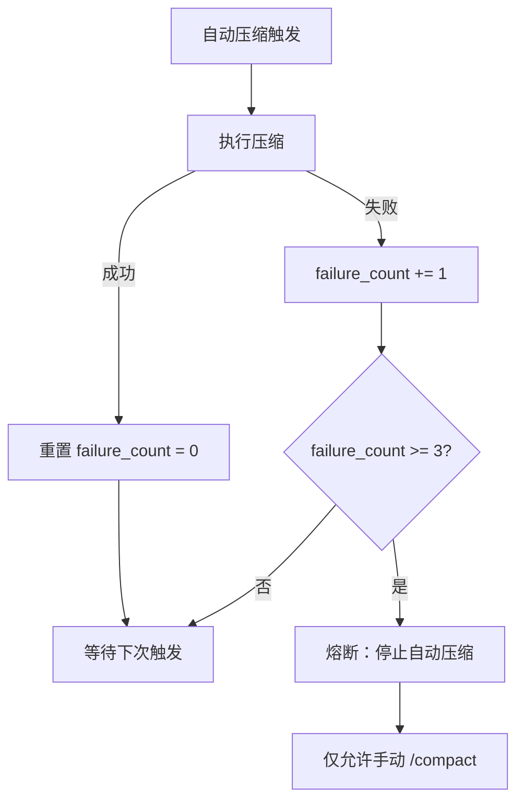
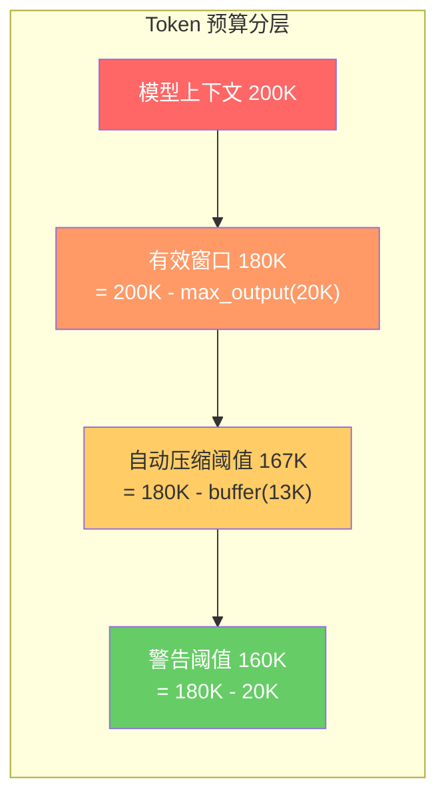

# Context Engine
>
> **所属域**：2. Cognition & Continuity — 当前注意力预算
>
> **Evidence Status** — grounded. Claude Code、OpenCode、Nocturne 等系统对 compaction、disclosure、snapshot 的实现；this repository 对上下文预算与表示分层的统一抽象。

**Principle Refs**: BR-02, BR-01 — 上下文信息随时间退化，窗口受显式资源预算约束。

## Context Engine 在系统中的位置



- **Memory** 管"存什么、何时检索"，Context 管"检索出来的东西放不放进窗口、放多少"。
- **Prompting** 管"指令怎么写、输出格式怎么约束"，Context 管"指令和历史如何在有限 token 里排布"。
- **World State** 提供外部事实，Context 决定哪些快照值得占用注意力预算。

三者的操作职责矩阵见 `../../cross-cutting/context-engineering-x-memory.md`。

## 定义

上下文窗口是 Agent 的工作记忆。每个 token 都在购买注意力，不在窗口中的信息模型无法利用。Context Engine 的职责是做取舍：哪些信息进入当前窗口、以什么语义和 trust tier 进入、哪些该压缩、哪些留在 memory / world state / raw refs 中按需回查。

## 核心问题

| 问题 | 表现 |
|---|---|
| Context Rot | 上下文填满后模型开始忽略指令、跳过步骤、重复已完成动作 |
| Lost in the Middle | 中间位置的信息最容易被忽略 |
| Trust Collapse | 不同来源的内容被混成一段 prompt |
| Summary Overwrite | 有损摘要覆盖原始观察 |

## 模块接口

**输入**：Depth Controller 的 milestone、Representation 层的 observations、Memory 的相关主张、World State 快照、State Engine 的进度
**输出**：组装好的 Context Pack
**配置**：compaction 策略、offloading 阈值、progressive disclosure、trust lane policy

## Context Pack 装配

```yaml
context_pack:
  system_prompt: string
  goal_and_constraints: string
  current_milestone: string
  trusted_instructions: []
  normalized_observations: []
  world_state_snapshots: []
  relevant_memory: []
  progress_state: {}
  decision_log_summary: string
  available_tools: []
  recent_effects: []
  trust_warnings: []
```

## 管理策略

| 策略 | 说明 | 详见 |
|---|---|---|
| Compaction | 按语义边界分组、按优先级丢弃或摘要历史消息 | `../../../design-space/patterns/compaction.md` |
| Frozen Snapshot | 不可变的上下文快照，用于子代理或恢复 | `../../../design-space/patterns/frozen-snapshot.md` |
| Tool Output Offloading | 大输出写文件，上下文只保留摘要和 raw ref | `../../../design-space/patterns/tool-output-offloading.md` |
| Progressive Disclosure | 按需逐步展开信息 | `../../../design-space/patterns/progressive-disclosure.md` |
| Untrusted Context Boundary | 不可信内容与指令分离 | `../../../design-space/patterns/untrusted-context-boundary.md` |

## 产品差异化配置

| 产品 | Context 重点 | 典型配置 |
|---|---|---|
| Coding Agent | 代码文件、测试日志、diff | offloading > 200 行；保留路径和失败测试名 |
| Research Agent | 多来源文本与来源冲突 | 保留来源评级、问题树、证据表 |
| Enterprise Workflow | 外部对象状态和审批上下文 | 保留 object id、状态快照、权限上下文 |
| Browser/Desktop Agent | DOM + 截图 + UI 状态 | 多 lane：DOM / screenshot / user goal |
| Companion Agent | 人格定义不可压缩 | persona frozen；关系层 compaction |

## 边界协议：Context / Prompting / Memory

上文 mermaid 图展示了三者的数据流向，此处补充操作级的分工：

| 操作 | Context 职责 | Prompting 职责 | Memory 职责 |
|---|---|---|---|
| **few-shot 示例** | 按预算装配进窗口 | 定义选择策略（`few_shot_policy`） | 提供历史候选 |
| **compaction** | 执行压缩，决定压缩比和保留集 | 不参与 | 不参与；压缩结果如需持久化，走 Context→Memory 写入协议 |
| **trust lane** | 装配时标记每个片段的来源和信任等级 | 自身内容默认 Trusted | 注入内容默认 Semi-trusted |

Trust Lane 定义详见 [安全 Plane](../security/overview.md)。完整职责矩阵见 `../../cross-cutting/context-engineering-x-memory.md`。

## 参考实现

- **Claude Code**：4 阶段压缩（snip → micro → collapse → auto），见 `projects/coding-agents/claude-code/control-layer.md`
- **OpenCode**：Doom Loop 检测与上下文压缩联动，见 `projects/coding-agents/opencode/context-engineering.md`
- **Nocturne Memory**：Disclosure Routing 决定信息披露策略，见 `projects/memory-systems/nocturne-memory/context-engineering.md`

## 生产验证：三层压缩

> **Evidence Status**: production-validated — Claude Code、opencode、hermes-agent 三个独立项目收敛到同一分层模式。



**Proactive — 主动压缩**
按 API round 将消息分组为完整问答对，整组剥离，不做 token 级切割。Claude Code 在 70% 预算时触发；opencode 用 `PRUNE_PROTECT`（40K）保护最近内容、`PRUNE_MINIMUM`（20K）作为最低保留线。关键点：保留语义边界，一个完整交互回合要么整体保留要么整体丢弃。

**Reactive — 反应式压缩**
当主动压缩不足以腾出空间、或 API 直接返回 prompt-too-long 时触发。Claude Code 计算 token gap 一次性跳过多组（不逐条试探）；hermes 采用迭代更新策略，多次压缩时摘要追加而非覆盖，保留历史可追溯性。反应式压缩是兜底手段；如果频繁触发，说明主动压缩阈值设低了。

**Micro-compact — 微压缩**
不触发完整消息重组，只在单轮内对已执行工具的输出做局部汇总。hermes 进一步拆成两阶段：先做廉价文本裁剪（截断、去重），裁不够再调 LLM 生成摘要。关键点：微压缩是热路径操作，必须低延迟，不能阻塞下一步工具调用。

---

## 生产实践：Token Gap 启发式压缩

> **Evidence Status**: production-validated — Claude Code 生产实现。

线性压缩（每次丢弃一组 compact group、再试）在大 gap 场景下极慢。Claude Code 的做法：

1. **解析错误消息**：`parsePromptTooLongTokenCounts(msg)` 从 API 错误文本中提取 `{actualTokens, limitTokens}`。
2. **计算 gap**：`gap = actualTokens - limitTokens`。
3. **跳组压缩**：用 gap 值跳过多个 compact groups（每组对应一个完整交互回合），而非逐组尝试。
4. **加速效果**：比线性压缩快 N 倍（N = 跳过的组数）。

关键实现约束：
- 跳组后仍需保持语义边界完整，跳到的位置向前对齐到最近的组边界。
- 跳组是 Reactive 路径的子策略；Proactive 路径仍按阈值逐步压缩。
- 若跳组后仍不够，退化为全量压缩（最激进模式）。

---

## 生产实践：自动压缩熔断

> **Evidence Status**: production-validated — Claude Code 生产实现，BQ 实证数据。

自动压缩可能进入死循环：压缩后仍超限 → 再触发压缩 → 仍失败 → 无限重试。熔断机制：

```
MAX_CONSECUTIVE_AUTOCOMPACT_FAILURES = 3
```

- 每次自动压缩成功 → 重置失败计数器。
- 连续 3 次失败 → **停止自动压缩**，不再自动触发。
- 用户手动 `/compact` 命令仍然可用，不受熔断影响。

**BQ 实证**：1,279 个会话曾出现 50+ 次连续自动压缩失败，熔断机制直接消除该问题。



---

## 生产实践：多层 Token 预算

> **Evidence Status**: production-validated — Claude Code + OpenCode 独立收敛到同一分层模式。

单一"上下文窗口大小"不足以管理 token 预算。生产系统需要多层阈值，每层触发不同策略：

| 层级 | 计算方式 | 典型值（200K 窗口） | 触发行为 |
|---|---|---|---|
| 模型上下文上限 | 模型固有参数 | 200,000 | 硬上限，超过即 API 报错 |
| 有效窗口 | 模型上下文 - `max_output_tokens` | 200,000 - 20,000 = **180,000** | 实际可用于 prompt 的空间 |
| 自动压缩阈值 | 有效窗口 - `AUTOCOMPACT_BUFFER` | 180,000 - 13,000 = **167,000** | 触发 Proactive 压缩 |
| 警告阈值 | 有效窗口 - 20,000 | 180,000 - 20,000 = **160,000** | 向用户显示窗口告警 |

**Claude Code 参数**：`AUTOCOMPACT_BUFFER = 13,000 tokens`，`max_output_tokens = 16,000-20,000`。
**OpenCode 参数**：`COMPACTION_BUFFER = 20,000 tokens`，更保守以适应多工具并发输出。



设计约束：
- `AUTOCOMPACT_BUFFER` 必须大于单次工具输出的最大预期大小，否则压缩后一次工具调用就再次超限。
- 预留 `max_output_tokens` 是硬性要求：API 需要为模型回复预留空间。
- 多模型部署时，每个模型的有效窗口不同，预算层需动态计算。

---

## 生产实践：压缩摘要管理

> **Evidence Status**: production-validated — Hermes Agent 生产实现。

压缩不只是"丢弃旧消息"。Hermes 的摘要管理策略解决了有损压缩的信息保留问题：

**保护头尾**
- 尾部保护：最近 N 条消息（含最后一条用户消息）绝不压缩，保证模型能"看见"最新上下文。
- 头部保护：system prompt + 第一轮用户意图保持完整。

**中间总结**
- 被压缩的中间轮次由 LLM 生成结构化摘要，而非直接丢弃。
- 摘要保留：关键决策点、工具调用结果、失败原因、状态变更。
- 摘要丢弃：重复的中间推理、冗余的工具原始输出、已过时的状态描述。

**迭代更新**
- 多次压缩时，新摘要**追加**到已有摘要，而非覆盖。
- 保留历史可追溯性：第 N 次压缩的摘要包含"前 N-1 次压缩的核心结论"。
- 防止 Summary Overwrite（见核心问题表）。

**工具输出预裁剪**
- 在调用 LLM 做摘要之前，先执行廉价的文本级裁剪：
  - 截断超长工具输出（保留头部 + 尾部 + 错误信息）
  - 去除重复的 API 响应体
  - 清理已过期的状态快照
- 裁剪后仍超限，再调 LLM 生成摘要，以控制压缩的推理成本。

---

## Context Engineering vs Prompt Engineering

> 来源：Gulli (2025) *Agentic Design Patterns*, Appendix A.

传统 Prompt Engineering 聚焦**优化单次查询的措辞**。Context Engineering 是更高层的实践：**在运行时动态构建完整的操作图景**，使模型拥有充分的上下文做出正确决策。

Context Engineering 管理的信息层：

| 层 | 来源 | 示例 |
|---|---|---|
| System prompts | 静态指令 | 角色定义、行为约束、输出格式 |
| Retrieved documents | 主动检索 | RAG 拉取的技术文档、知识库条目 |
| Tool outputs | 工具返回 | API 响应、代码执行结果、文件内容 |
| Implicit data | 隐式上下文 | 用户身份、交互历史、环境状态 |

核心原则：即使是最先进的模型，在有限或构建不良的操作环境视图下也会表现不佳。任务从"回答一个问题"变成"为 Agent 构建完整的操作图景"。

**与本 Plane 的关系**：Context Engine 正是 Context Engineering 在运行时的具体实现，负责选什么、放哪里、压多少。Context Engineering 是设计方法论，Context Engine 是运行时模块。
