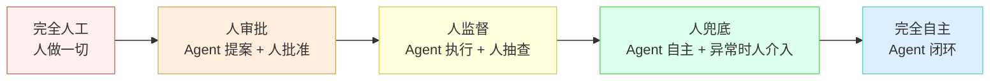
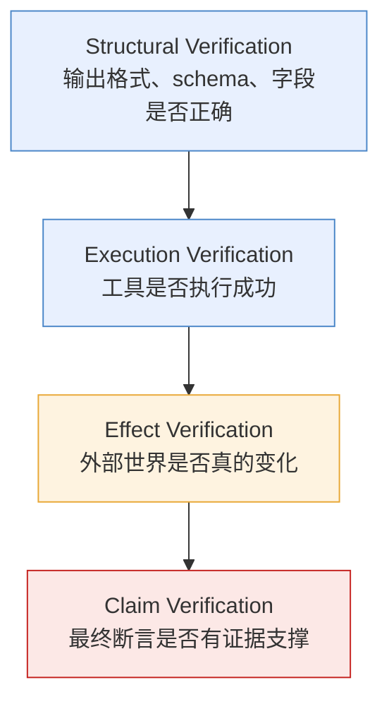
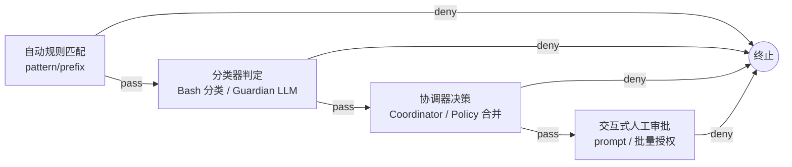
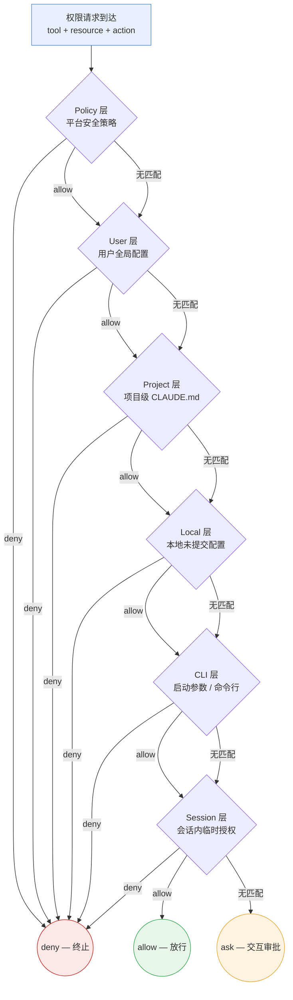

# Control & Policy Engine
>
> **所属域**：9. Governance (cross-cutting) — 权限、审批与验证
>
> **Evidence Status** — production-validated. Claude Code 的 hook / permission tree、Codex 的 guardian / sandbox policy、OpenCode 的 deny > ask > allow、企业工作流常见审批逻辑；本知识库对权限、验证、信任升级规则的统一抽象。分层审批管道与权限即配置模式已在三个项目中落地验证。

**Principle Refs**: BR-01, MC-02, EM-03 — 显式资源预算约束行动边界；自监控触发提前终止；环境条件限制可执行动作

## 定义

Control Policy Engine 对 Agent 行动进行**前馈约束、反馈验证和纠错**。权限不应散落在工具实现里，而应集中在 Control 层——这是 Agent 安全的最后一道防线。

Control 层回答四个问题：
- **允许做什么？** — 权限规则、工具白名单
- **什么时候要审批？** — 风险等级触发人工介入
- **什么证据足以停止？** — 验证层级判断执行是否完成
- **异常时怎么办？** — 表示不可靠、世界状态过期、效果未验证时的降级策略

## 模块接口

| 方向 | 内容 |
|------|------|
| **输入** | Tool Runtime 的权限查询、Kernel 的验证请求、Security 的 trust warning、Hook 事件 |
| **输出** | allow / deny / approval_required / verification_result / refresh_required |
| **配置** | 权限策略、审批规则、Hook 注册、验证方法、升级/降级条件 |

## 信任边界

### 协作光谱

Agent 自主程度不是二元开关，而是一条连续光谱：



生产系统通常不在光谱的两端，而是根据操作风险在不同位置切换。

### 基于风险的介入

| 风险 | 操作类型 | 介入方式 |
|------|----------|----------|
| 低 | 读取、分析、建议 | 无需介入 |
| 中 | 修改文件、调用内部 API | 事后审查 / 批量授权 |
| 高 | 删除、外部发送、生产操作 | 事前审批 |
| 极高 | 不可逆、安全相关、金钱相关 | 强制人工 |

### 基于不确定性的介入

Agent 应在以下情况请求输入：
- 多个合理选项无法确定
- 表示层置信度低
- 关键 world state 过期或冲突
- 效果验证失败且恢复路径代价高
- 操作不可逆或影响范围未知

## 验证层级



| 层级 | 问题 | 失败后果 |
|------|------|----------|
| Structural | 输出格式、schema、字段是否正确？ | 下游工具解析失败 |
| Execution | 工具是否执行成功？ | 操作未生效却以为成功 |
| Effect | 外部世界是否真的变化？ | 幻觉式完成报告 |
| Claim | 最终回答中的断言是否有证据？ | 用户收到错误信息 |

越往下验证代价越高，但遗漏的后果也越严重。

## AGENTS.md 与外部文本

项目级声明式配置（如 AGENTS.md）可以作为高优先级约束，但前提是：
- 来源在信任边界内
- 有明确生效范围
- 不与系统/用户直接指令冲突

其他外部文本（issue 评论、网页、日志、邮件）默认属于 **data lane**，不能自动升级成 instruction lane。

## 生产验证：分层审批管道

权限判定不是单点 if-else，而是多层管道——每层可独立注入逻辑，deny 在任意层短路终止。

### 管道结构



Claude Code 走完整 4 层；Codex 用 prefix 规则 + 用户批准 + 沙箱 3 个正交维度替代中间层；opencode 用 pattern-based 规则在第一层就覆盖多数场景。

### 权限维度正交表

| 维度 | 作用 | 典型取值 |
|------|------|----------|
| **Policy 规则** | 声明式白/黑名单 | `allow *_read` · `deny rm -rf` · `ask *.env` |
| **用户批准** | 运行时交互策略 | Never / OnFailure / Granular / 批量 |
| **沙箱隔离** | 最后兜底的物理边界 | 文件系统只读 · 网络白名单 · 进程 namespace |

三个维度独立配置、正交组合。Policy 决定"能不能"，批准决定"问不问"，沙箱决定"逃不逃得出去"。

### 审批缓存

已批准的决策按可序列化 key（文件路径、host:port、命令前缀）缓存，支持子集命中和批量放行。拒绝同样被追踪——模型收到结构化错误后可自行调整策略，而非盲目重试。

### 权限 Sources × Behaviors 合并流程

一个权限请求到达时，引擎从最高优先级来源开始逐层匹配，首遇 deny 立即终止，遇到 allow 放行到下一层继续检查，所有层都无匹配规则则回退到 ask。



**评估规则**：deny 在任意层短路终止，不可被低层覆盖；allow 仅表示当前层放行，仍需通过后续层检查；所有层都无匹配时回退到 ask，由用户交互决定。这保证了高层策略对低层的绝对控制力。

### 生产模式：Guardian 子 Agent 审批

静态规则引擎覆盖已知场景，但对长尾风险和上下文相关的边界判断力有限。Codex 引入独立 Guardian 子 agent 作为动态审批层——它不是规则匹配器，而是具备上下文理解能力的审批决策者。

**架构要点**：

- Guardian 是独立子 agent 进程，与被审批的主 agent 隔离运行，避免共享上下文导致的偏见
- Guardian 接收结构化的审批请求（tool、参数、资源、上下文摘要），返回 allow / deny / escalate
- 审批决策基于 7 维风险分类：

| 风险维度 | 示例场景 | 默认策略 |
|---|---|---|
| 数据泄露 | 读取 `.env` / credentials 后调用外部 API | deny + 告警 |
| 凭证探测 | 遍历 `~/.ssh/`、`~/.aws/` 等敏感目录 | deny |
| 破坏性操作 | `rm -rf`、`DROP TABLE`、覆盖生产配置 | deny 除非沙箱 |
| 网络外连 | 向非白名单域名发送 HTTP 请求 | ask + 记录目标 |
| 权限升级 | 修改自身权限规则、调用 sudo | deny |
| 资源耗尽 | 无限循环、大量文件写入、长时间占用 | 熔断 |
| 供应链风险 | 安装未审查依赖、执行远程脚本 | ask + hash 校验 |

**用户覆盖机制**：用户可通过 `--override-guardian` 显式覆盖 Guardian 的单次拒绝决策。覆盖操作本身被完整记录到审计日志，包含覆盖理由。

**熔断保护**：Guardian 连续判定高风险操作超过阈值（默认 3 次/分钟）时触发熔断，暂停主 agent 执行并通知用户。熔断状态需要用户显式解除，不会自动恢复——这防止攻击者通过高频请求绕过审批。

### 审批疲劳防护

反复弹出审批对话框会导致用户形成"条件反射式批准"——这比没有审批更危险，因为它提供了虚假的安全感。

**拒绝追踪状态（DenialTrackingState）**：

```text
DenialTrackingState:
  consecutive_denials: number      # 连续拒绝计数
  denial_history: [{tool, resource, timestamp}]
  max_consecutive_denials: 3       # 阈值（可配置）
```

**行为规则**：

- 用户连续拒绝同一类操作达到阈值时，agent 停止重试该类操作，转为调整策略或请求用户澄清意图
- 拒绝计数按操作类型分桶（文件写入、命令执行、网络请求各自独立计数）
- 计数在用户主动批准同类操作或显式重置时归零
- agent 收到拒绝后的结构化错误应包含拒绝原因和已尝试次数，帮助模型判断是否应放弃当前路径

这套机制与 Guardian 熔断互补：Guardian 从审批端防止高频风险操作，DenialTrackingState 从用户端防止审批疲劳。

## 设计模式

| 模式 | 说明 | 详见 |
|------|------|------|
| Hook System | 在生命周期关键事件上注入自定义逻辑 | `../../../design-space/patterns/hook-system.md` |
| Self-Verification | Agent 自我验证执行结果 | `../../../design-space/patterns/self-verification.md` |
| Loop Detection | 检测和打断无效循环 | `../../../design-space/patterns/loop-detection.md` |
| Untrusted Context Boundary | 区分指令与数据 | `../../../design-space/patterns/untrusted-context-boundary.md` |
| Permission Models | 三种权限范式对比 | `./permission-models.md` |

## 参考实现

- **Claude Code**：25 种 Hook 事件类型、Classifier + Hook 权限决策，见 `projects/coding-agents/claude-code/control-layer.md`
- **Codex**：规则引擎 + Guardian LLM 双层审批，见 `projects/coding-agents/codex/guardian-policy.md`
- **OpenCode**：deny > ask > allow 与 Doom Loop 检测，见 `projects/coding-agents/opencode/control-memory.md`
