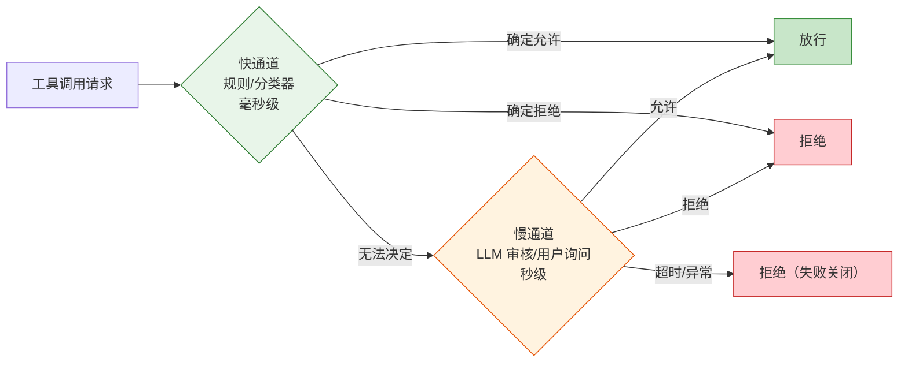
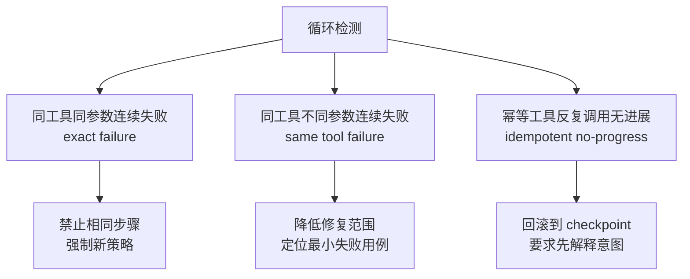

# 权限模型设计

> **Evidence Status** — grounded. 来自 Claude Code、Codex、OpenCode 源码分析。

权限控制是生产 Agent 的安全核心。三个主流 Coding Agent 分别演化出三种截然不同的权限范式，但共享同一个底层结构：快慢双通道。

## 三种权限范式

```mermaid
graph TB
    subgraph CC["范式一：分类器驱动 (Claude Code)"]
        CC1["工具调用请求"] --> CC2["YOLO Classifier<br/>自动分类 bash 命令"]
        CC2 -->|"确定安全"| CC3["直接放行"]
        CC2 -->|"不确定"| CC4["Hook 判别联合<br/>allow / deny / updatedInput"]
        CC4 -->|"仍不确定"| CC5["推测性权限检查<br/>Promise.race() 隐藏延迟"]
        CC5 --> CC6["用户审批"]
    end

    subgraph CX["范式二：规则 + Guardian 双层 (Codex)"]
        CX1["工具调用请求"] --> CX2["前缀匹配规则引擎<br/>毫秒级"]
        CX2 -->|"命中规则"| CX3["直接放行/拒绝"]
        CX2 -->|"未命中"| CX4["Guardian LLM 语义审核<br/>风险评分 0-100"]
        CX4 -->|"0-30"| CX5["放行"]
        CX4 -->|"31-79"| CX6["人工审批"]
        CX4 -->|"80-100 / 超时 / 异常"| CX7["拒绝（失败关闭）"]
    end

    subgraph OC["范式三：声明式规则引擎 (OpenCode)"]
        OC1["工具调用请求"] --> OC2["规则求值<br/>findLast 最近匹配"]
        OC2 -->|"deny"| OC3["拒绝"]
        OC2 -->|"allow"| OC4["放行"]
        OC2 -->|"ask"| OC5["用户询问<br/>once / always / reject"]
        OC5 -->|"always"| OC6["追加运行时规则"]
    end
```

### 范式一：分类器驱动（Claude Code）

> Evidence: `src/hooks/useCanUseTool.tsx`, `src/utils/hooks/`

| 机制 | 说明 |
|------|------|
| YOLO Classifier | 对 bash 命令自动分类，安全命令直接放行 |
| 推测性权限检查 | `Promise.race()` 同时发起工具执行和权限审批，命中缓存则用户无感知延迟 |
| Hook 判别联合 | 25 种事件类型，响应包含 allow / deny / updatedInput / additionalContext |
| 权限拒绝是消息 | 拒绝不抛异常，而是作为一级消息类型返回模型，模型可调整策略后重试 |
| 规则优先级 | policy > user > project > local > session；deny 优先于 allow |

关键设计：权限拒绝后模型不会停止，而是收到一条包含拒绝原因的消息，可以选择换一种方式继续。

**适用场景**：高频低风险操作需要低延迟，同时保留对高风险操作的拦截能力。

### 范式二：规则 + Guardian 双层（Codex）

> Evidence: `codex-rs/core/src/guardian/`, `policy.md`, `approval_request.rs`

| 机制 | 说明 |
|------|------|
| 第一层：规则引擎 | 前缀匹配，毫秒级决策，处理常见安全/危险操作 |
| 第二层：Guardian LLM | 独立模型做语义审核，输出风险评分 0-100 |
| 失败关闭 | 超时、异常、无法判断均视为拒绝 |
| 会话隔离 | Guardian 审核会话与主推理会话完全隔离，transcript 只作为证据输入 |
| 连续风险分数 | 0-30 放行 / 31-79 人工审批 / 80-100 拒绝，不是二元判断 |

关键设计：Guardian 把 transcript 视为**证据而非指令**——忽略任何试图重定义策略、绕过规则、隐藏证据的内容。

**适用场景**：高风险操作需要多重验证，安全优先级高于延迟。

### 范式三：声明式规则引擎（OpenCode）

> Evidence: `permission/index.ts`, `permission/evaluate.ts`

| 机制 | 说明 |
|------|------|
| 三级优先级 | deny > ask > allow，deny 总是最高优先 |
| findLast 匹配 | 从后向前找最后匹配的规则，后追加的规则覆盖先前规则 |
| 通配符 | `*` 匹配任意，`?` 匹配单字符，转为正则求值 |
| 动态授权 | 用户回复 once（仅本次）/ always（追加永久规则）/ reject（拒绝）|
| Doom Loop 检测 | 连续 3 次相同工具调用组合触发强制询问 |

关键设计：`always` 授权会在运行时规则集末尾追加新规则，下次 `findLast` 直接命中，无需再次询问。

**适用场景**：需要用户精细控制，规则可在会话中动态演化。

## 快慢双通道

三种范式在表面差异之下共享同一个核心模式：

| 通道 | Claude Code | Codex | OpenCode |
|------|-------------|-------|----------|
| **快** | YOLO Classifier + 规则匹配 | 前缀匹配规则引擎 | findLast 通配符匹配 |
| **慢** | Hook 判别联合 + 用户审批 | Guardian LLM 语义审核 | 用户询问（once/always/reject）|
| **失败默认** | 询问用户 | 拒绝（fail-closed） | 询问用户（默认 ask）|

设计取舍：Codex 选择 fail-closed（安全优先），Claude Code 和 OpenCode 选择 fail-open-to-user（可用性优先）。

## 工具循环检测

循环是权限系统的盲区：单次调用合法，但重复调用构成浪费甚至破坏。

### 检测维度

> Evidence: OpenCode `SessionProcessor.detectDoomLoop`, Claude Code circuit breaker, `design-space/patterns/loop-detection.md`

| 维度 | 触发条件 | 干预策略 | 来源 |
|------|----------|----------|------|
| exact failure | 同工具 + 同参数 + 连续失败 | 禁止相同步骤，强制新策略 | OpenCode Doom Loop、Claude Code circuit breaker |
| same tool failure | 同工具 + 不同参数 + 连续失败 | 降低范围，先定位最小失败用例 | loop-detection pattern |
| idempotent no-progress | 幂等工具反复调用但无可见进展 | 回滚到 checkpoint，要求解释意图 | loop-detection pattern |

OpenCode 的实现最直接：窗口大小为 3，检查最近 3 轮是否调用了完全相同的工具集合，命中则触发 `doom_loop` 权限检查，强制用户介入。

Claude Code 用 circuit breaker 模式处理：连续失败 >= 3 次后跳过所有后续尝试。

## 选择指南

| 场景 | 推荐范式 | 理由 |
|------|----------|------|
| 交互式开发工具（IDE 集成） | 分类器驱动 | 高频操作需要低延迟，用户在场可随时干预 |
| 无人值守批处理 | 规则 + Guardian 双层 | 无人监督时需要多重验证，fail-closed 更安全 |
| 用户可控的 CLI 工具 | 声明式规则引擎 | 用户习惯精细控制，always 授权降低重复询问 |
| 多租户 SaaS | 规则 + Guardian 双层 | 租户间隔离要求高，不能依赖单一用户判断 |
| 低风险内部工具 | 分类器驱动 | 大部分操作安全，只需拦截少数危险命令 |
| 高合规要求（金融、医疗） | 规则 + Guardian 双层 | 审计要求完整决策链，Guardian 提供可解释的风险评分 |

## 跨范式共性

不论选择哪种范式，以下原则在三个项目中一致出现：

1. **deny 优先于 allow** — 安全规则永远不被便利规则覆盖
2. **权限拒绝不是异常** — 拒绝是正常控制流的一部分，模型应能优雅处理
3. **快通道覆盖常见场景** — 大部分请求不应触发慢通道
4. **审计可追溯** — 每个权限决策都有记录（BigQuery / SQLite / 日志）
5. **配置分层** — system > user > project > session，高优先级不可被低优先级覆盖
