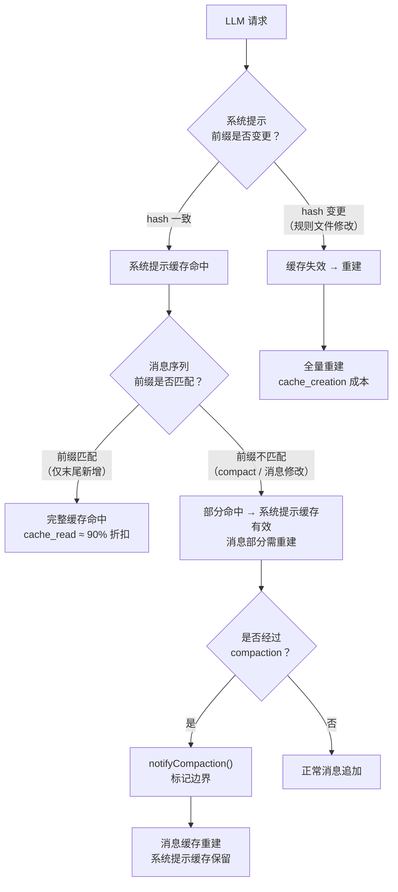
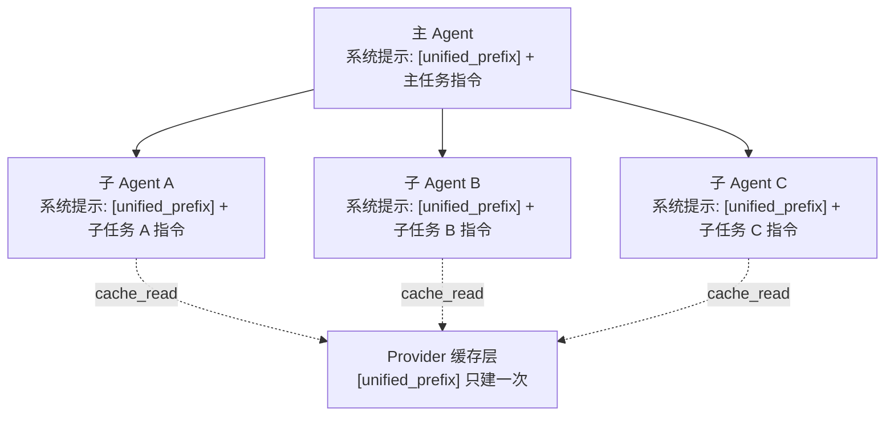
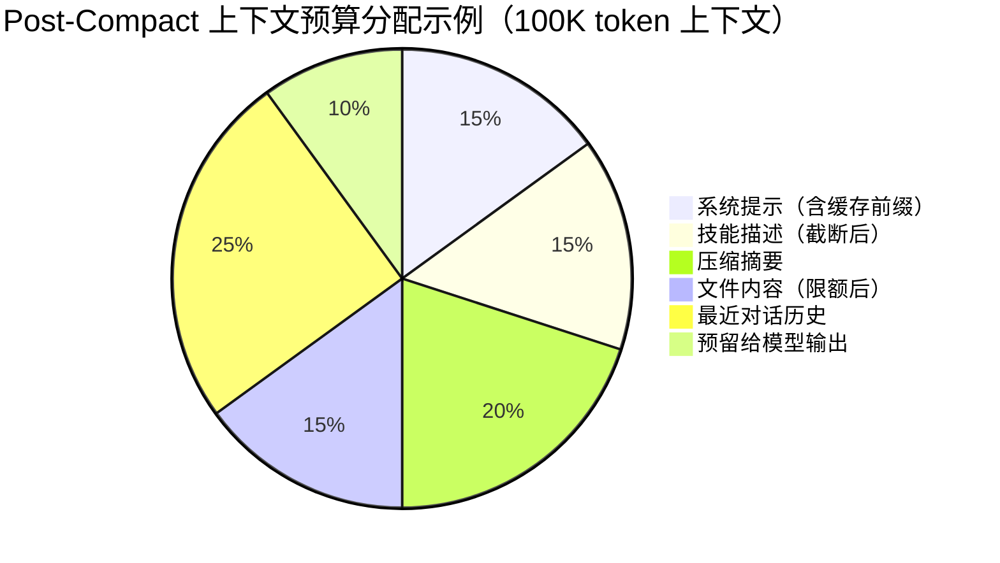
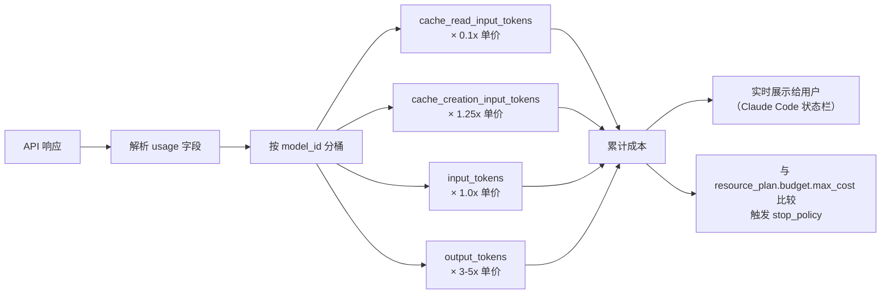

# Cost & Resource Plane
>
> **所属域**：7. Lifecycle & Economics — 成本工程与模型路由
>
> **Evidence Status** — production-validated. 基于 Claude Code prompt cache 前缀统一与缓存失效检测、Fork 子 agent 占位符统一缓存复用、内容脆化节省策略（slim subagent / post-compact 限额 / 技能截断）、per-model 成本跟踪（cache read/creation 独立统计）、GenericAgent 工具字符串复用（llmcore.py）、Hermes IterationBudget 三段式预算管理等生产实现；本知识库将成本从”事后账单”提升为运行时策略层。

**Principle Refs**: BR-01, BR-03 — 成本平面本身即预算约束的载体；满意即停优于无限优化，预算感知的停止策略是核心

成本不是事后复盘的指标，而是运行时的控制输入。不管理成本的 Agent 系统在生产中会费用失控——模型调用、工具调用和 Worker 并发都需要预算约束。

## 1. 定义

Cost & Resource Plane 负责模型路由、token 预算、工具预算、缓存、延迟、质量目标和资源回压。

核心原则：

```text
Cost is not a log. Cost is a control input.
```

## 2. ResourcePlan

```yaml
resource_plan:
  quality_target: minimal | standard | high | critical
  budget:
    max_cost: number|null
    max_tokens: integer|null
    max_latency_ms: integer|null
    max_tool_calls: integer|null
  routing:
    default_model_class: small | medium | large | specialist
    escalation_triggers: []
    downgrade_triggers: []
  caching:
    observation_cache: enabled
    tool_result_cache: enabled
    embedding_cache: enabled
  stop_policy:
    budget_exhausted_behavior: ask_user | partial_deliver | stop | switch_strategy
```

## 3. 成本控制点

| 阶段 | 控制 |
|---|---|
| Representation | OCR/ASR/embedding 是否缓存，是否低成本预解析 |
| Context | token 预算、compaction、offloading |
| Prompting | few-shot 数量、输出长度、推理模式 |
| Kernel | 小模型规划、大模型处理复杂分支 |
| Tools | 工具调用上限、批处理、去重、缓存 |
| Orchestration | worker 数量、并发上限、合并策略 |
| Verification | 高风险用强验证，低风险用轻验证 |
| Interaction | 成本接近阈值时让用户选择质量/速度/价格 |

## 4. 成本反模式

- Always-Big-Model：所有步骤都用最强模型。
- Infinite Retrieval：检索越多越好，无边际收益判断。
- No Cache：重复 OCR、重复 embedding、重复读相同外部对象。
- Hidden Worker Explosion：多 Agent 并发创建但无资源上限。
- Verify Everything Equally：高低风险都用同等验证深度。

## 5. Token 节省：GenericAgent 工具字符串复用

每次 LLM 调用都携带完整的工具 schema JSON，在工具数量多时这部分 token 开销巨大。GenericAgent 的做法是：当工具列表未变时，用一句话替代完整 schema。

**实现**（`llmcore.py:780-783`）：
- 首次调用：发送完整工具 JSON schema
- 后续调用：如果 `tools` 列表与 `last_tools` 相同，替换为一行文本 `"(same tools as before)"`
- 每 10 轮强制重置 `last_tools`，重新发送完整 schema（防止模型"遗忘"工具定义）

**效果**：工具 schema 通常占 2000-5000 token，复用后降至约 10 token，节省幅度约 10x。在 20 轮对话中，累计节省约 40,000-90,000 input token。

**约束**：这个优化依赖模型的上下文记忆能力——模型需要"记住"之前见过的工具定义。每 10 轮重置是在"节省 token"和"防止工具定义从注意力窗口中淡出"之间的经验平衡点。

## 6. 迭代预算：Hermes IterationBudget 三段式

Hermes 不是简单地设一个 `max_iterations` 然后计数。它的预算管理有消费、退还和压力注入三个阶段。

### 6.1 核心机制

| 阶段 | 方法 | 行为 |
|---|---|---|
| 消费 | `consume()` | 每个工具调用消费 1 单位预算；某些高成本操作（如创建子 agent）可消费多单位 |
| 退还 | `refund()` | 某些操作可退还预算——例如工具调用因为参数错误直接失败，未产生实际计算成本时，退还已消费的预算 |
| 压力注入 | 预算即将耗尽时 | 当剩余预算低于阈值，harness 在系统提示中注入收敛提示（如"你只剩 N 步，请尽快给出最终答案"），迫使模型从探索模式切换到收敛模式 |

### 6.2 预算共享

父 agent 和它创建的所有子 agent 共享同一个 `IterationBudget` 实例。这意味着：

- 子 agent 的工具调用会消耗父 agent 的预算
- 一个"贪婪"的子 agent 可以耗尽整个任务的预算
- 父 agent 在创建子 agent 时需要考虑预算分配，而不是无限制地 fork

这种设计避免了 Hidden Worker Explosion（第 4 节反模式），因为预算是全局有限的——即使代码允许创建任意数量的子 agent，预算也会自然限制实际并发。

### 6.3 与 Cost Plane 的映射

| IterationBudget 概念 | Cost Plane 对象 |
|---|---|
| 总预算 | `resource_plan.budget.max_tool_calls` |
| consume() | 成本控制点 → Tools 阶段 |
| 压力注入 | `stop_policy.budget_exhausted_behavior` 的前置信号 |
| 预算共享 | 成本控制点 → Orchestration 阶段的并发上限 |

## 7. Prompt Cache 优化：Claude Code

> **Evidence Status**: production-validated — Claude Code 生产级缓存策略。

Claude Code 对 LLM 调用成本的控制不只是"少发 token"，还包括利用 provider 的缓存机制降低单价。

### 7.1 缓存策略

| 策略 | 实现 | 效果 |
|---|---|---|
| Input cache 计数分离 | API 响应中区分 `cache_creation_input_tokens`、`cache_read_input_tokens` 和普通 `input_tokens`，分别计费和统计 | 精确追踪缓存命中率和实际成本 |
| 系统提示缓存 | 系统提示（含 CLAUDE.md、项目规则等）首次构建后作为缓存前缀；后续调用命中缓存时 input 成本降低约 90% | 长系统提示（通常 3000-8000 token）不需要每次重新处理 |
| Compact 保留缓存前缀 | compact 操作压缩对话历史但保留系统提示前缀不变，确保 compact 后首次调用仍能命中缓存 | 避免 compact 导致缓存失效、引发成本尖峰 |
| Fork 子 agent 占位符统一 | 所有子 agent 的系统提示使用统一占位符前缀，确保不同子 agent 共享同一缓存前缀 | N 个子 agent 共用 1 份缓存，而非各建各的 |
| 系统提示 hash 指纹 | 对系统提示内容计算 hash，变更时可检测缓存失效 | 规则文件变更后主动刷新缓存，避免使用过期缓存 |
| notifyCompaction() 标记边界 | 压缩操作完成后标记 compaction boundary，通知缓存层该边界之前的内容已变 | 避免压缩后缓存层仍引用旧的消息序列，导致缓存重建 |

### 7.2 缓存命中 / 失效条件



### 7.3 Fork 子 Agent 缓存复用



统一前缀的关键：所有子 agent 的系统提示以相同的前缀开头（项目规则、工具定义等），只在后缀部分附加各自的任务指令。Provider 级缓存按前缀匹配，因此 N 个子 agent 共享 1 份缓存创建成本。

### 7.4 三个项目的成本策略对比

| 维度 | Claude Code | Hermes | GenericAgent |
|---|---|---|---|
| Token 节省手段 | Prompt cache + compact | 子会话隔离（不传递完整上下文） | 工具字符串复用（10x 节省） |
| 预算模型 | token 计数 + 费用估算 | IterationBudget（工具调用次数） | 步骤计数 + token 上限 |
| 超预算行为 | 提示用户选择（继续/停止/compact） | 压力注入 → 强制收敛 | 停止执行并返回当前结果 |
| 多 agent 成本隔离 | 不适用（单 agent） | 共享预算实例 | 每个子任务独立步骤计数 |
| 缓存机制 | Provider 级 prompt cache | 无显式缓存 | 工具 schema 复用 |

## 8. 内容脆化节省策略

> **Evidence Status**: production-validated — Claude Code 的 slim subagent、post-compact 限额和技能截断。

"内容脆化"指的是主动削减发送给 LLM 的内容量——不是压缩（保留语义的缩写），而是直接省略。这比压缩更激进，但成本收益更明确。

### 8.1 三种脆化手段

| 策略 | 机制 | 节省量 | 适用场景 |
|---|---|---|---|
| **Omit CLAUDE.md（slim subagent）** | 子 agent 不加载完整的 CLAUDE.md 和项目规则，只注入最小必要指令 | 5–15 Gtok/周（高频使用场景） | 子任务简单、不需要项目全局上下文 |
| **Post-Compact 文件限额** | 压缩后重新装配上下文时，限制文件内容注入量：最多 5 个文件 × 5K token/文件 = 25K token | 压缩后首轮节省 50–80% 文件 token | 长会话中压缩频繁发生的场景 |
| **技能截断** | 技能描述（skill definition）截断为摘要：5K token/skill × 最多 5 skills = 25K token 上限 | 技能丰富时节省 30–60% 系统提示 | 技能数量多但单次任务只用少数几个 |

### 8.2 脆化预算分配



### 8.3 Slim Subagent 决策树

```text
是否创建子 agent？
  ├─ 否 → 正常流程，加载完整系统提示
  └─ 是 → 子任务是否需要项目全局上下文？
           ├─ 是 → 加载完整 CLAUDE.md + 项目规则
           │        （成本高，但正确性优先）
           └─ 否 → Slim 模式：
                    - 省略 CLAUDE.md
                    - 只注入任务指令 + 必要工具定义
                    - 系统提示从 ~8K token 降至 ~1K token
                    - 缓存前缀仍与主 agent 统一（见 §7.3）
```

## 9. Per-Model 成本跟踪

> **Evidence Status**: production-validated — Claude Code 的分模型、分缓存类型成本统计。

精确的成本控制需要精确的成本统计。Claude Code 的成本跟踪不是一个总数，而是按模型、按缓存类型分别统计。

### 9.1 统计维度

| 维度 | 字段 | 说明 |
|---|---|---|
| **模型** | `model_id` | 不同模型单价不同，混合使用时必须分别统计 |
| **Input — 普通** | `input_tokens` | 未命中缓存的输入 token，按标准价计费 |
| **Input — Cache Creation** | `cache_creation_input_tokens` | 首次建缓存的 token，通常按标准价的 1.25x 计费 |
| **Input — Cache Read** | `cache_read_input_tokens` | 命中缓存的 token，通常按标准价的 0.1x 计费 |
| **Output** | `output_tokens` | 模型输出 token，价格通常是 input 的 3–5x |

### 9.2 成本可观测性



关键洞察：Cache read 和 cache creation 的成本差异巨大（约 12.5x）。如果成本统计不区分这两者，运营团队会严重低估缓存失效的成本冲击——一次缓存失效可能导致单轮成本翻 10 倍以上。

## 10. Dynamic Model Routing

在成本优化中，最高杠杆的手段不是压缩 token，而是**对不同查询选择不同模型**。详见 `../../../design-space/patterns/dynamic-model-routing.md`。

核心组件：
- **Router Agent**：按查询复杂度分类（simple/reasoning/search），路由到不同成本级别的模型
- **Fallback Chain**：首选模型不可用时多级降级（Pro → Flash → Cache → 通知用户）
- **Critique Agent**：反馈环——检测路由错误（简单查询误送 Pro），驱动路由规则持续优化

**上下文裁剪**：通过选择性保留和自动总结减少输入 token 数，直接降低 API 成本。长对话系统定期总结历史而非全量保留。

**多 Agent 成本感知**：在多 Agent 系统中还需考虑 Agent 间通信成本——冗余消息、通信路径选择、协作收益与开销的权衡。

## 11. 关联文档

- `benchmarking.md`
- `../../../evaluation/cost-evals.md`
- `../../../design-space/anti-patterns/hidden-cost-explosion.md`
- `../../../design-space/patterns/dynamic-model-routing.md`
- `../../../design-space/patterns/task-prioritization.md`
