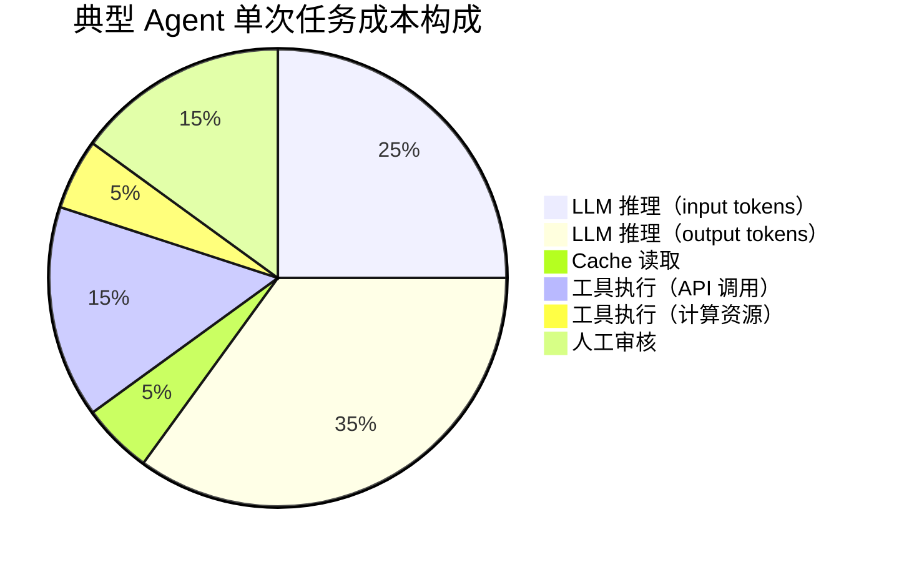
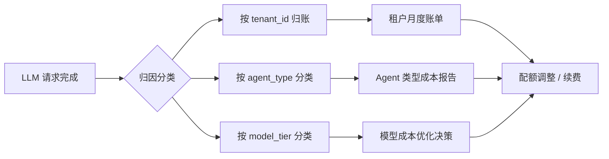
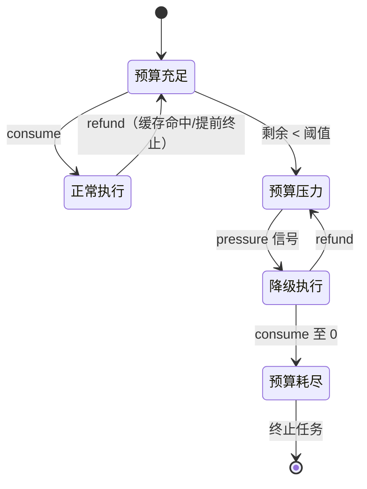
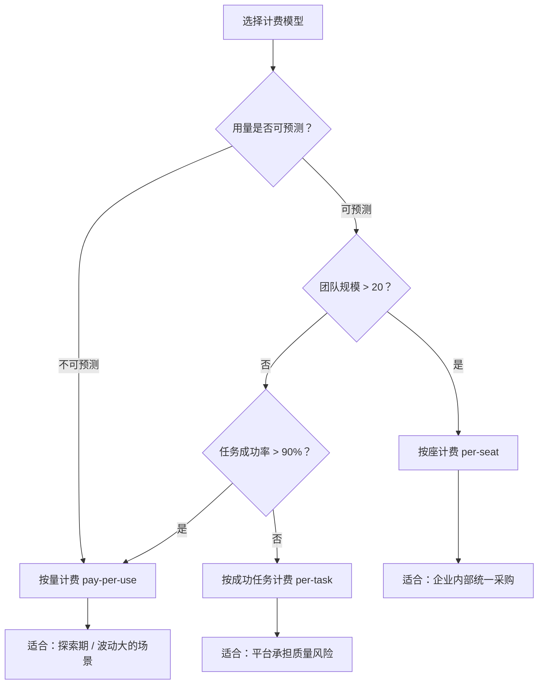

# Economics Plane
>
> **所属域**：7. Lifecycle & Economics — 租户管理与 SLO/SLA
>
> **Evidence Status** — synthesized. 跨项目租户计费、SLO/SLA 配额管理与平台级成本治理的归纳；与 Cost Plane 的分层关系从多个生产系统中提炼。

**Principle Refs**: BR-01, BR-03 — 组织级资源分配必须有显式预算；配额策略体现满意即停而非最优化追求

Cost Plane 管理单次执行的预算约束——token 上限、工具调用次数、模型路由。Economics Plane 关注更高层面的问题：谁为 Agent 的资源消耗付费、服务承诺如何量化、多个 Agent 实例如何在组织中治理。

## 与 Cost Plane 的边界

| 维度 | Cost Plane | Economics Plane |
|---|---|---|
| 作用域 | 单次任务执行 | 组织/平台级 |
| 对象 | token budget, tool call limit | tenant quota, SLO, fleet policy |
| 时间跨度 | 任务生命周期 | 计费周期、季度预算 |
| 决策者 | Runtime 自动执行 | 平台管理员 / 财务 |

Cost Plane 的 `ResourcePlan` 决定一次任务最多花多少 token；Economics Plane 决定这个租户这个月还剩多少 token 可以分配给任务。两者是不同层级的约束，Economics Plane 的配额最终会注入 Cost Plane 的 `budget` 字段。

## 成本构成与估算方法

> evidence-status: synthesized — 跨多项目实践（Hermes, Claude Code, SWE-bench 上下文）提炼的通用公式

### 单次任务成本公式

```
task_cost = Σ(input_tokens × input_price + output_tokens × output_price + cache_read × cache_price)
          + tool_execution_cost(compute_time, API_calls)
          + human_review_cost(review_count × avg_review_time × hourly_rate)
```

三项分别对应 **LLM 推理成本**、**工具执行成本**、**人工审核成本**。实际部署中，人工审核成本往往被低估——Agent 完成 80% 的任务但人要审每一个输出时，human_review_cost 可能反超 LLM 成本。

### ROI 计算框架

```
ROI = (human_cost_for_same_task - effective_agent_cost) / effective_agent_cost

effective_agent_cost = task_cost / pass_rate
```

- `human_cost_for_same_task`：人工完成同一任务的全成本（时间 × 时薪 + 工具费）
- `pass_rate`：Agent 一次成功的概率（pass@1）。若 pass@1 = 0.7，实际成本需除以 0.7
- 当 pass@k 可用时：`effective_cost = task_cost × k / (1 - (1 - pass_rate)^k)`，取 k 次尝试的期望成本

**判断标准**：ROI > 1 时 Agent 方案经济可行；ROI < 0.5 时应优先优化 pass_rate 而非扩大部署。

### 成本构成可视化



> 比例因任务类型而异。代码生成任务中 output tokens 占比更高；多工具编排任务中 tool_execution_cost 占比更高。

### 成本归因流程



## 1. Tenant Accounting

每个租户（user / team / org）的资源消耗需要独立追踪和归因。

**归因粒度**：

- 按 agent instance：哪个 Agent 消耗了多少资源
- 按任务类型：代码生成、数据分析、客服对话各花了多少
- 按模型：GPT-4 class 和 small model 的成本分别是多少

**计费模型**：

- 按量计费（pay-per-use）：按实际 token 消耗计费，适合用量波动大的场景
- 按座计费（per-seat）：按用户数固定收费，适合企业内部统一采购
- 按成功任务计费（per-completed-task）：只对成功完成的任务收费，风险由平台承担

实际部署中三种模型常混合使用。核心要求是：每笔消耗必须关联到一个 tenant ID 和一个 cost center，否则无法做成本归因。

## 2. SLO/SLA Model

Agent 服务需要可量化的服务承诺，否则无法被企业正式采用。

**关键 SLO 指标**：

- **可用性**：Agent 服务的 uptime 百分比（如 99.9%）
- **延迟**：P50 / P95 响应时间。对于多步任务，需要区分首次响应延迟和端到端完成延迟
- **任务成功率**：任务完成率、效果验证通过率。这是 Agent 特有的 SLO 维度——传统 API 只看可用性和延迟，Agent 还需要看"做对了没有"
- **成本上限**：单任务最大花费。防止一次失控的推理循环烧掉整个月的预算

**SLO 违约时的降级策略**：

当 SLO 指标接近阈值时，平台需要自动降级而不是直接失败：

1. 切换到低成本模型以降低延迟和费用
2. 减少验证深度以加快完成速度
3. 限制工具调用范围
4. 排队等待资源释放
5. 通知平台管理员介入

SLA 是 SLO 加上违约后果（赔偿、退款、服务信用额度）。SLO 先行，SLA 在商业协议中定义。

### SLO 指标参考值

> evidence-status: synthesized — 跨项目提炼，非单一生产系统的精确数字

| 指标 | 基础等级 | 标准等级 | 高级等级 | 说明 |
|---|---|---|---|---|
| 可用性 | 99% | 99.9% | 99.95% | Agent 服务可接受请求的时间占比 |
| 首次响应延迟 P50 | < 5s | < 2s | < 1s | 用户提交任务到收到第一个输出 |
| 首次响应延迟 P95 | < 15s | < 8s | < 3s | — |
| 端到端完成延迟 P95 | < 5min | < 2min | < 1min | 多步任务从提交到完成 |
| 任务成功率 | > 70% | > 85% | > 95% | pass@1 标准 |
| 单任务成本上限 | $5 | $2 | $1 | 防止单次失控推理循环 |
| 人工介入率 | < 50% | < 20% | < 5% | 需要人工 review/修正的任务比例 |

**注意**：任务成功率和人工介入率是 Agent 特有的 SLO 维度——传统 API 服务不需要衡量"做对了没有"和"需不需要人救场"。

## 3. Fleet Management

当组织部署多个 Agent 实例时，需要统一的 fleet 视图。

**Agent 注册中心**：

所有部署的 Agent 实例的目录，包含：实例 ID、Agent 类型、当前版本、部署环境、健康状态、负责团队。没有注册中心，平台团队连"我们有多少个 Agent 在跑"都回答不了。

**版本管理**：

Agent 的配置、prompt、工具集需要版本控制。每次变更生成新版本号，支持回滚。版本变更需要关联到性能和成本的变化——"v2.3 的 prompt 改动导致 token 消耗增加 15%"这类问题必须可追溯。

**配额分配**：

按租户和 Agent 类型分配资源上限。例如：团队 A 每月 10M token，其中代码生成 Agent 最多用 6M，数据分析 Agent 最多用 4M。配额可以设软上限（超出后降级）和硬上限（超出后拒绝）。

**灰度发布**：

新版本按百分比逐步推出。先给 5% 的流量，观察成本和成功率指标，确认无回归后逐步扩大。灰度期间新旧版本的经济指标需要并排对比。

### Fleet 预算控制实践

> evidence-status: synthesized — 从 Hermes IterationBudget 模型与 Claude Code session 成本模型提炼

**Hermes IterationBudget 模式**：

三操作模型——消费（consume）、退还（refund）、压力注入（pressure）：

- **consume**：每步执行扣减预算，粒度到单次 LLM 调用 + 工具调用
- **refund**：当工具调用被缓存命中或提前终止时，退还已预留但未使用的预算
- **pressure**：当剩余预算低于阈值时，向 Agent 注入"预算压力"信号，触发以下行为——优先使用缓存、切换小模型、减少验证深度、跳过可选步骤



**Claude Code Session 成本模型**：

- session 级别成本累积：每个 session 持续追踪 total_cost，用户可实时查看
- project config 持久化：模型选择、工具集、权限等配置持久化到项目级别，跨 session 复用
- 自然的成本感知：用户在 session 中看到累积成本，形成对 Agent 经济性的直觉

**计费模型选择决策**：



三种模型的核心取舍：按量计费对平台最安全但用户成本不可预测；按座计费用户体验好但平台承担用量风险；按成功任务计费对用户最友好但要求平台有很高的 pass_rate。

## 4. Quota & Rate Limiting

**租户级配额**：

- 每日 / 每月 token 上限
- 按模型类型分别设限（large model 配额和 small model 配额独立管理）
- 配额使用率接近阈值时发出告警

**Agent 级速率限制**：

- 并发任务数上限
- 每分钟工具调用数上限
- 每分钟 LLM 请求数上限（与底层模型 API 的 rate limit 对齐）

**溢出策略**：

当配额或速率达到上限时：

1. **排队**：请求进入等待队列，按优先级调度
2. **降级**：自动切换到低成本模型或简化执行路径
3. **拒绝**：返回明确的错误码和剩余配额信息，由调用方决定下一步

溢出策略应可按租户配置。付费等级高的租户可以排队等待，免费用户直接拒绝。

## 平台视角

对于运营多个 Agent 的平台团队，Economics Plane 是治理的核心。没有它，团队面对的是一堆独立的 Agent 实例，无法回答"这个月花了多少""哪个 Agent 效率最低""新版本是否更贵"。Cost Plane 解决的是单次执行不超预算；Economics Plane 解决的是整个 Agent fleet 在组织中可持续运营。两者缺一不可，但解决的问题层级不同。

## 关联文档

- `../cost/overview.md`
- `../../../evaluation/cost-evals.md`
