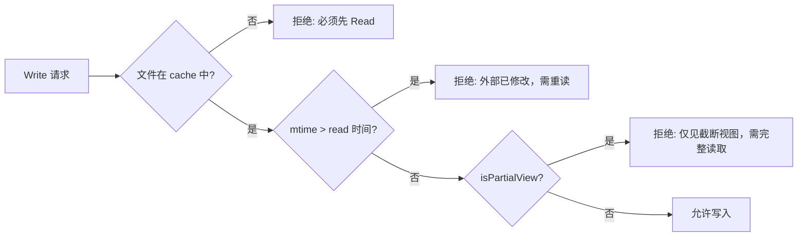

# Effects & External Action Verification
>
> **所属域**：4. Action & Effect — 外部效果与验证闭环
>
> **Evidence Status** — synthesized. coding、workflow、browser、ops 场景对写动作、回读验证、补偿事务的共同需求；this repository 对外部效果闭环的统一抽象。

**Principle Refs**: IS-02, BDI-02 — 效果验证本质是信念修正；工具执行成功不等于外部效果已达成

## 定义

Effects 层管理：
- Agent 想改变什么；
- 实际调用了什么动作；
- 外部世界是否真的改变；
- 如果没有，如何补偿、回滚或解释。

这层存在的原因是：**工具执行成功 ≠ 外部效果成功。**

## 最小 Effect 闭环

```text
Intended Effect
  ↓
Tool Call
  ↓
Execution Result
  ↓
Readback / External Ack / Human Confirm
  ↓
Effect Status
```

## Effect Record

```yaml
effect_id: string
tool_call_id: string
world_object_refs: []
intended_effect: string
preconditions_checked: []
postconditions_expected: []
verification_method: read_back | test | external_ack | human_confirm | none
verification_status: unverified | verified | failed | partially_verified
verification_evidence: []
rollback_or_compensation: string | null
notes: string | null
```

## 验证方法

| 方法 | 适用场景 |
|---|---|
| read_back | CRM、数据库、Git、文件系统、DOM |
| test | 代码修改、配置变更 |
| external_ack | 邮件、消息、队列、第三方 API |
| human_confirm | 不可感知的业务变化、线下动作 |
| sensor_confirm | 机器人、IoT、物理环境 |

## 不同动作的默认策略

| 动作类型 | 默认策略 |
|---|---|
| read | 无 effect ledger，记录 observation 即可 |
| write | 记录 intended effect + read-after-write |
| send / notify | 需要 outbox / ack / bounce 信息 |
| delete | 必须声明 reversibility 和确认策略 |
| deploy | 需要 rollout signal + health check + rollback |
| purchase / transfer | 强制人工确认 + 双重验证 |

## 常见失败

| 失败 | 表现 | 修复 |
|---|---|---|
| Ghost Success | 接口成功但状态没变 | postcondition + readback |
| Duplicate Side Effect | 重试导致重复发送 / 重复扣费 | idempotency key |
| Partial Effect | 多步流程只成功一半 | compensation transaction |
| Irreversible Misfire | 删除 / 外发动作无法挽回 | staged approval + dry-run |

## 生产验证：Cache-as-State 与效果确认

> Evidence Status: **production-validated** — Claude Code 主路径；opencode 部分复现。

文件系统是 coding agent 最高频的效果目标。Ghost Success 在这里的典型形态：工具报告写入成功，但文件内容并未如预期改变（外部进程竞争写、磁盘满、权限降级）。Claude Code 用 **FileStateCache + Read-Before-Write 协议** 在工具层面消除了这一类失败。

**FileStateCache** 是一个 LRU 缓存（25 MB 上限），为每个已读文件维护 `{ content, timestamp, offset, limit, isPartialView }` 记录——它既是 World Model 的文件系统切面，也是写操作的前置断言来源。

**Read-Before-Write 决策流**：



三层守卫的设计意图：

1. **Cache 存在性检查** — 强制"先观察再行动"，杜绝盲写。对应 Effect Record 的 `preconditions_checked`。
2. **Timestamp 乐观锁** — 用 mtime 做乐观并发控制，检测外部竞争（linter、formatter、人工编辑）。避免文件锁阻塞后续工具调用。失败时错误消息足够清晰，模型自动重读后重试。
3. **Partial View 拦截** — 模型只看到截断内容时标记 `isPartialView=true`，写工具拒绝执行，防止基于不完整信念覆写完整文件。

这个模式本质上把 Effects 层的 **read-after-write 验证** 前移为 **read-before-write 预防**：与其事后发现 Ghost Success，不如在写入前就确保前置条件成立。两者结合形成完整闭环——预防处理大部分情况，验证兜底剩余风险。

**泛化**：同样的 cache-as-state 策略可移植到数据库行版本号、API ETag、DOM snapshot hash 等场景——核心不变：**写之前必须持有足够新的读快照，否则拒绝执行**。

## 关联模式

- `../../../design-space/patterns/effect-ledger.md`
- `../../../design-space/patterns/self-verification.md`
- `../../../design-space/patterns/dual-channel-gui-verification.md`
- `gui-verification.md`
- `../../../evaluation/effect-evals.md`
