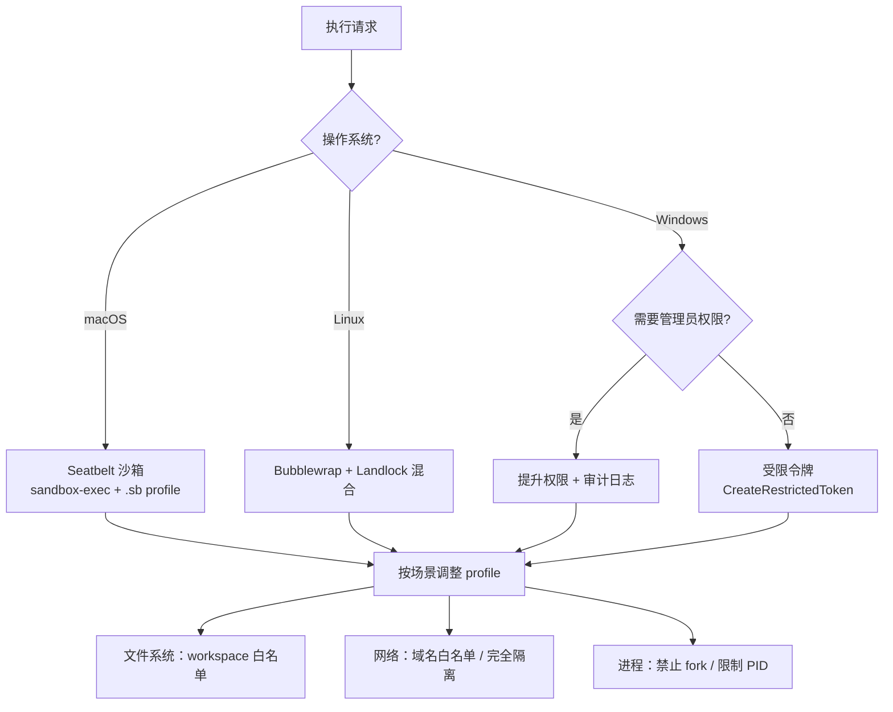

# Execution Engine
>
> **所属域**：4. Action & Effect — 实际执行宿主
>
> **Evidence Status** — grounded. Codex、Claude Code、Hermes、Augment 等系统对 sandbox、timeout、host abstraction 的实现；this repository 对”执行成功 != 效果成功”的统一抽象。

**Principle Refs**: IS-02, EM-01 — 执行返回 ≠ 世界状态确认，工具是认知延伸需隔离管理。

Agent 的价值最终通过执行实现，但执行环境的隔离、超时和失败处理决定了系统是否安全可靠。10 步操作中每步 99% 成功率，整体只有 90%。

## 定义

Execution Engine 管理工具实际运行的沙箱环境：Shell 命令、代码执行、文件操作、远程调用、浏览器动作、设备控制。

Execution 层负责的是**把动作送进宿主环境**，不是替任务宣布完成。

## 模块接口

**输入**：Tool Runtime 的执行请求（host + command + args）
**输出**：原始执行结果（由 Observation Normalizer 标准化）
**配置**：沙箱策略、超时、资源限制、网络策略、回放/重试策略

## 沙箱设计

| 维度 | 配置项 |
|---|---|
| 文件系统 | workspace 边界、只读区域、临时目录 |
| 网络 | 域名白名单、出口代理、完全隔离 |
| 资源 | CPU / 内存限制、磁盘配额 |
| 时间 | 单次命令超时、总任务超时 |
| 权限 | 禁止 sudo、限制系统调用、最小凭证 |
| 外设 | 浏览器 / 机器人 / GUI 的最小控制集 |

## 沙箱选择决策矩阵

不同执行场景对隔离的需求不同，过度沙箱化会增加延迟和复杂度：

| 场景 | 推荐沙箱 | 理由 | 典型开销 |
|---|---|---|---|
| 代码执行（Shell / 脚本） | 容器 / VM | 文件系统和网络必须隔离，防止逃逸 | 冷启动 1-5s |
| 浏览器操作 | 浏览器沙箱（独立 profile） | DOM 隔离 + cookie 隔离，防止跨站污染 | profile 创建 0.5-2s |
| API 调用（读） | 无沙箱 + 权限控制 | 只读操作无副作用，沙箱开销不划算 | ~0ms |
| API 调用（写） | 无沙箱 + 审批门 | 沙箱无法拦截远程写入，靠 policy 控制 | 审批等待时间 |
| 数据库写操作 | 事务 + 审批门 | 事务提供原子性和回滚能力 | 事务开销 |
| 文件系统写操作 | 容器 / chroot | 限制可写路径，防止覆盖系统文件 | 挂载开销 |

**选型启发式**：有副作用则需要隔离或审批；无副作用则权限控制即可。沙箱类型取决于副作用的可逆性：可回滚的用事务，不可回滚的用隔离 + 审批。

### 平台级沙箱选型（来自 Codex 生产实践）

> **Evidence Status** — production-validated. 基于 Codex 在 macOS / Linux 的实际沙箱实现。

不同操作系统的沙箱原语差异显著，选型需要平台感知。



| 平台 | 沙箱技术 | 优势 | 局限 |
|---|---|---|---|
| macOS | Seatbelt（sandbox-exec） | 系统原生，无需额外依赖；per-process 粒度 | .sb profile 语法文档不完整，调试困难 |
| Linux | Bubblewrap + Landlock | Bubblewrap 提供 namespace 隔离；Landlock 补充细粒度文件访问控制 | 需要内核 5.13+（Landlock）；Bubblewrap 需 user namespace |
| Windows | 受限令牌 / AppContainer | 无需额外安装；与 Windows 权限模型原生集成 | AppContainer 对文件路径限制严格，部分开发工具不兼容 |

**Codex 实践**：macOS 上使用 Seatbelt 配合自定义 .sb profile，限制文件读写到 workspace 目录、禁止网络访问（除白名单域名）、禁止 spawn 子进程。Linux 上以 Bubblewrap 为主，Landlock 作为 defense-in-depth 第二层。

## 执行超时与取消语义

**超时分级**：单一超时不够精细，需要 soft 和 hard 两级。

| 级别 | 触发时机 | 行为 |
|---|---|---|
| Soft Timeout | 达到预期时长的 80% | 发出警告，Agent 可选择缩小范围或提前收尾 |
| Hard Timeout | 达到最大允许时长 | 强制中止执行，返回 timeout 状态 |

**取消传播**：父任务取消时，子执行的清理规则。

```text
父任务取消
  → 检查子执行状态
    → 未开始：直接取消，无需清理
    → 执行中 + 无副作用：立即中止
    → 执行中 + 有副作用：等当前原子操作完成，再中止
    → 执行中 + 不可中断：等执行完成，标记结果为 cancelled_after_completion
```

**硬超时 vs 软超时的终止语义**：

| 类型 | 信号 | 行为 | 清理窗口 |
|---|---|---|---|
| 软超时 | SIGTERM / graceful signal | 通知进程收尾；进程可输出部分结果 | grace period（通常 5-30s） |
| 硬超时 | SIGKILL / 强制终止 | 立即杀死进程，不等待清理 | 无 |

**流程**：soft timeout 触发 → 等待 grace period → 如果进程仍未退出 → hard timeout 触发 SIGKILL。grace period 的长度取决于操作类型：文件写入给 5s，数据库事务给 30s，网络请求给 10s。

**不可中断执行**：以下操作一旦开始就不应中途取消，中断会留下不一致状态。

- 数据库事务提交（commit 阶段）
- 文件写入的 fsync 阶段
- 支付 / 转账等金融操作
- 已发送但等待确认的外部 API 写请求

这些操作在 ExecutionRequest 中标记 `interruptible: false`，Orchestrator 在发出取消信号时需跳过它们，等其自然完成。

## 执行结果的规范化

所有执行结果统一为 ExecutionResult，避免下游为每种工具写不同的解析逻辑。

```yaml
execution_result:
  execution_id: string
  status: success | failure | timeout | cancelled
  exit_code: integer | null       # 进程类执行的退出码
  stdout: string | null
  stderr: string | null
  duration_ms: integer
  artifacts: []                   # 执行产生的文件 / 对象引用
  metadata:
    sandbox_type: string
    resource_usage:
      cpu_ms: integer
      memory_peak_mb: integer
```

**四种状态的后处理路径**：

| 状态 | 后处理 |
|---|---|
| success | 交给 Observation Normalizer 标准化，进入下游判定 |
| failure | 写入 FailureRecord，由 Recovery Plane 决定 retry / replan / escalate |
| timeout | 区分 soft / hard；soft 可能有部分结果待回收；hard 视为 failure |
| cancelled | 检查是否有未清理的副作用，有则进入 compensation 流程 |

## 并发分流

不是所有执行都需要串行。按副作用分流可以显著提升吞吐量。

| 操作类型 | 并发策略 | 原因 |
|---|---|---|
| 读操作（API GET、文件 Read、DB SELECT） | 可并行 | 幂等，不改变世界状态 |
| 写操作（API POST/PUT、文件 Write、DB INSERT/UPDATE） | 串行或加锁 | 有副作用，并行可能竞态 |
| 混合批次 | 读并行 → 汇总 → 写串行 | 先收集信息再统一执行变更 |

**锁粒度选择**：全局锁最安全但吞吐最低。按资源加锁（如按文件路径、按 API endpoint）在安全和性能之间取得平衡。对于同一文件的多次 Edit，必须串行；对不同文件的 Edit，可以并行。

## 可靠性

单步 99% 成功率，10 步后只有 90.4%。Execution Engine 的设计必须假设失败是常态：

- 每次执行都有 timeout；
- 失败返回 failure_mode + recoverable + suggested_recovery；
- 幂等操作可以 retry；
- 非幂等操作要有 rollback / compensation；
- 写动作默认需要后续 verification。

## 关键区分

| 结果 | 含义 |
|---|---|
| execution_success | 宿主执行完成，例如进程退出码为 0 |
| tool_success | 工具返回符合约定的 observation |
| effect_success | 外部世界达到 postcondition |

前三者不一定同时成立。

## 设计模式

| 模式 | 详见 |
|---|---|
| Execution Environment | `execution-env.md` |
| Effect Ledger | `../../../design-space/patterns/effect-ledger.md` |

## 参考实现

- **Claude Code**：进程隔离、超时控制，见 `projects/coding-agents/claude-code/execution-layer.md`
- **Codex**：完全沙箱化的执行环境，见 `projects/coding-agents/codex/`
- **Hermes Agent**：多 backend 执行环境，见 `projects/general-agents/hermes-agent/execution-env.md`
- **Augment**：Sidecar 进程隔离，见 `projects/coding-agents/augment/README.md`
