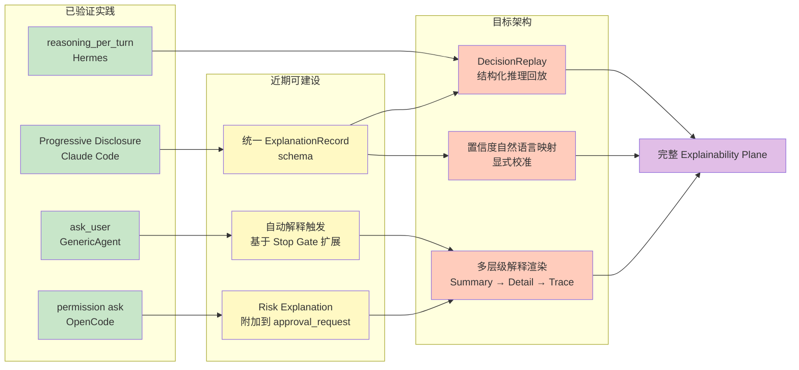

# Explainability Plane
>
> **所属域**：8. Reflection & Learning — 决策解释与置信度表达
>
> **Evidence Status** — theoretical. 从 Interaction Plane（progressive disclosure）、Observability Plane（trace）、agent-epistemics（置信度）中提取解释性需求；结合生产 Agent 用户反馈中的高频痛点。降级理由：核心机制（推理回放 DecisionReplay、ExplanationRecord schema、自动解释触发规则、置信度自然语言映射函数）均为本框架设计，尚未在任何参考项目中被显式实现或验证。Claude Code 的 Progressive Disclosure 和 Hermes 的渐进信息披露仅为间接实践，不构成对本 Plane 完整框架的生产验证。
>
> **实验性 Plane**：Explainability 的核心机制（DecisionReplay、ExplanationRecord、置信度映射）均为本框架设计，尚未在任何生产系统中显式实现。生产采用前请先在试点项目验证。Claude Code 的 Progressive Disclosure 仅为间接实践，不构成完整验证。

**Principle Refs**: MC-01, MC-03 — 解释必须显式表达不确定性；知道自己不知道什么才能诚实地向用户说明解释的边界

## 1. 定义

Explainability Plane 把 Agent 的决策过程、推理依据和不确定性翻译成用户能理解的解释。

它回答的核心问题是（区别于 Observability 的 trace 记录）：

```text
用户问"为什么选择了这个方案"时，Agent 能回答什么？
用户问"你有多确定"时，Agent 能回答什么？
用户问"如果失败了会怎样"时，Agent 能回答什么？
非技术用户能否理解 Agent 的关键决策？
```

**与其他 Plane 的区分**：
- **Observability**：面向开发者，记录完整 trace
- **Interaction**：面向用户，管理何时/如何打扰用户
- **Explainability**：面向用户，将内部状态翻译为可理解的解释

## 2. 解释类型

| 类型 | 触发 | 输出格式 | 示例 |
|---|---|---|---|
| Decision Explanation | 用户问"为什么" | 理由 + 备选 + 权衡 | "选择 Plan A 因为风险更低，Plan B 虽然更快但需要 force-push" |
| Confidence Explanation | 输出包含低置信度内容 | 自然语言置信度 + 依据 | "对这个结论有中等信心，基于 2 个来源，其中 1 个可能过期" |
| Risk Explanation | 高风险操作前 | 影响范围 + 可逆性 + 后果 | "这个操作会修改 3 个文件，不可自动撤销" |
| Progress Explanation | 长任务中 | 当前位置 + 已完成 + 剩余 | "已完成 3/7 步，当前在跑测试，预计还需要 2 轮" |
| Failure Explanation | 操作失败后 | 失败原因 + 已尝试 + 建议 | "测试失败因为 API 返回 500，已重试 2 次，建议检查服务状态" |
| Boundary Explanation | 拒绝或无法完成时 | 边界 + 原因 + 替代 | "无法直接修改生产数据库，但可以生成迁移脚本供你审查" |

## 3. 置信度的自然语言表达

数字置信度对非技术用户没有意义。Explainability Plane 将内部置信度映射为分级表达：

| 内部置信度 | 自然语言 | 附加行为 |
|---|---|---|
| ≥ 0.9 | 直接陈述，不加限定 | 无 |
| 0.7–0.9 | "根据已有信息，……" | 附带关键证据来源 |
| 0.5–0.7 | "初步判断是……，但还需要确认" | 附带不确定因素 |
| 0.3–0.5 | "不太确定，可能是……" | 建议验证步骤 |
| < 0.3 | "目前信息不足，无法可靠判断" | 给出获取更多信息的路径 |

**关键约束**：
- 不使用精确数字（如 "73% 确定"），除非用户明确要求
- 不假装确定——低置信度时必须显式降级
- 多个来源冲突时，展示冲突而不是静默选择

## 4. 推理回放

当用户问"为什么选择了这个工具/这条路径"时，Explainability Plane 从 TraceEvent 中提取关键决策点，生成简化的推理回放：

### 4.1 回放格式

```text
DecisionReplay:
  decision_point: "选择修复方案"
  options_considered:
    - option: "直接修改源文件"
      pros: ["速度快", "改动小"]
      cons: ["可能影响其他模块"]
    - option: "重构后再修改"
      pros: ["更安全", "覆盖更全"]
      cons: ["耗时长", "改动大"]
  chosen: "直接修改源文件"
  reason: "改动影响范围有限，且任务要求最小改动"
  confidence: 0.8
```

### 4.2 回放层级

| 层级 | 面向 | 内容 |
|---|---|---|
| Summary | 所有用户 | 一句话结论 + 关键理由 |
| Detail | 技术用户 | 备选方案 + 权衡 + 证据 |
| Trace | 开发者 | 完整 TraceEvent 序列 |

用户默认看到 Summary，可以逐级展开到 Detail 和 Trace。这与 Interaction Plane 的 Progressive Disclosure 模式一致。

## 5. ExplanationRecord Schema

```yaml
explanation_id: string
type: decision | confidence | risk | progress | failure | boundary
trigger: user_query | automatic | policy
target_audience: general | technical | developer
summary: string                    # 一句话，面向所有用户
detail: string | null              # 展开版，面向技术用户
evidence_refs: list[string]        # 关联的 EvidenceRef ID
trace_refs: list[string]           # 关联的 TraceEvent ID
confidence_level: high | medium | low | insufficient
generated_at: datetime
```

## 6. 自动解释触发

以下场景应自动附带解释，无需用户主动询问：

| 场景 | 自动解释类型 |
|---|---|
| 执行高风险操作 | Risk Explanation |
| 输出包含低置信度结论 | Confidence Explanation |
| 任务耗时超过预期 | Progress Explanation |
| 操作失败 | Failure Explanation |
| 拒绝用户请求 | Boundary Explanation |
| 在多个方案中做出非显然选择 | Decision Explanation |

## 7. 与其他模块的关系

| 模块 | 关系 |
|---|---|
| Observability | 解释从 TraceEvent 中提取，但重新组织为用户可理解的格式 |
| Interaction | 解释的触发和呈现遵循 Interaction 的中断原则 |
| Control | 审批请求应附带 Risk Explanation |
| Memory | 用户对解释的反馈可以作为 teaching 进入 Memory |
| Effects | EffectRecord 的 verification_status 是 Failure/Risk Explanation 的输入 |
| `agent-epistemics.md` | 认识论对象（Confidence、ConflictRecord、UnknownRecord）是解释的原材料 |
| `paradigm-routing.md` | 范式切换时应生成 Decision Explanation |

## 8. 常见失败

| 失败 | 表现 | 修复 |
|---|---|---|
| 解释过度 | 每一步都详细解释，信息过载 | 默认只在触发条件满足时解释 |
| 解释不足 | 关键决策没有解释 | 高风险 + 低置信度场景强制解释 |
| 虚假确定性 | 用确定语气表达低置信度结论 | 置信度自然语言映射强制执行 |
| 事后合理化 | 解释不反映真实决策过程 | 解释必须引用实际 TraceEvent |
| 技术黑话 | 非技术用户看不懂 | Summary 层级禁用技术术语 |

## 9. 实施清单

```text
[ ] 定义 ExplanationRecord schema
[ ] 实现置信度到自然语言的映射函数
[ ] 在 Stop Gate 中增加"是否需要自动解释"检查
[ ] 实现从 TraceEvent 到 DecisionReplay 的提取逻辑
[ ] 为 Interaction Plane 的 approval_request 附加 Risk Explanation
[ ] 在 Eval 中增加解释质量评估项
```

## 10. 走向实践：从间接实践到目标架构

> 本节桥接当前生产系统中已验证的间接实践与本 Plane 的理论目标。标注哪些已经存在、哪些仍需建设。

### 10.1 当前最接近 Explainability 的生产实践

以下实践已在各自项目中被验证，但它们各自只覆盖了 Explainability 的一个切面：

| 实践 | 来源 | 覆盖的解释类型 | 验证状态 |
|---|---|---|---|
| **Progressive Disclosure** | Claude Code | Progress / Decision（Summary 层） | production-validated |
| **reasoning_per_turn** | Hermes | Decision（每轮提取推理内容） | prototype-validated |
| **ask_user** | GenericAgent | Boundary / Confidence（不确定时主动解释并请求确认） | prototype-validated |
| **permission ask** | OpenCode | Risk（权限询问时解释为什么需要该权限） | production-validated |

### 10.2 差距分析

这些实践与完整 Explainability 目标之间的差距：

| 目标能力 | 当前状态 | 差距 |
|---|---|---|
| **DecisionReplay**（推理回放） | 无生产实现；Hermes 的 reasoning_per_turn 最接近但不支持结构化回放 | 需要从 TraceEvent 到回放格式的提取逻辑 |
| **ExplanationRecord schema** | 无生产实现；各系统用各自的日志格式 | 需要统一 schema + 存储 |
| **自动解释触发规则** | 部分存在——ask_user 和 permission ask 是手动嵌入的条件判断 | 需要通用的触发引擎，而非逐个硬编码 |
| **置信度自然语言映射** | 无显式实现；LLM 本身会用不确定语气但不可控 | 需要显式映射函数 + 校准 |
| **多层级解释（Summary → Detail → Trace）** | Progressive Disclosure 有层级概念但不针对解释内容 | 需要解释专用的层级渲染 |

### 10.3 演进路径



**图例**：绿色 = 已验证实践 ｜ 黄色 = 近期可建设（有基础设施支撑） ｜ 橙色 = 目标架构（需要专项开发） ｜ 紫色 = 完整目标

### 10.4 实施建议

1. **先统一 schema**：ExplanationRecord 是基础设施，先落地 schema 再做触发和渲染。
2. **从 Stop Gate 切入自动触发**：Stop Gate 已经有中断判断逻辑，在其中嵌入"是否需要解释"的检查点成本最低。
3. **reasoning_per_turn → DecisionReplay**：Hermes 的实践是最接近的起点，将其结构化输出对齐到 DecisionReplay 格式即可原型验证。
4. **置信度映射需要人类校准**：不能只靠 LLM 自评，需要小规模人类评测来校准映射阈值。

## Evidence Status

降级为 theoretical。置信度自然语言映射和 Progressive Disclosure 在 Claude Code 和 Interaction Plane 中有间接实践，但本 Plane 的核心机制（DecisionReplay、ExplanationRecord、自动解释触发、推理回放）均为理论设计，尚未在参考项目中被显式实现或生产验证。上述"走向实践"桥接段落中明确区分了已验证实践（production-validated / prototype-validated）和理论目标，不改变整体 evidence-status 评级。
