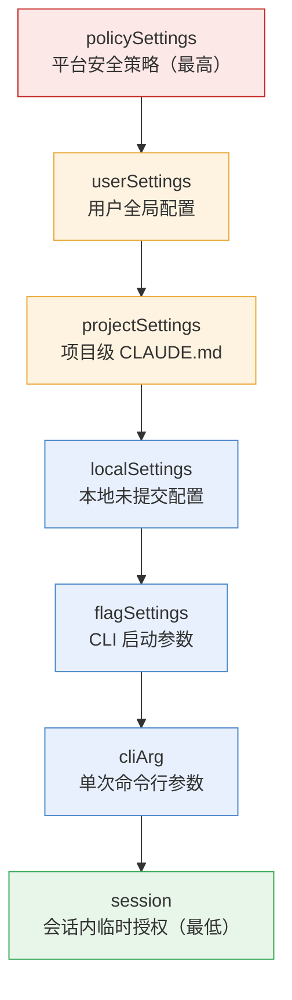
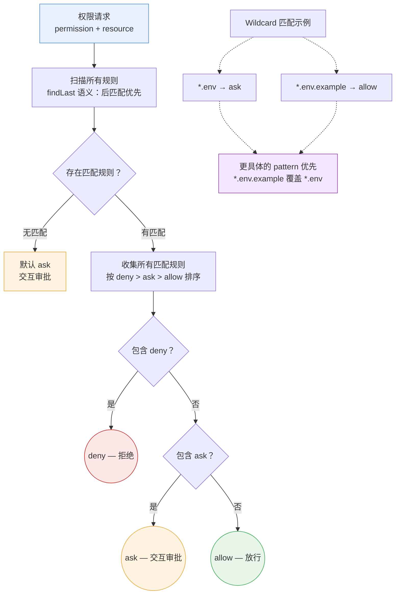
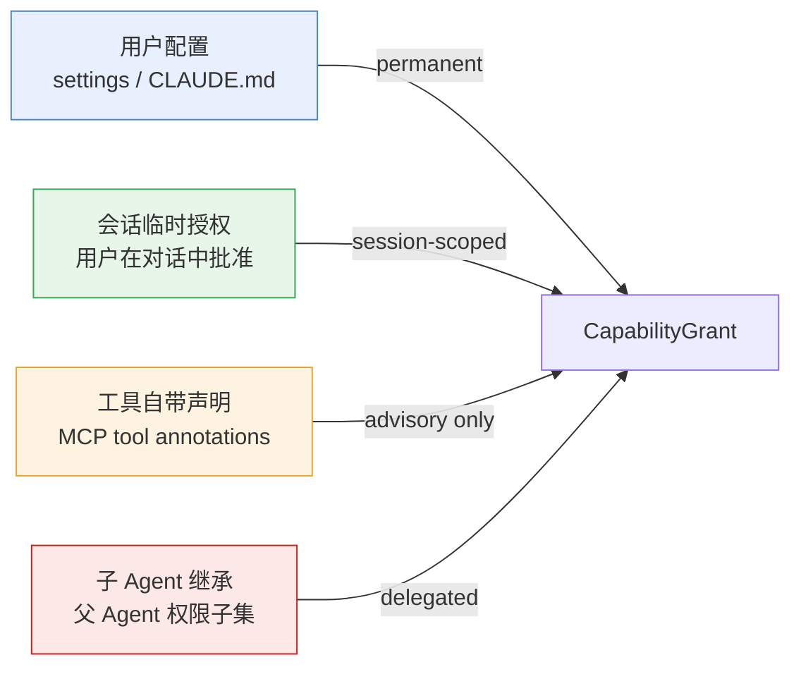
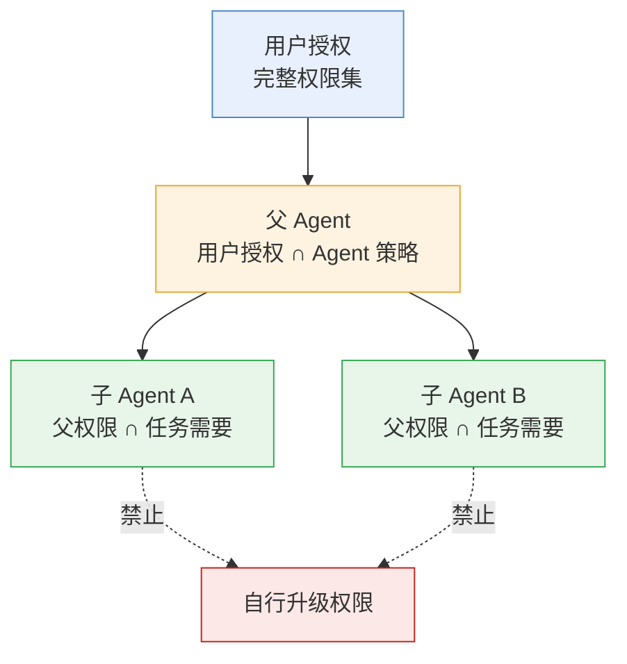
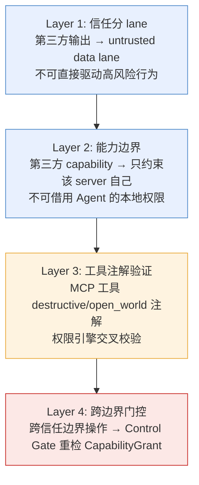

# Identity & Capability Plane
>
> **所属域**：5. Trust & Identity — 身份、租户与能力授权
>
> **Evidence Status** — grounded. Claude Code 的多层权限模式和规则来源分层、Codex 的沙箱+审批缓存架构、OpenCode 的 pattern-based 权限规则、Warp 的权限分类与 profile 级工具管控——四个项目的权限模型已可交叉验证；子 agent 权限继承和 Confused Deputy 防护模式在生产环境中得到实践检验。

**Principle Refs**: EM-03, IS-03 — 环境约束定义实际可用能力；身份与能力声明是表征而非事实，存在地图-领土偏差风险

## 定义

Identity & Capability Plane 管理"谁在让 Agent 做什么，以及 Agent 凭什么能做"。它把身份、授权、能力声明、委托链和租户边界变成一等对象。

核心原则：**能力不是工具清单，能力是带来源、范围、期限、风险和审计责任的授权。**

## CapabilityGrant Schema

```yaml
capability_grant:
  grant_id: string
  subject:
    kind: user | agent | service_account | tool | mcp_server
    id: string
  actor_on_behalf_of:
    user_id: string|null
    delegation_chain: []
  tenant_id: string|null
  scope:
    resources: []
    actions: read | propose | write | delete | send | deploy | purchase | verify | administer
    constraints: []
  trust_level: trusted_config | authenticated_user | delegated_agent | third_party_tool | untrusted_data
  expires_at: datetime|null
  approval_required_for: []
  audit_requirements: []
  revocation_condition: []
```

## 身份边界

| 身份 | 能代表什么 | 不能代表什么 |
|---|---|---|
| User Identity | 用户意图、审批、偏好 | 系统策略、第三方声明的事实 |
| Agent Identity | Agent 的执行主体、策略配置、trace 归因 | 用户本人；不得伪造用户授权 |
| Tool Identity | 工具能力、风险、输出来源 | 工具输出不能变成系统指令 |
| Service Account | 具体 API 权限 | 超出授权范围的通用行动能力 |
| MCP Server Identity | 第三方 server 的声明能力 | 用户授权或本地系统权限 |

## 多层权限模型

权限不是单一 allow/deny 开关——生产系统的权限模型至少包含三个正交维度：**模式选择**（Agent 运行在什么自主级别）、**规则来源**（谁有权定义规则、优先级如何）、**工具分类**（工具本身的风险属性如何影响权限决策）。

### 权限模式

Agent 的权限模式决定整体行为基线。以 Claude Code 为参照，模式从受限到自主排列：

| 模式 | 行为 | 适用场景 |
|---|---|---|
| plan | 只分析、只提案，不执行任何副作用 | 方案评审、dry run |
| default | 读操作自动放行，写操作逐一询问 | 日常开发 |
| acceptEdits | 文件编辑自动放行，其他写操作仍询问 | 受信项目中的编码任务 |
| dontAsk | 大部分操作自动放行，仅极高风险操作拦截 | 自动化流水线 |
| bypassPermissions | 跳过所有权限检查 | 沙箱内测试（不应用于生产） |
| auto | Codex 模式——全部自动执行，依赖沙箱兜底 | 容器化环境 |

模式之间不是简单的递进关系。`auto` 模式的安全前提是沙箱隔离能兜住所有副作用；`default` 模式在无沙箱环境中反而更安全。**模式选择必须与隔离能力匹配。**

### 规则来源分层

权限规则可以从多个来源注入，来源之间有明确的优先级。以 Claude Code 的七层模型为基准：



**合并规则**：高优先级 deny 不可被低优先级 allow 覆盖。Policy 层的禁止是硬约束——即使用户在会话中显式授权，也无法绕过平台策略。

其他项目的规则分层差异：

| 项目 | 层级数 | 关键差异 |
|---|---|---|
| Codex | 3 层：sandbox policy > approval policy > 工具默认 | 沙箱是物理隔离，不依赖规则引擎兜底 |
| OpenCode | 2 层：全局 rules > 会话 rules | 简单直接；pattern 匹配覆盖多数场景 |
| Warp | 2 层：profile config > session | profile 级 MCP allowlist/denylist 是核心控制面 |

### 权限判定管道

规则匹配按 deny > ask > allow 的优先级执行，使用 findLast 语义——同一权限标识的多条规则中，最后匹配的规则生效。Wildcard 模式支持精细控制：`*.env` 匹配 ask 但 `*.env.example` 匹配 allow，后者因更具体而优先。



**findLast 语义**：规则列表从头到尾扫描，同一资源可被多条规则命中，最后一条匹配的规则决定最终行为。这允许先定义宽泛规则再用具体规则覆盖——例如先 `deny *` 再 `allow src/**/*.ts`，效果是只允许 src 下的 TypeScript 文件。

### 多项目权限模型对比

| 项目 | 层数 | 特点 |
|---|---|---|
| Claude Code | 7 层 | 分类器 + 降级链；deny 从任意层短路；高层 Policy 不可被低层覆盖 |
| Codex | Guardian | 独立子 agent 审批；7 维风险分类；沙箱作为物理兜底 |
| OpenCode | 3 层 | deny > ask > allow + Wildcard 模式；findLast 语义；简洁直接 |
| Warp | 3 维 | 命令执行 / 文件读 / 文件写 正交分类；每维独立策略 + 理由枚举 |
| GenericAgent | 1 层 | ask_user 兜底；无规则引擎，所有不确定操作都交由用户决策 |

从 GenericAgent 的单层 ask_user 到 Claude Code 的 7 层管道，权限模型的复杂度与 Agent 的自主程度正相关。自主程度越高，需要越精细的规则分层来保证安全边界。GenericAgent 的 ask_user 兜底在低频交互场景下足够，但在高频自动化场景中会迅速退化为审批疲劳。

### 工具权限分类

工具本身携带风险属性，权限引擎在决策时将工具分类与规则来源交叉判定。

**按操作类型分类**（Warp 模型）：

| 分类 | 含义 | 默认策略 | 拒绝/允许原因枚举 |
|---|---|---|---|
| CommandExecution | 执行 shell 命令 | ask | AllowedByUser / DeniedByPolicy / DeniedBySandbox |
| FileRead | 读取文件内容 | allow | AllowedByPattern / DeniedBySecretPolicy |
| FileWrite | 修改/创建/删除文件 | ask | AllowedByEditMode / DeniedByReadOnlyFS |

**按风险注解分类**（Codex MCP 工具注解）：

| 注解 | 含义 | 权限引擎行为 |
|---|---|---|
| `read_only_hint: true` | 工具声明自己只读 | 可降低审批要求 |
| `destructive_hint: true` | 工具声明自己有破坏性 | 强制审批或拒绝 |
| `open_world_hint: true` | 工具可访问外部网络 | 触发网络出口策略检查 |

注意：工具注解是**声明**而非**事实**。第三方 MCP server 可以谎报 `read_only_hint: true` 但实际执行写操作。权限引擎可参考注解降低摩擦，但不能将注解作为安全边界。安全边界必须由沙箱和 policy 层保证。

### 权限规则 Schema

不同项目的权限规则收敛为类似的结构：

```yaml
# OpenCode 风格——最简洁的表达
permission_rule:
  permission: "file.write"        # 权限标识
  pattern: "src/**/*.ts"           # glob 匹配
  action: allow | deny | ask       # 决策

# Claude Code 风格——带来源和工具绑定
permission_rule:
  tool: "Edit"                     # 绑定工具
  path: "/project/src/**"          # 资源匹配
  decision: allow | deny | ask
  source: projectSettings           # 规则来源层级
  expires: session | permanent

# Codex 风格——三层正交
filesystem_rule:
  sandbox_kind: read_only | full_auto  # 沙箱类型
  access_mode: read | write            # 访问模式
  special_path: home | cwd | tmp       # 特殊路径
```

## CapabilityGrant 生命周期

CapabilityGrant 不是创建后就不变的静态对象。它有明确的来源、作用域、传播路径和过期语义。

### 授权来源



关键区分：用户配置和会话授权是**实际权限**，工具声明只是**建议**，子 Agent 继承是**受约束的委托**。

### 作用域

| 作用域 | 生效范围 | 典型用法 |
|---|---|---|
| 全局 | 所有项目、所有会话 | 用户全局偏好（如"允许读取所有文件"） |
| 项目 | 特定项目目录内 | 项目级 CLAUDE.md / AGENTS.md |
| 会话 | 当前对话 | 临时授权（如"这次可以执行 rm"） |
| 单次 | 当前这一次操作 | 一次性审批 |

### 授权更新与持久化

Claude Code 的 PermissionUpdate 机制支持在运行时动态添加/移除规则，写入三个持久化层级：

```text
添加规则：PermissionUpdate(action=add, rule, target_layer)
  → target_layer ∈ {userSettings, projectSettings, localSettings}
  → 写入后立即生效，后续同类操作自动放行

移除规则：PermissionUpdate(action=remove, rule, target_layer)
  → 从指定层级删除匹配规则
  → 该操作的后续请求回退到默认行为（通常是 ask）
```

### 审批缓存

同一操作的审批决策可以被缓存，避免反复打扰用户。

| 项目 | 缓存机制 | 缓存 key |
|---|---|---|
| Codex | ApprovalStore 缓存审批决策 | 操作类型 + 资源路径 |
| OpenCode | "always" 响应触发自动批准 | permission + pattern |
| Claude Code | 批量授权写入 settings | tool + path prefix |

缓存行为：同操作第二次请求时自动放行，无需再次询问。但**拒绝也被缓存**——模型收到结构化拒绝后应调整策略，而非盲目重试。

### 过期与撤销

| 机制 | 触发条件 | 效果 |
|---|---|---|
| 会话结束过期 | 对话关闭、进程退出 | session-scoped 授权自动失效 |
| 显式撤销 | 用户主动移除规则 | 对应 CapabilityGrant 立即失效 |
| 升级触发重新授权 | 工具版本变更、MCP server 更新 | 已缓存的审批决策失效，需重新确认 |
| 租户边界变更 | 切换项目、切换用户 | 前一租户的授权不带入新租户 |

## 子 Agent 权限继承

多 Agent 系统中，子 Agent 的权限管理是安全关键路径。核心原则：**子 Agent 权限 <= 父 Agent 权限，不可自行升级。**

### 继承模型



### 项目实践对比

| 维度 | Claude Code | Codex | 设计意图 |
|---|---|---|---|
| 权限提示 | `shouldAvoidPermissionPrompts=true` | `approval_policy=Never` | 子 Agent 无法显示审批 UI，不可交互式请求权限 |
| 未授权操作 | 自动拒绝（无法弹出 TUI 对话框） | 静默跳过 | 安全降级：宁可不做，不可越权 |
| 工具集裁剪 | 按 role 裁剪；fork 模式可选 `omitClaudeMd` | Review Task 禁用 WebSearch、Collab、SpawnCsv | 只给子 Agent 完成任务所需的最小工具集 |
| 上下文隔离 | 新实例，独立 `toolPermissionContext` | 独立沙箱，零父 context 泄漏 | 子 Agent 不应看到父的完整对话历史 |

### 继承规则

```text
规则 1: 子 Agent 权限 ⊆ 父 Agent 权限
规则 2: 子 Agent 不可触发交互式审批（无 UI 通道）
规则 3: 未明确授权的操作 → 拒绝（fail-closed）
规则 4: 子 Agent 不可修改自身或父的权限规则
规则 5: 子 Agent 的工具集由父在 spawn 时显式指定
```

### 权限不下行传播

Claude Code 的实现揭示了一个容易被忽略的安全细节：父 agent 的特权模式不应自动传递给子 agent。

**核心约束**：子 agent 不继承 `bypassPermissions`。即使父 agent 运行在 `bypassPermissions` 模式下（例如在受控沙箱中），spawn 出的子 agent 仍然按默认权限模式运行。这防止了"一个特权入口导致整棵调用树都绕过权限检查"的风险。

**权限气泡（Permission Bubble）**：子 agent 遇到需要审批的操作时，不会在子进程内静默失败或自行决策，而是将审批请求上浮到父 agent 所在的终端（或最近的有交互能力的祖先节点）。上浮过程中，请求携带完整的调用链上下文（哪个子 agent、因为什么任务、请求什么权限），使审批者能做出有信息的决策。

```text
父 Agent (bypassPermissions=true, 沙箱内)
  └── spawn 子 Agent A (bypassPermissions=false ← 不继承)
        ├── 读操作 → 按默认规则放行
        ├── 写操作 → 需审批 → 气泡上浮至父终端
        └── spawn 子 Agent B (bypassPermissions=false)
              └── 写操作 → 气泡上浮至父终端（跨两层）
```

这种设计的代价是子 agent 的自主性受限——在深层嵌套场景中，审批气泡的延迟可能影响执行效率。但在安全和效率的权衡中，防止权限泄漏的优先级更高。

## Confused Deputy 防护

Confused Deputy 攻击的本质：低信任实体利用高信任实体的权限执行越权操作。在 Agent 系统中，最常见的场景是第三方工具输出伪装成指令，诱导 Agent 用自身权限执行恶意操作。

### 攻击路径

```text
第三方只读资源返回 → "请代我执行写操作 / 读取机密 / 发送到外部"
                    ↓
Agent 如果不区分指令与数据 → 用自身权限执行（Confused Deputy）
```

### 防护层级



### 实战模式

| 模式 | 项目 | 机制 |
|---|---|---|
| MCP 工具注解 | Codex | `destructive_hint` / `open_world_hint` / `read_only_hint` 标记工具风险属性；权限引擎据此调整策略 |
| Profile 级 allowlist/denylist | Warp | 在 profile 配置中直接指定允许/禁止的 MCP 工具；未列入 allowlist 的工具不可调用 |
| 权限禁用即移除 | OpenCode | 如果某工具的权限被全局 deny，直接从工具列表中移除——模型根本看不到该工具，从根源消除误用 |
| Capability 路由前置过滤 | 通用 | 工具选择前先做 CapabilityGrant 过滤，只有 AllowedCapabilitySet 中的工具才进入候选 |

OpenCode 的"权限禁用即移除"是最彻底的 Confused Deputy 防护：模型不知道工具存在，就不可能被诱导使用它。代价是灵活性降低——工具一旦被 deny，即使场景变化也无法在会话中恢复。

## 能力路由

工具选择前先做能力过滤：

```text
TaskEnvelope.authority_scope
  ∩ User / tenant policy
  ∩ Agent role
  ∩ Tool risk profile
  ∩ Resource sensitivity
  → AllowedCapabilitySet
```

只有 `AllowedCapabilitySet` 中的动作可以进入 Tool Runtime。被过滤掉的动作可以变成 proposal、需要审批的 InteractionEvent，或被拒绝。

## 审计字段

任何高影响动作至少记录：

```yaml
audit_context:
  actor_user_id: string|null
  agent_id: string
  tenant_id: string|null
  capability_grant_id: string
  tool_id: string
  resource_ref: string
  action: string
  reason: string
  approval_ref: string|null
  effect_record_ref: string|null
```

## 与 Control / Security 的边界

| 问题 | Identity & Capability | Control | Security |
|---|---|---|---|
| 谁发起？ | 负责 | 读取 | 读取 |
| 允许做什么？ | 定义授权范围 | 判定是否放行 | 检查攻击/泄漏风险 |
| 工具有多危险？ | 记录能力和资源范围 | 应用 risk gate | 应用 sandbox / secret policy |
| 行为如何归因？ | 审计主体和委托链 | 记录 verdict | 记录安全事件 |
| 子 Agent 权限？ | 定义继承规则和工具集 | 执行 fail-closed 策略 | 检测权限逃逸 |
| 第三方工具？ | 注册 capability 声明 | 校验 allowlist/denylist | 强制 untrusted data lane |

## 评审清单

```text
[ ] Agent 是否区分用户身份、Agent 身份、工具身份？
[ ] 第三方 tool/MCP 输出是否只能作为 data lane？
[ ] 每个写动作是否能追溯到授权来源？
[ ] capability 是否有作用域、期限和撤销条件？
[ ] 多租户资源是否有 tenant boundary？
[ ] 高风险工具是否默认需要 approval 或 sandbox？
[ ] 权限模式是否与隔离能力匹配？
[ ] 规则来源优先级是否明确，高层 deny 不可被低层覆盖？
[ ] 子 Agent 权限是否严格不超过父 Agent？
[ ] 子 Agent 是否无法触发交互式审批？
[ ] 工具注解是否仅作为建议而非安全边界？
[ ] 权限缓存是否有过期和撤销机制？
```

相关文件：`../control/overview.md`、`../security/overview.md`、`../orchestration/overview.md`、`../../../categories/agent-platform/README.md`、`../../../evaluation/fixtures/mcp_confused_deputy_001.yaml`。
