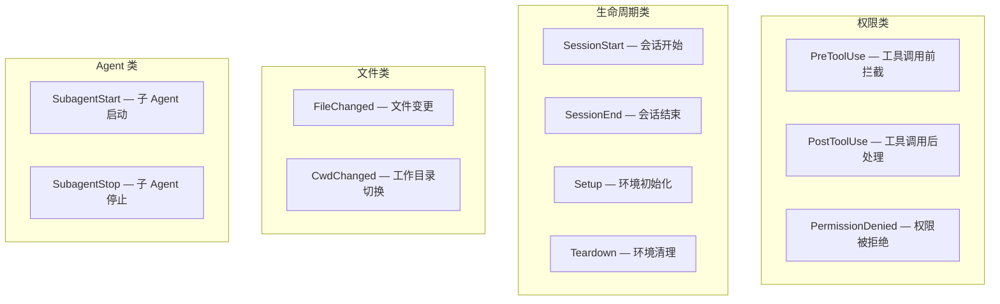

# Human-Agent Interaction Plane
>
> **所属域**：6. Coordination — Human-Agent 交互
>
> **Evidence Status** — synthesized. Autonomy Level、Control Policy、Approval、Memory Feedback、Progress Reporting 等实践需求；本知识库把人机交互从”审批按钮”提升为独立运行时层。

**Principle Refs**: MC-01, EM-03 — 必须向用户显式传达不确定性；用户本身也是环境约束的一部分

## 1. 定义

Interaction Plane 负责 Agent 与用户之间的中断、确认、审批、纠错、教学、进度报告、拒绝解释和信任升级。

它回答的核心问题是：

```text
用户何时需要被打扰？
Agent 该暴露多少信息？
用户如何纠正 Agent？
用户如何逐步授权更高自治？
Agent 如何说不并保持可理解？
```

## 2. InteractionEvent 类型

| 类型 | 触发器 | 输出 |
|---|---|---|
| progress | milestone、长任务、等待外部系统 | 简短进度 + 下一步 |
| clarification | 关键歧义、目标不完整 | 单个最关键问题或候选项 |
| approval_request | 高风险、不可逆、越权边缘 | 影响说明 + 选项 + 默认安全行为 |
| correction | 用户指出错误 | 更新 state / memory / plan |
| teaching | 用户表达偏好或规则 | proposed MemoryRecord / SkillRecord |
| budget_choice | 成本或时间接近阈值 | 质量-成本选项 |
| refusal | 不安全、不合规、不可验证 | 清楚原因 + 安全替代方案 |
| escalation | Agent 无法可靠完成 | 转人工或交付部分结果 |
| completion | 完成或部分完成 | 结果 + 证据 + 剩余不确定性 |

## 3. 交互原则

| 原则 | 含义 |
|---|---|
| Minimal Sufficient Interruption | 只问阻塞当前决策的最小问题 |
| Progressive Disclosure | 默认简洁，允许展开证据和 trace |
| User Control Surface | 用户可以暂停、取消、改目标、限制工具、调整预算 |
| Trust Calibration | 不假装确定，不隐藏风险，不过度打扰 |
| Teachability | 用户纠正应进入可审计状态，而不是只影响当前回复 |
| Refusal with Boundary | 拒绝要说明边界，不用空泛道歉替代设计 |

当原则之间发生冲突时，以用户对风险的知情权为最高优先级。例如 Trust Calibration 要求披露不确定性，而 Minimal Sufficient Interruption 要求减少打扰——此时应优先保证风险信息送达用户，再考虑精简交互形式。

## 4. 和其他模块的关系

| 模块 | 关系 |
|---|---|
| Control | approval_request 由 policy 触发，但 UX 由 Interaction 设计 |
| Memory | teaching / correction 可能生成 MemoryRecord，但需 provenance 和审批 |
| State | 用户取消、改目标、选择预算会改变 TaskCheckpoint |
| Cost | 预算接近上限时触发 budget_choice |
| Effects | 不可逆 effect 需要 approval 或 human_confirm |
| Observability | 每次交互写入 InteractionEvent 和 TraceEvent |

## 5. 拒绝追踪（Denial Tracking）

> Evidence Status: **production-validated** — Claude Code 和 OpenCode 独立实现了对用户拒绝的持久化追踪。

InteractionEvent 的 `approval_request` 和 `refusal` 类型描述了交互的瞬时行为，但缺少一个维度：**用户拒绝的历史累积如何影响后续交互决策**。生产系统表明，拒绝是用户意图的显式信号，必须被记忆和尊重。

### 5.1 拒绝记录与消费

- **Claude Code**（`denialTracking.ts`）：记录用户对工具调用的拒绝历史，每条记录包含操作类型、参数摘要、拒绝时间。Agent 在发起工具调用前查询拒绝记录，避免对已被拒绝的同一操作重复请求确认
- **OpenCode**：permission reply 支持三种粒度——`once`（仅本次）、`always`（自动批准后续相同权限请求）、`reject`（拒绝并记录）。`always` 和 `reject` 都是持久化的用户偏好信号
- **设计原则**：拒绝是用户意图的显式信号，不应被忽略或重复提示。连续对同一操作请求审批是交互层面的 Doom Loop

### 5.2 拒绝追踪与其他 Plane 的关系

| Plane | 关系 |
|---|---|
| Control | 拒绝记录可提升为 policy 规则——被多次拒绝的操作类型自动降级为禁止 |
| Recovery | 拒绝触发 replan 而非 retry——不应尝试绕过用户拒绝 |
| Memory | 持久化拒绝偏好是 MemoryRecord 的一种，需要 provenance |
| Trust | 反复请求已被拒绝的操作会损害信任，拒绝追踪是信任维护的基础设施 |

## 6. 用户主导的上下文策展

> Evidence Status: **synthesized** — Warp 的 Context Chip 系统展示了用户主动注入上下文的交互模式。

传统交互模式中，上下文由 Agent 管理（自动收集文件、搜索结果、工具输出）。生产系统出现了一种互补模式：**用户显式策展上下文**。

- **Warp Context Chip**：用户可在发送消息前显式附加文件、命令输出、代码块作为上下文 chip。每个 chip 在发送前处于 pending 状态，用户可以移除不需要的 chip
- **交互含义**：用户通过选择附加哪些上下文来表达任务边界和关注点。附加的内容是用户认为与当前任务相关的，未附加的内容是用户认为不相关的

这是一种 **User Control Surface**（第 3 节交互原则）的具体实现：用户不仅可以控制 Agent 做什么，还可以控制 Agent 看到什么。

## 7. Stop Gate 中的交互检查

```text
是否有用户必须知道的风险？
是否有不可验证但可能影响交付的部分？
是否有用户纠正尚未应用？
是否有 pending approval？
是否有预算、范围或安全降级？
```

## 8. Hook / 插件化扩展

> **Evidence Status** — production-validated. Claude Code 实现了 15+ 事件类型的 Hook 系统；OpenCode、Codex 有类似但范围较小的实现。

Interaction Plane 的前述内容描述了 Agent 与用户之间的交互事件。Hook 系统解决的是另一个问题：**外部逻辑如何在交互事件发生时介入 Agent 行为**。

### 8.1 Hook 事件类型



权限类事件是最关键的——PreToolUse Hook 可以在工具执行前阻止危险操作，PostToolUse Hook 可以在执行后注入审计或副作用处理。

### 8.2 Hook 执行形式

| 形式 | 说明 | 适用场景 |
|---|---|---|
| Shell | 执行 shell 命令或脚本 | 本地环境检查、文件校验、CI 触发 |
| HTTP | 调用外部 webhook | 审计日志、外部审批系统、通知服务 |
| Plugin | 加载插件模块 | 复杂逻辑、需要状态的拦截器 |
| Function callback | 进程内函数调用 | SDK 集成、低延迟场景 |

### 8.3 Hook 响应协议

**同步 Hook**：阻塞当前流程直到返回。

```yaml
sync_response:
  action: continue | stop       # 是否继续执行
  decision: approve | block     # 针对权限类事件的裁定
  updatedInput: ...             # 可选：修改后的输入（如过滤敏感字段）
```

任何一个 Hook 返回 `block`，则该操作被拒绝（PreToolUse 场景下等同于权限否决）。多个 Hook 并行时取最严格结果。

**异步 Hook**：后台执行，不阻塞主流程。

```yaml
async_response:
  timeout: 30s                  # 超时后视为成功或按 fallback 处理
  rewake: true | false          # 完成后是否唤醒 Agent 处理结果
  event_store: required         # 异步 Hook 需要事件持久化（重启后可恢复）
```

异步 Hook 的关键约束：必须有事件存储支持。Agent 重启后需要从事件存储恢复未完成的异步 Hook 状态，否则会丢失外部系统的回调。

### 8.4 Hook 配置源分层

Hook 配置可以来自多个层级，优先级从高到低：

```text
User        — 用户级配置（~/.agent/hooks.yaml）
Project     — 项目级配置（.agent/hooks.yaml）
Policy      — 组织策略下发的强制 Hook
Session     — 会话内临时注册的 Hook
```

高优先级配置可以覆盖低优先级，但 Policy 层的 Hook 不能被 User 或 Project 层禁用——这是组织级安全约束的执行点。

### 8.5 与其他 Plane 的关系

| Plane | Hook 的作用 |
|---|---|
| Control | PreToolUse Hook 是 Control Policy 的运行时执行点 |
| Security | Hook 可实施输入过滤、输出脱敏、操作审计 |
| Effects | PostToolUse Hook 可触发效果验证或回滚 |
| Observability | 所有 Hook 的触发和结果写入 TraceEvent |
| Recovery | Hook 失败本身需要恢复策略（fallback / skip / abort） |

## 9. 子文件导航

| 文件 | 内容 | 关注点 |
|---|---|---|
| `intent-alignment.md` | 意图漂移检测、认知负载管理、多利益方冲突 | 用户意图与 Agent 理解的持续对齐 |
| `interruption.md` | 中断策略和时机选择 | 何时打扰用户、何时自主决策 |
| `progress-report.md` | 进度报告的设计 | 长任务中如何保持用户知情 |
| `teaching.md` | 用户教学与纠正 | 用户偏好和规则如何进入 Agent 状态 |
| `trust-escalation.md` | 信任升级的工程机制 | 阶段划分、升降级条件、授权范围 |
| `trust-dynamics.md` | 信任建设的理论框架 | 信任演化路径、破坏修复、品类差异、过度信任 |
| `cognitive-load.md` | 认知负荷与交互设计 | 输出信息密度、审批复杂度、进度频率、错误层次化 |
| `ux-patterns.md` | 具体的 UX 交互模式 | Progress Card、Approval Block、Evidence Drawer 等 |

## 10. 外部参考

- `../../../design-space/patterns/progressive-disclosure.md`
