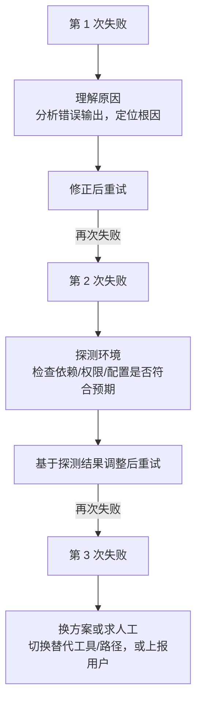
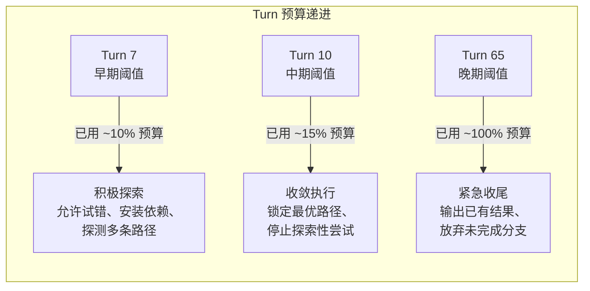
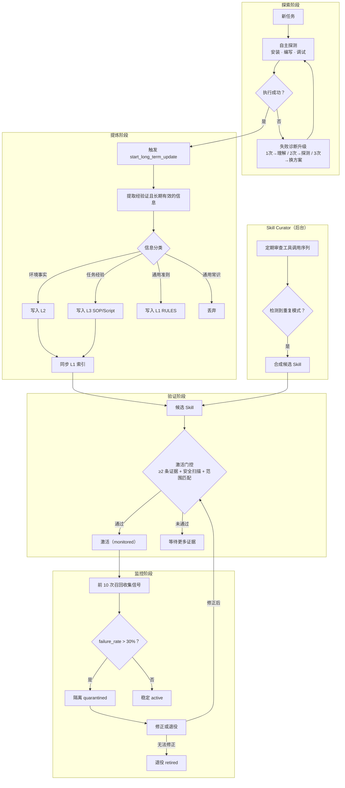

# Learning & Adaptation Plane
>
> **所属域**：8. Reflection & Learning — 经验学习与技能治理
>
> **Evidence Status** — grounded. GenericAgent 的 self-evolution 四步循环和 L0-L4 记忆约束规则（源码级验证）、Hermes 的 Skill Curator 自动提炼和 SKILL.md 运行时创建（源码级验证）、Voyager skill library 的知识蒸馏实践，共同支撑本文件中的机制描述。

**Principle Refs**: BDI-01, MC-02 — 学习即从运行观察中构建信念；自监控发现偏差时触发适应性调整

## 定义

Learning & Adaptation Plane 负责把运行经验转化为可复用的策略、技能、记忆、测试和配置变更。它强调三件事：

1. 只从有证据的运行中学习；
2. 学到的内容先进入候选区，经过验证后再可被召回；
3. 失效、冲突或有害的学习结果必须能降权、隔离或退役。

```text
Trace / user correction / eval failure
  → candidate extraction
  → evidence and safety validation
  → activation under scope
  → monitored reuse
  → deactivation or refinement when evidence changes
```

## 可学习对象

| 对象 | 示例 | 必须验证什么 |
|---|---|---|
| Project Convention | 构建命令、测试入口、代码风格 | 是否来自可信项目文件或成功 trace |
| Tool Recipe | "先搜索再读取再编辑"的工具链 | 是否可 replay，是否有 postcondition |
| Prompt Fragment | 某类任务的输出格式或检查清单 | 是否提升 eval，而非只更像模板 |
| Recovery Strategy | 某工具超时后的替代路径 | 是否减少失败，不引入更高风险 |
| Memory Entry | 用户偏好、长期事实、关系背景 | 是否有 provenance、scope、失效条件 |
| Eval Fixture | 从失败 trace 提炼的回归用例 | 是否能稳定复现关键风险 |

## CandidateRecord Schema

```yaml
candidate_record:
  candidate_id: string
  source: trace | user_correction | eval_failure | project_file | human_review
  scope: global | tenant | project | user | task_type
  content_type: convention | tool_recipe | prompt_fragment | recovery_strategy | memory | eval_fixture
  evidence_refs: []
  preconditions: []
  validation_required: []
  safety_checks: []
  activation_state: candidate | active | quarantined | retired
  invalidation_triggers: []
  last_validation_evidence: []
```

## 学习边界

| 不应学习 | 原因 | 替代做法 |
|---|---|---|
| 一次性外部状态 | 很快过期 | WorldStateSnapshot + TTL |
| 未验证的模型推断 | 容易固化幻觉 | 先进入 hypothesis，不激活 |
| 含 secret / PII 的 trace | 隐私和安全风险 | redact 后只保留结构化经验 |
| 越权但成功的路径 | 会固化安全绕过 | 标记为 anti-pattern fixture |
| 只在单一环境偶然有效的命令 | 过拟合 | 写入 preconditions 和 scope |

## 触发器

| 触发器 | 动作 |
|---|---|
| 同一失败重复出现 | 生成 recovery strategy 候选 + eval fixture |
| 用户纠正同一偏好多次 | 生成 scoped memory 候选 |
| 工具链多次成功 | 生成 tool recipe 候选 |
| 项目配置改变 | 使相关 convention 候选重新验证 |
| eval 退化 | 暂停相关候选召回，进入诊断 |

---

## 专题详述

以下主题已拆分为独立文件，按需深入：

| 专题 | 文件 | 解决什么 |
|---|---|---|
| 自进化循环与记忆约束 | [`self-evolution-loop.md`](./self-evolution-loop.md) | 四步循环（探测→识别→固化→索引）、L0 不可变公理、四层写入纪律 |
| Skill Curator 治理 | [`skill-curator.md`](./skill-curator.md) | 自动提炼流程、三阶段背景审核（确定性转移→LLM审核→合并协调）、SKILL.md 格式 |
| 训练时学习方法参考 | [`training-methods-reference.md`](./training-methods-reference.md) | PPO/DPO/RLVR/SICA/AlphaEvolve 离线训练反馈环 |

---

## 固化的验证协议

不是每次成功都值得固化，也不是每个固化的 Skill 都应永远保持活跃。验证协议定义固化和丢弃的客观条件。

### 固化条件

满足以下三条才应触发固化：

1. **重复性**：同类问题出现 2 次以上
2. **可验证性**：解决方案经工具执行验证成功（No Execution, No Memory）
3. **收益性**：固化后能减少后续推理开销——即写入 ROI 为正

仅出现一次的成功路径不固化，因为无法区分"可复用模式"和"偶然成功"。

### 丢弃条件

以下任一条件成立，已固化的 Skill 应降权或退役：

| 丢弃条件 | 检测方式 | 动作 |
|---|---|---|
| 环境已变化 | 项目依赖升级、API 变更、配置迁移 | 触发 invalidation，进入 quarantined |
| 最近使用产生错误 | 连续 N 次召回后执行失败 | 自动降权，超阈值则 deprecated |
| 前提不再成立 | preconditions 中的某项无法满足 | 标记 deprecated，保留记录 |
| 与 policy 冲突 | Skill 建议的操作被安全策略禁止 | policy 优先，Skill 隔离 |

### 失败诊断升级

GenericAgent 对失败的处理不是"重试直到成功或放弃"，而是逐步升级诊断力度：



| 失败次数 | 动作 | 原理 |
|---|---|---|
| 1 次 | 理解原因——分析错误输出，推断根因 | 多数失败来自参数错误或瞬时问题，理解即可解决 |
| 2 次 | 探测环境——主动检查依赖、权限、配置 | 重复失败说明可能不是操作问题而是环境问题 |
| 3 次 | 换方案或求人工——切换替代路径或上报 | 三次失败后继续同一路径的期望收益已经很低 |

这个升级策略与 Tool System 的循环守卫（loop guard）互补：循环守卫防止 Agent 在同一工具上无限重试，失败诊断升级指导 Agent 在每次重试前做什么不同的事。

### Turn 预算递进阈值

失败诊断升级不仅按失败次数递进，还与会话 Turn 预算关联。GenericAgent 定义了三级递进阈值，随着对话轮次消耗比例升高，诊断策略从激进切换为保守：



| 阈值 | 触发条件 | 策略变化 |
|---|---|---|
| Turn 7 | 会话进入中前期 | 如果核心路径仍未跑通，启动失败诊断升级（1→理解、2→探测、3→换方案） |
| Turn 10 | 探索窗口即将关闭 | 停止新路径探索，锁定当前最优方案执行到底 |
| Turn 65 | 会话预算接近耗尽 | 无论任务是否完成，输出当前已有结果并说明未完成部分 |

Turn 阈值与失败次数升级是正交的两个维度：失败次数决定"做什么不同的事"，Turn 阈值决定"还有没有预算做不同的事"。两者共同避免 Agent 在有限对话窗口内无效消耗。

---

## 候选激活前后的验证协议

候选从 `candidate` 到 `active` 不是自动晋升，必须过两道关：

**激活前**：
1. 证据充分性——至少 2 个独立 trace 或 1 个用户确认支持
2. 安全扫描——不含 secret/PII、不固化越权路径（→ `../../cross-cutting/learning-x-safety.md`）
3. 范围匹配——preconditions 和 scope 是否排除了不适用场景

**激活后**：
1. 监控期——新候选的前 N 次召回标记 `monitored`，自动收集 success/failure 信号
2. 回滚触发——如果 failure_rate > threshold 或 eval 退化，自动降级为 `quarantined`
3. 版本追踪——每次修正生成新版本，保留旧版本回滚路径

```yaml
activation_gate:
  min_evidence_count: 2
  safety_scan: required
  scope_validation: required
  monitoring_window: 10_uses
  auto_quarantine_threshold: 0.3  # 30% 失败率
```

---

## 完整固化流程

将自进化循环、记忆约束、Skill Curator 和验证协议串联起来，完整流程如下：



---

## 与 architecture/learning 的关系

`architecture/learning/` 是学习机制的专题库（反馈循环、知识蒸馏、在线适应、安全护栏、技能治理、事故驱动演化）。本 plane 是运行时入口，说明学习如何接入 State、Memory、Evaluation、Operations 和 Security。

| 专题 | 文件 | 解决什么 |
|---|---|---|
| 反馈循环 | `../../learning/feedback-loops.md` | 从哪些信号中学习 |
| 知识蒸馏 | `../../learning/knowledge-distillation.md` | 如何从 trace 提炼可复用经验 |
| 在线适应 | `../../learning/online-adaptation.md` | 运行时参数调整 |
| 安全护栏 | `../../learning/safety-guardrails.md` | 学习过程中的安全约束 |
| 技能治理 | `../../learning/skill-governance.md` | 技能版本管理与供应链防护 |
| 事故驱动 | `../../learning/incident-driven-evolution.md` | 从故障中固化 eval fixture |

## 参考实现

| 系统 | 核心特征 | 详见 |
|---|---|---|
| **GenericAgent** | 自进化四步循环、L0 不可变公理、L1 ≤30 行硬约束、失败诊断升级 | `projects/general-agents/generic-agent/self-evolution.md` |
| **Hermes** | Skill Curator 自动提炼、SKILL.md 运行时创建、渐进式信息披露、冻快照模式 | `projects/general-agents/hermes-agent/memory-skills.md` |

相关 pattern：`../../../design-space/patterns/skill-crystallization.md`。
相关认知架构：`../../../cognitive-architecture/skill-acquisition.md`。

## 探索与发现

Agent 的学习不仅限于从已知经验中固化模式，还可以**主动探索未知空间**。详见 `../../../design-space/patterns/exploration-discovery.md`。

核心模式：假设-验证循环（Generation → Reflection → Ranking → Evolution），适用于研究、创新和开放式问题求解。
