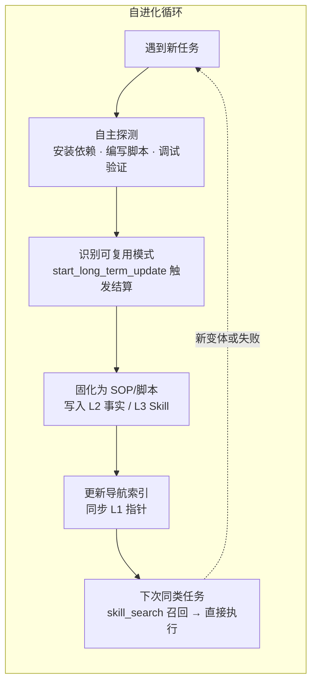
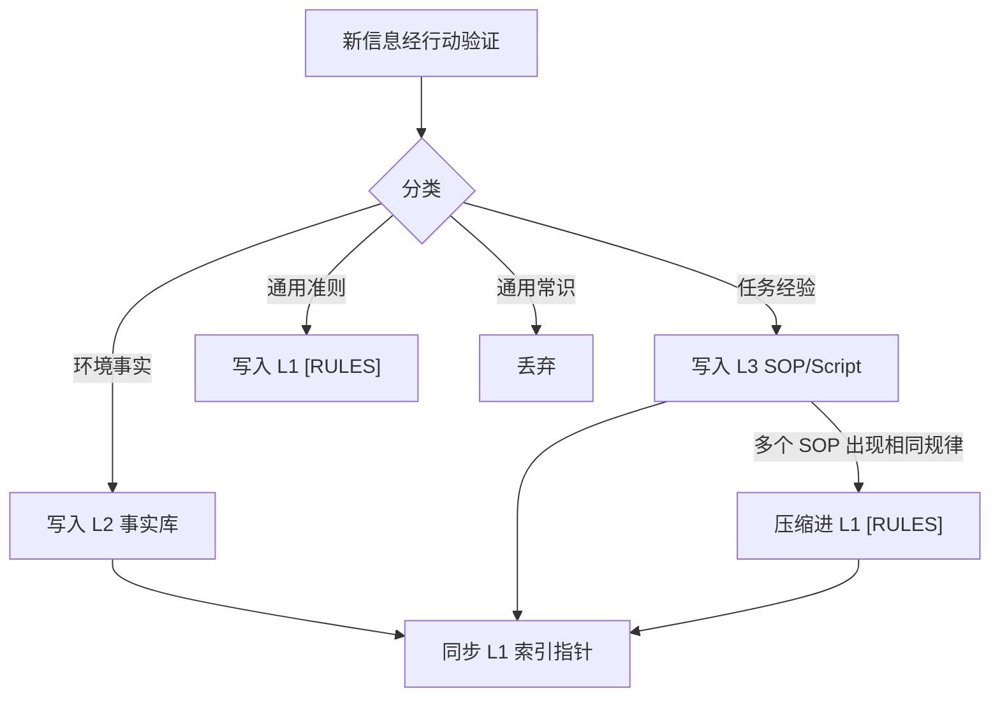

## 自进化循环：从探索到固化

> **Evidence Status** — grounded. 来自 GenericAgent 的 self-evolution 四步循环和 L0-L4 记忆约束规则（源码级验证）。

Agent 的学习不是被动积累，而是一条从"遇到新任务"到"下次直接执行"的闭环管线。GenericAgent 的 self-evolution 机制提供了这条管线的完整实现。

### 四步循环



**第一步：自主探测**。Agent 面对未见过的任务时，不等人指路，直接动手——安装依赖、编写脚本、调试验证。GenericAgent 的典型表现：第一次被要求"监控股票并提醒"时，自主安装 mootdx、构建选股流程、配置定时任务。

**第二步：识别可复用模式**。任务完成后，Agent 调用 `start_long_term_update` 触发记忆结算。结算 prompt 明确要求"提取事实验证成功且长期有效的信息"，禁止临时变量、推理过程、未验证信息、通用常识入库。

**第三步：固化为 SOP/脚本**。结算结果按信息分类决策树路由到对应层：

```python
# GenericAgent 信息分类逻辑
def decide_layer(info):
    if is_environment_specific(info):   # IP/路径/凭证/API 密钥
        return "L2"
    if is_generic_principle(info):       # 全局避坑指南
        return "L1 [RULES] (压缩为 1 句)"
    if is_task_specific_expertise(info): # 艰难尝试 + 长期有用
        return "L3 SOP/Script"
    return None  # 通用常识 → 不存储
```

**第四步：更新导航索引**。L2/L3 写入后必须同步 L1 指针。这是极简指针型记忆的关键约束：信息存在但 L1 没有指针，等于不存在。

进化效果在几周内可量化：Skill 数量从 0 增长到 50+，平均任务轮次从 10+ 降到 2-3，重复任务耗时从分钟级降到秒级（GenericAgent 实测数据）。

### 两种触发模式

| 模式 | 触发条件 | 行为 |
|---|---|---|
| 任务驱动 | 任务完成时 Agent 主动调用 `start_long_term_update` | 从当前 trace 提炼经验，立即固化 |
| 计划驱动 | 空闲 30 分钟后自动触发 | 审查近期未结算的 trace，批量提炼 |

任务驱动是主要通道——每次成功完成复杂任务都是一次学习机会。计划驱动是补偿机制，防止 Agent 忙于执行而忘记沉淀。

---

## 记忆约束规则：四层写入纪律

自进化循环必须在严格的记忆约束下运行，否则学到的东西比忘掉的还多。GenericAgent 的 L0 元规则定义了四层写入纪律。

### L0 元规则的不可变性

L0 层（`memory_management_sop.md`）包含写入公理、分类决策树和层级同步规则。这些规则本身不允许被 Agent 修改——即使 Agent 认为规则"可以优化"。

这不是过度保守。记忆管理规则是整个学习系统的根基。如果 Agent 可以修改"什么信息值得记住"的规则，它就可能逐渐放松标准，让未验证信息进入持久层，导致记忆污染的连锁反应。L0 的不可变性是系统自洽性的锚点。

```text
L0 Meta Rules（不可变公理）
  ├── 行动验证原则：No Execution, No Memory
  ├── 禁止易变状态：不存时间戳、PID、Session ID
  ├── 信息分类决策树：环境事实 → L2 / 避坑准则 → L1 / 任务经验 → L3
  └── 层级同步规则：L2/L3 变更必须同步 L1 指针
```

### 四层约束

**约束一：L1 索引硬约束——不超过 30 行，不超过 1K tokens**。

L1 每轮必须注入系统提示，是 context window 的常驻开销。每多一个词，就在后续每轮对话中多消耗一个 token。30 行 / 1K tokens 是 GenericAgent 经实践确定的上限——超过这个阈值，L1 从"索引"退化为"又一个全量注入"，分层的意义不复存在。

L1 的内容是极简指针，不是内容本身：

```text
浏览器自动化: web_scan/web_execute_js直接调用 | 特殊:tmwebdriver_sop(...)
键鼠模拟: ljqCtrl_sop+.py(仅win，禁pyautogui/先activate窗口)
定时任务: scheduled_task_sop(报告→sche_tasks/done/)

[RULES]
1. 搜索先行: 信息用google, 项目内os.listdir, 禁猜路径
2. 交叉验证: 禁信搜索摘要, 数值必进详情页核实
```

**约束二：禁止易变状态**。

不存储会随环境变化而失效的瞬时信息。判断标准：下次会话启动时这条信息是否仍然成立？答案不确定，不入库。

| 禁止存储 | 原因 |
|---|---|
| 时间戳（"现在是 2025-06-15 14:30"） | 下次会话必然过期 |
| 进程 ID、Session ID | 进程重启即失效 |
| 绝对路径中的临时目录（`/tmp/xxx`） | 不可复现 |
| 当前运行的端口号（除非固定配置） | 动态分配的端口无法跨会话复用 |

**约束三：只记录跨会话仍重要且难以快速重建的信息**。

这是写入 ROI 公式的简化表述。GenericAgent 的 L0 prompt 要求"提取事实验证成功且长期有效的信息"——如果一条信息下次用 `ls` 或 `grep` 就能在 5 秒内获取，它不值得占用 L1/L2 的 token 预算。

```text
写入 ROI = (不放这几个词的犯错概率 × 犯错代价) / 每轮词数成本
```

- 犯错概率高 + 代价大：必须写入（如 API 鉴权流程中的关键步骤）
- 犯错概率低 + 代价小：不值得写入（如常见库的标准用法）
- 犯错概率高 + 代价小：视情况写入 L1 [RULES] 一句话提醒

**约束四：记忆同步规则**。

L2/L3 新增或修改时，必须同步更新 L1 导航指针。如果发现某条经验在多个 L3 SOP 中反复出现，应压缩为 L1 [RULES] 中的一句话通用准则。这是从具体经验到抽象规律的自然提升路径。


