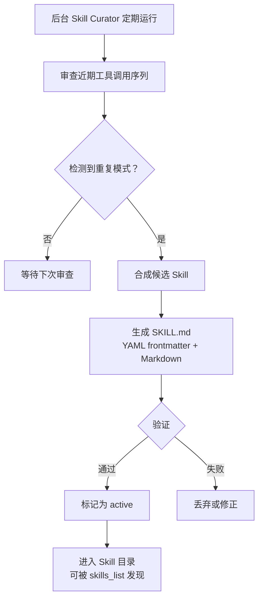
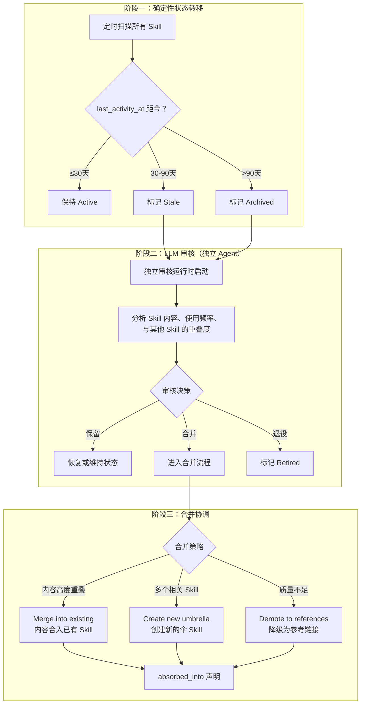

## Skill Curator：自动提炼与生命周期管理

> **Evidence Status** — grounded. 来自 Hermes `skill_curator.py`（约 1675 行）的完整实现。

GenericAgent 的自进化依赖 Agent 自身在任务完成时主动触发结算。Hermes 提供了另一条路径：用后台辅助 agent（Skill Curator）定期审查已使用的工具序列，自动检测重复模式并合成新 Skill。

### 自动提炼流程



Skill Curator 只修改 Agent 创建的 Skill，不碰用户创建的。这是一条硬边界：用户的意图和 Agent 的归纳可能冲突，Agent 不应该擅自"改进"用户明确编写的内容。

### Skill 生命周期

Hermes 的 Skill 有三个生命周期状态，自动过渡：

| 状态 | 含义 | 过渡条件 |
|---|---|---|
| 活跃（active） | 近期被使用且成功率达标 | 新建或从不活跃恢复 |
| 不活跃（inactive） | 长期未被调用 | 超过 N 天未命中 |
| 已归档（archived） | 不再参与召回 | 从 inactive 超时，或环境变更触发 |

过渡是自动的，但可人工干预。已归档的 Skill 不删除，保留在目录中供审查和恢复。

### 背景审核模式：三阶段治理

> **Evidence Status** — production-validated. 来自 Hermes `skill_curator.py`（约 1675 行）的完整实现。

简单的 active/inactive/archived 三态适用于单个 Skill 的生命周期。但当 Skill 数量增长到数十个，需要一个独立的审核机制来处理合并、去重和质量控制。Hermes 的 Skill Curator 实现了三阶段治理：



**关键设计决策**：

**分离的审核运行时**。LLM 审核在独立 agent 会话中执行，不在主会话上下文中进行。这避免了审核推理过程（可能涉及大量 Skill 内容比对）污染用户的工作上下文。

**确定性优先，LLM 兜底**。阶段一的状态转移完全基于时间戳，不涉及 LLM 推理——确定性规则执行快、成本为零、可预测。只有需要语义判断的合并/退役决策才启动 LLM。

**三种合并策略**：
| 策略 | 适用场景 | 结果 |
|---|---|---|
| Merge into existing | A 和 B 内容高度重叠，B 更完整 | A 的内容合入 B，A 标记 `absorbed_into: B` |
| Create new umbrella | 多个小 Skill 覆盖同一主题的不同方面 | 创建新伞 Skill C，原 Skill 标记 `absorbed_into: C` |
| Demote to references | Skill 质量不足以独立存在 | 降级为其他 Skill 的参考链接，原 Skill 标记 Retired |

**absorbed_into 声明**。被合并的 Skill 主动声明去向：`absorbed_into: <target_skill_name>`。这使得任何引用旧 Skill 的代码或记忆都能追溯到新位置。

### Skill 运行时创建：SKILL.md 格式

Hermes 的每个 Skill 是一个目录，入口文件为 `SKILL.md`，格式为 YAML frontmatter + Markdown body：

```yaml
---
name: reverse-engineering        # ≤64 chars
description: Web service reverse engineering and automation
version: 1.0.0                   # 语义版本化
platforms: [macos, linux]        # 平台感知过滤
required_environment_variables:
  - name: CAPSOLVER_API_KEY
    prompt: "CAPSolver API key"
    required_for: captcha_solving
metadata:
  hermes:
    tags: [automation, security]
    related_skills: [browser-use] # 关联技能
---

## 使用场景
...

## 步骤
...

## 已知限制
...
```

几个设计决策值得注意：

**版本化**（`version` 字段）使同一 Skill 的多个版本可以共存。环境变化导致旧版本失效时，不需要删除旧版本，只需标记 deprecated 并指向新版本。

**标签化**（`tags`）和**关联**（`related_skills`）支持 Skill 之间的发现和导航。Agent 在 `skills_list` 中看到元数据后，按需加载完整内容（渐进式信息披露）。

**平台感知**（`platforms`）使 Skill 可以声明自己只在特定平台上可用。在 macOS 上运行时，声明 `platforms: [linux]` 的 Skill 不会出现在召回结果中，避免误用。

### 渐进式信息披露

Agent 不需要一次性加载所有 Skill 的全部内容：

| 层级 | 接口 | 返回内容 | Token 成本 |
|---|---|---|---|
| Tier 1 | `skills_list()` | 所有 Skill 的 name + description + category | 低 |
| Tier 2 | `skill_view(name)` | 单个 Skill 的完整 SKILL.md | 中 |
| Tier 3 | `skill_view(name, file_path)` | Skill 的支持文件（模板/资产/参考） | 按需 |
