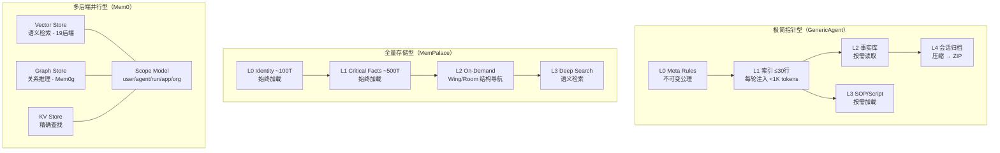
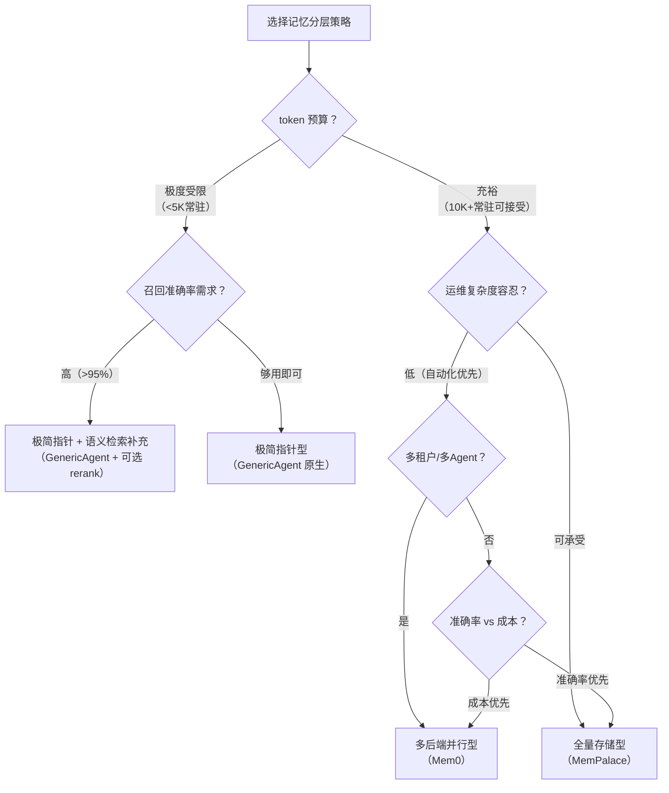

# 记忆分层策略

> **Evidence Status** — grounded. 来自 GenericAgent L0-L4 五层实现、MemPalace L0-L3 四层+宫殿结构（96.6% R@5 基准验证）、Mem0 三层存储+四维 Scope（26% 质量提升基准验证）、Letta OS 内存隐喻的实战对比。

**Principle Refs**: BR-02 — 记忆系统的分层策略直接决定 token 效率、召回准确率和维护成本三者的权衡。

## 三种分层策略



### 策略一：极简指针型（GenericAgent）

**核心思路**：最小化常驻 context 占用，用指针层级替代内容注入。

| 层 | 常驻/按需 | 容量 | 内容 |
|---|---|---|---|
| L0 Meta Rules | 常驻 | ~200T | 写入公理、分类决策树 |
| L1 索引 | 常驻 | ≤30行, <1K tokens | 高频场景 key→value、低频关键词、[RULES] |
| L2 事实库 | 按需 `file_read` | 可膨胀 | 环境路径、凭证、配置、ID |
| L3 SOP/Script | 按需 `file_read` | 可膨胀 | 精简 SOP、可复用脚本 |
| L4 会话归档 | 按需搜索 | 自增长 → 月度 ZIP | 原始日志 → 压缩摘要 → 聚合索引 |

**token 预算**：常驻 <1.2K tokens，总控 <30K tokens（含按需加载）。

**L1 同步机制**是该策略的关键：L2/L3 变更时必须同步更新 L1 指针，否则信息虽然存在却无法被发现。高频场景直接写 `key→value`，低频场景仅列关键词。

**优势**：
- context window 占用极小，绝大多数回合只消耗 L0+L1 的 ~1.2K tokens
- 按需加载使 Agent 在需要深入时才付出 token 成本
- 分层清晰，每层写入规则明确

**代价**：
- L1 索引维护成本：每次写入 L2/L3 都需同步 L1
- L1 膨胀风险：如果审视不及时，索引退化为全量注入
- 召回依赖 Agent 的定位能力：如果 L1 指针不准确，信息等于不存在

### 策略二：全量存储型（MemPalace）

**核心思路**：存一切原文，用结构使其可找，而非用 LLM 决定什么值得记住。

| 层 | 常驻/按需 | 容量 | 内容 |
|---|---|---|---|
| L0 Identity | 常驻 | ~100T | AI 身份定义 |
| L1 Critical Facts | 常驻 | ~500T | Top 15 关键记忆 |
| L2 On-Demand | 结构导航 | Wing/Room/Closet/Drawer | 话题触发时加载 |
| L3 Deep Search | 语义检索 | ChromaDB 全量嵌入 | 显式查询时检索 |

**Palace 结构**是该策略的核心：

```
Wing (person/project)
  └── Room (topic/idea)
        └── Closet (summary pointer)
              └── Drawer (verbatim content)

Hall = 记忆类型走廊（facts, events, discoveries...）
Tunnel = 跨 Wing 连接（同一 Room 在不同 Wing 中的关联）
```

结构导航替代语义猜测，Wing+Room 过滤带来 +34% R@10 提升。

**性能基准**（LongMemEval）：

| 模式 | R@5 | LLM 依赖 |
|---|---|---|
| Raw（ChromaDB only） | 96.6% | 无 |
| Hybrid v4 + rerank | 100% | Haiku（~$0.001/查询） |

**优势**：
- 召回准确率最高：原文保留避免有损摘要的信息丢失
- 不依赖 LLM 决定记忆价值，消除提取偏差
- 时间感知 KG 支持 `valid_from/valid_to` 时间范围查询

**代价**：
- 存储成本随对话量线性增长
- 常驻 context 占用 ~600T（L0+L1），高于极简指针型
- 结构维护成本：Wing/Room 组织需要持续治理

### 策略三：多后端并行型（Mem0）

**核心思路**：不同查询模式各有最优后端，统一 Scope 模型管理归属。

| 后端 | 查询模式 | 适用场景 |
|---|---|---|
| Vector Store | 语义相似度 | "用户之前提过类似的事" |
| Graph Store (Mem0g) | 关系推理、多跳查询 | "Alice 管理的人偏好什么语言？" |
| KV Store | 精确键值查找 | 用户偏好设置、配置项 |

**自动生命周期**是该策略的核心：系统从对话中自动提取候选记忆，经评估、去重后决定 CREATE / UPDATE / DELETE / SKIP。

**Scope 模型**提供五维归属：

| Scope | 语义 | 查询示例 |
|---|---|---|
| user_id | 属于特定用户 | `mem0.search(query, user_id="alice")` |
| agent_id | 属于特定 Agent | `mem0.search(query, agent_id="analyst")` |
| run_id | 属于特定会话 | 会话级临时上下文 |
| app_id | 属于特定应用 | 应用级配置 |
| org_id | 属于特定组织 | 团队共享知识 |

**性能基准**：

| 指标 | Mem0 vs Full Context |
|---|---|
| 响应质量 | +26% |
| p95 延迟 | -91% |
| Token 成本 | -90%+ |

**优势**：
- 选择性注入：只注入相关记忆，token 成本极低
- 多后端覆盖不同查询模式，各有最优路径
- 自动化程度最高，开发者零负担

**代价**：
- 三层存储的一致性和同步复杂度高
- LLM 自动提取质量不稳定，可能遗漏重要信息
- Scope 组合查询复杂度随维度增加而上升

## 策略对比

| 维度 | 极简指针型 | 全量存储型 | 多后端并行型 |
|---|---|---|---|
| **代表** | GenericAgent | MemPalace | Mem0 |
| **常驻 token** | ~1.2K | ~600 | 按查询动态注入 |
| **召回准确率** | 依赖 L1 质量 | 96.6%（Raw）→ 100%（Hybrid） | 接近 Full Context（<5分差距） |
| **存储成本** | 低（纯文本文件） | 中（ChromaDB + SQLite） | 高（Vector + Graph + KV） |
| **维护成本** | 中（L1 同步） | 中（结构治理） | 低（自动化） |
| **写入自动化** | Agent 主动触发 | 系统 Hook 触发 | 系统全自动 |
| **多租户** | 目录隔离 | 无内建 | 五维 Scope |
| **LLM 依赖** | 无（纯文件 I/O） | 可选（rerank 可用 Haiku） | 强（提取、评估、去重） |

## 选择决策树



## OS 内存隐喻（教学锚点）

Letta 提出的类比为记忆分层提供了直觉性的心智模型：

| OS 概念 | Agent 对应 | 特征 |
|---|---|---|
| **RAM** | Context Window | 容量有限，访问快，掉电丢失 |
| **磁盘** | Vector Store / 文件系统 | 容量大，访问慢，持久化 |
| **搜索引擎** | 对话检索（Recall） | 全文索引，按相关性排序 |
| **分页** | Context Compaction | RAM 满时将低优先级内容换出 |
| **缓存命中** | 前缀缓存（Prompt Caching） | 热数据留在 RAM，减少重新加载 |

Letta V1 的演进揭示了一个趋势：随着上下文窗口扩大（1M+ tokens），"放不下"不再是主要约束，**"注意力稀释"**成为新的瓶颈。OS 内存管理的必要性不会消失，但约束从容量转向了注意力分配。

## 混合策略实践

生产系统通常不会纯用一种策略。常见的混合方式：

| 组合 | 做法 | 适用场景 |
|---|---|---|
| 指针 + 语义检索 | L1 索引 + ChromaDB 兜底 | 需要精确定位 + 模糊回忆 |
| 全量存储 + Scope | MemPalace 结构 + Mem0 式归属标签 | 多用户长期陪伴 |
| 指针 + 图记忆 | L1→L2 事实 + Graph Store 关系推理 | 需要多跳推理的专业场景 |

选择分层策略时，核心问题是"在当前的 token 预算、准确率需求和维护能力下，哪种权衡可接受"。
