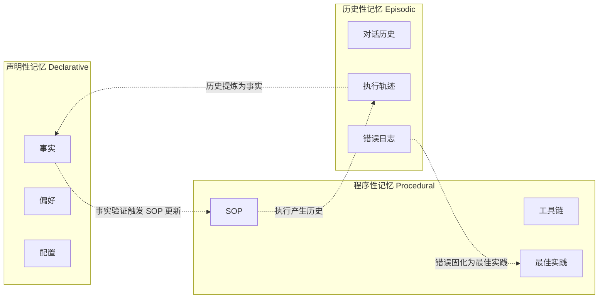

# 记忆类型分类学

> **Evidence Status** — grounded. 来自 Hermes Memory/Skill/Session 三分离、GenericAgent L2 事实/L3 SOP/L4 历史分层、Letta Core/Archival/Recall 三层级、Mem0 四维 Scope 的实战验证。

**Principle Refs**: BR-02, BDI-01 — 不同类型的记忆有不同的生命周期和退化模式，信念需从观察构建。

## 三类记忆的本质区分

### 声明性记忆（Declarative）

存储"**是什么**"——事实、偏好、配置、实体关系。

| 实现 | 载体 | 示例 |
|---|---|---|
| Hermes MEMORY.md | Markdown 文件，§ 分隔条目 | 用户偏好、项目约定 |
| GenericAgent L2 | `global_mem.txt`，按 `## [SECTION]` 组织 | 环境路径、API 端点、凭证 |
| Letta Core Memory | 上下文内结构化块（human/persona/custom） | 用户画像、Agent 人格 |
| Mem0 KV Store | 键值对 | 精确偏好设置 |
| Nocturne Memory | Node-Memory 版本链 | 带 provenance 的事实 |

**特征**：查找模式为精确匹配或属性过滤，变更频率低，错误代价高（一条错误事实会持续污染后续推理）。

### 程序性记忆（Procedural / Skill）

存储"**怎么做**"——可执行的 SOP、工具调用序列、脚本模板。

| 实现 | 载体 | 示例 |
|---|---|---|
| Hermes SKILL.md | Frontmatter + Markdown，支持渐进披露 | 逆向工程流程、浏览器自动化 |
| GenericAgent L3 | `memory/*.md` + `memory/*.py` | `tmwebdriver_sop.md`、定时任务脚本 |
| Letta Archival | 向量存储的长期知识 | 参考材料、操作手册 |

**特征**：查找模式为语义匹配（"我要做类似的事"），需要版本管理（SOP 可能过期），由成功执行触发写入（Skill Crystallization）。

GenericAgent 的进化指标证明了程序性记忆的价值：Skill 从 0 增长到 50+ 后，平均任务轮次从 10+ 降到 2-3，重复任务耗时从分钟级降到秒级。

### 历史性记忆（Episodic / Session）

存储"**发生了什么**"——对话历史、执行轨迹、时间线。

| 实现 | 载体 | 示例 |
|---|---|---|
| Hermes session_search | SQLite FTS5，BM25 排序 | 跨会话对话检索 |
| GenericAgent L4 | 原始日志 → 压缩 → 月度 ZIP | `model_responses_PID.txt` |
| Letta Recall Memory | 对话数据库，支持时间过滤 | `conversation_search_date` |
| MemPalace Drawer | ChromaDB 原文存储 | 逐字对话记录 |

**特征**：查找模式为时间范围 + 关键词/语义混合，体积增长最快，是声明性和程序性记忆的原始素材来源。

## 三类混淆的反模式

将不同类型的记忆混在同一存储中是生产系统的常见错误。

| 混淆模式 | 后果 | 实战案例 |
|---|---|---|
| **事实混入历史** | 事实随对话归档被压缩丢失 | 环境配置写在对话日志里而非 L2，下次找不到 |
| **SOP 混入事实** | 事实库膨胀，L1 索引失控 | 操作步骤写进 `global_mem.txt`，每轮注入不相关的长文本 |
| **历史冒充事实** | 过期信息被当作当前状态 | "上次部署端口是 3000" 被当作"端口是 3000" |
| **推断冒充陈述** | 多 Agent 场景归因错误 | Agent-A 推断"用户可能喜欢 Rust"被存为用户偏好 |

Hermes 用文件级物理分离解决此问题：`MEMORY.md`（声明性）、`SKILL.md`（程序性）、SQLite `sessions.db`（历史性）。三类记忆有独立的写入工具、存储格式和检索路径。

## 治理模型对比

记忆的治理权归属是架构的关键分歧点：谁决定记什么、改什么、删什么？

| 维度 | Agent-Centric | System-Centric | Hybrid |
|---|---|---|---|
| **代表** | Letta | Mem0 | GenericAgent、Hermes |
| **写入决策** | Agent 自主 | 系统自动 | Agent 提出候选，规则验证 |
| **个性化上限** | 高 — 自编辑记忆支撑人格演化 | 中 — 系统提取受 LLM 能力限制 | 中高 — Agent 驱动但有约束 |
| **安全风险** | 高 — Agent 可能腐蚀自身记忆 | 低 — 系统统一管理 | 中 — 公理约束 + 审批机制 |
| **维护成本** | 低 — Agent 自管理 | 低 — 自动化 | 中 — 需维护分类规则 |
| **适用场景** | 长期陪伴、深度个性化 | 多 Agent 平台、SaaS | 开发者工具、专业 Agent |
| **失败模式** | Agent 覆盖关键记忆 | LLM 提取遗漏重要信息 | 分类规则僵化，新场景覆盖不足 |

### 治理模型选择指南

- **需要深度个性化**（Agent 形成独特"性格"）→ Agent-Centric
- **多 Agent、多租户**（记忆归属和隔离是刚需）→ System-Centric
- **开发者工具**（Agent 积累项目经验，但需行动验证约束）→ Hybrid
- **高安全要求**（记忆修改需审计追踪）→ Hybrid + Nocturne 式版本链

## 记忆 Scope 模型

不同系统对"这条记忆属于谁"的回答差异大。

| 系统 | Scope 维度 | 隔离方式 |
|---|---|---|
| **Mem0** | user_id / agent_id / run_id / app_id / org_id | 标签组合查询 |
| **Letta** | Agent 实例级 | Core/Archival 跨会话共享，Recall 按会话隔离 |
| **Nocturne** | Namespace | 单实例多 Agent，Namespace 物理隔离 |
| **GenericAgent** | 文件系统目录 | 每个 Agent 实例独立 memory 目录 |
| **Hermes** | 文件系统目录 | `~/.hermes/memory/` + `~/.hermes/skills/` |

Scope 设计决定了多租户、多 Agent 场景下的记忆可见性边界。Mem0 的五维 Scope 是当前最灵活的模型，但跨 Scope 查询的复杂度也最高。
