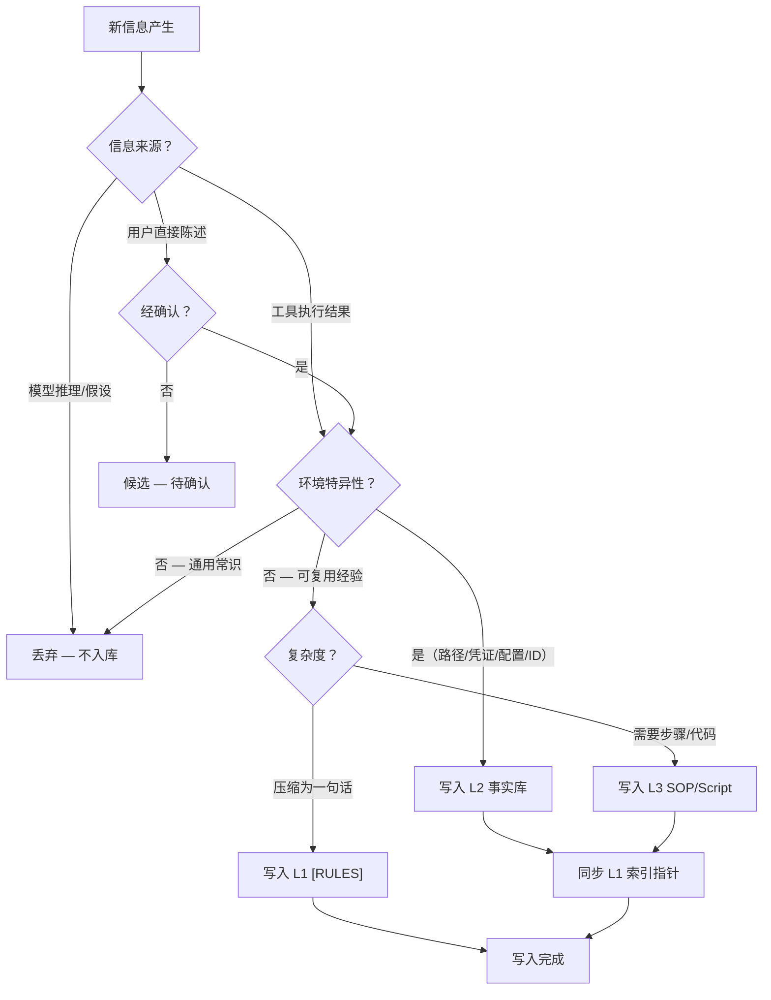

# 记忆写入纪律

> **Evidence Status** — grounded. 来自 GenericAgent memory_management_sop、Hermes skill_manager/memory_tool、Nocturne Memory changeset 审计的实战验证。

**Principle Refs**: BR-02, BDI-01 — 信念从观察构建而非假设推断；记忆随时间退化需有效期管理。

## 核心公理：无行动，不记忆

任何写入持久记忆的信息必须源自工具执行结果。禁止模型推测、未验证假设、未执行计划入库。

这条公理来自 GenericAgent 的 `memory_management_sop.md`（L0 层）：

> 只存行动验证的信息。Agent 不能仅凭推理就往记忆里写"这个 API 的超时是 30 秒"——必须实际调用过、观察到结果后才能记录。

违反此公理的后果是**记忆污染**（Memory Pollution）：一条错误的"事实"进入 L2 后，会通过 L1 索引反复注入后续会话的上下文，导致系统性错误且难以定位根因。

## 写入决策流程



## 五条写入纪律

### 1. 行动验证原则

经行动验证的有效信息是记忆系统的唯一合法输入。

| 合法 | 非法 |
|---|---|
| `code_run` 执行成功，确认端口 8080 可用 | 模型推断"端口 8080 应该可用" |
| `web_scan` 返回页面结构，确认按钮选择器 | 根据文档猜测选择器 |
| 用户明确告知"我偏好简洁回复" | Agent 推断"用户可能偏好简洁" |

GenericAgent 的 `start_long_term_update` 在任务完成时触发记忆结算，prompt 明确要求"提取**事实验证成功且长期有效**的信息"，禁止"临时变量、推理过程、未验证信息、通用常识"。

Hermes 的 `memory_tool` 在写入前执行威胁扫描（`_scan_memory_content`），拦截 prompt injection、role hijack、隐藏字符等恶意内容，从安全层面加固写入纪律。

### 2. 神圣不可删改性

经行动验证的有效信息在记忆重构时不可丢弃。可以压缩迁移（如 L4 会话归档压缩为摘要），但压缩后必须保留足够信息使原始事实可恢复或可定位。

Nocturne Memory 的做法：每次修改生成 changeset 快照，支持人类审查和一键回滚。AI 拥有完整 CRUD 权限，但版本链保证了信息不会静默消失。

MemPalace 的做法：原文保留在 Drawer 层，上层 Closet 只存摘要指针。96.6% 的检索准确率正是建立在"原始存储优于总结"的基础上。

### 3. 禁止易变状态

不存储会随环境变化而失效的瞬时信息：

- 时间戳（"现在是 2025-06-15 14:30"）
- 进程 ID、Session ID
- 绝对路径中的临时目录（`/tmp/xxx`）
- 当前运行的端口号（除非是固定配置）

判断标准：**下次会话启动时这条信息是否仍然成立？** 如果答案不确定，不入库。

### 4. 最小充分指针

上层索引（L1）只留能定位下层内容的最短标识。多一词即冗余。

GenericAgent L1 示例：

```
浏览器自动化: web_scan/web_execute_js直接调用 | 特殊:tmwebdriver_sop(...)
键鼠模拟: ljqCtrl_sop+.py(仅win，禁pyautogui/先activate窗口)
```

每行是一个定位入口：场景关键词 + 最短路径提示。不复述 L2/L3 的完整内容。

L1 有膨胀风险。如果不定期审视和精简，它会从"索引"退化为"又一个全量注入"，失去分层的意义。

### 5. 写入 ROI 公式

不是所有经验证的信息都值得写入。写入决策应量化权衡：

```
ROI = (不放这几个词的犯错概率 × 犯错代价) / 每轮词数成本
```

- **犯错概率高 + 代价大**：必须写入（如 API 鉴权流程中的关键步骤）
- **犯错概率低 + 代价小**：不值得写入（如常见库的标准用法）
- **犯错概率高 + 代价小**：视频情况，可写入 L1 [RULES] 一句话提醒

每写入一个词，都在消耗后续每轮对话的 context window 预算。L1 索引每轮必注入，成本最高；L3 SOP 按需加载，成本较低。

## 实战做法对比

| 系统 | 写入触发 | 验证机制 | 安全防护 |
|---|---|---|---|
| **GenericAgent** | `start_long_term_update` 工具调用 | L0 公理约束 + 分类决策树 | 记忆层修改需 pending 审批 |
| **Hermes** | `memory_tool(add, ...)` 工具调用 | 冻快照：写入立即持久化，下会话才注入系统提示 | 威胁模式扫描 + 零宽字符检测 |
| **Mem0** | 系统自动提取 | LLM 评估重要性和新颖性 → 去重 | Actor-aware 标记区分陈述与推断 |
| **Nocturne** | AI CRUD 工具调用 | Changeset 快照 + 人类审查 | 版本链 + 回滚能力 |

## 反模式

| 反模式 | 后果 | 对策 |
|---|---|---|
| **推测入库** | 错误"事实"反复注入上下文，系统性偏差 | 行动验证原则 |
| **全量转储** | L1 膨胀为全量注入，context 爆炸 | 最小充分指针 + 定期审视 |
| **总结覆盖原文** | 有损摘要丢失关键细节，召回准确率下降 | 原文保留 + 指针导航 |
| **时间戳入库** | 下次会话信息已过期，误导决策 | 禁止易变状态 |
| **Agent 推断标记为用户事实** | 多 Agent 场景下归因混乱 | Actor-aware 标记（Mem0）|
