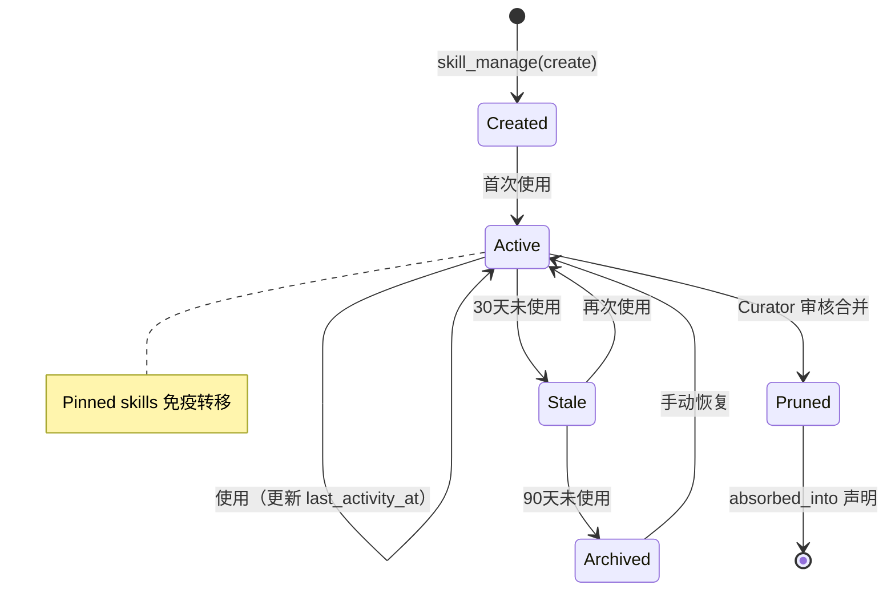

# Memory Engine
>
> **所属域**：2. Cognition & Continuity — 跨会话持续性
>
> **Evidence Status** — grounded. GenericAgent、Hermes、Mem0、Letta、MemPalace、Nocturne Memory 等系统对分层记忆、写入纪律、治理模型的实战验证；本知识库对”记忆是可追溯主张而非现实本身”的统一抽象。

**Principle Refs**: BR-02, BDI-01 — 记忆随时间退化可过期，信念需从观察而非假设构建。

## 定义

Memory Engine 管理跨会话、跨任务的持续性。记忆是产品特性，不是数据库特性——它决定 Agent 在未来任务中的行为质量。

记忆层保存的内容：
- 经行动验证的稳定主张
- 来源指针与 provenance 链
- 用户偏好与约束
- 项目约定与环境事实
- 已验证技能（SOP、脚本、模板）
- 失效与更正历史

记忆条目必须标注来源和有效期，不应视为实时状态。

## 记忆分层与写入流程

```mermaid
graph TD
    subgraph “记忆层级（稳定性递减，容量递增）”
        L0[“L0 Meta Rules<br/>不可变公理”]
        L1[“L1 索引<br/>≤30行导航”]
        L2[“L2 事实库<br/>环境特异性事实”]
        L3[“L3 技能/SOP<br/>可执行程序性记忆”]
        L4[“L4 会话归档<br/>历史轨迹”]
    end

    L0 -->|”约束写入规则”| L1
    L1 -->|”指针定位”| L2
    L1 -->|”指针定位”| L3
    L2 -->|”归档”| L4
    L3 -->|”归档”| L4

    subgraph “写入流程”
        A[“新信息产生”] --> B{“经行动验证？”}
        B -->|”否”| X[“丢弃”]
        B -->|”是”| C[“标注 provenance”]
        C --> D{“分类”}
        D -->|”环境事实”| L2
        D -->|”任务经验”| L3
        D -->|”高频定位”| L1
        D -->|”通用常识”| X
    end
```

## 与 Context / World State 的区别

| 维度 | Context | Memory | World State |
|---|---|---|---|
| 生命周期 | 当前窗口 | 跨会话持久化 | 外部对象的当前或近期状态 |
| 本质 | 当前注意力预算 | 历史主张资产 | 可刷新的状态快照 |
| 主要问题 | context rot | 污染、过期、隐私 | stale、冲突、最终一致性 |
| 使用方式 | 装配 | 检索 / 写入 / 审计 / 失效 | read / refresh / verify |

## 模块接口

**输入**：Agent Kernel 的记忆写入候选、用户的记忆管理操作、eval / skill feedback
**输出**：相关记忆、记忆审计、修订历史
**配置**：记忆分层、写入审批、召回排序、敏感度、失效策略

## 记忆分层

| 层 | 生命周期 | 示例 | 写入策略 |
|---|---|---|---|
| Working | 当前上下文 | 正在处理的任务信息 | 自动（由 Context 管理） |
| Session | 单次会话 | 当前对话历史 | 自动 |
| Project | 项目生命周期 | 构建命令、目录约定、SOP | 半自动 + provenance |
| Long-term | 持久 | 用户偏好、关系、惯例 | 候选 → 确认 → provenance |
| Skill | 持久 | 成功执行路径、脚本、模板 | 提炼 → 验证 → 修订追踪 |

## 关键规则

### No Execution, No Memory — 写入纪律

只有经工具执行验证的信息才能写入持久层。这是记忆系统的根基公理。

**三条禁止**：
- 禁止推理猜测入库——模型推断"端口 8080 应该可用"不等于执行 `code_run` 确认可用
- 禁止未执行计划入库——"计划下一步安装 X"在安装成功前不属于事实
- 禁止未验证假设入库——从文档推测的选择器不等于 `web_scan` 返回的选择器

**各层硬约束**：
- **L1 索引**：≤30 行、<1K tokens。每轮必注入系统提示，是 context window 的常驻开销。超过此阈值，L1 从"索引"退化为"又一个全量注入"
- **L2 事实库**：仅存环境特异性事实（路径/凭证/配置/ID），必须源自成功的工具调用结果
- **L3 SOP/Script**：仅存可复用的任务经验，必须经过至少一次完整执行验证

**写入 ROI 公式**：

```text
ROI = (不放这几个词的犯错概率 × 犯错代价) / 每轮词数成本
```

| 犯错概率 | 犯错代价 | 决策 |
|---|---|---|
| 高 | 大 | 必须写入（如 API 鉴权关键步骤） |
| 高 | 小 | L1 [RULES] 一句话提醒 |
| 低 | 小 | 不写入（如常见库标准用法） |

### 其他规则

- **禁止易变状态**：不存储时间戳、PID、Session ID 等瞬时信息。
- 一次性情绪不写成长期偏好。
- 敏感信息需要显式确认。
- 删除 = 物理删除 + 不再用于推理。
- 记忆条目必须有 provenance、freshness / review policy、confidence。
- Skill 记忆必须支持修订追踪、停用和回滚。

## 专题文件

| 文件 | 主题 | 关键内容 |
|---|---|---|
| [memory-write-discipline.md](memory-write-discipline.md) | 记忆写入纪律 | 行动验证原则、写入 ROI 公式、决策流程 |
| [memory-type-taxonomy.md](memory-type-taxonomy.md) | 记忆类型分类学 | 声明性/程序性/历史性三分法、治理模型对比 |
| [memory-layering-strategies.md](memory-layering-strategies.md) | 记忆分层策略 | 极简指针型/全量存储型/多后端并行型对比、选择决策树 |

## Skill 记忆生命周期

Skill 记忆不是写入即永驻——它有明确的状态机和自动过渡规则。以下状态图来自 Hermes Skill Curator 的实战模型（evidence-status: production-validated, `skill_curator.py`）。



**关键设计**：
- **时间驱动退化**：30 天未使用 → Stale，90 天 → Archived。这是确定性规则，不依赖 LLM 判断
- **Pinned 豁免**：用户标记为 Pinned 的 Skill 不受自动退化影响
- **Pruned 终态**：Curator 审核后合并入更大 Skill 时，原 Skill 通过 `absorbed_into` 声明去向，而非静默删除
- **可逆设计**：Archived 仍可手动恢复为 Active，保留完整回溯路径

## 记忆安全模型

Memory 是 Agent 的持久化攻击面。与 Context（会话级、用完即弃）不同，写入 Memory 的恶意内容会跨会话持续影响 Agent 行为，且随时间推移越来越难被发现。

### 威胁分析

| 威胁 | 攻击路径 | 影响 |
|---|---|---|
| 记忆投毒 | 通过工具输出、不可信数据注入虚假记忆 | Agent 长期基于错误前提决策 |
| 跨用户泄漏 | 多租户环境中记忆隔离不严 | 用户 A 的偏好/数据泄漏给用户 B |
| 记忆篡改 | 攻击者修改已有记忆条目 | 行为静默偏移，审计困难 |
| 持久化后门 | 注入看似合理的"技能"或"偏好" | Agent 在特定触发条件下执行恶意操作 |

### 防护要求

- **跨用户隔离**：Memory 按 tenant/user scope 严格分区，检索时强制附加 scope 过滤，不允许跨 scope 联合查询。
- **投毒检测**：写入前校验 provenance 链——来自 untrusted data lane 的内容不能直接写入持久记忆，须经 trust elevation（用户确认或独立验证）。
- **用户可控性**：用户必须能查看、修正、删除自己的记忆条目。"Agent 记住了什么"不应是黑箱。提供记忆审计视图和一键清除能力。
- **不可变审计日志**：所有记忆写入、修改、删除操作记录到 append-only 审计日志，用于事后溯源。

### 设计检查

```text
[ ] 记忆存储是否按 tenant/user 隔离？检索是否强制 scope 过滤？
[ ] 来自 untrusted data lane 的内容写入记忆前是否经过 trust elevation？
[ ] 用户是否能查看、修正、删除自己的记忆？
[ ] 记忆变更是否有不可变审计日志？
```

## 设计模式

| 模式 | 说明 | 详见 |
|---|---|---|
| Layered Memory | 按生命周期和稳定性分层 | `../../../design-space/patterns/layered-memory.md` |
| Skill Crystallization | 从成功任务中提炼技能 | `../../../design-space/patterns/skill-crystallization.md` |

## 参考实现

| 系统 | 核心特征 | 详见 |
|---|---|---|
| **GenericAgent** | L0-L4 五层、”No Execution, No Memory”、Skill 固化 | `projects/general-agents/generic-agent/memory-layers.md` |
| **Hermes** | Memory/Skill/Session 三分离、冻快照、FTS5 会话搜索 | `projects/general-agents/hermes-agent/memory-skills.md` |
| **Mem0** | Vector+Graph+KV 三层存储、四维 Scope、自动生命周期 | `projects/memory-systems/mem0/architecture.md` |
| **Letta** | OS 内存隐喻（context=RAM, archival=disk）、Agent 自管理 | `projects/memory-systems/letta/architecture.md` |
| **MemPalace** | 原始存储优于总结、Wing/Room 结构导航、96.6% R@5 | `projects/memory-systems/mempalace/` |
| **Nocturne Memory** | 版本链、审计快照、Disclosure Routing | `projects/memory-systems/nocturne-memory/` |
