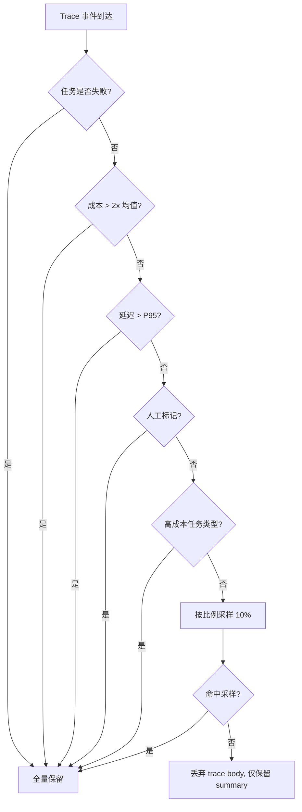

# Observability & Evaluation Integration
>
> **所属域**：8. Reflection & Learning — trace、采样与评估事件
>
> **Evidence Status** — grounded. Claude Code、OpenCode 等系统对 usage、trace、runtime events 的记录；本知识库对”表示、效果、世界状态、配置指纹”全链路 trace 的统一抽象。

**Principle Refs**: MC-02, IS-03 — 自监控需要 trace 支撑以实现早期终止；观测数据本身是地图而非领土，需检测偏差

无法观测的系统无法调试、无法评估、无法改进。没有 Observability，Agent 无法从”能跑”过渡到”可运维”。

## 定义

Observability 模块负责 Trace、日志、监控和评估数据采集。State 用于恢复，Trace 用于分析、评估和事故处理。

## 模块接口

**输入**：所有模块的事件（representation、prompt、tool call、decision、effect、error、checkpoint、approval、config）
**输出**：结构化 trace、成本报告、评估数据、告警信号
**配置**：trace 粒度、采样策略、告警规则、保留期限

## Trace 事件类型

| 事件 | 数据 |
|---|---|
| task_start | task_id, product_type, required_depth |
| representation_built | raw_refs, parser, lossy, confidence, trust_tier |
| prompt_built | prompt_id, purpose, output_contract |
| world_state_read | object_ref, observed_at, ttl, stale |
| tool_call | tool_id, args, result, latency, cost |
| effect_recorded | effect_id, intended_effect, verification_status |
| interaction | interaction_id, type, trigger |
| agent_message | sender, receiver, message_type, authority_scope |
| decision | decision_id, rationale_summary, alternatives |
| milestone_complete | milestone_id, verification_result |
| error | error_type, failure_mode, recovery_action |
| checkpoint | checkpoint_id, state_summary |
| config_fingerprint | model_ref, prompt_ref, tool_schema_refs, policy_refs |
| task_complete | reached_depth, artifacts, evidence |

## 采样策略

全量 trace 在生产环境不可行。以下策略来自多项目实践，核心原则：**失败必留、成功抽样、异常提权**。

### 采样规则

| 类别 | 策略 | 理由 |
|---|---|---|
| 失败 trace | 全量保留（100%） | 失败是最有价值的调试信号，丢弃即丢信息 |
| 成功 trace | 比例采样（默认 10%） | 成功路径有重复性，抽样即可覆盖 |
| 高成本任务 | 全量保留（100%） | 成本异常需要完整 trace 定位浪费点 |
| 成本异常（>2x 均值） | 自动提升至 100% | 异常检测触发，不依赖事先配置 |
| 延迟异常（>P95） | 自动提升至 100% | 延迟尖刺往往隐含 retry storm 或 stale refresh |
| 人工标记 | 全量保留（100%） | 用户/运维主动标记的 session 优先保留 |

### 采样决策流程



> **实践要点**：summary 始终保留（task_id, status, cost, latency, error_type），即使 trace body 被采样丢弃，也能做聚合统计和趋势分析。

## 告警规则

告警是 Observability 到运维动作的桥梁。以下规则覆盖成本、循环、成功率、延迟四个维度。

| 告警类型 | 条件 | 级别 | 动作 |
|---|---|---|---|
| 单任务成本超限 | `task_cost > budget_threshold` | P1 | 立即通知 + 考虑中断任务 |
| 累积成本超限 | `session_cost > session_budget * 0.8` | P2 | 通知 + 预算剩余提示 |
| Doom Loop 检测 | 连续 N 次相同 tool_call 且无状态变化 | P1 | 强制中断 + 告警 |
| 成功率下降 | 滑动窗口（如 100 任务）`success_rate < threshold` | P2 | 通知 + 自动提升采样率 |
| P95 延迟超 SLO | `latency_p95 > slo_target` | P2 | 通知 + 关联 trace 分析 |
| 工具连续失败 | 同一 tool 连续失败 ≥ 3 次 | P1 | 通知 + 标记该 tool 降级 |

> **与 Control Plane 的关系**：Doom Loop 告警和单任务成本超限通常由 Control Plane 的 Stop Gate 执行中断；Observability 负责检测和通知，Control 负责执行。

## 成本与质量追踪

```yaml
cost_report:
  tokens_input: int
  tokens_output: int
  tool_calls: int
  api_calls: int
  wall_time: duration
  human_interruptions: int
  effect_verifications: int
  stale_state_refreshes: int
```

### Trace 事件与成本报告关联

成本不是事后统计，而是实时可观测的管线。以下结构来自 Claude Code 等项目的实践：

**Per-Turn 指标**（每轮 LLM 调用产生）：

| 指标 | 含义 | 来源 |
|---|---|---|
| `tool_count` | 本轮调用的工具数 | tool_call 事件计数 |
| `hook_duration` | 本轮所有 hook 耗时之和 | hook 执行时间累加 |
| `classifier_duration` | 分类器/路由决策耗时 | 路由模块计时 |
| `turn_tokens` | 本轮消耗的 token 数 | API 响应中的 usage 字段 |
| `turn_cost` | 本轮费用 | token 数 × 单价 |

**Per-Session 累积**（整个任务/会话级别）：

| 指标 | 含义 | 用途 |
|---|---|---|
| `total_cost` | 会话总费用 | 预算比对、成本告警 |
| `total_tokens` | 会话总 token 数 | 容量规划 |
| `tool_breakdown` | 按工具分类的调用次数和耗时 | 识别低效工具 |
| `turn_count` | 总轮次 | 检测 Doom Loop |
| `retry_count` | 重试次数 | 识别不稳定路径 |

**成本可观测性管线**：

```text
API 响应 (usage) → 分桶累积 (per-turn → per-session) → 预算比对 → 告警/中断
     ↓                    ↓                                  ↓
  TraceEvent           cost_report                     Control Plane
```

> **实践要点**：成本管线的延迟应低于 1 轮——在下一轮 LLM 调用前，当前轮的成本必须已累积并完成预算比对。否则预算超限只能事后发现。

## 与评估和运维的关系

- Trace 数据是评估的原材料。
- 配置指纹进入 trace，才能做回归定位。
- incident response 依赖 representation / effect / world state 事件回放。

## 入口文档

- `trace-format.md`
- `sampling.md`

## 参考实现

- **Claude Code**：usage tracking 和 cost reporting，见 `projects/coding-agents/claude-code/state-ui-layer.md`
- **OpenCode**：runtime 级别 trace，见 `projects/coding-agents/opencode/orchestration.md`
