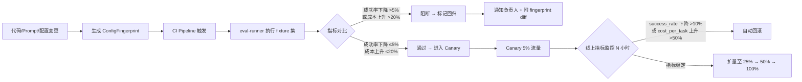
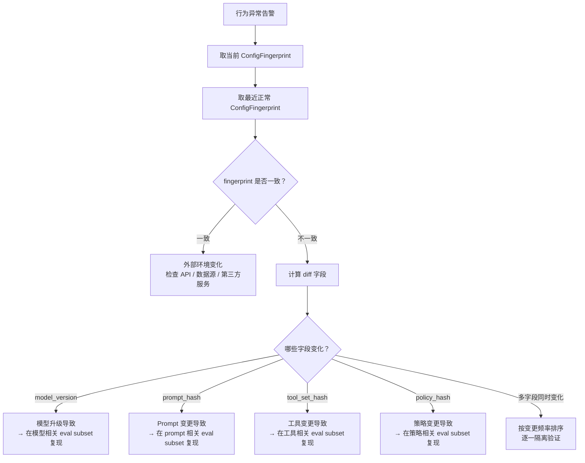
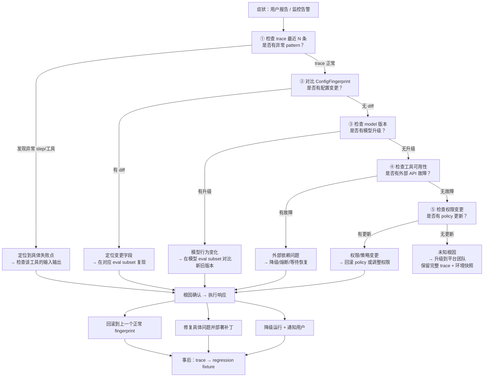

# Operations Plane
>
> **所属域**：7. Lifecycle & Economics — 上线、回归与事故响应
>
> **Evidence Status** — synthesized. 生产 Agent 系统对配置追踪、回归、灰度、回滚、事故响应的需求；本知识库对 Agent 运维面的统一抽象。

**Principle Refs**: MC-02, BR-01 — 运维层监控预算合规与系统健康；自监控异常触发回滚和事故响应

Agent 系统上线后，模型升级、prompt 变更、tool schema 调整都可能导致静默回归。Operations 层使每一次行为变化可追溯、可回滚、可定位。

## 定义

Operations 层负责让 Agent 稳定上线、可回归、可灰度、可回滚、可事故响应。

它不表达 skill 自身的状态标签。它表达的是：一次 Agent 行为由哪些模型、prompt、tool schema、policy、eval suite 和运行配置共同产生。

## Agent CI/CD 实践

> evidence-status: synthesized — 行业最佳实践提炼，涵盖 eval-driven CI、Canary 部署与自动回滚

### Eval-Driven CI

传统软件 CI 跑单元测试；Agent CI 跑 eval suite。核心区别：Agent 的输出是非确定性的，不能用 assertEqual 判断，需要用 eval metric（成功率、质量评分、成本）。



**CI 中的 eval-runner 集成要点**：

1. **fixture 集即回归套件**：每次事故产生的 trace 转化为 fixture，持续积累
2. **基线对比**：每次 CI 运行对比当前 fingerprint 与上一个 passing fingerprint 的 eval 结果
3. **成本预算**：CI eval 本身也消耗 token，需要为 CI 设定独立的 token 预算上限
4. **并行化**：fixture 之间无状态依赖，可并行执行以缩短 CI 时间

### Canary 部署

| 阶段 | 流量比例 | 持续时间 | 退出条件 |
|---|---|---|---|
| Shadow | 0%（并行运行，不产生 effect） | ≥ 2h | 输出差异在可接受范围 |
| Canary | 5% | ≥ 4h | task_success_rate 和 cost_per_task 无显著退化 |
| 扩量 | 25% → 50% | 各 ≥ 2h | 同上 |
| 全量 | 100% | — | Canary 全程无告警 |

### 快速回滚触发条件

以下任一条件满足时，自动回滚到上一个已知正常的 ConfigFingerprint：

- `task_success_rate` 下降 > 10%（相对值）
- `cost_per_task` 上升 > 50%（相对值）
- 出现新的 critical failure category（之前未见过的失败模式）
- P95 延迟上升 > 100%

回滚粒度：fingerprint diff 只涉及 prompt 则只回滚 prompt，只涉及 tool schema 则只回滚 tool 版本——避免不必要的全量回滚。

## 配置追踪与回归检测

Agent 行为异常时，根因可能是模型升级、prompt 变更或工具 schema 调整。三者同时变化时很难靠人判断。

**ConfigFingerprint**：对当前配置组合做确定性指纹。

```yaml
config_fingerprint:
  model_version: string        # 模型 ID + 版本号
  prompt_version: string       # prompt 模板的 content hash
  tool_versions:               # 每个 tool 的 schema hash
    - tool_name: string
      schema_hash: string
  policy_version: string       # 控制策略版本
  eval_suite_version: string   # 评估集版本
  fingerprint: sha256          # 以上全部字段的确定性 hash
```

**回归检测**：对比两个 ConfigFingerprint 下的 eval 结果。当且仅当 fingerprint 不同时才有回归可能；fingerprint 相同但表现变化，说明外部环境（API、数据）变了。

```text
回归判定流程：
1. 行为异常 → 取当前 ConfigFingerprint
2. 与最近一次已知正常的 fingerprint 对比
3. 差异字段即为候选根因（模型变更？prompt 变更？tool 变更？）
4. 在差异字段对应的 eval subset 上 re-run，确认回归项
```

### ConfigFingerprint 实战强化

**Fingerprint 生成时机**：每次部署（包括配置热更新）必须生成新 fingerprint。Fingerprint 构成：

```
fingerprint = sha256(model_version + tool_set_hash + prompt_hash + policy_hash + eval_suite_version)
```

其中 `tool_set_hash = sha256(sorted([tool_name + ":" + schema_hash for each tool]))`，确保工具集顺序无关。

**回归检测的 fingerprint diff**：



**诊断顺序原则**："先看 trace → 对比 fingerprint → 最后才看代码。" 大多数 Agent 事故根因不在代码逻辑，而在配置组合的变化。按这个顺序，80% 的事故可在 5 分钟内定位根因。

## 灰度部署与回滚

Agent 上线不应该是全量切换。灰度策略按风险递增分三阶段：

| 阶段 | 流量 | 退出条件 |
|---|---|---|
| Shadow Mode | 0%（新旧并行，新版不产生 effect） | 新版输出与旧版差异在可接受范围内 |
| Canary | 5-10% 真实流量 | 关键指标（成功率、P95 延迟、单任务成本）无显著退化 |
| 全量 | 100% | Canary 运行 N 小时无告警 |

**回滚触发条件**：任一阶段出现以下情况立即回滚到上一个已知正常的 ConfigFingerprint：

- 成功率下降超过阈值（如 >5%）
- P95 延迟上升超过阈值（如 >30%）
- 单任务平均成本上升超过阈值（如 >20%）
- 出现新的 critical failure category

回滚粒度不是整体回滚——如果 fingerprint diff 只涉及 prompt，只回滚 prompt 版本。

## 事故诊断流程（5 分钟定位根因）

事故发生时，按以下决策树逐步排查，目标是 5 分钟内定位根因。

### 事故响应决策树



### 诊断顺序说明

| 步骤 | 检查内容 | 耗时 | 典型命中率 |
|---|---|---|---|
| 1 | Trace 异常 pattern | 1 min | ~40% |
| 2 | ConfigFingerprint diff | 1 min | ~25% |
| 3 | 模型版本变更 | 30s | ~15% |
| 4 | 外部 API 可用性 | 1 min | ~10% |
| 5 | Policy/权限变更 | 30s | ~5% |
| - | 未知（需升级） | — | ~5% |

关键原则：**先看 trace，再对比 fingerprint，最后才看代码。** 大多数 Agent 事故的根因不在代码，而在配置组合的变化。按此顺序，前两步即可覆盖约 65% 的事故。

### 事故转化为防线

每次事故处理完成后，必须完成两件事：

1. **事故 trace → regression fixture**：将导致事故的输入/上下文/期望输出转化为 eval fixture，加入 CI 回归套件
2. **事故根因 → 监控规则**：如果现有监控未覆盖该故障模式，新增对应的告警规则

## AgentOps 分层：从 DevOps 到 AgentOps

Agent 运维是在已有运维体系上的增量叠加。每一层解决新增的特有问题：

| 层 | 新增关注 | 核心工具/实践 | 与上层的关系 |
|---|---|---|---|
| **DevOps** | 代码构建、测试、部署、基础设施 | CI/CD、IaC、监控 | 基础层，所有后续层的前提 |
| **MLOps** | 数据版本、模型训练、特征管理 | 实验追踪、模型注册、数据管线 | 在 DevOps 上叠加数据和模型生命周期 |
| **FMOps** | Prompt 版本、上下文管理、模型路由 | Prompt registry、token 成本监控、A/B 测试 | 在 MLOps 上叠加大模型特有的非确定性管理 |
| **AgentOps** | 多步行为追踪、工具链回归、效果验证 | ConfigFingerprint、轨迹评估、Canary、回滚 | 在 FMOps 上叠加 Agent 闭环的可观测性和控制 |

跳过底层直接做 AgentOps 会导致失败。没有可靠的 CI/CD（DevOps）就无法做配置追踪；没有 Prompt 版本管理（FMOps）就无法做 Agent 回归检测。

**AgentOps 特有挑战**（DevOps/MLOps/FMOps 不覆盖的）：
- **非确定性多步行为**：同一输入可能产生不同工具调用序列，传统断言式测试失效。
- **工具链联动回归**：模型、prompt、tool schema 三者任一变更都可能导致行为漂移，需要 ConfigFingerprint 联合追踪。
- **效果验证闭环**：Agent 的"成功"意味着外部世界状态确实改变（而非仅返回 200），需要 read-after-write 和 EffectRecord。

## 运维面最少要包含

| 能力 | 为什么需要 |
|---|---|
| Configuration Lineage | 知道当前行为由哪些配置产生 |
| Eval Regression | 变更前后比较，不靠感觉 |
| Canary Rollout | 先在小流量验证，再全量 |
| Shadow Mode | 新策略在旧流量上 dry-run 比较差异 |
| Incident Response | 出问题能定位、暂停、补偿和回滚 |
| SLO / Budget | 成本、时延、成功率、人工打扰次数 |
| Data Retention | trace、memory、artifact、secret 的保留和删除 |

## 入口文档

- `configuration-lineage.md`
- `rollout-and-regression.md`
- `incident-response.md`

## Trellis: Manifest-Driven Migrations

> **Evidence**: Trellis migrations/manifests/*.json

版本升级用声明式 JSON manifest 定义文件操作（rename/delete）和配置追加（sentinel 检查 + 模板提取）。幂等性通过 sentinel 检查保证。参见 `projects/tool-platforms/trellis/manifest-driven-migrations.md`。
