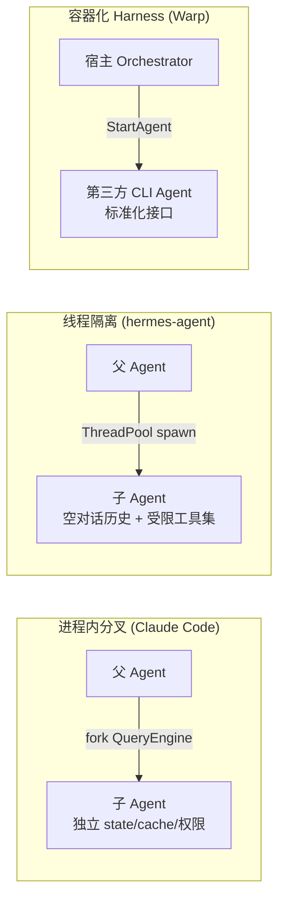

# Orchestration Engine
>
> **所属域**：6. Coordination — 多 Agent 协作与通信
>
> **Evidence Status** — production-validated. 隔离模式已在 Claude Code / hermes-agent / Codex / Warp 落地；其余模块为多项目统一抽象。

**Principle Refs**: BR-01, IS-03 — 多 Agent 协作需要预算在子代理间显式传播；各模型对世界的表征可能彼此偏离

单 Agent 能力有限，复杂任务需要多 Agent 协作完成。Orchestration Engine 是多 Agent 系统的调度中枢，决定谁做什么、如何合并、冲突如何仲裁。

## 定义

Orchestration Engine 管理多 Agent/Worker 协作：子代理派生、Worker 任务分配、多窗口执行、结果合并。

## 模块接口

**输入**：Kernel 的 spawn/delegate 请求
**输出**：Worker 结果（通过 Output Contract 标准化）
**配置**：branch budget、merge strategy、conflict policy

## 何时需要编排

| 场景 | 编排方式 |
|---|---|
| 独立子任务可并行 | Worker 并行 + 合并 |
| 需要独立上下文 | Subagent（隔离上下文） |
| 上下文将满 | 新窗口（multi-window） |
| 跨部门流程 | Worker 流水线 |

## Output Contract

每个 Worker 的输出必须遵守约定格式，否则合并会出问题：

```yaml
worker_output:
  worker_id: string
  task_ref: string
  status: complete | partial | failed
  artifacts: []
  conflicts: []
  decisions_made: []
```

## Merge Strategy

| 策略 | 适用 |
|---|---|
| Append | 各 Worker 输出独立，直接拼接 |
| Priority | 有明确优先级时，高优先覆盖 |
| Conflict Resolution | Worker 输出有冲突，需要解决 |
| Human Review | 冲突严重，交给人类 |

## 设计模式

| 模式 | 详见 |
|---|---|
| Subagent | `../../../design-space/patterns/subagent.md` |
| Worker Orchestration | `../../../design-space/patterns/worker-orchestration.md` |
| Multi-Window | `../../../design-space/patterns/multi-window.md` |

## 参考实现

- **Claude Code**：Fork vs Spawn 子代理模式，见 `projects/coding-agents/claude-code/orchestration-layer.md`
- **Augment**：Worker Agent 编排 + Checkpoint，见 `projects/coding-agents/augment/patterns.md`
- **Codex**：Orchestrator 调度，见 `projects/coding-agents/codex/orchestrator.md`
- **OpenCode**：编排层实现，见 `projects/coding-agents/opencode/orchestration.md`

## 生产验证：子 Agent 隔离模式

> **Evidence Status** — production-validated. 下述三种隔离模式已在 Claude Code、hermes-agent、Codex、Warp 四个项目中落地运行。

子 agent 编排的核心取舍不是"要不要隔离"，而是隔离到哪一层。实践收敛出三种粒度：



**隔离维度对比**

| 维度 | 进程内分叉 | 线程隔离容器 | Harness 容器 |
|---|---|---|---|
| Context | 新实例；可选 `omitClaudeMd` 裁剪 5-15k token | 空对话历史，零父 context 泄漏 | 完全独立进程/沙箱 |
| 工具集 | 继承父集或按 role 裁剪 | 显式阻断危险工具（delegate、memory、execute_code） | 标准化三件套：ReportArtifact / NotifyUser / FinishTask |
| 权限 | toolPermissionContext 独立副本 | 线程局部状态；子 agent 无法触达父 TUI 回调 | 松耦合 + `minimum_plugin_version` 兼容性校验 |
| 并发 | 按 budget 控制 | 默认 max_workers=3 | 按 lifecycle_subscription 事件流控 |
| 深度 | worktree / remote / 默认三档 | 默认 depth=1，可调至 3 | 单层；多层需链式 StartAgent |

**设计启示**

1. **隔离是默认姿态**——子 agent 不应继承父的完整 context；继承越多，状态污染与权限逃逸风险越高。
2. **工具集裁剪是最低成本的安全边界**——hermes-agent 的 DELEGATE_BLOCKED_TOOLS 五行配置即可阻断递归委派和副作用扩散。
3. **Harness 模式将异构 agent 统一为可替换组件**——Warp 证明：只要接口对齐（SendMessageToAgent + 标准 artifact），底层 agent 可独立升级而不触碰编排层。

## 生产验证：多 Harness 协议抽象

> **Evidence Status** — production-validated. Warp 的 Local / Remote Harness 已在生产环境运行；Claude Code 的 Fork 全上下文继承为 production-validated。

子 Agent 隔离解决了"一个编排器管自己的子进程"，但真实场景还需要**用户自带任意兼容 Agent**。Warp 通过 Harness 抽象将"如何启动 Agent"与"如何与 Agent 通信"解耦，形成两种 Harness 模式，加上 Claude Code 的进程内 Fork，共三种隔离路径。

### 三种隔离模式对比

```mermaid
graph TB
  subgraph "A. 进程内分叉 (Claude Code Fork)"
    P[父 Agent 进程] -->|fork()| C1[子 Agent<br/>全 context 继承<br/>共享 Prompt Cache]
    P -->|fork()| C2[子 Agent<br/>独立 tools 白名单]
  end

  subgraph "B. Local Harness (Warp)"
    LH[Local Harness] -->|启动本地 CLI 进程| CLI1[Claude Code CLI]
    LH -->|启动本地 CLI 进程| CLI2[OpenCode CLI]
    LH -.->|stdin/stdout RPC| CLI1
    LH -.->|stdin/stdout RPC| CLI2
  end

  subgraph "C. Remote Harness (Warp Oz)"
    RH[Remote Harness] -->|gRPC/WebSocket| OZ1[云端 Oz 沙箱<br/>Agent 容器]
    RH -->|gRPC/WebSocket| OZ2[云端 Oz 沙箱<br/>Agent 容器]
    OZ1 -.->|事件流| RH
    OZ2 -.->|事件流| RH
  end

  style P fill:#e1f5fe
  style LH fill:#fff3e0
  style RH fill:#fce4ec
```

### Harness 详细对比

| 维度 | 进程内分叉 (Claude Code) | Local Harness (Warp) | Remote Harness (Warp Oz) |
|---|---|---|---|
| 启动方式 | `fork()` 在同进程内创建子 agent | 本地启动独立 CLI 进程（Claude Code / OpenCode 等） | 云端 Oz 环境启动容器化 Agent |
| 通信协议 | 进程内函数调用 + 共享内存 | stdin/stdout RPC（标准化消息格式） | gRPC / WebSocket RPC |
| Agent 可替换性 | 不可替换，绑定 Claude | **可替换**：任意兼容 CLI Agent | **可替换**：任意兼容容器 Agent |
| 隔离级别 | 进程内（工具集 / 权限隔离） | 进程级（独立 PID + 独立 env） | 容器级（独立 OS 环境 + 网络隔离） |
| Context 继承 | 全对话历史 + 系统提示字节一致 | 无继承（通过 SendMessageToAgent 传入任务描述） | 无继承（通过 RPC 传入任务描述） |
| 适用场景 | 需要 Prompt Cache 共享的快速子任务 | 本地开发、需要混用不同 Agent 的场景 | 云端大规模编排、需要强隔离的场景 |

**关键设计洞察**：Harness 模式的核心是"独立 CLI 进程 + RPC 通信"的隔离架构。编排器不需要知道底层 Agent 的实现细节，只需要 Agent 支持标准化的三件套接口（`ReportArtifact` / `NotifyUser` / `FinishTask`）。这允许用户自带任意兼容 Agent，编排层无需改动。

## 生产验证：Fork 全上下文继承

> **Evidence Status** — production-validated. Claude Code 的 Fork 机制已在生产中运行。

Claude Code 的 Fork 是进程内分叉的代表实现，核心特征是**全上下文继承**：

### 继承机制

1. **Prompt Cache 共享**：父 agent 的完整对话历史 + 系统提示（system prompt）字节一致地传入子 agent，触发 Prompt Cache 复用，避免重复计算。
2. **占位符统一**：Fork 启动时在父对话中插入统一占位符 `"Fork started — processing in background"`，保证父对话的连贯性。
3. **递归防护**：检查 messages 中是否存在 `FORK_BOILERPLATE_TAG`，若存在则拒绝再次 Fork，防止无限递归。

### 子 Agent 定义结构

```yaml
sub_agent_definition:
  tools: [Read, Grep, Glob, Bash]   # 白名单——只允许子 agent 使用的工具集
  maxTurns: 15                       # 熔断——超过此轮数强制终止
  memory_scope: inherited | isolated # inherited 共享父 context，isolated 空白起步
  isolation_mode: fork | spawn       # fork 全继承，spawn 空白 + 注入描述
```

**设计权衡**：Fork 以 Prompt Cache 共享换取了更低的启动延迟和 token 成本，但代价是子 agent 继承了父的全部 context，状态污染风险高于 Harness 模式。适合短生命周期、只读性质的子任务。

## 生产验证：Ambient Agent 云托管模式

> **Evidence Status** — production-validated. Warp 的 Ambient Agent 模式已在生产中运行。

Ambient Agent 是 Warp 提出的云端长时 Agent 托管模式，核心是**Task 与 Run 的分离**：

### 核心概念

- **Task**：一个完整的用户意图，可能跨越多个 Run 完成。
- **Run**：Task 的一次执行尝试。一个 Task 失败后可以重新 Run，保留之前 Run 的上下文和产物。
- **SessionJoinLink**：每个 Run 生成一个可分享的链接，用户或审核者可随时加入观看 Agent 的实时执行过程。

### 生命周期

```text
Task 创建
  → Run #1 启动（流式启动、事件报告）
  → Agent 执行中... → SessionJoinLink 可供实时观看
  → Run #1 失败（超时 / 需要人工输入）
  → Run #2 启动（继承 Run #1 的 context + 产物）
  → Run #2 完成 → Task 标记为 complete
```

**设计启示**：Task/Run 分离解决了长时 Agent 的两个核心问题——(1) 单次执行失败不等于任务失败，(2) 用户不需要全程在线，可以异步检查进度。这与传统的"一次请求一次响应"模式根本不同。

## 协议补强

多 Agent 编排至少需要四个对象：

```text
AgentMessage        # Agent 间消息协议
OutputContract      # 子任务交付契约
SharedWorldModel    # 多 Agent 共享外部状态引用
ArbitrationDecision # 冲突仲裁结果
```

新增入口：

- `communication.md`：Agent 间通信协议。
- `shared-world-model.md`：共享世界模型和冲突记录。
- `topology.md`：star / pipeline / hierarchy / mesh / blackboard 拓扑。
- `async-patterns.md`：异步协作、租约、heartbeat、取消传播。
- `governance.md`：多 Agent 治理——责任归因、冲突仲裁、级联失败、治理拓扑。
- `trust-and-attribution.md`：Agent 间信任模型、输出可信度传播、身份联邦。

## 任务优先级与编排

编排器需要决定**执行什么**（优先级）和**如何执行**（编排策略）。当多任务/多目标竞争资源时，编排器需要优先级排序机制。详见 `../../../design-space/patterns/task-prioritization.md`。

优先级排序为编排决策提供输入信号：
- P0 任务 → 立即分配、更高执行深度
- 依赖链上游任务 → 优先执行以解除阻塞
- 预算约束 → 影响模型选择和并行度

动态重排序发生在编排循环内：新事件到达 → 暂停当前（checkpoint）→ 重评优先级 → 可能切换。

## Inter-Agent Communication 标准

A2A (Agent-to-Agent) Protocol 是跨框架 Agent 互操作的开放标准：

| 组件 | 作用 |
|---|---|
| **Agent Card** | Agent 的数字身份——描述能力、技能、通信端点 |
| **tasks/send** | 同步请求-响应 |
| **tasks/sendSubscribe** | 流式更新（SSE） |
| **input-required** | 多轮对话中请求额外信息的状态 |

A2A 与 MCP 互补：A2A 管理 Agent 间的任务和工作流协调，MCP 管理 LLM 与外部资源的标准化接口。

安全机制：mTLS、显式认证、Agent Card 的能力声明用于访问控制。
