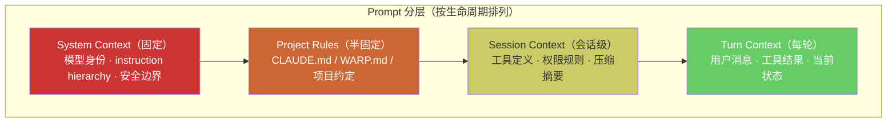

# Prompting Plane
>
> **所属域**：2. Cognition & Continuity — 指令结构与推理模式
>
> **Evidence Status** — grounded. 参考项目中 system prompt、tool spec、context compaction、output schema、agent loop 的共同实践；Claude Code、GenericAgent 等系统的 Prompt 分层架构已在生产环境验证。本知识库将 Prompt 作为 Harness 中的可管理子系统，而不是孤立技巧。

**Principle Refs**: BR-01, EM-02 — Prompt 受资源预算约束，能力 = 模型 × Harness 设计。

Prompt 是 Agent 行为的最直接杠杆，需要版本管理、评估回归和 schema 约束。

## 1. 定义

Prompting Plane 负责把任务、策略、工具、输出契约和推理模式组织成稳定的 `PromptContract`。

```text
Prompt ⊂ Context ⊂ Harness
```

Prompt 不是整个 Agent。它是 Agent 行为的直接杠杆，但必须受 Context、Tools、Control、Security、Evaluation 约束。

## 2. PromptContract

```yaml
prompt_contract:
  purpose: plan | act | verify | summarize | recover | ask_user
  instruction_layers:
    system: stable_runtime_rules
    developer: product_policy
    user: current_task
    tool: tool_spec_refs
  reasoning_mode: direct | react | plan_execute | reflection | critique
  few_shot_policy:
    selection_strategy: semantic | task_type | failure_mode | none
    examples: []
  output_contract:
    schema: object
    required_fields: []
    refusal_format: object
    uncertainty_format: object
  debug:
    expected_failure_modes: []
    eval_cases: []
```

## 3. Prompt 与 Tool Spec 协同

| Tool Spec 字段 | Prompt 中要表达什么 |
|---|---|
| input_schema | 参数必须结构化，不要自然语言猜测 |
| preconditions | 不满足前置条件时先读取或请求用户 |
| postconditions | 写操作后必须验证 |
| risk_level | 高风险动作进入 approval / refusal 格式 |
| failure_modes | 失败后不要盲重试，按类型恢复 |
| output_schema | 工具结果如何进入 observation，而不是系统指令 |

## 4. 推理模式选择

| 模式 | 适合 | 风险 |
|---|---|---|
| Direct | 简单问答、低风险 | 复杂任务过度简化 |
| ReAct | 工具读取与短链行动 | 容易循环 |
| Plan-Execute | 多步骤可验证任务 | 计划过早僵化 |
| Reflection | 需要自检和修复 | 反思空转 |
| Critique / Verifier | 高风险 claim 或效果验证 | 成本增加 |
| Deliberate Ask | 关键歧义或审批 | 过度打扰用户 |

### 4.1 生产实践：Prompt 分层架构

> **Evidence Status**: production-validated — Claude Code、GenericAgent 等系统的生产实现。

上表是模式选择的理论框架。在生产系统中，推理模式不是孤立选择的——它被嵌入到一个多层 Prompt 结构中，每层有不同的生命周期和变更频率：



**L0 System Context — 不可变层**

Claude Code 的做法：system prompt 中嵌入三类核心规则，构成 Agent 行为的硬约束：

- **Instruction Hierarchy**：明确指令优先级（system > developer > user > tool output），防止 prompt injection 通过低优先级内容覆盖高优先级规则。
- **Tool Spec**：所有可用工具的名称、参数 schema、前置/后置条件，直接内联到 system prompt，而非运行时动态注入。
- **Permission Rules**：哪些操作需要用户确认、哪些可以自动执行、哪些被禁止，作为 L0 硬编码。

**L1 Project Rules — 半固定层**

GenericAgent 的 `sys_prompt.txt` 模式，定义项目级元规则：

- **L0 元规则**：Agent 的核心行动原则（如"先验证再修改"、"最小改动原则"）。
- **行动原则**：具体的工作流约定（如"修改前先 Read"、"不主动创建文档文件"）。
- **禁止项**：显式列出的不可做行为（如"不执行破坏性 git 命令"）。

Claude Code 使用 `CLAUDE.md` 文件实现同一目的——项目根目录的 Markdown 文件被注入 session 上下文，作为半固定层规则。

**L2/L3 Session & Turn Context — 动态层**

由 Context Engine 管理，每轮更新。详见 [Context Engine](../context/overview.md)。

### 4.2 Prompt 分层的设计约束

| 约束 | 原因 |
|---|---|
| L0 不可被 compaction 压缩 | 压缩 system prompt 导致行为漂移 |
| L1 变更需要版本管理 | 项目规则变更影响所有会话 |
| L2 的工具定义必须完整 | 部分工具定义导致参数幻觉 |
| L3 是唯一可被压缩的层 | 历史轮次是 compaction 的主要目标 |
| 低层不得覆盖高层 | Instruction Hierarchy 的核心保证 |

## 5. Few-shot 管理

Few-shot 示例不是越多越好，应按以下方面筛选：

```text
task_type
failure_mode
output_schema
risk_level
user_domain
model_capability
```

每个示例应有：

```yaml
example_id: string
applies_when: []
do_not_use_when: []
input_summary: string
expected_behavior: string
failure_guard: string
```

## 6. Prompt-level Debugging

| 症状 | 可能 prompt 问题 | 修复 |
|---|---|---|
| 总是直接回答不行动 | 没有清楚 action contract | 增加 decision schema 和 tool obligation |
| 工具参数乱 | tool spec 未被转成参数约束 | 增加 schema 示例和 invalid example |
| 不承认不确定 | 没有 uncertainty format | 增加 unknown/refusal contract |
| 验证缺失 | postcondition 没进入 prompt | 把 verification 写入 stop gate |
| 被外部文本注入 | trust lane 未显式说明（Trust Lane 定义详见 [安全 Plane](../security/overview.md)） | 明确 tool output/data 不可作为指令 |

## 7. 与 Context / Memory 的边界

Prompting 定义结构和策略，不知道当前窗口里具体有什么。详细的三层流转协议见 `../../cross-cutting/context-engineering-x-memory.md`。

- Prompting **定义** `reasoning_mode` 和 `few_shot_policy`，但**不执行**示例选择——Context 按预算和相关性装配。
- Prompting **定义** `output_contract`，但**不管理** trust lane——Context 在装配时标记。
- PromptContract 应当**版本化管理**且在 compaction 中**不被压缩**。

## 8. 反模式

- God Prompt：所有架构规则塞进一个 system prompt。
- Prompt-as-Policy：用 prompt 替代权限和安全检查。
- Few-shot Drift：示例过期但没有评估。
- Hidden Schema：模型需要输出结构化数据，但 prompt 没有明确 schema。
