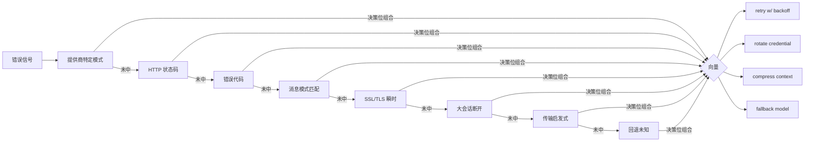
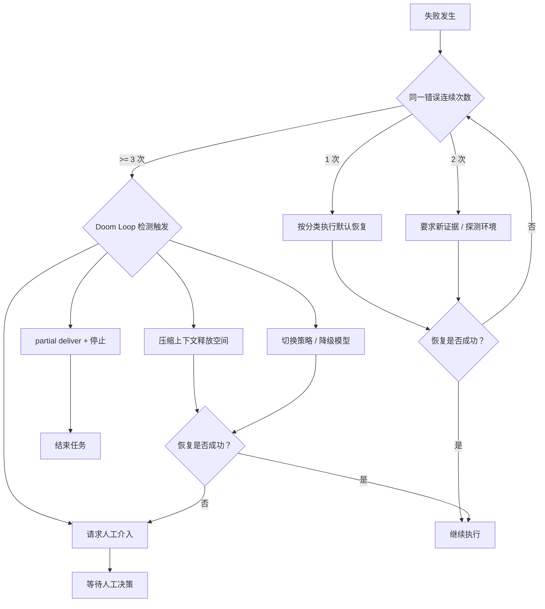
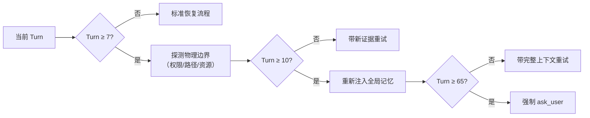

# Error & Recovery Plane
>
> **所属域**：7. Lifecycle & Economics — 错误恢复与补偿
>
> **Evidence Status** — mixed (synthesized + production-validated). 工具超时、LLM 输出不可解析、外部状态过期、写动作部分成功、长任务中断是 coding / workflow / browser / ops / research agent 共有的失败模式；本文件将分散在 execution、effects、state、operations 中的恢复逻辑抽象为横切 plane。多维恢复决策小节已达 production-validated。

**Principle Refs**: BDI-03, MC-02 — 意图跨故障持续存在且可修正；自监控检测失败并触发恢复

## 定义

Recovery Plane 管理 Agent 在失败时如何分类、止损、恢复、补偿和交付部分结果。失败是一等运行时对象——每次失败记录原因、影响范围、是否需要新证据、恢复策略和停止条件。

```text
Failure observed
  → classify failure
  → assess risk and reversibility
  → choose recovery action
  → execute recovery under budget and policy
  → verify recovered state or surface partial delivery
  → update trace / state / eval fixture
```

## FailureRecord Schema

```yaml
failure_record:
  failure_id: string
  task_id: string
  phase: observe | represent | decide | act | verify | update | deliver
  category: parse_error | tool_error | timeout | stale_world_state | policy_block | effect_failed | partial_effect | conflict | user_interruption | budget_exhausted | unknown
  severity: low | medium | high | critical
  evidence_refs: []
  affected_objects: []
  reversibility: reversible | compensable | irreversible | unknown
  requires_new_evidence: bool
  recovery_action: retry | refresh | replan | compensate | rollback | ask_user | escalate | partial_deliver | stop
  retry_budget_remaining: integer
  compensation_refs: []
  status: open | recovering | recovered | escalated | stopped
```

## 错误分类与默认恢复

| 失败类型 | 典型表现 | 默认恢复 | 禁止做法 |
|---|---|---|---|
| parse_error | 模型输出不是目标 schema | 用结构化修复 prompt 重试一次 | 无限“请重新输出 JSON” |
| tool_error | 工具返回错误或异常 | 检查参数、前置条件、权限，再重试 | 不读错误详情直接换工具 |
| timeout | 工具或流程超时 | 退避、缩小范围、分片执行 | 原样快速重试导致放大负载 |
| stale_world_state | 快照过期或写前状态改变 | refresh world state，再 replan | 用旧快照继续写 |
| policy_block | 控制层拒绝动作 | 解释原因、降级为提案或请求审批 | 绕过 policy |
| effect_failed | 工具执行成功但后置条件不成立 | readback 诊断，补偿或 replan | 把 tool success 当作 done |
| partial_effect | 多步写入只成功一部分 | 进入 compensation stack | 再执行后续步骤掩盖问题 |
| conflict | 多 Agent / 多来源结果冲突 | 保留冲突，仲裁或请人确认 | 静默合并成单一结论 |
| budget_exhausted | token、费用、时间或工具次数耗尽 | partial deliver 或请求预算升级 | 继续消耗隐藏预算 |

## Recovery Budget

恢复必须有预算，否则系统会从“会自修复”退化成“会死循环”。

```yaml
recovery_budget:
  max_total_retries: 3
  max_same_action_retries: 1
  require_new_evidence_for_retry: true
  max_compensation_steps: 5
  escalation_after: high_severity | budget_exhausted | irreversible_risk
  partial_delivery_allowed: true
```

## 生产验证：多维恢复决策

> Evidence Status: **production-validated** — hermes-agent、Codex、Claude Code 三个项目独立收敛到同一模式。

传统恢复是 retry / fallback / abort 三叉树——每次只走一条分支。生产系统的实际做法是把恢复拆成**多个正交决策位**，同一错误可同时触发多个动作。

hermes-agent 的 `ClassifiedError` 包含 4 个独立布尔位：`should_retry`、`should_rotate_credential`（402 计费耗尽）、`should_compress`（prompt-too-long）、`should_fallback`（持续 rate limit 切换模型）。一次 402 可以同时触发 rotate + retry。

**分类管道**按 8 层优先级逐级匹配，首中即停：



Claude Code 对特定错误类型有精确映射：prompt-too-long → 反应式压缩（token gap 跳过）；media-size → 删除图像/PDF 后重试；rate-limit → 延迟重试或降级模型。每种类型有 max retry 上限（bounded failure）。Codex 则简化为三类：`Fatal`（中止）、`Retriable`（指数退避）、`UserInput`（交互修正）。

| 维度 | 三叉树模型 | 多维向量模型 |
|---|---|---|
| 决策结构 | 互斥分支，每次只选一条 | 正交位，可组合触发 |
| 分类精度 | 粗粒度（成功/可重试/致命） | 多层管道，首中即停 |
| 恢复动作 | 单一动作 | 多动作并发（compress + rotate） |
| 预算控制 | 全局 retry 计数 | 每类错误独立 max retry |

将上表中的 `recovery_action` 枚举视为基础语义，决策位组合是其上的**生产扩展**——两者互补而非替代。

## 连续失败熔断（Consecutive Failure Circuit Breaker）

> Evidence Status: **production-validated** — Claude Code BQ 遥测数据验证。

Recovery Budget 管的是总量上限，但还有一种更具体的浪费模式：**连续失败不停重试**。Claude Code 遥测数据表明 1,279 个会话出现 50+ 连续失败，每天浪费约 250K 次 API 调用。

**模式**：维护 `consecutive_failures` 计数器，每次失败 +1，任何一次成功立即重置为 0。计数器达到阈值时触发熔断——不再自动重试，而是升级或停止。

```yaml
consecutive_failure_breaker:
  counter: consecutive_failures    # 成功即重置为 0
  threshold: 3                     # 连续 3 次失败触发
  on_trigger: escalate | stop      # 不再自动重试
  evidence: "Claude Code BQ: 1,279 sessions × 50+ consecutive failures = ~250K wasted API calls/day"
```

与 Recovery Budget 的 `max_total_retries` 互补：Budget 管总量，连续失败熔断管**模式**——即使总量未耗尽，连续失败也意味着当前策略无效，应切换而非继续。

## 循环检测与退出（Doom Loop Detection）

> Evidence Status: **production-validated** — OpenCode、GenericAgent、Claude Code、Hermes 四个项目独立实现了循环检测机制。

Recovery Budget 定义了重试上限，但仅靠计数器不够——Agent 可能在不同 action 之间来回切换而不触发同一 action 的计数上限，形成 **Doom Loop**（恢复死循环）。生产系统对此有明确的检测和退出策略：

- **OpenCode**：`DOOM_LOOP_THRESHOLD = 3`，连续出现相同错误 >= 3 次时触发 compact（压缩上下文释放空间）或直接停止执行
- **GenericAgent**：渐进式恢复——1 次失败 → 理解错误原因，2 次 → 探测环境，3 次 → 换方案或请求人工介入
- **Claude Code**：`consecutive_failures` 计数器 + 工具循环检测，识别连续重试相同操作的模式并切断循环
- **Hermes**：`IterationBudget` 耗尽时触发强制收敛，不允许无限延长恢复链

### 恢复策略的项目对照

| 恢复阶段 | Claude Code | Codex | OpenCode | GenericAgent | Hermes |
|---|---|---|---|---|---|
| 首次失败 | PostToolUseFailure hook | 沙箱内重试 | retry 状态 | 理解错误原因 | jittered_backoff |
| 重复失败 | 拒绝追踪 | 用户确认 → 无沙箱重试 | Doom Loop 检测 | 探测环境 | 凭证轮换 |
| 持续失败 | abort + 状态保存 | Guardian 拒绝 | compact 或停止 | 换方案 / 求人工 | 模型降级 |

### 恢复决策流程



关键规则：**恢复动作本身消耗 recovery budget——如果恢复动作也失败，不得用另一轮恢复来恢复恢复。** Doom Loop 检测是 Recovery Budget 的运行时补充，一个管静态上限，一个管动态模式。

## 恢复动作的验证

恢复动作本身也必须被验证：

| 恢复动作 | 验证方式 |
|---|---|
| retry | 新 observation 与旧失败不同，或错误已消失 |
| refresh | WorldStateSnapshot 的 observed_at / freshness 已更新 |
| replan | 计划引用新证据，且旧失败原因被处理 |
| compensate | 外部对象回到可接受状态，或补偿状态已记录 |
| rollback | rollback 后 health/test/readback 通过 |
| ask_user | InteractionEvent 记录用户选择和授权范围 |
| partial_deliver | 未完成项、风险和阻塞原因明确列出 |

## 与其他 Plane 的关系

| Plane | Recovery 读取 | Recovery 写入 |
|---|---|---|
| Execution | ExecutionResult、stderr、timeout | retry / cancel / backoff |
| Effects | EffectRecord、postcondition | compensation / rollback result |
| World State | Snapshot freshness、conflict | refresh request |
| State | checkpoint、open step | FailureRecord、replan reason |
| Control | policy verdict、approval requirement | escalation request |
| Interaction | user interruption、correction | clarification / approval event |
| Observability | trace, spans | recovery span、failure label |
| Evaluation | failure taxonomy | regression fixture candidate |

## 评审清单

```text
[ ] 每类工具错误是否有分类，而不是只有 "failed"？
[ ] retry 是否要求新证据或参数变化？
[ ] 部分效果是否有 compensation stack？
[ ] 不可验证或不可逆动作是否会请求人工确认？
[ ] budget exhausted 时是否能诚实部分交付？
[ ] 失败 trace 是否能转化成 regression fixture？
```

## Checkpoint 恢复协议

从 checkpoint 恢复时，Task State 和 World State 的处理策略不同：

| 对象 | 恢复策略 | 原因 |
|---|---|---|
| Task State（plan、completed_steps、open_steps） | **保留** checkpoint 中的值 | 任务进度是 Agent 自己的记录，不会被外部改变 |
| World State（world_refs） | **强制刷新**全部引用 | 外部对象在 Agent 中断期间可能已变化 |
| Pending Effects | **逐一重验证** | 中断前的待验证效果可能已过期或已被确认 |
| Environment State（workspace、git status） | **校验**后决定是否重建 | 执行环境可能被其他进程修改 |
| Artifacts（diff、文件、报告） | **保留**并校验存在性 | 产物一般不会被外部删除，但需确认 |

```text
恢复流程：
1. Load checkpoint → 恢复 Task State
2. 刷新全部 world_refs → 对比 checkpoint 中的旧快照
3. 如有 world_ref 不一致 → 标记受影响的 open_steps 为 needs_revalidation
4. 重验证 pending_effects → 更新 EffectRecord 状态
5. 校验 environment → 不一致则修复或请求人工
6. 从第一个 safe step 继续
```

关键规则：**不得跳过 world_refs 刷新直接继续执行。** checkpoint 是时间胶囊，恢复时必须解冻。详见 `../../cross-cutting/state-x-world-state.md`。

FailureRecord 由 Recovery Plane 生成并记录，由 [Learning Plane](../../learning/incident-driven-evolution.md) 消费，用于驱动 Harness 演化和 eval fixture 扩张。

### 递进式失败诊断（Progressive Failure Diagnosis）

> Evidence Status: **grounded** — GenericAgent 的 turn-based 恢复策略代码级验证。

长会话中失败的含义随 turn 数递进变化。GenericAgent 的实现揭示了一个关键洞察：**早期失败通常是参数/工具问题，中期失败是上下文丢失，晚期失败是任务本身超出能力边界**。

| Turn 阈值 | 诊断假设 | 恢复动作 |
|---|---|---|
| Turn 7 | 工具/参数/环境边界 | 探测物理边界（权限、路径、资源限制） |
| Turn 10 | 上下文窗口遗忘关键信息 | 重新注入全局记忆（system prompt / task context） |
| Turn 65 | 任务超出自动化能力边界 | 强制 `ask_user`，不允许继续自主重试 |



此模式与连续失败熔断互补：熔断管**短期连续失败**，递进诊断管**长期累积失败**。两者共同覆盖失败的时间维度。

相关文件：`../../lifecycle.md`、`../effects/overview.md`、`../execution/overview.md`、`../operations/incident-response.md`、`../../../evaluation/failure-taxonomy.md`、`../../../design-space/anti-patterns/infinite-retry.md`。
