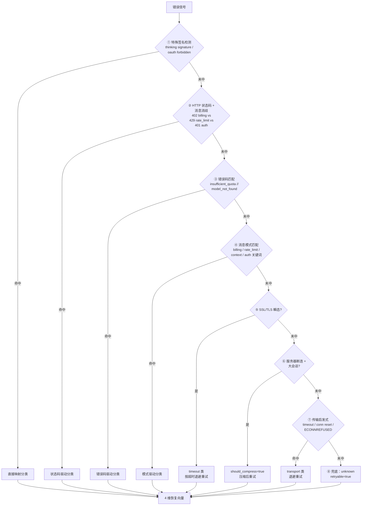
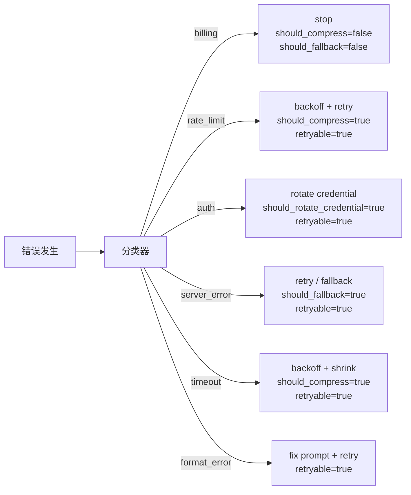

# Recovery Decision Tree

> **所属域**：7. Lifecycle & Economics — 错误恢复与补偿
>
> **Evidence Status** — grounded. 五层防御架构综合 Cordum 熔断器生产实现、Temporal Saga 补偿、FAILURE.md 协议（多个 Agent 框架的事故复盘）；决策矩阵从生产事故模式归纳而来。

**Principle Refs**: MC-02 — 自监控检测失败并触发恢复；BDI-03 — 意图跨故障持续存在且可修正

> 本文定义恢复的理论框架和决策树。§4.2 错误分类管线以 Hermes 的生产实现为基础；跨项目的错误处理对比见 [synthesis/error-recovery-comparison.md](../../../synthesis/error-recovery-comparison.md)。

## 1. 问题陈述

Agent 系统的失败不是"出错 → 重试"这么简单。一次工具调用失败可能需要重试，也可能需要补偿已完成的步骤，也可能需要升级给人类，也可能需要立即停止。选择错误的恢复策略比不恢复更危险——在不可逆操作上重试、在级联故障中继续执行、在预算耗尽后静默消耗隐藏资源。

Recovery Decision Tree 提供一个结构化的决策框架：从失败分类开始，经过可逆性评估和资源预算检查，最终映射到具体的恢复动作。

## 2. 五层防御架构

恢复是层层递进的防御体系。每一层都是独立的防线，内层失败时由外层接管。

```text
第 1 层：Circuit Breaker（熔断器）
  ↓ 未触发
第 2 层：Validation Gate（验证门）
  ↓ 验证通过
第 3 层：Idempotent Saga（幂等补偿）
  ↓ 补偿不足
第 4 层：Budget Guardrail（预算护栏）
  ↓ 预算允许
第 5 层：Human Escalation（人工升级）
```

| 层 | 防御对象 | 触发条件 | 动作 |
|---|---|---|---|
| **Circuit Breaker** | 重复失败的依赖 | 错误率超过阈值 | 快速失败，不再尝试 |
| **Validation Gate** | 不合规的动作计划 | 前置条件不满足 | 拒绝执行，返回原因 |
| **Idempotent Saga** | 部分完成的多步操作 | 中间步骤失败 | 反向补偿已完成步骤 |
| **Budget Guardrail** | 资源超支 | 预算不足以完成恢复 | 降级或部分交付 |
| **Human Escalation** | 超出自动化能力 | 不可逆 + 高风险 + 无确定策略 | 暂停并请求人工决策 |

## 3. Circuit Breaker 详细参数

熔断器是第一道防线：当某个依赖持续失败时，快速切断调用链，避免重试风暴。

### 3.1 状态机

```text
CLOSED ──[failure_count >= 3 within 60s]──→ OPEN
  ↑                                           │
  │                                     [TTL 30s 到期]
  │                                           ↓
  └───[2 consecutive successes]───── HALF-OPEN
                                        │
                                  [any failure]
                                        ↓
                                      OPEN
```

### 3.2 参数配置

```yaml
circuit_breaker:
  failure_threshold: 3          # 60s 内失败 3 次触发
  window_seconds: 60            # 统计窗口
  open_ttl_seconds: 30          # OPEN 状态持续时间
  half_open_max_requests: 2     # HALF-OPEN 时允许的探测请求数
  success_threshold: 2          # HALF-OPEN 到 CLOSED 需要连续成功次数
  state_backend: redis          # 跨副本共享状态
  per_dependency: true          # 每个依赖独立熔断器
```

### 3.3 跨副本共享状态

当 Agent 服务多副本部署时，熔断器状态需要跨副本共享，否则每个副本独立计数，整体失败率被低估。

```text
副本 A: 失败 1 次
副本 B: 失败 1 次
副本 C: 失败 1 次
─────────────────
各自计数：均未触发熔断（< 3）
共享计数：总计 3 次，触发熔断 ✓
```

**实现**：Redis INCR + TTL，或 Consul KV 存储熔断状态。

## 4. 四种失败模式

不同的失败模式需要不同的响应级别和恢复策略。

| 失败模式 | 严重级别 | 表现 | 核心危险 |
|---|---|---|---|
| **Graceful Degradation** | WARNING | 非关键功能不可用，核心功能正常 | 无（已设计的降级路径） |
| **Partial Failure** | ERROR | 多步操作部分完成 | 不一致状态 |
| **Cascading Failure** | CRITICAL | 一个组件失败引发连锁反应 | 系统级不可用 |
| **Silent Failure** | DANGEROUS | 工具返回成功但实际未生效 | 错误决策基于虚假成功 |

### 4.1 Silent Failure 特别说明

Silent Failure 是最危险的失败模式：系统认为操作成功，但外部世界没有改变。典型场景：

- 工具调用返回 HTTP 200，但实际写入被下游服务丢弃。
- 文件写入成功，但写入了错误的路径。
- API 调用返回旧的缓存结果，Agent 将其视为最新状态。

**防御**：所有有副作用的操作必须有 readback 验证——写入后读取，确认外部状态已改变。参见 [Effects Plane](../effects/overview.md)。

## 4.2 错误分类管线

错误处理的第一步是**分类**。不同错误类型对应完全不同的恢复路径：billing 错误重试毫无意义，rate_limit 需要退避等待，auth 失效需要轮换凭证。在进入五层防御体系之前，错误分类管线决定从哪一层开始恢复。

### 8 步分类管道

> Evidence Status: **grounded** — Hermes Agent `classify_error()` 代码级验证。

分类器是 8 层优先级管道，**首中即停**。越靠前的层匹配精度越高、误判代价越低：



每层只负责一种信号源，避免"用 HTTP 状态码猜消息含义"的误分类。例如 402 既可能是 billing（余额不足）也可能是 rate_limit（配额用尽），第 ② 层需结合消息体消歧。

### 分类优先级

Hermes Agent 的错误分类器按严重性和不可恢复程度排列优先级，优先匹配的分类直接决定恢复策略：

```text
优先级（高→低）:
  1. billing       — 账户级问题，无法通过技术手段恢复
  2. rate_limit    — 暂时性，退避后可恢复
  3. auth          — 凭证失效，需要轮换
  4. server_error  — 上游故障，可重试或降级
  5. timeout       — 网络/负载问题，缩小范围后可重试
  6. format_error  — 响应解析失败，修复 prompt 后可重试
```

### 分类 → 恢复策略映射



### 每种分类的恢复属性

| 分类 | retryable | should_compress | should_rotate_credential | should_fallback | 进入防御层 |
|---|---|---|---|---|---|
| billing | false | false | false | false | 第 5 层（人工升级） |
| rate_limit | true | true | false | false | 第 1 层（熔断器） |
| auth | true | false | true | false | 第 2 层（验证门） |
| server_error | true | false | false | true | 第 1 层（熔断器） |
| timeout | true | true | false | false | 第 1 层（熔断器） |
| format_error | true | false | false | false | 第 2 层（验证门） |

### 4 维恢复向量 vs 传统三叉树

> Evidence Status: **grounded** — Hermes `ClassifiedError` 代码级验证。

传统恢复决策是一个 `should_retry` 布尔值，只能选 retry / fallback / abort 其中之一。上表中的 4 列布尔位构成**恢复向量**，允许并行组合：

| 维度 | 三叉树模型 | 4 维向量模型 |
|---|---|---|
| 决策结构 | 互斥分支，每次只选一条 | 正交位，可组合触发 |
| 典型组合 | retry OR fallback | compress AND rotate AND retry |
| 预算控制 | 全局 retry 计数 | 每类错误独立 max retry |

**实例**：一次 402 + prompt-too-long 错误可以同时触发 `should_compress=true`（压缩上下文）+ `should_rotate_credential=true`（切换 API key）+ `retryable=true`（压缩 + 轮换后重试）。传统模型只能依次尝试。

### 与五层防御的关系

错误分类管线是五层防御体系的**前置步骤**，决定错误从哪一层开始处理：

- **billing** 直接跳到第 5 层（人工升级），中间层无能为力
- **rate_limit / server_error / timeout** 从第 1 层（熔断器）开始，逐层升级
- **auth** 从第 2 层（验证门）开始，凭证轮换后重试
- **format_error** 从第 2 层开始，修复 prompt 后重新验证

分类器的判断越准确，恢复路径越短。错误的分类会导致在无效的层级上浪费重试预算。

> **来源**：Hermes Agent 错误处理实现（`run_agent.py`）。参见 `../../../projects/general-agents/hermes-agent/agent-loop.md`。

## 5. 决策矩阵

当失败发生时，恢复策略由三个维度决定：失败类别、可逆性和资源预算。

### 5.1 矩阵

| 失败类别 | 可逆性 | 预算充足 | 预算不足 |
|---|---|---|---|
| **parse_error** | reversible | retry（结构化修复 prompt） | partial_deliver |
| **tool_error** | reversible | retry（检查前置条件后） | partial_deliver |
| **tool_error** | irreversible | escalate（人工确认） | stop |
| **timeout** | reversible | retry（退避 + 缩小范围） | partial_deliver |
| **stale_world_state** | compensable | refresh → replan | partial_deliver + 警告 |
| **policy_block** | — | degrade（降级为提案） | stop + 解释原因 |
| **effect_failed** | compensable | compensate → retry | compensate → stop |
| **effect_failed** | irreversible | escalate | escalate（无论预算） |
| **partial_effect** | compensable | compensate（反向补偿） | compensate → partial_deliver |
| **partial_effect** | irreversible | escalate + 记录不一致 | escalate（无论预算） |
| **cascading** | — | circuit_break → isolate → recover | circuit_break → stop |
| **silent_failure** | unknown | readback → reclassify | readback → escalate |
| **budget_exhausted** | — | N/A | partial_deliver + 预算报告 |

### 5.2 决策流程伪代码

```text
on_failure(failure_record):
  // 第 1 层：熔断检查
  if circuit_breaker.is_open(failure_record.dependency):
    return fast_fail(reason="circuit_open")

  // 第 2 层：验证门
  if not validation_gate.check(failure_record):
    return reject(reason=validation_gate.reason)

  // 分类和评估
  category = classify(failure_record)
  reversibility = assess_reversibility(failure_record)
  budget = check_remaining_budget()

  // 第 3 层：补偿
  if category in [effect_failed, partial_effect] and reversibility == compensable:
    result = saga.compensate(failure_record.compensation_refs)
    if result.success and budget.sufficient:
      return retry_after_compensation()
    else:
      return partial_deliver(result)

  // 第 4 层：预算护栏
  if not budget.sufficient:
    if reversibility == irreversible:
      return escalate(reason="irreversible + no budget")
    return partial_deliver(completed_steps)

  // 第 5 层：人工升级
  if reversibility == irreversible or category == cascading:
    return escalate(failure_record)

  // 默认：带新证据重试
  if retry_budget > 0 and has_new_evidence:
    return retry(with_new_evidence=true)
  return partial_deliver(completed_steps)
```

### 5.3 连续失败熔断

> Evidence Status: **production-validated** — Claude Code BQ 遥测数据。

决策矩阵假设每次失败独立评估。但在实际运行中，**连续** N 次失败比分散的 N 次失败危险得多——它意味着当前策略整体失效。Claude Code 遥测发现 1,279 个会话累积 50+ 连续失败，每天浪费约 250K API 调用。

在 `on_failure` 入口增加一层前置检查：

```text
on_failure(failure_record):
  consecutive_failures += 1
  if consecutive_failures >= 3:
    return escalate(reason="consecutive_failure_breaker")
  // ... 进入正常决策矩阵
on_success():
  consecutive_failures = 0   // 任何成功立即重置
```

### 5.4 递进式失败诊断

> Evidence Status: **grounded** — GenericAgent turn-based 恢复策略。

长会话中决策矩阵需叠加**时间维度**——同样的 tool_error，在 Turn 3 和 Turn 50 意味着不同的事情：

| Turn 阈值 | 叠加诊断 | 在矩阵中的影响 |
|---|---|---|
| ≥ 7 | 探测物理边界（权限、路径、资源限制） | 将 `requires_new_evidence` 强制设为 true |
| ≥ 10 | 重新注入全局记忆 | 在 retry 前追加 context refresh 步骤 |
| ≥ 65 | 强制 ask_user | 覆盖矩阵结果，无论分类和可逆性 |

## 6. Fail-Closed vs Fail-Open

Agent 系统的默认安全姿态应该是 Fail-Closed：不确定时停止，而非继续。

| 模式 | 行为 | 适用场景 | 风险 |
|---|---|---|---|
| **Fail-Closed**（默认） | 不确定时拒绝执行 | 有副作用的操作、安全敏感场景 | 可能过度保守 |
| **Fail-Open** | 不确定时继续执行 | 只读操作、有审计旁路信号 | 可能执行不应执行的操作 |

### 6.1 Fail-Open 的条件

Fail-Open 只在以下条件**全部满足**时允许：

```yaml
fail_open_conditions:
  - operation_type: read_only           # 无副作用
  - audit_bypass_signal: present        # 有明确的旁路信号
  - rollback_possible: true             # 即使出错也可回滚
  - human_notified: true                # 人工已知晓
```

缺少任一条件，回退到 Fail-Closed。

## 7. 恢复指标

| 指标 | 定义 | 目标 |
|---|---|---|
| MTTR（Mean Time to Recovery） | 从失败检测到恢复完成 | < 30s（自动恢复） |
| 恢复成功率 | 自动恢复成功的比例 | > 80% |
| 误升级率 | 不需要人工但升级了的比例 | < 10% |
| 补偿完整度 | 补偿后状态一致的比例 | > 95% |
| Silent Failure 检出率 | readback 发现的静默失败比例 | > 90% |

## 8. 评审清单

```text
[ ] 是否所有失败都经过分类，而不是统一"重试"？
[ ] 分类管道是否覆盖 8 层信号源（签名/状态码/错误码/模式/SSL/断连/传输/兜底）？
[ ] 恢复决策是否使用多维向量（retryable/compress/rotate/fallback）而非单一 boolean？
[ ] 熔断器是否按依赖独立配置？
[ ] 是否有 consecutive_failures 计数器防止连续失败浪费？
[ ] 长会话是否有递进式诊断（Turn 7 探测 / Turn 10 记忆注入 / Turn 65 强制 ask_user）？
[ ] 不可逆操作失败时是否升级而非重试？
[ ] 恢复是否有预算限制？
[ ] 默认安全姿态是否为 Fail-Closed？
[ ] Silent Failure 是否有 readback 检测机制？
[ ] 恢复动作本身是否被验证？
```

## 交叉引用

| 关联文件 | 关系 |
|---|---|
| [Recovery Plane overview](./overview.md) | 父文件，FailureRecord schema 和恢复动作定义 |
| [Compensation Patterns](./compensation-patterns.md) | Saga 补偿的详细实现 |
| [Concurrency Plane overview](../concurrency/overview.md) | 并发环境下的故障传播路径 |
| [Effects Plane overview](../effects/overview.md) | readback 验证和 effect 记录 |
| [Control Plane overview](../control/overview.md) | Policy block 和审批机制 |
| [Infinite Retry anti-pattern](../../../design-space/anti-patterns/infinite-retry.md) | 缺乏决策树导致的反模式 |
| [Incident Response](../operations/incident-response.md) | 生产事故的响应流程 |
