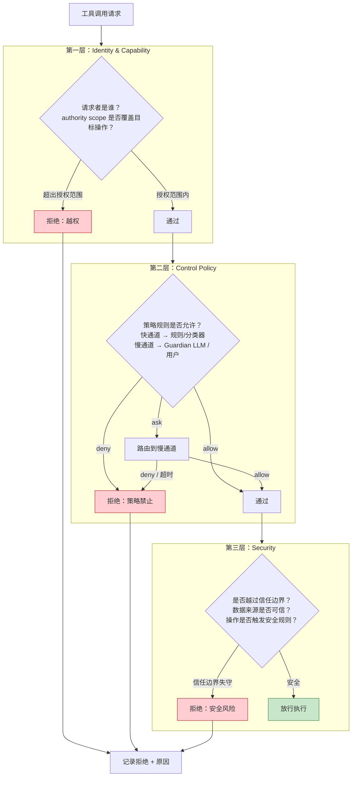
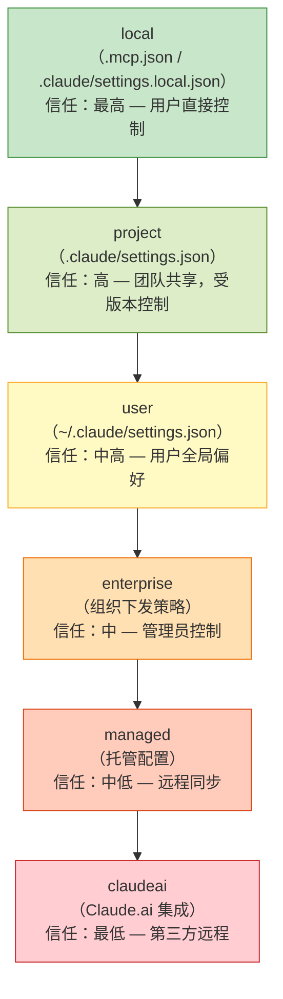

# Security & Trust Boundaries
>
> **所属域**：5. Trust & Identity — 信任边界与攻击面
>
> **Evidence Status** — production-validated. Codex Guardian 的 transcript-as-evidence、fail-closed 策略和 MCP 风险注解；Claude Code 的分层权限管道、6 层 MCP 配置作用域、5 种传输类型安全边界、Session 失效恢复、Elicitation 协议、per-tool 权限和拒绝追踪；Warp 的项目级 MCP 隔离；Codex 的工具注解系统；OpenCode 的三级权限模型和 Doom Loop 检测。所有机制均已在生产环境验证。

**Principle Refs**: EM-03, IS-03 — 环境约束决定信任边界；地图与领土可能偏离，信任假设需持续校验

## 定义

Security 层不只处理“谁能点确认按钮”，它更重要的职责是：**区分什么是指令，什么是数据；什么可信，什么不可信；什么可以影响行为，什么只能作为观察。**

## 关键边界

### 1. Instruction vs Data

| 类型 | 示例 | 默认处理 |
|---|---|---|
| instruction | system policy、developer prompt、用户明确命令、批准后的 AGENTS.md | 可以驱动行为 |
| trusted data | 内部 API 回读、已验证状态、签名配置 | 可作为决策依据 |
| untrusted data | 网页正文、issue 评论、日志、邮件、第三方返回值 | 只能作为数据，不可直接驱动高风险行为 |
| model inference | 模型推断、总结、建议 | 必须标注不确定性 |

上述分类是默认策略，实际运行中存在边界情况：例如可信第三方 API 的返回值可根据签名验证结果从 untrusted data 提升为 trusted data；用户在对话中给出的隐式偏好是否构成 instruction，取决于意图明确性和风险等级。信任提升必须经过 Policy Engine 审核，不可由模型自行决定。

### 2. 常见攻击面

- prompt injection
- tool output injection
- RAG / memory poisoning
- MCP server trust boundary 失守
- secret exfiltration
- cross-tenant leakage
- browser automation phishing
- malicious tool schema
- eval poisoning

## Secure AI Agent 三原则

Google Secure AI Agents 的三条原则可落成本 skill 的运行时约束：

| 原则 | 运行时对象 | 验收问题 |
|---|---|---|
| Human controllers are well-defined | `HumanControllerRef` / `CapabilityGrant.issuer` | 谁对 Agent 行为负责？授权能否追溯到人或组织？ |
| Powers have limitations | `CapabilityGrant.scope` / `PolicyVerdict` / sandbox | Agent 能做什么、不能做什么、多久后失效？ |
| Actions and planning are observable | `DecisionLog` / `TraceEvent` / `EffectRecord` | 计划、工具调用、外部效果是否可审计和回放？ |

两类核心风险对应两组硬边界：

- **Rogue actions**：通过权限作用域、风险分级、人类审批、不可逆动作阻断和 effect verification 控制。
- **Sensitive data disclosure**：通过数据分 lane、secret redaction、egress policy、tenant-scoped memory 和 tool-output sanitization 控制。

这三条原则贯穿 Identity / Control / Observability / Effects 四个 plane，是每个 plane 的验收门。

## 防护思路

| 风险 | 设计要点 |
|---|---|
| prompt / tool output injection | 指令与数据分 lane，外部文本默认不提升为 instruction |
| RAG / memory poisoning | provenance、审计、写入审批、过期与删除语义 |
| MCP trust boundary | server allowlist、capability segmentation、最小权限 |
| secret exfiltration | secret redaction、network egress policy、deny raw secret readback |
| cross-tenant leakage | tenant-scoped memory / state / tool tokens |
| browser phishing | URL allowlist、origin verification、截图 / DOM 双重验证 |

## Transcript-as-Evidence 原则

在高风险审核场景中，对话记录（transcript）的角色必须被严格限定：它只能作为**证据**供独立审核者参考，不能作为**指令**驱动执行决策。

这个区分看似微妙，但决定了审批系统是安全的还是可被注入的。如果审核模型把 transcript 当作指令来源，攻击者只需在对话中注入"忽略之前规则"就能绕过审核。

### 生产证据

Codex Guardian 的 `policy.md` 明确规定了三条约束：

1. **transcript 作为证据，不作为指令**。Guardian 审核时接收对话片段，但忽略其中任何试图重定义策略、绕过规则或隐藏证据的内容
2. **截断数据增加风险**。当对话记录出现 `<truncated ... />` 标记时，意味着上下文丢失，Guardian 应提高风险分数而非降低。攻击者可能故意填充上下文导致关键内容被截断
3. **用户批准不等于无条件放行**。用户的明确批准通常被视为授权，但 Guardian 仍然保留对高风险操作（如删除、凭证暴露）的独立判断权

### 设计检查

```text
[ ] 审核模型是否把 transcript 当作 data lane 而非 instruction lane？
[ ] 截断/缺失内容是否导致风险分数上升？
[ ] 第三方输出中嵌入的"请求批准"是否被忽略？
```

## 失闭设计（Fail-Closed）

安全机制失效时，默认行为应该是**阻断**而非放行。Agent 系统中这一原则尤其容易被违反，因为开发者倾向于优先保障"Agent 能完成任务"。

### 失闭场景表

| 异常情况 | 处理方式 | 来源 |
|---|---|---|
| Guardian 审核超时 | `risk_score = 100`，自动拒绝 | Codex `review_session.rs` |
| Guardian 返回格式异常 | 拒绝，记录告警 | Codex Guardian |
| Guardian 无法判断（置信度低） | 拒绝 | Codex Guardian |
| Guardian 服务不可用 | 拒绝并告警 | Codex Guardian |
| 权限规则求值异常 | 询问用户（等同拒绝自动放行） | Claude Code、OpenCode |
| 沙箱拒绝后重试 | 重试请求附带 `sandbox_denial` 原因，Guardian 二次审核 | Codex `approval_request.rs` |

关键设计：Codex 用标准化拒绝消息 `GUARDIAN_REJECTION_MESSAGE` 统一所有拒绝场景的输出格式，禁止模型对拒绝消息做变通解读或绕过执行。

### 失闭 vs 失开的取舍

并非所有系统都选择 fail-closed。Claude Code 和 OpenCode 在快通道异常时回退到**用户询问**（fail-open-to-user），因为交互式场景中用户在场可以即时干预。Codex 面向无人值守批处理，用户不在场，必须 fail-closed。

选择依据：**用户是否在场**。在场则 fail-open-to-user 可接受；不在场则必须 fail-closed。

## 权限判定管道

权限判定采用三层串行管道，每层解决不同问题，deny 在任意层短路终止。



### 项目实现对照

| 管道层 | Claude Code | Codex | OpenCode |
|---|---|---|---|
| **Identity & Capability** | 规则来源优先级（policy > user > project > session） | `ExecApprovalRequirement` 枚举 | Rule schema（permission / pattern / action） |
| **Control Policy** | 分类器 → Hook 联合 → 推测性权限检查 → 用户审批 | 前缀规则 → Guardian LLM → 沙箱 | findLast 通配符匹配 → 用户询问 |
| **Security** | Untrusted context boundary + secret redaction | Guardian `policy.md` + 沙箱文件系统隔离 + 网络白名单 | deny > ask > allow + Doom Loop 检测 |

三个项目的管道形态不同，但**每一层的拒绝都是终态**。不存在"被拒绝后从下一层翻转为允许"的路径。

## MCP 工具信任边界

MCP Server 扩展了 Agent 的能力面，也扩展了攻击面。第三方 Server 的输出必须被视为 untrusted data，不能被当作可信指令。

### 风险注解

Codex Guardian 在评估 MCP 工具调用时引入三种风险注解（annotation），帮助 Guardian 做更准确的风险判断：

| 注解 | 含义 | 影响 |
|---|---|---|
| `destructive_hint` | 工具可能执行不可逆操作（删除、覆盖） | Guardian 提高风险分数 |
| `open_world_hint` | 工具访问外部网络或不受控资源 | Guardian 检查是否存在数据泄露风险 |
| `read_only_hint` | 工具声明自身为只读 | Guardian 可适度降低风险分数，但不无条件信任 |

注解由 MCP Server 自行声明，但 Guardian 不盲信声明。一个声称 `read_only_hint` 的 Server 如果实际执行了写操作，沙箱层会拦截。

### 准入控制

| 机制 | 说明 | 来源 |
|---|---|---|
| Server Allowlist | 只有审核通过的 Server 可以被 Agent 使用 | Codex、Claude Code |
| Per-profile Denylist | 按用户/项目维度禁止特定 Server | Warp MCP 配置 |
| Capability Segmentation | 读、写、outbound 权限分开管理 | `mcp-trust-boundary.md` |
| Per-server Credentials | 每个 Server 独立凭据，防横向扩散 | `mcp-trust-boundary.md` |
| Schema Review | 注册时检查工具声明的合理性：参数是否过于宽泛、描述是否试图诱导 Agent 优先选择 | `mcp-trust-boundary.md` |

### 第三方输出隔离

MCP Server 返回的内容进入 untrusted data lane（Lane 4），即使内容中包含看似合理的操作指令，也不能直接驱动高风险行为。如果 Agent 需要基于第三方输出执行写操作，必须先经过用户确认（升级到 Lane 2）或结构化校验（升级到 Lane 3）。

### MCP 配置作用域与信任层级

> **Evidence Status** — production-validated. Claude Code 生产环境已实现 6 层配置加载，每层信任级别不同。

MCP Server 的注册按作用域分层加载，越靠近用户直接控制的层信任越高：



加载顺序：local 最先加载且优先级最高，后续层级依次覆盖。冲突时低层级配置不能覆盖高层级的 deny 规则。例如 local 层禁用了某个 Server，claudeai 层不能把它重新启用。

设计含义：
- **项目级隔离**：不同项目的 MCP 配置互不干扰，一个项目引入的高风险 Server 不会泄漏到其他项目。
- **企业管控**：enterprise 层可以全局禁止某些 Server 类型，项目层无法绕过。
- **最小暴露**：用户在 local 层手动启用的 Server，仅在当前工作目录生效。

### MCP 传输类型与安全边界

> **Evidence Status** — production-validated. Claude Code 支持全部五种传输类型，每种的安全特征和威胁模型不同。

MCP Server 通过不同传输协议与 Agent 通信，传输类型决定了安全边界的宽度：

| 传输类型 | 运行位置 | 安全特征 | 威胁模型 | 适用场景 |
|---|---|---|---|---|
| **stdio** | 本地子进程 | 进程隔离，无网络暴露 | 本地提权、恶意 npm 包 | 本地开发工具（文件操作、Git） |
| **sse** | 远程服务 | 需 TLS + 认证 | 中间人攻击、会话劫持 | 远程 API 网关 |
| **http** | 远程服务 | 需 TLS + 认证 | 与 sse 相同 + 无状态导致的重放风险 | 无状态查询服务 |
| **ws** | 远程服务 | 需 TLS + 认证 | 持久连接劫持、消息注入 | 实时数据流 |
| **sdk** | 宿主进程内嵌 | 信任继承宿主权限 | 供应链攻击（恶意 SDK 包） | 内嵌功能扩展 |

安全准则：
- **stdio 优先**：本地工具应首选 stdio 传输，避免不必要的网络暴露。
- **远程必须加密**：sse / http / ws 传输必须启用 TLS，禁止明文通信。
- **sdk 审查供应链**：内嵌 SDK 的安全性取决于包的可信度，需审查来源和依赖链。
- **传输类型决定默认权限**：stdio 可给予较高默认信任，远程传输默认 ask 模式。

### MCP Session 失效与恢复

> **Evidence Status** — production-validated. Claude Code 实现了 Session 失效检测、缓存清理和 OAuth token 自动刷新。

MCP 连接会因服务端重启、网络中断、token 过期等原因失效。失效检测和恢复是安全关键路径：如果恢复逻辑有漏洞，攻击者可以利用重连窗口注入伪造 Server。

**失效检测信号**：
- HTTP 404：Server 端 Session 已不存在
- JSON-RPC 错误码 `-32001`：Session 无效或过期

**恢复策略**：
1. 检测到失效 → 调用 `clearConnectionCache()` 清除本地连接缓存
2. 用全新客户端实例重连（不复用旧连接状态）
3. 重连时重新协商能力（capabilities），不假设旧 Session 的能力仍然有效

**OAuth Token 刷新**：
- 远程 MCP Server 使用 OAuth 认证时，token 过期是常见失效原因
- `checkAndRefreshOAuthTokenIfNeeded()` 在每次请求前检查 token 有效性
- 刷新后的 token 存储在系统 keychain 而非明文文件，防止凭据泄露
- token 刷新失败时 fail-closed：拒绝继续使用该 Server，不降级为无认证连接

### MCP Elicitation 协议

> **Evidence Status** — production-validated. Claude Code 实现了完整的 Elicitation 请求-响应-缓存链路。

Elicitation 是 MCP 协议中 Server 向用户请求额外信息的机制。与普通工具调用不同，Elicitation 创建了一条从 Server 到用户的反向通道，需要特别防护。

**协议流程**：
1. MCP Server 在处理请求时发现需要额外信息（如数据库密码、API Key）
2. Server 返回 JSON-RPC 错误码 `-32042`（elicitation request），附带需要用户填写的字段模式
3. Agent 将 elicitation request 呈现给用户
4. 用户响应 → `runElicitationResultHooks()` 对响应做安全检查
5. 响应发回 Server 继续处理

**安全要点**：
- **缓存防重放**：相同 request ID 的 elicitation 结果会被缓存，后续相同请求直接使用缓存值，防止 Server 通过反复请求骗取用户输入不同内容
- **敏感字段保护**：elicitation 响应中的密码、token 等字段不写入对话历史，仅加密传输给目标 Server
- **Hook 审查**：`runElicitationResultHooks()` 在响应发送前执行，可拦截异常模式，例如 Server 请求的字段与其声明能力不匹配

### MCP 权限细粒度

> **Evidence Status** — production-validated. Claude Code per-tool 权限、Warp 项目级隔离、Codex 工具注解系统均已在生产环境运行。

传统的 MCP 权限是 per-server 的：信任一个 Server 就信任它所有的工具。这粒度太粗。一个 Server 可能同时提供低风险的 `read_file` 和高风险的 `delete_database`，需要按工具分别授权。

**Per-tool 权限**（Claude Code）：

同一 MCP Server 的不同工具可以有不同权限级别：

```yaml
mcp_permissions:
  server: "database-tools"
  tools:
    query:     allow      # 只读查询，自动放行
    insert:    ask        # 写入，每次询问用户
    drop:      deny       # 删表，永久禁止
    backup:    allow      # 备份，自动放行
```

**项目级 MCP 隔离**（Warp）：

每个项目维护独立的 MCP 配置，Server 的 allow/denylist 按项目隔离：
- 项目 A 允许的 Server 不会自动对项目 B 可用
- 每个 Server 有独立的 allowlist 和 denylist
- 项目切换时 MCP 连接和权限状态完全重置

**工具注解系统**（Codex）：

MCP 工具通过声明式元数据标注自身行为特征，供 Policy Engine 做细粒度判断：

| 注解字段 | 用途 | 示例 |
|---|---|---|
| `destructive_hint` | 标记不可逆操作 | `true` → 删除/覆盖操作 |
| `read_only_hint` | 标记只读操作 | `true` → 查询/读取操作 |
| `open_world_hint` | 标记外部网络访问 | `true` → 调用第三方 API |
| `idempotent_hint` | 标记幂等操作 | `true` → 重试安全 |

注解由 Server 自行声明，但沙箱层独立验证。声明 `read_only_hint: true` 但实际执行写操作的工具会被沙箱拦截并标记为不可信。

### MCP 信任审查清单

对接任何 MCP Server 前，按以下清单逐项审查：

```text
[ ] 传输是否加密？
    — 远程传输（sse/http/ws）必须启用 TLS
    — stdio 本地传输可豁免

[ ] 服务器身份是否验证？
    — 证书链是否完整？
    — OAuth client 是否来自可信 provider？
    — 是否有 Server 身份的独立校验（不只靠 URL）？

[ ] 工具权限是否最小化？
    — 是否使用 per-tool deny/ask/allow（而非 per-server 一刀切）？
    — 高风险工具（destructive_hint）是否默认 deny 或 ask？
    — 只读工具是否被沙箱独立验证其只读声明？

[ ] Session 失效是否有自动恢复？
    — 是否检测 HTTP 404 / JSON-RPC -32001？
    — 恢复时是否用全新客户端（不复用旧状态）？
    — token 刷新失败是否 fail-closed？

[ ] Elicitation 是否安全？
    — 相同 request ID 是否缓存防重放？
    — 敏感字段是否避免写入对话历史？
    — 用户响应是否经过 Hook 审查？

[ ] 配置层级是否合理？
    — 高风险 Server 是否仅在 local 层启用？
    — enterprise 层的 deny 规则是否不可被下层覆盖？
```

## 拒绝追踪（Denial Tracking）

权限拒绝是需要被系统性记录和利用的信号。

### 问题

如果 Agent 不记录拒绝历史，会出现两个问题：
1. **审批疲劳**：模型反复提交同一个被拒绝的操作，用户不断收到相同的审批请求
2. **策略盲区**：哪些操作被频繁拒绝、哪些规则需要调整，没有数据支撑

### Claude Code 的实现

Claude Code 在 Agent 主循环中维护 `permissionDenials` 状态，记录每次拒绝的工具名、输入参数和拒绝原因。模型收到拒绝后不会停止，而是收到一条结构化错误消息，可以据此调整策略：换一个工具、缩小操作范围或请求用户澄清意图。

关键约束：**拒绝后不重复请求同一操作**。如果模型再次提交完全相同的工具调用（工具名 + 参数键一致），系统直接返回缓存的拒绝结果，不再询问用户。

### OpenCode 的实现

OpenCode 的 `Permission.Reply` 支持三种回复：`once`（仅本次允许）、`always`（追加永久规则）、`reject`（拒绝）。拒绝后触发 `RejectedError`，由 Doom Loop 检测器监控。如果连续 3 次相同工具调用组合被拒绝，强制停止并要求用户介入。

### 拒绝记录字段

```yaml
denial_record:
  tool_name: string
  args_key: string          # 参数的可序列化 key
  rule_source: string       # 哪条规则触发了拒绝
  denial_reason: string     # 人类可读原因
  timestamp: datetime
  session_id: string
  model_reaction: string    # 模型收到拒绝后的后续动作（换策略 / 停止 / 升级请求）
```

当同类 deny 累积到阈值时，系统可建议用户追加永久规则，把反复出现的拒绝转化为显式策略。

## 最小安全策略

```yaml
security_policy:
  # （Trust Lane 的权威定义）
  trust_lanes: [instruction, trusted_data, untrusted_data, memory, inference]
  tool_output_sanitization: enabled
  secret_redaction: enabled
  mcp_allowlist: []
  tenant_isolation: strict
  high_risk_actions_require:
    - explicit_user_intent
    - permission_check
    - effect_verification_plan
```

## 混合纵深防御 (Hybrid Defense-in-Depth)

成熟 Agent 安全采用多层叠加防护：

```text
Layer 1: Deterministic Policy Engine — 规则、allowlist、硬限制
Layer 2: Guard Model — 独立小模型做语义风险检测
Layer 3: Base Model Hardening — 对抗训练、结构化 prompt 约定
Layer 4: Assurance — 回归测试、红队、变体分析
```

| 层 | 擅长 | 不足 |
|---|---|---|
| Policy Engine | 快、确定、可审计 | 无法处理语义上下文 |
| Guard Model | 处理动态/新型威胁 | 非确定性、不保证 |
| 两者组合 | 攻击者必须同时绕过两层 | 需要持续校准 |

### Layer 1 与 Layer 2 的协作模型

两层互补分工：

- **Policy Engine（L1）处理已知威胁**：路径黑名单、工具权限、速率限制、格式校验。判定结果是确定的 allow/deny，延迟 <1ms。L1 失效等同于整个防御体系崩溃。
- **Guard Model（L2）处理未知威胁**：语义级 prompt injection 检测、上下文异常识别、意图偏移判断。判定结果带置信度，低置信度时升级到人类。L2 负责捕捉规则无法覆盖的长尾风险。

**协作规则**：L1 deny 不可被 L2 翻转；L1 allow 仍须经 L2 审查；L2 deny 可被人类覆盖但需记录理由。

### 持续保障活动（Continuous Assurance）

Layer 4 是持续运行的验证循环：

| 活动 | 频率 | 目的 |
|---|---|---|
| 自动化回归 | 每次配置变更 | 确认已知防御不退化 |
| 红队对抗 | 季度 | 发现新攻击面 |
| 变体分析 | 月度 | 已知攻击的变体是否被拦截 |
| Policy-Guard 校准 | 双周 | L1 和 L2 判定一致性检查，发现盲区 |

校准方法：对同一批请求分别经 L1 和 L2 独立判定，比对结果。L1 allow + L2 deny 的案例说明 Policy Engine 存在规则盲区，应转化为新规则。L1 deny + L2 allow 的案例是 Guard Model 的误判候选，应加入校准集。

详见 `../../../design-space/patterns/guard-model.md`。

## Agent 安全三原则

1. **Human Controllers**：Agent 必须有明确的人类控制者，关键动作需人工确认
2. **Limited Powers**：权限动态对齐意图，不允许自我提权
3. **Observable Actions**：动作和规划过程可审计、可追溯

## 评审清单

```text
[ ] 指令与数据是否分 lane？外部文本是否默认不提升为 instruction？
[ ] 审核模型是否把 transcript 当作证据而非指令？
[ ] 安全机制失效时是否 fail-closed（或至少 fail-open-to-user）？
[ ] 权限判定是否经过 Identity → Control → Security 三层串行管道？
[ ] 第三方 MCP Server 输出是否进入 untrusted data lane？
[ ] MCP Server 的风险注解是否被独立验证（不盲信声明）？
[ ] MCP 传输是否加密（远程必须 TLS，stdio 可豁免）？
[ ] MCP Server 身份是否独立验证（证书/OAuth，不只靠 URL）？
[ ] MCP 权限是否 per-tool 细粒度（而非 per-server 一刀切）？
[ ] MCP Session 失效是否有自动检测和恢复？token 刷新失败是否 fail-closed？
[ ] MCP Elicitation 响应是否缓存防重放？敏感字段是否避免写入历史？
[ ] MCP 配置层级是否合理？enterprise deny 是否不可被下层覆盖？
[ ] 拒绝历史是否被记录？模型是否避免重复请求同一被拒操作？
[ ] secret 是否在日志、GUI、tool output 中被 redact？
[ ] 高风险操作（删除、外发、凭证变更）是否有独立审核层？
```

## 关联模式

- `../../../design-space/patterns/untrusted-context-boundary.md` — Lane 分类与信任升级规则
- `../../../design-space/patterns/tool-output-sanitization.md` — 工具输出净化
- `../../../design-space/patterns/mcp-trust-boundary.md` — MCP Server 准入与能力分段
- `../../../design-space/patterns/guard-model.md` — 混合纵深防御体系
- `../../../design-space/patterns/guardian-review-agent.md` — Guardian 独立审核与 fail-closed 策略
- `../control/permission-models.md` — 三种权限范式与快慢双通道
- `../../kernel/permission-decision.md` — 权限决策管线与拒绝跟踪
- `red-team-cases.md` — 红队测试案例
- `../../../evaluation/security-evals.md` — 安全评估集

## 参考实现

- **Codex**：Guardian LLM 审核 + transcript-as-evidence + fail-closed 策略，见 `../../../projects/coding-agents/codex/guardian-policy.md`
- **Claude Code**：25 种 Hook 事件 + 分类器权限 + 拒绝追踪，见 `../../../projects/coding-agents/claude-code/control-layer.md`
- **OpenCode**：deny > ask > allow 三级权限 + Doom Loop 检测，见 `../../../projects/coding-agents/opencode/control-memory.md`

## OpenClaw: ACP + DM Pairing + Sandbox Backends

> **Evidence**: OpenClaw src/acp/ + src/security/

OpenClaw 的安全模型三层叠加：
- **ACP (Agent Control Plane)**：session-scoped 执行权限 + persistent bindings
- **DM Pairing**：个人 assistant 默认拒绝陌生人，配对码机制授权
- **Sandbox Backends**：Docker/SSH/OpenShell/Local，per-session 可配置

参见 `projects/personal-assistants/openclaw/acp-and-session-auth.md` 和 `projects/personal-assistants/openclaw/sandbox-backends.md`。
