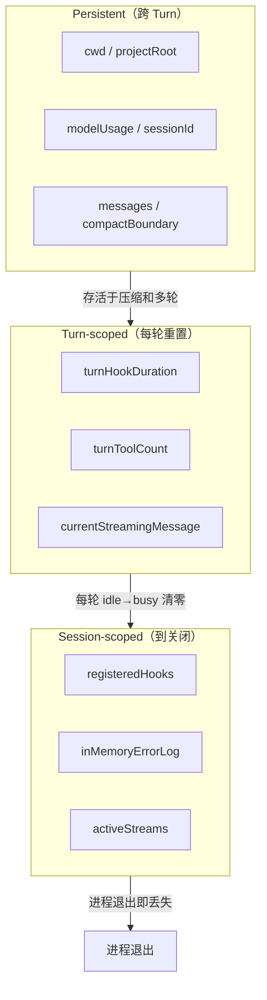
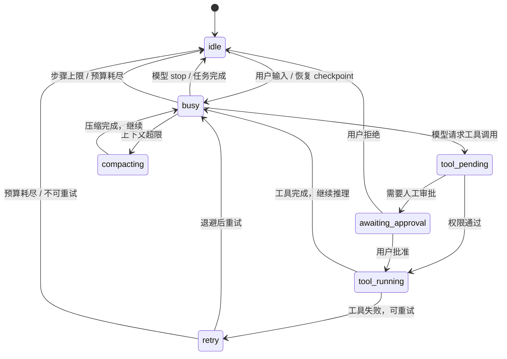

# State & Checkpoint Engine
>
> **所属域**：2. Cognition & Continuity — 任务状态与 checkpoint
>
> **Evidence Status** — production-validated. Claude Code JSONL append-only 消息存储与 AppStateStore 状态管理、Codex SessionState + AgentControl + TaskKind 枚举、OpenCode SessionStatus 三状态机与 Doom Loop 检测、Hermes SessionStore SQLite+JSONL 双写与 parent_session_id 链式压缩、GenericAgent working checkpoint 跨压缩存活机制；Claude Code 三层状态生命周期分类（Persistent / Turn-scoped / Session-scoped）；本知识库对任务状态与外部世界状态的分层抽象。

**Principle Refs**: BDI-03, BR-02 — 意图持续但可修订，任务状态随时间可退化。

## 定义

State Engine 管理**任务当前状态**，Checkpoint Engine 管理**中断恢复**。长任务 Agent 最常见的失败就是丢失进度或恢复到错误上下文。

要特别区分：
- **Task State**：Agent 当前任务走到哪一步；
- **World State**：外部对象当前是什么状态。

State 层主要负责前者，并记录与后者相关的引用和待验证 effect。

## 为什么需要状态层

| 常见失败 | 原因 |
|---|---|
| 上下文满后忘记进度 | 没有外部化的 task state |
| 工具失败后无法恢复 | 没有 checkpoint |
| 多 Worker 不知彼此状态 | 没有共享任务状态 |
| 用户中断后无法继续 | 没有恢复机制 |
| 以旧外部状态继续执行 | world state 没刷新 |

## 模块接口

**输入**：Kernel 的状态更新、checkpoint 请求、effect status、approval status
**输出**：当前任务状态、checkpoint 数据、恢复指令
**配置**：checkpoint 频率、持久化方式、恢复策略

## 状态类型

| 状态 | 作用 | 示例 |
|---|---|---|
| Task State | 任务整体 | 目标、计划、阶段、完成度 |
| Step State | 当前步骤 | 工具调用、输入、输出、错误 |
| Artifact State | 产物 | diff、报告、文件路径 |
| Environment State | 执行环境 | git status、依赖、工作目录 |
| Approval State | 审批 | pending / approved / rejected |
| Pending Effects | 待验证动作 | ticket 已更新待回读、邮件待 outbox 确认 |

## 状态生命周期分类

状态不只有"类型"，还有**生命周期**。Claude Code 的实现揭示了三层分类——不同生命周期的状态需要不同的持久化和清理策略。

| 生命周期 | 含义 | 代表字段（Claude Code） | 清理时机 |
|---|---|---|---|
| **Persistent（跨 Turn）** | 跨越多轮交互，直到会话结束或显式重置 | `cwd`, `projectRoot`, `modelUsage`, `sessionId`, `registeredTools` | 会话结束 |
| **Turn-scoped（每轮重置）** | 单轮推理完成即清零，下一轮从空开始 | `turnHookDuration`, `turnToolCount`, `currentStreamingMessage` | 每轮 `idle → busy` 转移时 |
| **Session-scoped（到关闭）** | 随进程存活，进程退出即丢失，不参与持久化 | `registeredHooks`, `inMemoryErrorLog`, `activeStreams` | 进程退出 |



设计教训：混淆生命周期是状态 bug 的高发区。典型错误是把 Turn-scoped 字段（如当前轮工具调用计数）放在 Persistent 层导致跨轮累积错误，或把 Session-scoped 字段（如 Hook 注册表）持久化到磁盘导致恢复时加载过期回调。

## 状态转移模型

任务状态不是布尔值（在做 / 做完），而是有明确生命周期的状态机。下面的模型从 5 个参考项目中归纳——各项目的状态粒度不同，但收敛到同一套核心转移路径。



### 项目对照

| 项目 | 状态集 | 存储位置 | 状态变更通知 |
|------|--------|----------|-------------|
| **Claude Code** | 隐式——由 `State` 对象中的 `messages` / `toolUseContext` / `turnCount` / `transition` 组合表达；没有显式枚举 | 内存 `State` 对象，每轮解构-重建 | `onChangeAppState` 观测器 + SDK stream |
| **Codex** | `SessionState` + `TaskKind`（Regular / Review / Compact / Undo）+ `AgentControl` 控制平面 | Rust `StateDb` 持久化，AgentRegistry 内存 | 事件上报至 TUI |
| **OpenCode** | 显式三状态：`idle` / `busy` / `retry { attempt, message, next }` | `Instance.state()` per-directory Map | `Bus.publish(SessionStatus.Event.Updated)` |
| **Hermes** | 隐式——`_running_agents` Dict 表示活跃，`_pending_messages` 表示排队 | SQLite + JSONL 双写 SessionStore | Gateway 消息循环 |
| **GenericAgent** | 隐式——`api_call_count` / `iteration_budget.remaining` / `working` checkpoint | 内存 + 磁盘 L4 归档 | Generator yield |

OpenCode 的三状态机最简洁，也最接近最小可行模型：`idle` 表示可接受输入，`busy` 表示正在推理或执行工具，`retry` 携带退避信息。Claude Code 没有显式状态枚举，但 `State.transition` 字段记录"为什么上一次迭代继续"，在调试和测试时等效于状态机的边标签。

### 子状态：工具调用生命周期

工具调用本身也是一个状态机，嵌套在任务状态机内部。OpenCode 的 `ToolPartState` 是最显式的实现：

```text
pending → running → completed
                  → failed
```

每个状态携带时间戳（`time.created` / `time.start` / `time.end` / `time.compacted`），`compacted` 标记工具输出已被压缩——状态本身不丢失，但内容被摘要替代。

## 内存 vs 持久化选择矩阵

状态放哪里不是架构纯度问题，而是失败模式问题：内存状态进程崩溃即丢失，持久化状态有 I/O 开销和一致性代价。

| 项目 | 策略 | 持久化介质 | 内存结构 | 恢复能力 |
|------|------|-----------|----------|---------|
| **Claude Code** | 纯内存 | 无（transcript 靠 compact boundary 保留） | `DeepImmutable<AppState>` — 700+ 行状态树，发布-订阅 + 浅比较 | 进程崩溃 = 丢失；compact boundary 跨压缩保留关键状态 |
| **Codex** | 内存 + DB | `StateDb`（SQLite） | `SessionState` + `AgentRegistry`（`RwLock<HashMap>`） | 跨会话恢复；Phase 1/2 memory pipeline 异步提取 |
| **OpenCode** | 内存 + SQLite | SQLite WAL 模式（`PRAGMA journal_mode = WAL`） | `Instance.state()` per-directory；`Deferred` 异步等待 | 会话级持久化；`Session.fork` 支持分支恢复 |
| **Hermes** | 双写 | SQLite + JSONL 降级 | `_running_agents` Dict + `_agent_cache` | SQLite 优先，JSONL 降级；原子文件写入（`fsync` + `os.replace`） |
| **GenericAgent** | 分层 | L4 磁盘归档（JSONL → zip） | `working` checkpoint Dict | `update_working_checkpoint` 跨压缩存活；L4 月度归档 |

### 选择决策树

```text
状态需要跨进程崩溃存活？
  ├─ 否 → 内存（Claude Code 模式）
  │        适用：单次会话、短任务、可重做
  └─ 是 → 需要并发读？
           ├─ 否 → JSONL / 文件（GenericAgent 模式）
           │        适用：单用户、顺序写入
           └─ 是 → SQLite WAL（OpenCode / Hermes 模式）
                    适用：多会话、前端实时同步、需要查询
```

关键教训：Hermes 的双写策略不是冗余设计，而是迁移策略——SQLite 是目标，JSONL 是降级路径。GenericAgent 的 `working` checkpoint 证明了一个最小模式：只要能把 `key_info` 和 `related_sop` 传递给下一轮，状态就能跨压缩存活。

## 状态与世界状态的冲突仲裁

Task State 和 World State 是两个独立的真相来源，两者的不一致是常态而非异常。详见 `../../cross-cutting/state-x-world-state.md`。

### 仲裁规则

**World State 优先于 Task State，除非有明确的用户覆盖。**

原因：Task State 记录"Agent 认为自己做到了哪一步"，World State 记录"外部世界实际是什么样"。当两者冲突时，外部世界是最终裁判。

### 典型冲突场景

| 场景 | Task State 说 | World State 说 | 正确处理 |
|------|-------------|---------------|---------|
| 用户说"我改了代码"但 `git diff` 为空 | 待处理用户修改 | 无变更 | 信任 `git diff`，告知用户未检测到变更，请求澄清 |
| 任务显示"文件已写入"但 readback 内容不符 | 步骤已完成 | 文件内容不匹配 | 回滚步骤状态为未完成，触发 replan |
| Checkpoint 恢复后 git HEAD 已变 | 从 checkpoint 中的 commit 继续 | HEAD 指向不同 commit | 刷新 world_refs，标记受影响步骤为 `needs_revalidation` |
| 多 Agent 并发：Agent A 读取文件后 Agent B 已修改 | Agent A 基于旧快照规划 | 文件已被 Agent B 改写 | 版本门控写入；写冲突时进入仲裁而非静默覆盖 |

### 用户覆盖例外

用户显式指令可以覆盖 World State 的裁定。例如：
- 用户说"忽略 lint 错误，继续部署" — 即使 World State 显示 lint 失败，用户覆盖有效
- 用户说"用这个版本的文件" — 即使 git 显示冲突，用户选择有效

覆盖必须记录为 `InteractionEvent`，不能静默消化。

## 上下文满后的状态保留

上下文压缩是 State Engine 最严峻的考验：压缩必须释放 token 空间，但不能丢失任务状态。各项目的做法差异很大，但共享一个不变量——**任务进度、当前计划和未验证 effect 不可被压缩丢弃**。

| 项目 | 压缩时状态保留机制 | 保留内容 |
|------|-------------------|---------|
| **Claude Code** | `CompactBoundary` 标记 + `getMessagesAfterCompactBoundary` | 边界之后的完整消息保留；边界之前的消息被 LLM 摘要替代；摘要 prompt 要求保留任务进度和关键发现 |
| **Codex** | `TaskKind::Compact` — 压缩本身是一种任务类型 | `SessionState` 中的 `previous turn settings` 跨压缩持续 |
| **Hermes** | `parent_session_id` 链式压缩 | 压缩失败后创建新会话，`parent_session_id` 指向旧会话；旧会话的摘要注入新会话系统提示 |
| **GenericAgent** | `update_working_checkpoint` 工具 | `key_info`（当前任务关键信息）+ `related_sop`（相关 SOP 引用）写入 `working` Dict，注入下一轮 anchor prompt |
| **OpenCode** | `SessionCompaction.create` + `PRUNE_PROTECT` / `PRUNE_MINIMUM` | 保护最近 40K tokens（`PRUNE_PROTECT`），最低保留 20K tokens（`PRUNE_MINIMUM`）；超限触发自动压缩 |

GenericAgent 的 `working` checkpoint 是最简模式：Agent 在压缩前主动调用 `update_working_checkpoint`，把关键信息外置到一个不参与压缩的 Dict 中。代价是依赖模型主动触发——如果模型忘了调用，信息就丢了。`passed_sessions` 计数器跟踪 checkpoint 经历了多少轮压缩，作为陈旧度信号。

Hermes 的链式压缩是最激进的方案：当压缩后仍超标时，直接创建新会话。`parent_session_id` 链保证审计可追溯，但代价是冷启动——新会话只有摘要，没有原始上下文。

---

## 专题详述

以下主题已拆分为独立文件，按需深入：

| 专题 | 文件 | 解决什么 |
|---|---|---|
| 持久化模式 | [`persistence-patterns.md`](./persistence-patterns.md) | JSONL Append-Only 存储（Claude Code）、Working Checkpoint 跨会话传递（GenericAgent）、链式恢复流程 |
| 子 Agent 状态隔离 | [`subagent-isolation.md`](./subagent-isolation.md) | 多 Agent 消息隔离不变量、项目对照（Claude Code / Codex / OpenCode） |

---

## Checkpoint 内容

```yaml
checkpoint_id: string
task_id: string
current_depth: D4
plan_snapshot: {}
completed_steps: []
open_steps: []
artifacts: []
workspace_diff: string | null
world_refs: []
pending_effects: []
resume_instruction: string
```

## 恢复流程

```text
Load checkpoint
  → Hydrate task state
  → Validate environment
  → Refresh stale world refs
  → Rebuild minimal context
  → Continue from next safe step
```

## 设计模式

| 模式 | 详见 |
|---|---|
| Checkpoint Hydration | `../../../design-space/patterns/checkpoint-hydration.md` |
| Feature List Progress | `../../../design-space/patterns/feature-list-progress.md` |
| Scratchpad Progress File | `../../../design-space/patterns/scratchpad-progress-file.md` |
| Decision Log | `../../../design-space/patterns/decision-log.md` |

## 评审清单

```text
[ ] 任务状态是否有显式表示（枚举 / 状态对象），而不是散落在多个布尔变量中？
[ ] 状态变更是否通过事件或观测器通知，而不是轮询检查？
[ ] 长任务是否有外部化的 checkpoint，而不是只靠内存？
[ ] 压缩时是否保留任务进度、当前计划和未验证 effect？
[ ] 子 Agent 的消息历史是否与主循环隔离？
[ ] checkpoint 恢复时是否刷新全部 world_refs？
[ ] Task State 与 World State 冲突时，是否以 World State 为准？
[ ] 用户覆盖是否记录为 InteractionEvent？
```

## 与其他 Plane 的关系

| Plane | State 读取 | State 写入 |
|---|---|---|
| Context | 当前进度用于 Context Pack 装配 | 压缩结果更新 compact boundary |
| World State | world_refs 的 freshness verdict | 刷新请求、冲突标记 |
| Effects | EffectRecord 的 verification_status | pending_effects 列表更新 |
| Recovery | checkpoint 数据、open step | FailureRecord 触发状态回退 |
| Control | approval_status | 审批结果更新 Approval State |
| Orchestration | 子 Agent spawn/completion 事件 | 子任务状态注册和清理 |
| Observability | 状态变更 trace / span | — |

## 参考实现

- **Claude Code**：AppStateStore + 单向数据流 + compact boundary 状态保留，见 `projects/coding-agents/claude-code/state-ui-layer.md`、`projects/coding-agents/claude-code/query-loop.md`
- **Codex**：SessionState + AgentControl 独立控制平面 + TaskKind 枚举，见 `projects/coding-agents/codex/agent-control.md`、`projects/coding-agents/codex/memory-pipeline.md`
- **OpenCode**：三状态机 + Doom Loop 检测 + SQLite WAL 持久化 + Session fork，见 `projects/coding-agents/opencode/orchestration.md`、`projects/coding-agents/opencode/control-memory.md`
- **Hermes**：SQLite + JSONL 双写 + parent_session_id 链式压缩 + 原子文件持久化，见 `projects/general-agents/hermes-agent/gateway.md`、`projects/general-agents/hermes-agent/memory-skills.md`
- **GenericAgent**：working checkpoint + L0-L4 分层记忆 + 迭代预算模型，见 `projects/general-agents/generic-agent/memory-layers.md`、`projects/general-agents/generic-agent/agent-loop.md`
- **Augment**：Checkpoint 系统，见 `projects/coding-agents/augment/patterns.md`

相关文件：`../../cross-cutting/state-x-world-state.md`、`../recovery/overview.md`、`../context/overview.md`、`../context/compression-strategies.md`、`../../kernel/context-budget.md`、`../../../synthesis/local-agent-runtime-practices.md`。
