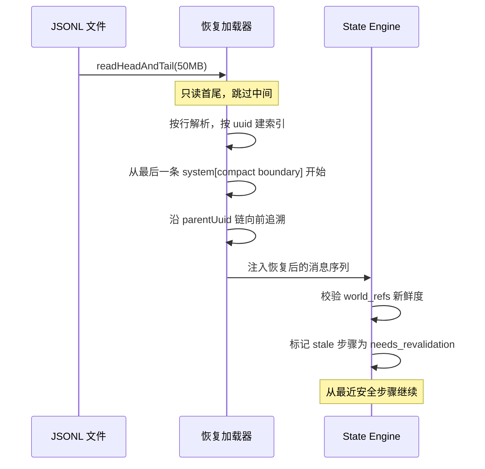
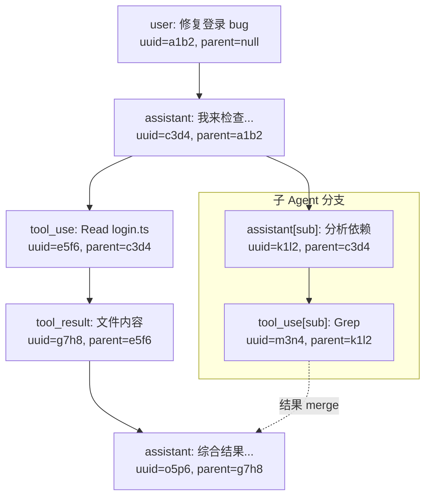
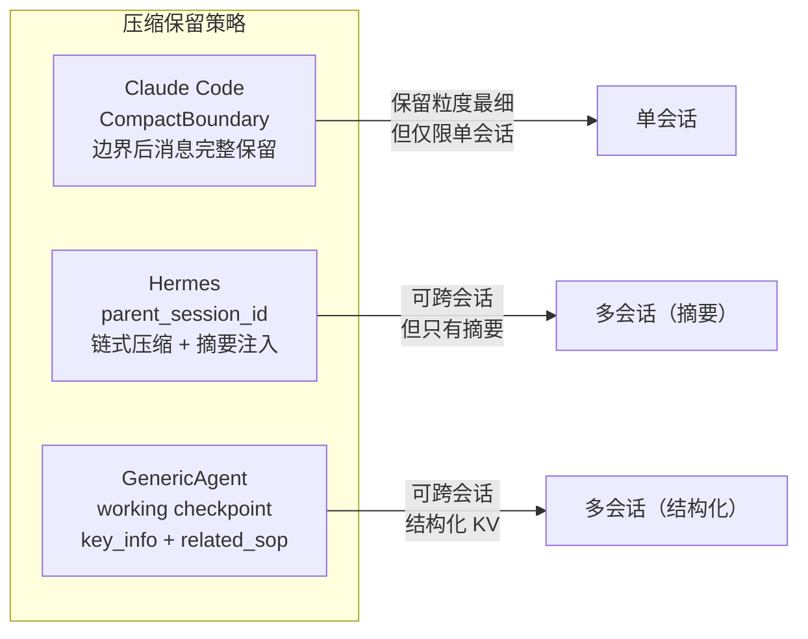

## JSONL Append-Only 存储模式

> **Evidence Status**: production-validated — Claude Code 的消息持久化实现。

Claude Code 的会话存储采用 JSONL append-only 格式，每行一条 type-tagged Entry。这是最简单的持久化方案，也是最容易恢复的方案。

### 消息条目结构

```jsonl
{"uuid":"a1b2","type":"user","parentUuid":null,"timestamp":1717000000,"content":"修复登录 bug"}
{"uuid":"c3d4","type":"assistant","parentUuid":"a1b2","timestamp":1717000001,"content":"我来检查..."}
{"uuid":"e5f6","type":"tool_use","parentUuid":"c3d4","timestamp":1717000002,"toolName":"Read","input":{...}}
{"uuid":"g7h8","type":"tool_result","parentUuid":"e5f6","timestamp":1717000003,"content":"文件内容..."}
{"uuid":"i9j0","type":"system","parentUuid":null,"timestamp":1717000004,"content":"[compact boundary]"}
```

### 关键设计决策

| 决策 | 理由 |
|---|---|
| **Type-tagged Entry**（user / assistant / tool_use / tool_result / system） | 恢复时可按类型过滤，例如只加载 system + 最近 N 条 user/assistant |
| **parentUuid 链式跟踪** | 支持任意拓扑——不仅线性对话，也支持 fork（子 agent 分支）和 merge（结果回收）|
| **Append-only 写入** | 崩溃安全：最后一条可能不完整，但之前的条目全部有效；无需事务 |
| **分块读取防 OOM** | `readHeadAndTail(50MB)` — 大文件只读首尾各 50MB，中间跳过；恢复时按 parentUuid 链重建拓扑 |

### 链式恢复流程



### parentUuid 拓扑示例



与 `overview.md` 中"内存 vs 持久化选择矩阵"的关联：JSONL append-only 对应矩阵中"单用户、顺序写入"路径。需要并发读时升级为 SQLite WAL（OpenCode / Hermes）；需要查询拓扑时在 JSONL 之上建内存索引。

---

## Working Checkpoint 跨会话传递

> **Evidence Status**: production-validated — GenericAgent 的 `working` checkpoint 机制。

GenericAgent 的 `working` checkpoint 是跨会话状态传递的最小可行模式。核心思想：Agent 在每轮结束时把关键信息写入一个不参与压缩的 Dict，下一轮（甚至下一个会话）自动将其注入 prompt。

### 机制

```text
┌─────────────────────────────────────────┐
│  Turn N                                  │
│  Agent 调用 update_working_checkpoint:   │
│    working['key_info'] = "发现 bug 在 X" │
│    working['related_sop'] = "SOP-042"    │
│    working['passed_sessions'] = 0        │
└────────────────┬────────────────────────┘
                 │ 压缩 / 新会话
                 ▼
┌─────────────────────────────────────────┐
│  Turn N+1 / Session M+1                 │
│  Anchor Prompt 自动注入:                 │
│    "上次关键发现: 发现 bug 在 X"         │
│    "相关 SOP: SOP-042"                   │
│    "已跨 1 轮压缩"                       │
│  passed_sessions += 1                    │
└─────────────────────────────────────────┘
```

### 生命周期规则

| 规则 | 说明 |
|---|---|
| **每轮自动注入** | `working` Dict 的内容在每轮 prompt 装配时自动注入到 anchor prompt 区域 |
| **跨会话保留** | 会话结束时 `working` Dict 持久化到磁盘；新会话启动时自动加载 |
| **陈旧度跟踪** | `passed_sessions` 计数器记录 checkpoint 经历了多少轮压缩/多少个会话 |
| **长期更新后清零** | 当 `passed_sessions` 超过阈值（经验值 3-5），Agent 应主动重新评估并更新或清零 checkpoint |

### 与其他状态保留机制的对比



关键取舍：`working` checkpoint 的优势是简单、结构化、可跨会话；劣势是依赖模型主动调用 `update_working_checkpoint`——如果模型忘了调用，信息就丢了。Claude Code 的 CompactBoundary 不依赖模型主动行为（由 harness 自动标记），但只在单会话内有效。
