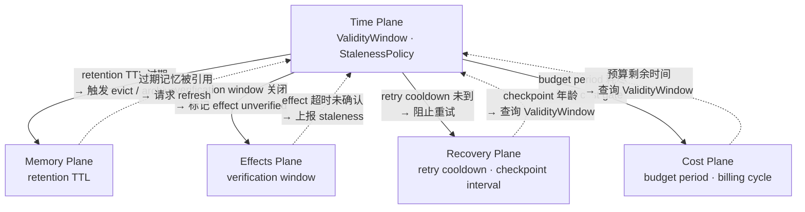

# Time Plane
>
> **所属域**：3. World Modeling — 时序约束与有效期管理
>
> **Evidence Status** — grounded. 基于 Claude Code memoize/compact、Hermes freshness 窗口与 parent_session_id 链、GenericAgent L2 易变状态禁令等生产实现；本文件将时间约束、过期和因果关系统一为横切 plane。

**Principle Refs**: BR-02, IS-03 — 时间推移导致上下文结构性腐化；时间维度上的地图-领土偏差（过期信息被当作当前事实）

Time Plane 统一管理 Agent 系统中所有时间相关的约束、过期和因果关系。

## 1. 核心对象

| 对象 | 职责 | 典型来源 |
|---|---|---|
| `TemporalAnchor` | 任何带时间戳的观察、决策或效果的时间锚点，记录"这个信息是什么时候获取的" | Observation.observed_at、EffectRecord.timestamp、Checkpoint.created_at |
| `ValidityWindow` | 有效期窗口，定义一个对象从创建到过期的生命区间 | World State TTL、Approval valid_until、Memory expiry、Cost budget_period |
| `CausalChain` | 因果链，记录"A 发生在 B 之前，B 依赖 A 的结果"的时序约束 | Effect 序列、Plan 步骤依赖、多步 tool call 的先后关系 |
| `StalenessPolicy` | 过期策略，定义对象超过有效期后的处理方式 | World State stale_policy、Memory review_policy、Cache eviction |

## 2. 对象 Schema

```yaml
temporal_anchor:
  anchor_id: string
  source_object: string          # 关联的 Observation / Effect / Checkpoint ID
  timestamp: datetime
  clock_source: system | harness | external | model_injected
  precision: millisecond | second | minute | approximate

validity_window:
  window_id: string
  target_object: string
  created_at: datetime
  expires_at: datetime | null    # null = 不过期
  ttl: duration | null
  status: active | stale | expired | refreshed

causal_chain:
  chain_id: string
  links:
    - step_id: string
      anchor: temporal_anchor_id
      depends_on: [step_id] | null
      effect_ref: string | null
  ordering_guarantee: strict | best_effort

staleness_policy:
  policy_id: string
  target_type: world_state | memory | approval | capability | cache | plan
  max_age: duration
  on_stale: refresh | degrade | block | notify
  on_expired: refresh | block | drop | escalate
  refresh_strategy: poll | event_driven | on_access
```

## 3. 跨 Plane 映射

| 其他 Plane | 原有属性 | Time Plane 对象 |
|---|---|---|
| World State | freshness, TTL, stale_policy | ValidityWindow + StalenessPolicy |
| Memory | review_policy, expiry | ValidityWindow + StalenessPolicy |
| Effects | timestamp, sequence | TemporalAnchor + CausalChain |
| Recovery | checkpoint_at | TemporalAnchor |
| Approval | valid_until | ValidityWindow |
| Cost | budget_period | ValidityWindow |
| State | step 顺序、plan 过期 | CausalChain + ValidityWindow |
| Identity & Capability | expires_at | ValidityWindow |

映射方向：各 Plane 仍然持有自己的时间字段，Time Plane 提供统一的查询、校验和过期处理接口。各 Plane 不需要自己实现过期扫描和因果校验逻辑。

### 时间约束跨域传播图



**传播规则**：Time Plane 向外推送过期信号（实线），各 Plane 按需回查时间约束（虚线）。当多个约束同时命中时，取最严格的策略。例如 budget period 已耗尽时，即使 retry cooldown 允许重试也应阻止。

## 4. Agent 时间感

LLM 没有内置时钟。模型无法感知两次调用之间过了多久，也无法判断一条 Observation 是 5 秒前还是 5 小时前获取的。Harness 必须主动在上下文中注入时间信息：当前时间、观察年龄（距 observed_at 的时间差）、任务已用时间和剩余预算时间。

长任务中这一点更加关键。一个运行 30 分钟的 Agent，前期获取的 World State 可能已经过期，早期的审批窗口可能已经关闭，预算时间可能所剩无几。Time Plane 的职责是在这些时间约束被违反前发出信号，而非等到写动作失败后才发现快照已过期。

## 5. 时间相关的失败模式

| 失败 | 表现 | 根因 | 修复 |
|---|---|---|---|
| Stale Act | 基于过期快照执行写动作 | ValidityWindow 过期但未检查 | 写动作前强制 freshness gate |
| Expired Approval | 审批已过期但 Agent 仍继续执行 | Approval 的 ValidityWindow 未被 gate 检查 | 在 Action 前校验 approval 时效 |
| Causal Inversion | 步骤 B 先于步骤 A 执行，但 B 依赖 A 的结果 | CausalChain 约束缺失或未执行 | 强制 CausalChain ordering |
| Clock Drift | Harness 注入的时间与外部系统时间不一致 | 多 clock source 未对齐 | 统一使用 Harness 时钟，记录 clock_source |
| Phantom Freshness | 刷新了对象但只更新了时间戳，没有真正重新获取 | refresh 操作只改 metadata | refresh 必须产生新 Observation |

## 6. Freshness 管理的实战模式

"信息什么时候获取的"和"信息还有效吗"是两个问题。前者是 TemporalAnchor，后者是 ValidityWindow。生产系统对这两个问题的回答方式差异很大。

| 项目 | 策略 | 实现细节 | 新鲜度粒度 |
|---|---|---|---|
| Claude Code | `memoize()` 缓存系统上下文 | Git 状态、LSP 诊断等在会话初始化时采集一次，整个会话期间视为不变；仅当 harness 判断上下文可能失效时重新采集 | 会话级（分钟~小时） |
| Hermes | `_AUTO_CONTINUE_FRESHNESS_SECS_DEFAULT = 3600` | 自动续行时检查上次交互距今是否超过 1 小时；超过则视为上下文过期，拒绝自动续行，要求人工确认 | 固定窗口（1 小时） |
| GenericAgent | L2 禁止存储易变状态 | `system_prompt_l2` 明确禁止在 scratchpad 中保留时间戳、PID、临时路径等易变值；违反此规则的写入会被后续步骤覆盖 | 步骤级（每步重新获取） |

共性规则：**refresh-before-act**，在做关键决策（特别是写操作）前，主动刷新而非依赖缓存。Claude Code 在执行文件写入前会重新读取文件内容而非依赖早期缓存；Hermes 在自动续行前检查新鲜度；GenericAgent 每步重新获取环境状态。这是防止 Stale Act 的最低成本手段。

## 7. TTL 策略的工程实现

TTL 不是一个抽象概念，它需要具体的标注、检测和清理机制。

### 7.1 信息过期标注

| 项目 | 过期边界 | 实现 |
|---|---|---|
| Claude Code | compact 操作 | 当上下文接近 token 上限时触发 compact，compact 之前的消息被摘要替代；摘要本身不携带原始时间戳，相当于把过期信息降级为"大致记忆" |
| Hermes | `parent_session_id` 链 | 子会话通过 parent_session_id 链接到父会话；父会话的上下文不会自动传递给子会话，子会话必须从任务描述重建上下文，天然切断了过期信息的传播 |
| GenericAgent | 步骤级重置 | 每个规划步骤独立执行，前一步的工具输出不自动注入后续步骤的上下文；需要跨步骤传递的信息必须显式写入 scratchpad，且受 L2 易变状态禁令约束 |

### 7.2 世界状态刷新触发条件

刷新不应该是定时轮询（浪费），也不应该是"出错了再刷新"（太晚）。生产系统的触发条件：

- **写操作前**：Claude Code 在 Edit/Write 前重新 Read 目标文件，确认内容未被外部修改
- **会话恢复时**：Hermes 检查 freshness 窗口，超时则不自动续行
- **步骤切换时**：GenericAgent 每步重新采集环境状态
- **compact 后**：Claude Code compact 后对关键信息（如当前工作目录、Git 分支）重新注入

## 8. 时序约束在工具调用中的体现

工具调用不是无序的函数调用，它们有隐含的时序依赖。

### 8.1 read-before-write / read-after-write

这是最基本的时序约束：写入前必须读取当前状态（防止覆盖），写入后应读取确认结果（防止静默失败）。

| 约束 | 场景 | Claude Code 实现 |
|---|---|---|
| read-before-write | 编辑文件前必须先读取 | Edit 工具要求当前会话中至少 Read 过目标文件一次，否则直接报错 |
| read-after-write | 确认写入结果 | 写操作完成后 harness 返回操作结果（成功/失败/diff），模型可据此判断是否需要修正 |
| check-before-act | 执行危险操作前确认前置条件 | `git status` 在 commit 前、`ls` 在创建文件前；这些不是建议而是系统提示中的强制规则 |

### 8.2 并发工具调用的时序保证

Claude Code 对并发调用有明确的分级策略：

| 调用类型 | 并发策略 | 原因 |
|---|---|---|
| 读操作（Read, Grep, Glob） | 可并行 | 读操作幂等，不改变世界状态，并行不产生冲突 |
| 写操作（Edit, Write, Bash） | 必须串行 | 写操作有副作用，并行可能导致竞态（如两个 Edit 操作同一文件） |
| 混合调用 | 读可并行，写排队 | 一次 response 中可同时发起多个 Read，但写操作按顺序执行 |

这种分级直接映射到 CausalChain 的 `ordering_guarantee`：读操作是 `best_effort`，写操作是 `strict`。

## 9. 权衡

**集中管理 vs 各 Plane 自管理。** 集中管理的好处是过期策略一致、时间查询有统一接口、跨 Plane 的时效校验不需要各自实现。代价是引入了一个横切依赖，所有需要时间约束的 Plane 都要与 Time Plane 交互。对于简单 Agent（C0-C2），各 Plane 自管理 TTL 就够了；C3 以上，当多个 Plane 的过期策略需要协调时，集中管理的收益才显现。

**时间精度 vs 实现复杂度。** 大多数 Agent 场景不需要毫秒级精度，分钟级甚至"最近 5 分钟内"就足够做过期判断。追求高精度意味着需要处理时钟同步、网络延迟和跨系统时间偏移，这些复杂度在大多数场景中不值得。schema 中保留 precision 字段，让实现者按需选择。

## 10. 关联文档

- `../world-state/overview.md`
- `../effects/overview.md`
- `../recovery/overview.md`
- `../cost/overview.md`
- `../../lifecycle.md`
