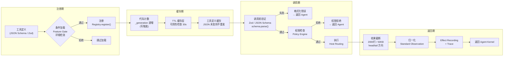
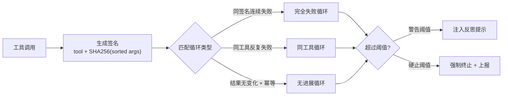
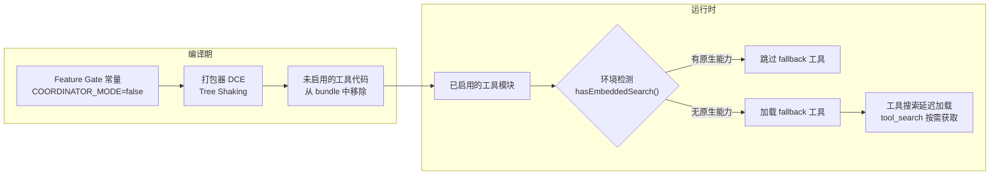
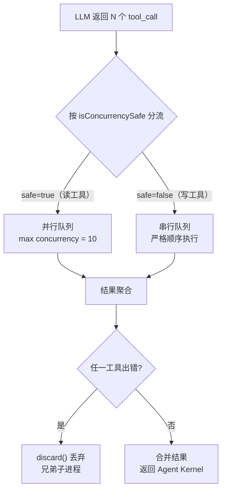
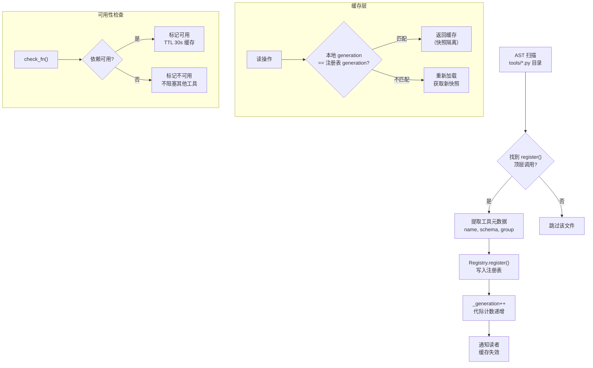
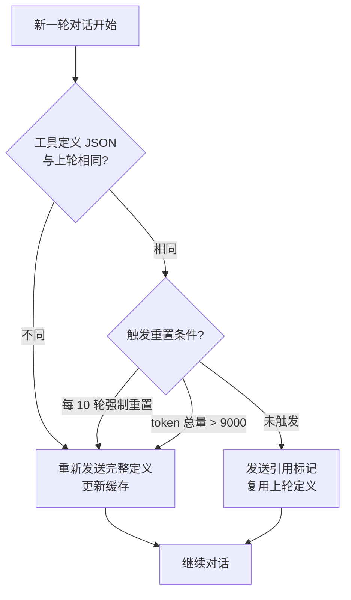
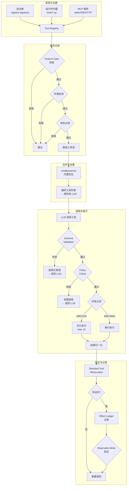

# Tool System
>
> **所属域**：4. Action & Effect — 工具注册与调用边界
>
> **Evidence Status** — production-validated. Claude Code、Codex、OpenCode、Augment、Hermes、VCPToolBox 对 tool registry、schema、risk policy、host layer 的实现；hermes-agent / GenericAgent 对幂等性二分法与循环守卫的生产验证；this repository 对工具边界、效果边界和验证契约的统一抽象。

**Principle Refs**: EM-01, IS-02 — 工具是认知延伸，工具成功 ≠ 世界状态确认。

## 定义

Tool Runtime 管理 Agent 与外部世界交互。工具面决定 Agent 能做什么，工具设计质量决定做得有多可靠。

工具设计的目标是给 Agent 一个稳定、可控、可审计的行动界面。暴露 API 只是起点，把工具调用管到不失控才是终点。

## 模块接口

**输入**：Agent Kernel 的 tool call（tool_id + args + intended_effect）
**输出**：Standard Tool Observation + Effect Candidate
**内部流程**：Schema Validation → Policy Check → Host Routing → Execute → Normalize → Effect Recording → Trace

## 工具注册→调用完整链路

> evidence-status: production-validated. Hermes registry-discovered 模式、Claude Code buildTool 工厂与 Feature Gate、OpenCode Zod schema 验证、GenericAgent 工具定义缓存的综合提炼。

以下流程图展示单次工具调用从定义到返回的端到端链路，每个节点对应一个可审计的阶段：



**链路中的关键决策点**：

| 阶段 | 关键机制 | 失败处理 |
|---|---|---|
| 条件加载 | Feature Gate + 环境检测 + 角色过滤 | 静默跳过，不污染工具池 |
| 代际计数 | 写操作递增 `_generation`，读操作比对代际判断缓存有效性 | 代际不匹配 → 重新加载 |
| 定义缓存 | JSON 序列化比对，未变化则复用（平均节省 90% 工具定义开销） | 每 10 轮或 token > 9000 时强制重置 |
| 调用前验证 | Zod `schema.parse()` 严格校验 | 格式化错误直接返回 Agent，可自定义错误格式 |
| 结果截断 | 超 2000 行或 50KB 截断，支持 head/tail 方向选择 | 截断标记 + 原始引用保留 |

## 工具规格 (Tool Spec)

每个工具必须定义：

```yaml
tool_id: update_ticket
capability_domain: crm
host_layer: local | remote | sidecar | mcp
risk_level: safe | check | approval | forbidden
effect_type: read | write | send | delete | deploy | purchase | notify
input_schema:
  ticket_id: string
  status: string
output_schema:
  updated: boolean
  ticket_snapshot: object | null
permission_required: [crm.write]
idempotent: false
preconditions:
  - actor_has_crm_scope
  - ticket_exists
postconditions:
  - ticket.status == "resolved"
verification_method: read_back
reversibility: reversible | compensatable | irreversible
world_state_refs: [crm.ticket]
consistency_model: strong | eventual | unknown
timeout_ms: 5000
retry_policy:
  max_retries: 1
  retry_on: [timeout, transient_io]
failure_modes: [not_found, permission_denied, timeout, stale_revision]
audit_log: true
trust_policy:
  output_tier: trusted_data | untrusted_data
```

## 设计原则

| 原则 | 含义 |
|---|---|
| Narrow Capability | 工具职责要窄，避免万能工具 |
| Typed Boundary | 输入输出必须结构化 |
| Explicit Risk | 每个工具声明风险等级与 effect type |
| Preconditions First | 写动作前明确需要满足什么 |
| Postconditions Required | 工具设计要告诉系统“成功后世界应该是什么样” |
| Observable Result | 返回值能用于推理、验证和恢复 |
| Idempotency First | 可重复执行的工具优先幂等 |
| Failure Is Data | 失败也要结构化返回 |
| Read-after-Write | 写动作默认需要回读或外部确认 |
| Untrusted Output Handling | 外部文本默认不进入 instruction lane |

## Standard Tool Observation

```yaml
tool_call_id: string
tool_id: string
status: success | failed | partial | blocked
summary: string
result: object
raw_result_refs: []
artifacts:
  - type: file | diff | url | log | screenshot | dom | row
    uri: string
side_effects:
  - type: file_write | api_write | email_send | browser_click | none
failure_mode: string | null
recoverable: boolean
suggested_recovery: string | null
normalized_as: representation_id | null
```

## Effect Ledger

工具调用结束后，不代表任务已经完成。对所有写动作，建议记录 Effect Ledger：

```yaml
effect_id: string
tool_call_id: string
target_system: github | filesystem | crm | email | calendar | browser | robot
world_object_refs: []
intended_effect: string
actual_observation: string | null
verification_status: unverified | verified | failed | partially_verified
verification_evidence: []
rollback_or_compensation: string | null
risk_level: safe | check | approval | irreversible
```

## 常见失败

| 失败 | 表现 | 修复 |
|---|---|---|
| Wrong Tool | 选错工具 | 工具描述优化 + router eval |
| Bad Arguments | 参数错误 | schema validation + 示例 |
| Tool Failure Loop | 失败后重复同一调用 | 幂等性二分法 + 循环守卫（见下节） |
| Output Misinterpretation | 错误理解工具结果 | standard observation + parser |
| Success Without Effect | tool success 但现实没变 | postcondition + read-after-write |

## 生产验证：幂等性二分法与循环守卫

> hermes-agent 的 registry-discovered tool surface 和 GenericAgent 的极简工具集均验证了此模式：工具规模不同，但都必须区分幂等读、变异写和验证动作。

工具必须按幂等性做二分：幂等工具（read_file、search_files、web_search 等）多次调用结果不变；变异工具（write_file、terminal、browser_click 等）每次调用可改变系统状态。这一区分直接决定循环检测策略。对幂等工具，"连续调用结果不变"即可判定无进展；对变异工具，副作用本身算作进展，不能用结果相同来判断卡死。

**签名与检测流程**：



| 循环类型 | 适用范围 | 警告 / 硬止 |
|---------|---------|------------|
| 完全失败循环（同签名连续失败） | 所有工具 | >2 / >5 |
| 同工具循环（任意参数反复失败） | 所有工具 | >3 / >8 |
| 无进展循环（连续结果不变） | **仅幂等工具** | >2 / >5 |

**StepOutcome 模式**（GenericAgent）：工具返回显式三元组 `(data, next_prompt, should_exit)`，不依赖隐式返回值判断是否继续。工具执行本身遵循三段式生命周期 `before_callback → execute → after_callback`，在回调中插入限流、审计和循环计数，把守卫逻辑与业务逻辑解耦。

## 生产验证：编辑工具的多策略级联

> OpenCode 的 5 层替换器级联验证了此模式：编辑工具实现了一条从精确到模糊的降级匹配链。

LLM 生成的编辑指令（old_string → new_string）经常因空白符、缩进、上下文偏移等原因与文件实际内容不完全匹配。硬匹配失败 ≠ 编辑意图错误，因此需要一条逐步放宽约束的级联策略，在精确性与容错性之间取最优平衡。

**级联链**：

```
SimpleReplacer → 直接字符串匹配（零容错，零歧义）
  ↓ 失败
LineTrimmedReplacer → 逐行 trim 后匹配（忽略行首行尾空白）
  ↓ 失败
BlockAnchorReplacer → 多候选块 + Levenshtein 相似度（阈值 0.3）
  ↓ 失败
WhitespaceNormalizedReplacer → 归一化所有空白符后匹配
  ↓ 失败
IndentationFlexibleReplacer → 忽略缩进差异，仅匹配内容骨架
```

**设计要点**：

| 要点 | 说明 |
|---|---|
| 顺序不可逆 | 必须从最精确开始，命中即停；跳过精确层会引入误匹配 |
| 每层可审计 | 返回使用了哪一层、匹配置信度、实际替换位置 |
| 阈值可调 | BlockAnchorReplacer 的 Levenshtein 阈值（0.3）是经验值，过低会拒绝合理编辑，过高会接受危险替换 |
| 失败即数据 | 全部 5 层均失败时，汇总每层的失败原因返回给 LLM，辅助其修正指令 |

此模式的思路是工具层为 LLM 的不精确输出兜底：在工具侧建立多级容错，而非要求 LLM 每次生成完美匹配的编辑指令。

## 生产验证：工具条件加载与 DCE

> Claude Code 的 60+ 内置工具验证了此模式：工具注册按条件裁剪，只暴露当前上下文真正需要的工具。

Agent 可用工具越多，模型选择正确工具的难度越大（tool selection noise）。条件加载通过"编译期裁剪"减少运行时选择空间，同时避免不适用的工具被误调用。

**三种条件加载维度**：

| 维度 | 示例 | 效果 |
|---|---|---|
| Feature Gate | `COORDINATOR_MODE`、`AGENT_TRIGGERS` 等特性开关 | 整组工具按功能模块启停 |
| 环境检测 | `hasEmbeddedSearchTools()` 检测运行时能力 | 有原生搜索时不加载 fallback 搜索工具 |
| 角色过滤 | Sub-agent 禁用部分高权限工具 | 最小权限原则在工具层的落地 |

**buildTool 工厂的保守默认值**：

```yaml
isConcurrencySafe: false   # 默认不允许并发——安全优先
isReadOnly: false           # 默认不标记为只读——强制开发者显式声明
userFacingName: tool_id     # 面向用户的名称与内部 ID 保持一致
```

**去重策略**：所有来源（内置 + MCP + 动态注册）的工具经 `uniqBy(name)` 合并，内置工具优先级最高，防止外部 MCP 服务覆盖核心工具。

**Feature Gate + Dead Code Elimination 深入**（evidence-status: production-validated）：

Claude Code 的条件加载不仅在运行时过滤，还与打包器（bundler）集成实现编译期裁剪：



| 层级 | 机制 | 时机 |
|---|---|---|
| 编译期 DCE | Feature Gate 常量 + Tree Shaking | 构建时，未启用的工具代码不进入产物 |
| 运行时条件加载 | 环境检测 + 角色过滤 | 启动时，按上下文裁剪可用工具集 |
| 延迟加载 | `tool_search` 特性 | 调用时，工具定义按需从延迟列表获取，首次调用前不占内存 |

这三层形成递进裁剪链：编译期去掉不可能用到的，启动时去掉当前不需要的，调用时才加载真正被选中的。

## 生产验证：工具并发控制

> Claude Code 的 StreamingToolExecutor 验证了此模式：工具并发按安全属性分流，而非一律并行。

读工具天然幂等，可安全并行；写工具可能产生状态竞争，必须串行。并发控制粒度在工具注册时通过 `isConcurrencySafe` 标记确定，运行时由执行器统一调度。

**调度规则**：



**StreamingToolExecutor 的关键行为**：

| 行为 | 说明 |
|---|---|
| 流式启动 | 工具参数流式接收时即刻开始执行，不等待完整 JSON |
| 进度优先 | 执行过程中发出进度消息（progress event），供 UI 实时展示 |
| 错误传播 | 任一写工具失败 → discard 同批次所有未完成的并行工具 |
| 超时独立 | 每个工具有独立超时，不共享批次级超时 |

## 生产验证：MCP 工具集成模式

> Claude Code、Codex、Warp、OpenCode 分别验证了 MCP 集成的不同侧面：传输层多样性、信任模型、生命周期管理。

MCP（Model Context Protocol）正在成为 Agent 工具扩展的事实标准，但各项目在传输协议、信任处理、失败策略上的选择差异显著。没有"唯一正确的 MCP 集成方式"，只有适合具体约束的权衡。

**对比矩阵**：

| 项目 | MCP 传输方式 | 信任处理 | 失败策略 |
|---|---|---|---|
| Claude Code | stdio / SSE / HTTP / WebSocket / SDK；5 级配置作用域 | OAuth + XAA 认证 | 重试 + 降级到内置工具 |
| Codex | MCP annotations（destructive / open_world / read_only） | Guardian 评估注解 | 按注解阻断或放行 |
| Warp | Existing MCP（持久）+ Ephemeral MCP（临时）；profile 级 allowlist | 60 秒启动超时 | 非阻塞失败，MCP 不可用不阻塞主流程 |
| OpenCode | StdioClient / SSEClient / HTTPClient；BusEvent 通知工具变更 | 权限规则覆盖 | 事件总线广播变更，动态刷新工具列表 |

**关键设计决策**：

- **持久 vs 临时**：Warp 区分 Existing MCP（随 profile 持久化）和 Ephemeral MCP（单次会话），解决了"用户自定义工具"和"临时集成"的不同生命周期需求。
- **注解驱动信任**：Codex 在工具元数据中标注 `destructive`/`open_world`/`read_only`，由 Guardian 在调用前评估，而非在传输层做信任判定。
- **非阻塞失败**：Warp 的 60 秒启动超时 + 非阻塞失败确保 MCP 服务不可用时不拖垮整个 Agent 启动流程。

## 生产验证：工具自发现与自注册

> Hermes 的 170+ 工具通过 registry-discovered 模式管理，验证了大规模工具集的自动化注册与分组加载。

当工具数量超过几十个，手动维护注册列表不可持续。自发现模式让工具"声明自己的存在"，注册中心只负责收集和分组。

**三阶段自发现流程**：

| 阶段 | 机制 | 说明 |
|---|---|---|
| 自注册 | `registry.register()` 在模块导入时自动执行 | 工具定义与注册合一，减少遗漏 |
| 运行时发现 | 扫描 `tools/*.py` 查找顶层 `register()` 调用 | 新工具文件放入目录即生效，无需修改注册表 |
| 依赖延迟检查 | `check_fn()` 只在工具首次被调用时导入平台库 | 缺少可选依赖不阻塞其他工具加载 |

**AST 工具自发现机制**（evidence-status: production-validated）：

Hermes 通过 AST 解析扫描工具目录，自动发现调用 `register()` 的模块，无需手动维护注册列表。关键组件：



| 机制 | 说明 |
|---|---|
| 代际计数器 `_generation` | 写操作（register/unregister）触发递增，读操作通过代际匹配判断缓存是否有效 |
| TTL 缓存层 | 可用性检查结果缓存 30 秒，避免高频调用 `check_fn()` 的开销 |
| 快照隔离 | 读者获得稳定视图（当前代际的完整工具列表），只有写入才持有锁；读操作无锁 |
| 延迟依赖检查 | `check_fn()` 仅在工具首次被调用时导入平台库，缺少可选依赖不阻塞其他工具 |

**Toolset 分组管理**：170+ 工具按功能域分组（filesystem、web、code_analysis、browser 等），Agent 按任务类型加载对应 toolset，而非全量加载。这与"工具条件加载"模式互补：条件加载解决"加载哪些"，toolset 分组解决"怎么组织"。

## 生产验证：工具定义字符串复用

> GenericAgent 验证了此模式：工具定义在多轮对话中重复发送是主要的 token 浪费来源，缓存 + 周期性重置可大幅降低开销。
>
> evidence-status: production-validated

每轮对话向 LLM 发送的 system prompt 中包含完整的工具定义 JSON。当工具集不变时，这些定义是纯冗余，但直接省略又可能导致模型"遗忘"可用工具。折中方案是缓存 + 条件重发 + 周期性强制重置。

**策略**：



| 策略 | 触发条件 | 说明 |
|---|---|---|
| 缓存复用 | 工具定义 JSON 未变化 | 不重发，节省 token |
| 周期性重置 | 每 10 轮对话 | 防止长对话中工具定义"漂移"或模型注意力衰减 |
| 阈值重置 | token 总量 > 9000 | 上下文过长时清理堆积，避免截断风险 |
| 变更重发 | 工具定义有增删改 | 立即重发完整定义 |

**实测效果**：平均节省 90% 的工具定义 token 开销。在工具集稳定的长对话中（20+ 轮），仅在第 1、10、20 轮发送完整定义，其余轮次复用。

## 工具生命周期全景

以下流程综合了上述所有模式，展示工具从发现到调用的完整链路：



## 设计模式

| 模式 | 详见 |
|---|---|
| Tool Registry | `../../../design-space/patterns/tool-registry.md` |
| Layered Tool Host | `../../../design-space/patterns/layered-tool-host.md` |
| Tool Output Sanitization | `../../../design-space/patterns/tool-output-sanitization.md` |
| MCP Trust Boundary | `../../../design-space/patterns/mcp-trust-boundary.md` |
| Effect Ledger | `../../../design-space/patterns/effect-ledger.md` |

## 参考实现

- **Claude Code**：60+ 工具、并发控制、MCP 客户端，见 `projects/coding-agents/claude-code/execution-layer.md`
- **Codex**：审批 + 沙箱 + orchestrator，见 `projects/coding-agents/codex/`
- **OpenCode**：schema 验证、权限上下文、7 个内置 agent，见 `projects/coding-agents/opencode/tool-system.md`
- **Augment**：Remote / Local / Sidecar / MCP 四层 host，见 `projects/coding-agents/augment/README.md`
- **VCPToolBox**：插件系统和分布式工具，见 `projects/tool-platforms/vcptoolbox/plugin-system.md`

## Trellis: Registry-Driven Platform Tools

> **Evidence**: Trellis AI_TOOLS registry

Trellis 的 AI_TOOLS 不注册工具本身，而是注册"平台能力描述"，从中派生每个平台的 skill/agent/hook 文件。14 个 configurator 从单一 registry 自动生成所有平台配置。参见 `projects/tool-platforms/trellis/platform-registry-configurator.md`。

## OpenClaw: Manifest-First Plugin Discovery

> **Evidence**: OpenClaw 125 extensions

OpenClaw 的 125 个 extension 通过 `openclaw.plugin.json` 声明 capability，runtime 启动时扫描 manifest 决定加载。Plugin SDK boundaries（api.ts facade）强制插件只能通过受控接口访问 core。参见 `projects/personal-assistants/openclaw/plugin-system.md` 和 `patterns/manifest-first-plugin.md`。
