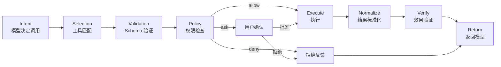
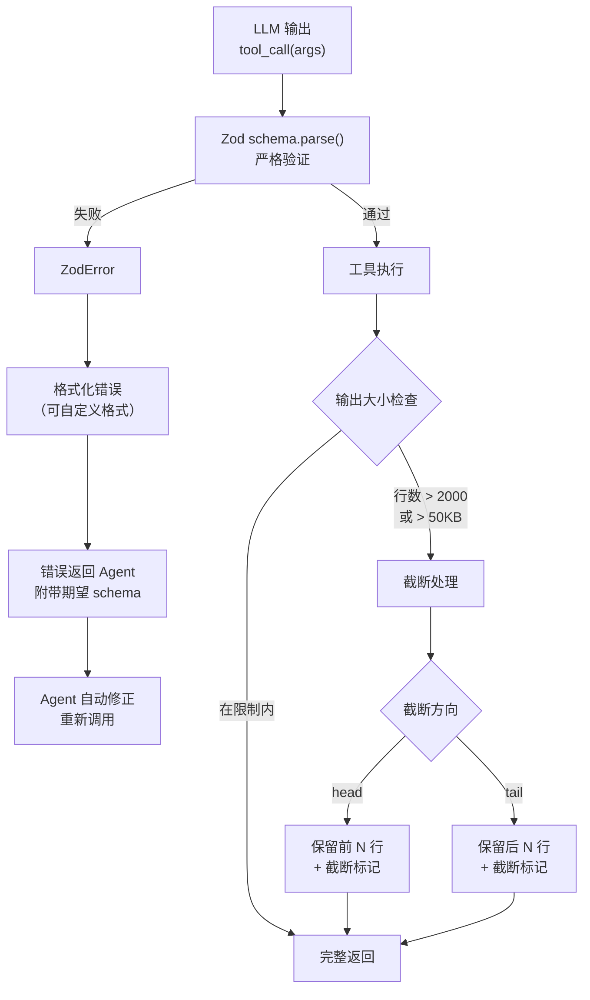
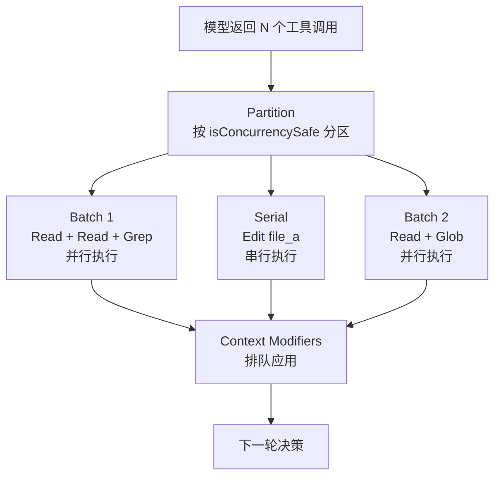
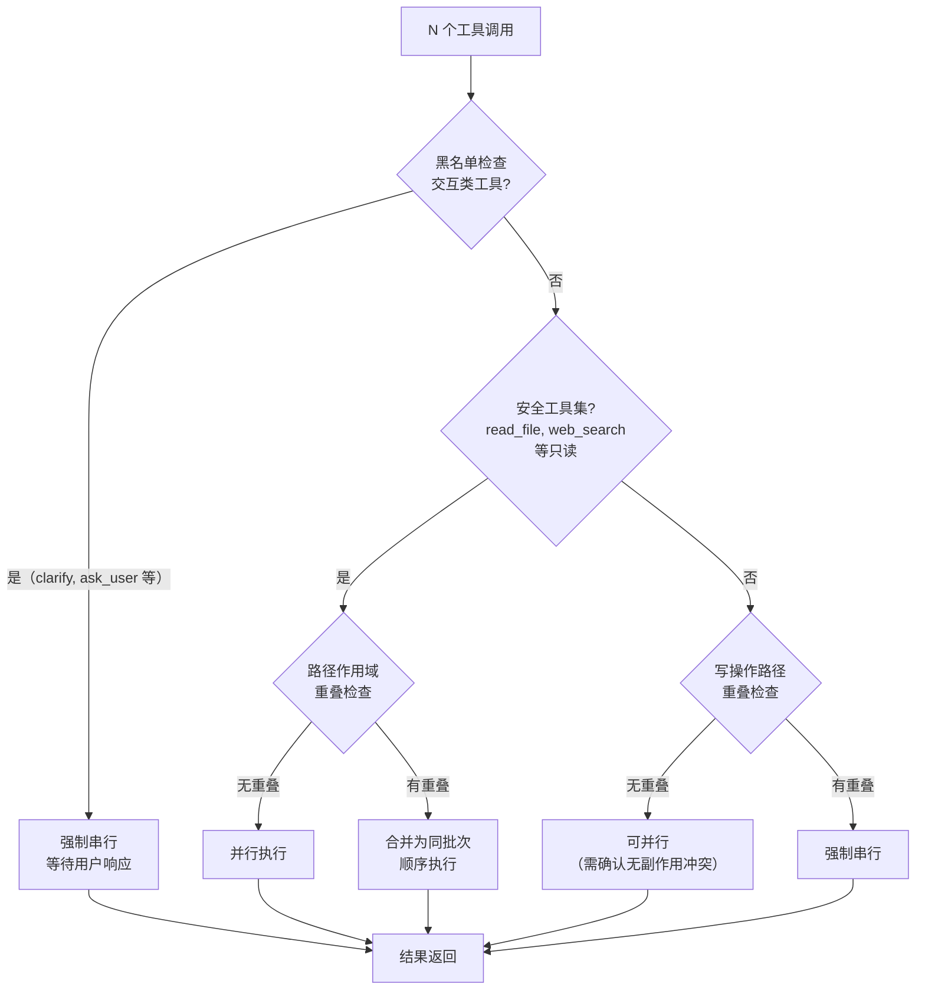

# Tool Use Pattern


> **Evidence Status** — synthesized. 通用运行时模块来自多个参考项目的统一抽象。

## 问题

Agent 需要调用工具完成真实动作，但工具调用容易出现参数错误、工具选错、结果不可读、权限越界。

## 解法

```text
Intent → Tool Selection → Schema Validation → Policy Check → Execute → Normalize → Verify
```

## 伪代码

```python
def use_tool(intent, candidate_tool, args, state):
    tool = registry.resolve(candidate_tool)
    args = tool.schema.validate(args)
    decision = policy.check(tool, args, state)
    if decision == 'deny': return Observation.denied(tool.id)
    if decision == 'ask': return ApprovalRequest(tool.id, args)
    raw = executor.run(tool, args)
    obs = normalizer.normalize(tool, raw)
    trace.record(tool.id, args, obs)
    return obs
```

### 工具调用完整流水线



## 设计要点

- 工具描述说明何时使用、何时不要使用。
- 工具输出结构化，包含 status、summary、evidence、error_type。
- 高风险工具必须经过 Policy Engine。
- 长输出应该 offload，只把摘要和引用放入上下文。

## Schema 验证与输出截断

> evidence-status: production-validated. OpenCode 的 Zod schema 验证 + 输出截断机制。

**核心洞察**：LLM 生成的工具调用参数不可信——即使模型"理解"了 schema，仍会出现类型错误、字段遗漏、格式不符。在工具执行前做严格的 schema 验证，是防御性工具设计的第一道防线。

**验证流程**：



**设计要点**：

| 要点 | 说明 |
|---|---|
| 严格模式 | 使用 `schema.parse()` 而非 `safeParse()`——验证失败即抛错，不允许静默通过 |
| 错误格式化 | ZodError 转换为 Agent 可理解的结构化错误，包含字段路径、期望类型、实际值 |
| 自定义错误 | 支持注册自定义错误格式化器，适配不同 Agent 的错误理解能力 |
| 输出截断 | 2000 行或 50KB 阈值，支持 head（保留开头）和 tail（保留结尾）两种方向 |
| 截断标记 | 截断后附加 `[truncated: N lines omitted]` 标记，Agent 知道输出不完整 |

## 并发分区

某些工具在执行后需要更新共享上下文（如文件状态缓存）。这些更新通过 Context Modifier 机制实现——工具返回一个修改函数，由编排器在批处理完成后统一应用，避免并发修改冲突。

当模型在单轮中返回多个工具调用时，运行时需要决定哪些可以并行执行、哪些必须串行。核心依据是每个工具声明的 `isConcurrencySafe` 标记。只读工具（Read、Grep、Glob 等）通常标记为并发安全；写操作工具（Edit、Write、Bash 等）因为会修改共享状态，必须标记为非并发安全。

运行时按调用顺序扫描工具列表，将相邻的并发安全工具合并为一个批次并行执行，遇到非并发安全工具则隔离为串行块。串行块执行完毕后继续扫描后续调用。这种分区策略在保证安全性的同时最大化了吞吐量。

工具执行完毕后，所有上下文修改器（Context Modifiers）排队在当前批处理全部完成后统一应用。这避免了并行执行的工具之间通过上下文产生竞态条件，确保下一轮决策看到的上下文是一致的快照。



### 并行化决策矩阵

> evidence-status: production-validated. Hermes 的路径作用域检查 + 黑名单串行策略。

仅依赖 `isConcurrencySafe` 标记做二分（并行/串行）是基础策略。生产环境需要更细粒度的决策——同为"可并行"的工具之间，也可能因资源竞争而需要串行化。

**决策流程**：



**决策矩阵**：

| 工具类型 | 路径无重叠 | 路径有重叠 | 决策依据 |
|---|---|---|---|
| 只读工具（read_file, search, grep） | 并行 | 并行（安全） | 幂等，无副作用 |
| 写工具（write_file, patch） | 并行（谨慎） | **串行** | 路径重叠 → 状态竞争 |
| 交互工具（clarify, ask_user） | **串行** | **串行** | 需要用户响应，不可并发 |
| 浏览器工具（browser_click, navigate） | **串行** | **串行** | 共享浏览器状态 |
| 网络工具（web_search, fetch） | 并行 | 并行 | 无状态，幂等 |

**路径作用域检查**：对 `read_file`、`write_file`、`patch` 等文件操作工具，在并行调度前检查目标路径是否重叠。两个 `read_file` 读同一文件是安全的；一个 `read_file` 和一个 `write_file` 指向同一文件则必须串行（先写后读或先读后写，取决于调用顺序）。
