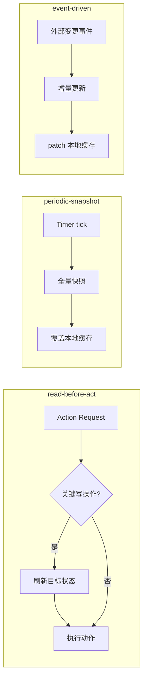

# World State Layer
>
> **所属域**：3. World Modeling — 外部对象的当前状态快照
>
> **Evidence Status** — synthesized. workflow、browser、ops、memory、coding 场景对外部对象状态回读与刷新的一般需求；this repository 对外部对象状态管理的统一抽象。

**Principle Refs**: IS-01, IS-03, BR-02 — Agent 操作模型而非现实，地图与领土可能静默偏离，状态随时间退化。

## 定义

World State Layer 维护 Agent 对外部对象当前状态的**可刷新的快照**。

Task State 关心“任务做到哪一步”；World State 关心“外部对象现在是什么样”。

例如：
- CRM ticket 当前状态是什么？
- Git 分支现在的 HEAD 是什么？
- 页面按钮当前是否可点击？
- 服务器告警现在是否仍在 firing？
- 机器人当前坐标在哪里？

## 模块接口

**输入**：tool readback、sensor reading、API read、DOM snapshot
**输出**：world state snapshot、freshness verdict、conflict signal
**配置**：TTL、refresh policy、consistency model、conflict policy

## Snapshot Schema

```yaml
snapshot_id: string
target: string
object_type: crm.ticket | git.repo | browser.page | server.alert | robot.pose
observed_at: datetime
observed_by: tool_id
state: object
freshness_ttl: duration
confidence: float | null
source: api | human | log | sensor | browser
consistency_model: strong | eventual | unknown
stale_policy: refresh_before_act | allow_if_recent | require_human
```

## 同步策略

三种策略不互斥，生产系统通常组合使用。



| 策略 | 适用场景 | 新鲜度 | 开销 |
|---|---|---|---|
| 读前刷新（read-before-act） | 写操作前、交付前 | 最高 | 每次动作一次 IO |
| 定期快照（periodic-snapshot） | 监控、仪表盘、后台同步 | 取决于间隔 | 固定频率 |
| 事件驱动（event-driven） | Webhook、队列消费、文件 watch | 接近实时 | 仅在变更时触发 |

**组合示例**：Claude Code 以 read-before-act 为主（Edit 前必须 Read），同时在会话初始化时做一次 periodic-snapshot（memoize），compact 后按需 event-driven 重注入关键上下文。

## Stale Snapshot 风险与缓解

基于过期状态做出的决策是 Agent 最常见的静默错误来源之一。

**风险链**：状态过期 → 决策基于错误前提 → 执行"成功"但效果不符合预期 → False Completion。

**缓解手段**：

| 手段 | 实现 | 适用层级 |
|---|---|---|
| freshness TTL 标注 | 每个 snapshot 携带 `freshness_ttl`，超期自动标记 stale | 所有 |
| stale_policy 三级策略 | `warn`：日志告警但允许继续；`block`：阻止基于 stale 数据的写操作；`refresh`：自动触发刷新 | C2+ |
| 双读确认 | 写操作前后各读一次，对比变更是否符合预期 | 高风险场景 |
| etag / 版本号 | 乐观锁，写入时校验版本，冲突则重试 | 多 Actor 场景 |

## 何时必须刷新

| 场景 | 默认策略 |
|---|---|
| 写动作前读取关键业务对象 | refresh_before_act |
| 最终交付前确认状态 | refresh_before_act |
| 最终一致系统（邮件、队列、缓存） | poll_until_timeout |
| 高风险生产变更 | require_human 或 double-check |
| 低风险只读分析 | allow_if_recent |

## 常见失败

| 失败 | 表现 | 修复 |
|---|---|---|
| Stale Snapshot | 基于旧状态继续操作 | ttl + refresh gate |
| State Conflict | 多 Actor 同时修改对象 | etag / optimistic lock |
| False Completion | 任务状态完成，但世界状态未达标 | stop gate 绑定 world state |
| Eventual Consistency Blindness | 刚写完就立刻读空 | poll / backoff / consistency policy |

## 关联文档

- `../state/overview.md`
- `../effects/overview.md`
- `../../../evaluation/effect-evals.md`
