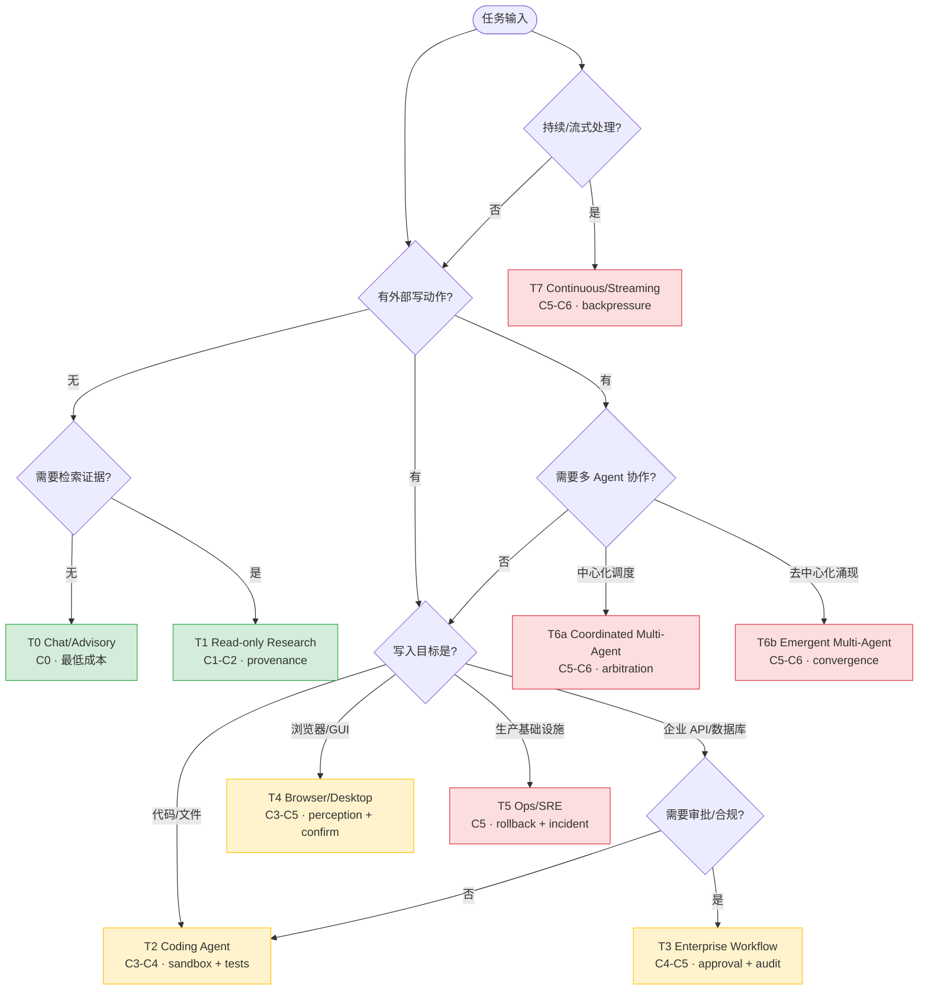

# Reference Topologies

> **Evidence Status** — synthesized. 本知识库 categories 与参考项目中 coding、research、workflow、memory、tool platform 等不同 Agent 类型的模块组合；本知识库对不同风险与执行深度下的 Agent 拓扑归纳。

## 1. 选择顺序

```text
User Job → External Effect Risk → Required Depth → Verification Reachability → Interaction Need → Cost Constraint → Governance Need → Complexity Level → Topology
```

不要为所有 Agent 都堆满全部模块。拓扑由风险、执行深度、外部效果、验证可达性、恢复需求和交互复杂度决定。复杂度等级见 `complexity-levels.md`。

### 拓扑选择决策树



> **图注**：绿色 = 低复杂度（C0-C2），黄色 = 中复杂度（C3-C5），红色 = 高复杂度（C5-C6）。从上到下沿决策路径走，第一个匹配的拓扑即为起点；随后按"模块升级触发器"（第 10 节）按需叠加模块。

## 2. T0：Chat / Advisory Assistant

```text
Interface → Representation(light) → Prompting → Context → Kernel → Response
```

关键模块：representation light、prompting、context、claim caution。

Stop Gate：回答是否清楚，是否承认不确定性，是否没有越权声明。

## 3. T1：Read-only Research Agent

```text
Interface → Representation → Retrieval Tools → Context → Claim Verification → Report
```

关键模块：provenance、untrusted context boundary、claim verification、cost-aware retrieval。

Stop Gate：关键 claim 有来源、时间和不确定性标注。

## 4. T2：Coding Agent

```text
IDE/CLI → Repository Representation → Prompt/Context/State
                                  ↓
                         Tool Runtime → Sandbox Execution
                                  ↓
                       Tests / Diff / Checkpoint → Deliver
```

关键模块：repo representation、sandbox、state、tests、concurrency limits、trace replay。

Stop Gate：diff 符合需求、测试或等价验证通过、无无关修改。

## 5. T3：Enterprise Workflow Agent

```text
Webhook/Chat → Representation → World State
                              ↓
                   Policy / Approval / Interaction
                              ↓
                    API Tool → Effect Ledger → Readback
```

关键模块：identity-aware interface、CapabilityGrant、world state、effect ledger、approval UX、read-after-write、audit、recovery。

Stop Gate：目标对象正确、写入已验证、审批记录存在、用户可理解影响。

## 6. T4：Browser / Desktop Agent

```text
DOM/Screenshot → Representation → Kernel
                              ↓
                    UI Action Tool → DOM/Screenshot Readback
```

关键模块：perception confidence、prompt injection defense、human confirmation for irreversible actions、visual/DOM verification。

Stop Gate：页面状态或后端状态确认，而不是“按钮已点击”。

## 7. T5：Ops / SRE Agent

```text
Alert/Event → Logs/Metrics/Trace Representation → Runbook / Policy
                                                 ↓
                                      Tool Execution → Effect Verification
                                                 ↓
                                      Incident Timeline / Postmortem
```

关键模块：event ordering、rollback, strict approval, service world state, incident trace, shadow-mode eval。

Stop Gate：服务状态恢复或明确升级，所有动作进入 incident timeline。

## 8. T6：Multi-Agent Workflow

T6 包含两种本质不同的协作结构，按协调方式拆分为 T6a 和 T6b。

> 选择指引：中心化任务分配选 T6a Coordinated；去中心化拍卖、辩论或环境信号协调选 T6b Emergent，详见 `paradigms/collaboration-paradigms.md` 去中心化协作形态。

### T6a Coordinated（中心化协调）

```text
Coordinator Agent
  ├─ Research Agent
  ├─ Planning Agent
  ├─ Execution Agent
  └─ Verification Agent
        ↓
 Shared World State + AgentMessage + Arbitration
```

传统的 Coordinator-Worker 模式。存在一个中央调度者，负责任务分解、Worker 分配、结果合并和冲突仲裁。Worker 的自主性限定在子任务范围内。

关键模块：communication protocol、shared world model、identity/capability boundary、conflict arbitration、output contract、concurrency control、cost budget、failure handoff。

Stop Gate：各 Agent 输出可合并、冲突已处理、最终 claim 和 effect 有证据。

### T6b Emergent（去中心化涌现）

```text
Agent ←→ Shared Environment ←→ Agent
Agent ←→ Auction / Debate / Signal ←→ Agent
              ↓
   Emergent Global Behavior
```

没有中央调度者。Agent 通过市场竞标（Market-Based）、结构化辩论（Debate-Based）、环境信号（Stigmergy）或独立投票（Ensemble）实现协调，全局行为从局部交互中涌现。

关键模块：去中心化协议（拍卖 / 辩论 / 信号衰减）、共享环境设计、收敛性监控、信号冲突处理、成本预算（竞标价格需要 Cost Plane 约束）。

Stop Gate 与 T6a 不同——涌现系统没有单一的"合并完成"时刻。替代方案：
- Market-Based：所有拍卖已结算 + 质量审计通过
- Debate-Based：辩论收敛或达到轮次上限 + 裁决产出
- Stigmergy：环境状态稳定（信号变化率低于阈值）
- Ensemble：投票完成 + 一致性检查

详细的去中心化协作形态定义见 `../paradigms/collaboration-paradigms.md` 的"去中心化协作形态"章节。与 `../concepts/agent-typology.md` 中的"涌现协作型"形态对应。

## 9. T7：Continuous / Streaming Agent

```text
Event Stream → Representation Pipeline → Windowed Context / State
                                      ↓
                              Policy / Action / Backpressure
                                      ↓
                              Effect Verification / Flow Metrics
```

关键模块：dataflow、backpressure、state windows、deduplication、cancel/resume、resource scheduling。

Stop Gate：持续系统通常没有一次性 stop gate，而是有 alert gate、handoff gate、incident gate。

## 10. 模块升级触发器

| 触发器 | 必须升级 |
|---|---|
| 有外部写动作 | Effect Ledger + Verification + Recovery |
| 外部状态会变化 | World State + Freshness TTL |
| 输入来自网页/邮件/日志/RAG | Security Trust Lanes |
| 任务超过单轮 | Task State + Checkpoint |
| 需要用户纠错、教学或授权 | Interaction Plane |
| 多 Agent 协作 | AgentMessage + Shared World Model |
| 批量/流式任务 | Dataflow + Backpressure |
| 并发工具调用 | Concurrency + Cancellation |
| 成本敏感 | Cost Plane + Model Routing + Cache |
| 需要跨任务学习 | Memory + Learning Governance |
| 需要上线生产 | Operations + Eval Regression |
| 涉及多租户 | Tenant Isolation + Identity / Capability + Secret Policy |
| 涉及不可逆动作 | Approval + Compensation Plan |


## 11. 验证不可达时的拓扑降级

| 原拓扑 | 不可达原因 | 降级交付 |
|---|---|---|
| T2 Coding Agent | 测试无法运行或依赖不可安装 | diff + 静态检查 + 未运行原因 + 建议命令 |
| T3 Workflow Agent | 外部系统无法 readback | 写入请求状态 + external ack 等待 + human confirm |
| T4 Browser Agent | DOM / screenshot 不一致 | 暂停高风险动作，请求用户确认当前界面 |
| T5 Ops Agent | 指标平台不可用 | 不执行恢复动作，输出 runbook + escalation |
| T6a Coordinated | 子 Agent 输出冲突 | 保留冲突，进入 arbitration，不合并最终结论 |
| T6b Emergent | 群体无法收敛 | 输出各方立场 + 收敛失败原因，不强行选择单一结论 |

## 12. 与复杂度等级映射

| Topology | 推荐复杂度 | 说明 |
|---|---|---|
| T0 Chat / Advisory | C0 | 无工具或只输出建议 |
| T1 Read-only Research | C1-C2 | 证据和 provenance 是关键 |
| T2 Coding Agent | C3-C4 | diff 是外部效果，测试是验证 |
| T3 Enterprise Workflow | C4-C5 | 身份、审批、审计、补偿不可省 |
| T4 Browser / Desktop | C3-C5 | GUI grounding 与不可逆操作控制是核心 |
| T5 Ops / SRE | C5 | 事故时间线、审批和恢复验证是核心 |
| T6a Coordinated Multi-Agent | C5-C6 | 协议、仲裁、成本和共享状态是核心 |
| T6b Emergent Multi-Agent | C5-C6 | 去中心化协议、收敛性保证、信号设计是核心 |
| T7 Continuous / Streaming | C5-C6 | backpressure、heartbeats、incident gates 是核心 |
