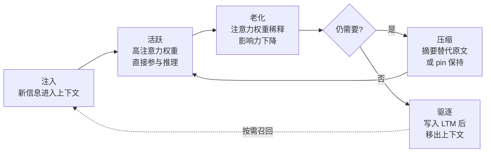

# 上下文窗口动力学——容量限制与注意力分配

> **Evidence Status** — mixed. 认知科学模型（Baddeley/Cowan/Miller/Broadbent/Kahneman）在 LLM Agent 中的工程映射为实践推导。

> **相关视角**：工程实现见 [上下文工程](../concepts/context-engineering.md)。本文聚焦认知模型到工程设计的映射。

## 核心框架

上下文窗口 = **容量限制**（能装多少） + **注意力分配**（怎么分配权重）

这两个维度不可分割：容量决定了注意力的总预算，注意力分配决定了有限容量的利用效率。

```text
上下文窗口
  |
  +-- 容量限制（Token 上限、组块化、压缩）
  |     原理：Miller 7+/-2 chunks、Cowan 4 chunks
  |     对应：Context Plane 的容量管理
  |
  +-- 注意力分配（优先级、显著性、阶段适配）
        原理：Broadbent 过滤、Kahneman 容量模型、Treisman 衰减
        对应：Context Pack 的组装策略
```

---

## 1. 容量限制

### 1.1 组块化是核心杠杆

容量以组块（chunk）计，不以原子 token 计。有效组块化可以在固定容量内装更多信息。

| 认知科学概念 | LLM Agent 对应 | 说明 |
|---|---|---|
| 容量限制 | Token 限制 | 128K/200K tokens 看似很大，但对长任务仍然不够 |
| 组块化 | Context Pack 设计 | 把相关信息打包成结构化组块，比散乱追加高效 |
| 被动衰减 | Context Rot | 早期信息注意力权重下降——信息仍在但被"淹没" |
| 干扰效应 | 新工具输出覆盖旧推理 | 大量工具返回结果可能冲淡之前的推理链 |
| 主动维护 | Pinning / 关键信息标记 | 把重要信息显式保持在上下文中 |

### 1.2 Context Rot 不是"旧信息被删了"

在 Transformer 架构中，早期 token 的注意力权重会随上下文增长而被稀释。Agent 对早期信息的"记忆"逐步退化，类似认知科学中的干扰效应：信息仍在上下文中，但被后续内容"淹没"。

有效对策是：

1. 识别关键信息并主动维护（pinning）
2. 对非关键信息进行组块化压缩
3. 将低频但重要的信息转移到长期记忆（LTM），需要时再检索

### 1.3 多模态容量差异

| 信息类型 | Agent 对应 | 管理策略 |
|---|---|---|
| 文本对话历史 | 主线上下文 | 按对话轮次管理 |
| 截图/图表/UI 状态 | 多模态输入 | Token 成本高，优先用文字描述替代 |
| 跨工具结果的整合视图 | 情景缓冲 | 需要显式构造，不会自动形成 |

---

## 2. 注意力分配

### 2.1 信息进入前过滤（Broadbent 模型）

不是所有工具输出都需要进入 Context Window。在进入深度处理之前先过滤：

```text
工具输出 -> [显著性评估]
  -> 高显著性：原样保留或结构化提取
  -> 中显著性：摘要 + raw ref
  -> 低显著性：仅保留 raw ref，不进入窗口
```

### 2.2 Token 预算分配（Kahneman 模型）

Context Window 的 token 预算就是注意力资源池：

```text
1. 固定分配（pin）：System Prompt、Goal、Constraints     — 持久基线
2. 目标驱动分配：与当前 milestone 相关的 observations    — 即时意图
3. 显著性驱动分配：异常信号、错误、冲突                  — 自动注意
4. 预算余量（10-15%）：处理意外发现和方向调整            — 剩余资源
```

### 2.3 压缩信息的回查（Treisman 模型）

被压缩或摘要化的信息不是完全不可用。如果摘要中出现异常信号（错误码、unexpected 关键词），应触发"回查原文"。这是 Tool Output Offloading 中保留 raw ref 的认知基础。

### 2.4 显著性信号类型

| 信号类型 | 示例 | 处理策略 |
|---|---|---|
| 错误和异常 | exit code != 0、stack trace | 自动提升优先级 |
| 与预期不符 | 搜索预期有结果但为空 | 触发反思 |
| 模式打破 | 前 9 个测试通过、第 10 个异常失败 | 可能暴露边界条件 |
| 安全信号 | 权限错误、认证失败 | 强制注意 + 告警 |

**设计原则**：异常信号的优先级应高于正常的任务相关信息。正常信息确认假设，异常信息可能推翻假设——推翻假设的信息价值更高。

---

## 3. 容量与注意力的协同：Context Pack 组装

### 3.1 组装优先级

| 选择因素 | 策略 | 冲突时优先级 |
|---|---|---|
| 结构优先级 | System Prompt > Goal > Recent > Background | 最高——不可缺省的基线 |
| 显著性 | 异常信号优先（可能推翻假设） | 高 |
| 目标相关性 | 按 goal alignment 排序 | 中 |
| 新鲜度 | 最近的观察优先 | 中 |
| 可靠性 | 高 trust 来源优先 | 默认即可 |

### 3.2 按任务阶段动态重组

不同任务阶段需要不同的上下文内容：

| 阶段 | 上下文侧重 |
|---|---|
| 任务理解 | 用户需求、约束、上下文背景 |
| 方案设计 | 现有架构、相关代码、设计模式 |
| 实现 | 具体文件内容、API 签名、测试用例 |
| 验证 | 测试结果、期望行为、边界条件 |
| 交付 | 变更摘要、影响范围、注意事项 |

### 3.3 Compaction 策略与注意力模型的对应

| Compaction 策略 | 注意力模型 |
|---|---|
| Snip（裁剪工具输出） | Broadbent 过滤——直接丢弃低显著性输出 |
| Micro-summary（微摘要） | Treisman 衰减——保留关键信号，衰减细节 |
| Collapse（折叠历史） | 容量模型的资源回收 |

### 3.4 上下文生命周期



---

## 4. 与运行时模块的映射

| 运行时模块 | 角色 | 设计影响 |
|---|---|---|
| Context Plane | 上下文窗口的容器 | 支持优先级标记、组块化、动态重组；高需求品类用分层压缩 |
| Memory Plane | 长期记忆（LTM） | 通过 retrieval 将信息加载进上下文；检索策略考虑任务阶段 |
| Prompting Plane | 固定分配区 | System Prompt 是"永久 pin"的上下文内容 |
| State Plane | 外化存储（scratchpad） | Scratchpad 文件 = 上下文的溢出区，不受 token 限制 |
| World State Plane | 外部环境的内部表征 | World State 快照是"从外部世界进入上下文的观察" |

Plane 级别的设计影响：

- **Context Plane**：高工作记忆需求（Coding/Security）→ 更积极的分层压缩（Claude Code 三层：auto/reactive/snip）；低需求（Creative/Personal Memory）→ 标准滑窗
- **Memory Plane**：最近工具调用结果短期缓存（GenericAgent 的 working checkpoint）；文件状态的空间表示（Claude Code 的 Git 上下文注入）
- **State Plane**：高刷新频率需求 → 每步 checkpoint（Codex 的 turn-level state）；低刷新频率 → 阶段性 checkpoint（GenericAgent 的 session-level）

---

## 5. 常见反模式

| 反模式 | 症状 | 修正 |
|---|---|---|
| 无限追加 | 上下文越来越长，响应越来越慢 | 引入压缩和驱逐策略 |
| 一刀切截断 | 截断后 Agent 重复已完成的工作 | 截断前写入 LTM，保留摘要 |
| 全量 pin | 所有信息都标为高优先级 | pin 数量应有上限，定期审计 |
| 忽略阶段转换 | 进入实现阶段仍保留大量需求讨论 | 阶段切换时触发 Context Pack 重组 |
| 注意力均匀分布 | 关键信号被淹没 | 引入显著性评估和优先级分配 |
| 纯目标驱动 | 忽略异常信号 | 为异常信号保留自动注意力通道 |
| 注意力僵化 | 阶段变了关注没变 | 阶段转换时重新评估分配 |
| 预算耗尽 | 无法处理新信息 | 保留 10-15% token 余量 |
| 摘要丢失异常 | 压缩时丢弃了错误信号 | 压缩策略显式保留异常信号 |

---

## 6. 检查清单

```text
上下文管理是否区分了信息优先级（pin / keep / compress / evict）？
是否有从上下文到 LTM 的溢出路径？
上下文压缩是否保留了恢复/检索的能力？
Context Pack 是否根据任务阶段动态调整？
是否监控了 Context Rot 的信号（如重复询问已提供的信息）？
多模态信息是否有差异化的保留策略（截图 vs 文字）？
是否显式构造了跨工具结果的整合视图？
工具输出进入上下文前是否经过显著性评估？
异常信号是否自动获得更高的注意力权重？
压缩后的摘要是否保留了 raw ref 以便回查？
```

---

## 延伸阅读

- `../concepts/context-engineering.md` — 上下文工程
- `metacognitive-control.md` — 反思决策中的注意力
- `../design-space/patterns/compaction.md` — Compaction 策略
- `../design-space/patterns/tool-output-offloading.md` — 工具输出卸载
- `../design-space/patterns/scratchpad-progress-file.md` — Scratchpad 模式
- `../design-space/patterns/checkpoint-hydration.md` — 上下文恢复模式
- `../architecture/planes/state/overview.md` — State Plane 作为外化存储
- `../paradigms/memory-paradigms.md` — 记忆范式选择
