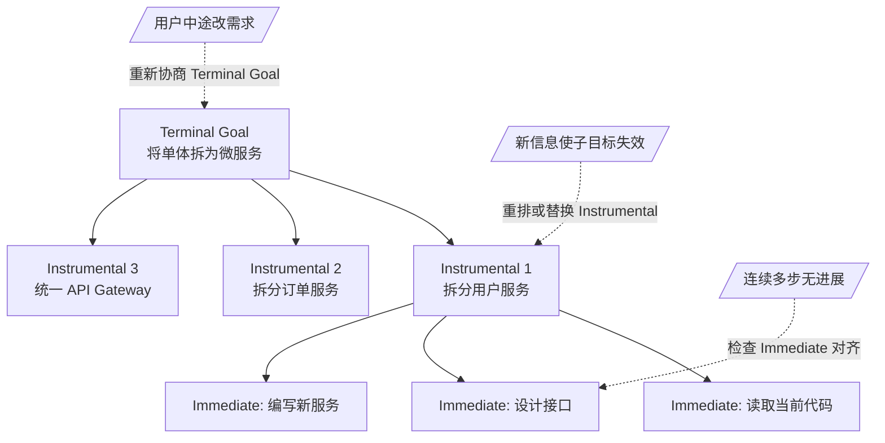

# 目标层级与冲突解决

> **Evidence Status** — mixed. 目标层级理论来自经典 AI（BDI 架构、HTN 规划），冲突解决映射为 LLM Agent 实践推导。

## 1. 为什么需要这篇

Agent 在执行过程中经常出现"方向偏移"：用户说"帮我重构这个模块"，Agent 开始修改，中途发现一个 bug 就去修 bug，修完 bug 又发现测试不通过就去改测试，最后偏离了重构目标。这往往是**目标管理**的问题：Agent 缺少清晰的目标层级和冲突解决机制。当然也可能叠加工具调用粒度不当、上下文窗口遗忘等因素，但目标层级缺失是最常见的主因。

## 2. 三层目标结构

### 2.1 Terminal Goal（终极目标）

用户最终想要什么。通常在任务开始时确立，贯穿整个执行过程。

- 例："将单体服务拆分为微服务架构"
- 特征：相对稳定、可能模糊、需要操作化才能执行
- 对应：TaskEnvelope.success_criteria、User Job

### 2.2 Instrumental Goal（工具性目标）

为达成终极目标需要完成的子目标。一个终极目标通常分解为多个工具性目标。

- 例："先拆分用户服务" "再拆分订单服务" "最后统一 API Gateway"
- 特征：可拆解、有依赖关系、可能需要动态调整
- 对应：Task Graph 中的 milestone、Plan-Execute 中的 step

### 2.3 Immediate Goal（即时目标）

当前这一步要做什么。直接驱动下一个 ToolCall。

- 例："读取 UserService.java 的当前实现"
- 特征：具体、可执行、生命周期短
- 对应：当前 ToolCall 的意图

### 2.4 三层关系与调整触发



关键原则：**每个即时目标都应该能沿层级向上追溯到终极目标**。如果一个 ToolCall 的意图无法与任何 instrumental goal 关联，它很可能是目标漂移。

动态调整的三类触发：用户中途改变需求时需要重新协商 terminal goal；执行中发现新信息使原子目标不再合理时需要重排 instrumental goal；连续多步未见进展时需要检查 immediate goal 是否仍与上层对齐。

## 3. 目标冲突的类型

### 3.1 层级冲突

即时目标与更高层目标矛盾。

| 场景 | 即时目标 | 终极目标 | 冲突 |
|---|---|---|---|
| Debug 偏移 | 修复发现的 bug | 重构模块 | 修 bug 不在重构范围内 |
| 过度优化 | 优化这个函数性能 | 快速交付 MVP | 优化和交付速度矛盾 |
| 安全违规 | 删除这个文件清理空间 | 保持系统稳定 | 文件可能被其他模块依赖 |

### 3.2 平级冲突

两个 instrumental goal 互相排斥。

- "提高代码覆盖率" vs "减少测试维护成本"
- "兼容旧 API" vs "设计更好的新接口"
- "使用最新依赖" vs "保持构建稳定性"

### 3.3 时间冲突

短期效率与长期维护性的矛盾。

- 硬编码 vs 抽象——现在快但以后改不动
- 跳过测试 vs 写测试——现在慢但以后稳
- 临时补丁 vs 根因修复——现在能用但技术债累积

## 4. 冲突解决策略

三种策略中，**层级优先**是实践中最常用的默认策略，大多数目标漂移问题通过"检查当前动作是否服务于上层目标"就能拦截。约束满足适用于平级冲突，放弃与报告则是兜底。

### 4.1 层级优先

```text
Terminal Goal > Instrumental Goal > Immediate Goal
```

当低层目标与高层目标冲突时，低层让步。具体操作：

1. 在执行即时目标前，检查它是否与当前 instrumental goal 对齐
2. 在调整 instrumental goal 前，检查是否仍然服务于 terminal goal
3. 如果 terminal goal 本身需要调整，那是用户的决策，不是 Agent 的

### 4.2 约束满足

在约束范围内找到满足多个目标的方案。

```text
场景：提高覆盖率 vs 减少维护成本
约束满足方案：只为核心路径写测试，边缘情况用 property-based testing 覆盖
```

这要求 Agent 能识别目标之间的张力，并寻找帕累托最优解，而不是简单二选一。

### 4.3 放弃与报告

当冲突不可调和时，停下来请求人工决策。

```text
触发条件：
- 两个高层目标明确矛盾且没有折中方案
- 需要变更 terminal goal 的定义
- Agent 不确定用户在冲突中的优先级偏好
```

Agent 应该知道自己的决策边界。主动上报优于静默做出可能错误的取舍。

## 5. 与知识库的映射

| 知识库组件 | 目标层级角色 | 设计影响 |
|---|---|---|
| TaskEnvelope.success_criteria | Terminal Goal 的操作化 | 定义明确的成功标准，避免目标模糊 |
| Task Graph / Milestone | Instrumental Goal 的结构化 | 子目标之间的依赖和顺序 |
| ToolCall | Immediate Goal 的执行 | 每个 ToolCall 应该有明确的 intent |
| Interaction Plane 的 intent-alignment | 检测目标漂移 | 定期检查当前行动是否仍服务于用户意图 |
| Control Plane | 防止即时目标违反终极约束 | 安全边界、权限约束作为不可违反的终极约束 |
| Reflection 范式 | 目标对齐检查的执行时机 | 反思阶段应包含"当前行动是否仍在正轨"的检查 |

## 6. 设计启发

### 6.1 目标漂移检测

Agent 应在以下时机检查目标对齐：

- 每完成一个 instrumental goal 后
- 连续多步未产生可观察进展时
- 发现新信息导致原计划假设不成立时
- 用户给出新指令或反馈时

### 6.2 目标的显式表示

目标不应该只存在于 prompt 的自然语言中。一种可行的外化格式：

```text
[Terminal Goal] 将单体拆为微服务
[Current Instrumental Goal] 拆分用户服务 (2/3)
[Current Immediate Goal] 编写 UserService 的 gRPC 接口定义
[Alignment Check] 当前步骤服务于用户服务拆分，对齐终极目标
```

将目标结构外化到 State Plane 或 Scratchpad 中，使目标管理可观察、可审计。

### 6.3 检查清单

```text
Terminal Goal 是否有明确的 success_criteria？
每个 Instrumental Goal 是否能追溯到 Terminal Goal？
每个 Immediate Goal 是否能追溯到 Instrumental Goal？
是否有目标漂移检测机制？
平级冲突是否有明确的优先级规则或升级路径？
```

## 7. 对运行时 Plane 的设计影响

### State Plane
- Terminal Goal → TaskEnvelope.success_criteria
- Instrumental Goal → Plan 中的子目标列表
- Immediate Goal → 当前 step 的 action intent
- 目标冲突 → TaskState 中需要 conflict_record 字段

### Control Plane
- 目标优先级 → 决定哪些工具调用需要审批（高优先级目标允许更多自主权）
- 目标降级 → 当 cost/time 超预算时，自动从 Terminal 降级到 Instrumental

### Recovery Plane
- 目标失败分类：Terminal 失败 = 任务失败；Instrumental 失败 = 可重规划；Immediate 失败 = 可重试

## 8. 目标设定与监控

> 来源：Gulli (2025) *Agentic Design Patterns*, Ch11.

### SMART Goals 框架

Agent 目标应满足 SMART 原则：

| 属性 | 含义 | Agent 映射 |
|---|---|---|
| **Specific** | 具体明确 | TaskEnvelope.success_criteria 不含模糊表述 |
| **Measurable** | 可量化 | 有明确的验证条件（测试通过、输出格式、数值范围） |
| **Achievable** | 可实现 | 在当前工具和权限范围内可完成 |
| **Relevant** | 与主目标相关 | Instrumental Goal 直接服务于 Terminal Goal |
| **Time-bound** | 有时限 | resource_plan 中有 max_time 或 max_steps |

### 进展监控

监控 Agent 是否偏离目标的信号：

- 工具调用序列与 Plan 的偏离度（→ trajectory evaluation）
- 子目标完成率随 step 数的变化曲线
- 成本消耗率 vs 目标完成进度的比值
- 用户中断频率（高中断 = 目标可能不清晰）

反馈循环：监控 → 偏离检测 → course correction（重规划 / 回退到上级目标 / 请求澄清）。

## 9. 延伸阅读

- Bratman, M. (1987). *Intention, Plans, and Practical Reason* -- BDI 架构的理论基础
- Erol, K. et al. (1994). "HTN planning: Complexity and expressivity" -- 层级任务网络
- `paradigms/control-paradigms.md` -- 控制范式中的目标管理
- `architecture/planes/control/overview.md` -- Control Plane 的约束实现
- `architecture/planes/interaction/trust-escalation.md` -- 何时升级给人工
- `design-space/patterns/milestone-gated-execution.md` -- Milestone 门控执行
