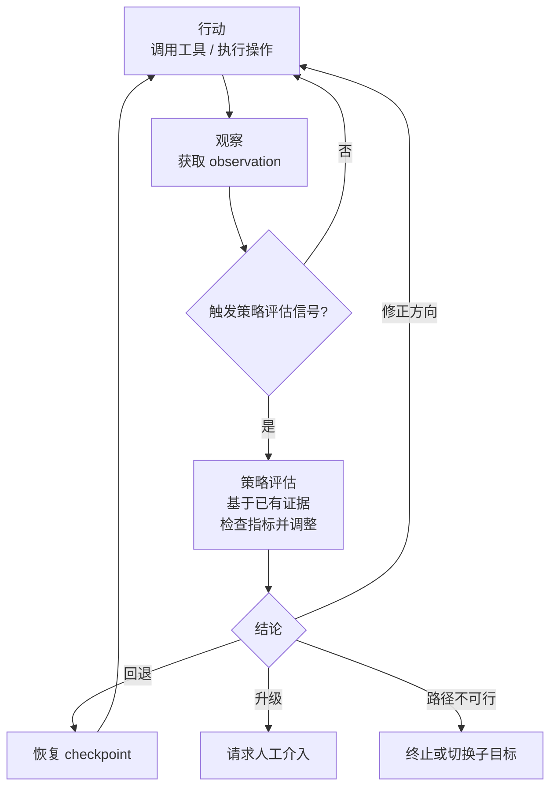

# 元认知控制——Agent 何时该进行策略评估、何时该行动

> **Evidence Status** — mixed. 元认知理论来自认知心理学（Flavell、Nelson & Narens），LLM Agent 中的映射为工程实践推导。

## 1. 核心问题

Agent 在执行过程中需要不断做一个元决策：

```text
"我应该继续行动，还是停下来做策略评估？"
```

这个决策不关乎任务本身，而关乎"当前执行过程是否在正轨"。这就是元认知（metacognition）：Agent 对自身执行过程进行运行时指标检查并据此调整策略的机制。

## 2. 行动 vs 策略评估的 Tradeoff

### 2.1 过度行动

Agent 一直调用工具但不检查方向是否正确。

```text
症状：
  Step 1: 读文件 A → 没找到想要的内容
  Step 2: 读文件 B → 没找到想要的内容
  Step 3: 读文件 C → 没找到想要的内容
  ...
  Step 15: 读文件 O → 还是没找到

问题：Agent 在第 3 步就应该停下来做策略评估——"我的搜索策略是否正确"
```

这就是 ReAct 漫游：Agent 在行动空间中随机游走，每一步都"合理"但整体没有方向。

### 2.2 过度策略评估

Agent 一直在"想"但不动手验证。完整的验证策略（包括超越 postcondition 的方式）见 [超越验证](../concepts/beyond-verification.md)。

```text
症状：
  Thought: 可能是 A 的问题
  Thought: 但也可能是 B
  Thought: 如果是 A，那么 C 也会受影响
  Thought: 但 C 受影响的前提是 D 为真
  Thought: D 是否为真取决于...
  ...
  [20 轮 thought，0 次工具调用]

问题：Agent 在第 2 步就应该终止评估、调用工具去验证 A 或 B
```

这就是无限评估循环：Agent 在推理空间中打转，每一步都"有道理"但没有新证据进入。

### 2.3 平衡点

```text
行动应该产生新的 observation（工具输出、状态变化、错误信号）
策略评估可能导致：更换工具、调整目标分解、请求用户澄清、
                  或判断当前路径不可行并终止

如果行动不产生新 observation → 停下来做策略评估
如果策略评估不改变后续行动 → 停止评估去行动
```

### 2.4 行动-策略评估循环



## 3. 触发策略评估的信号

Agent 不应该在每一步都做策略评估（成本太高），也不应该永远不做（方向会偏）。以下信号提示"该进行运行时指标检查了"：

| 信号 | 典型表现 | 对应知识库 |
|---|---|---|
| 进展停滞 | 连续 N 步 TaskState 无变化；ToolCall 返回相似空结果 | `loop-detection.md` |
| 置信度下降 | 之前的假设被推翻；新观察与预期矛盾 | -- |
| 意外结果 | 文件不存在；测试不该通过却通过了；API 返回意外格式 | -- |
| 计划偏离 | 原计划 5 步现在第 10 步；修改文件数远超预期 | -- |
| 用户反馈 | "不是这个意思"；用户给出新方向 | -- |
| 资源超支 | Token 消耗过半但任务完成不足 25% | `depth-budgeting.md` |

关键判断：意外结果不一定是错误，但它意味着 Agent 的世界模型与现实不一致。应先将意外纳入已有证据、修正假设，再决定下一步行动。

## 4. 策略评估后的行动选择

策略评估的价值在于它导致的后续动作：可能是策略调整，也可能是确认"当前路径不可行"并及时止损。后者同样是有效的评估产出，比起继续在死路上消耗资源，尽早终止或升级本身就是合理的策略选择。

### 4.1 修正方向

改变策略或工具选择，继续推进。

```text
评估前：用 grep 逐文件搜索关键词
评估后：改用 AST 分析工具精确定位符号引用
```

这是最常见的策略评估结果：方法不对，换一个方法。

### 4.2 回退

回到上一个已知正确的状态（checkpoint），从那里重新出发。

```text
评估前：基于错误假设修改了 3 个文件
评估后：撤销修改，回到修改前的状态，基于新假设重新开始
```

对应知识库：`design-space/patterns/checkpoint-hydration.md`

### 4.3 升级

请求人工介入。

```text
触发条件：
  - Agent 多次策略评估后仍无法找到有效策略
  - 问题超出 Agent 的能力边界
  - 决策需要业务判断而非技术判断
```

升级不是失败。过晚升级（继续浪费资源）比过早升级（打断用户）代价更大。

### 4.4 放弃当前子目标

切换到可行的替代路径。

```text
评估前：尝试通过修改源码修复问题
评估后：发现源码修改影响面太大，改为在配置层面 workaround
```

对应知识库：`cognitive-architecture/goal-hierarchy.md` 中的目标冲突解决。

### 4.5 范式切换

从当前推理范式切换到更适合的范式。

```text
评估前：使用 ReAct 逐步探索
评估后：发现问题可以分解为独立子任务，切换到 Plan-Execute
```

对应知识库：`paradigms/paradigm-routing.md`

## 5. 元认知控制的实现层次

| 层次 | 控制方式 | 成本 | 适用场景 |
|---|---|---|---|
| 硬编码 | 固定规则（如"超过 10 步必须做策略评估"） | 最低 | 简单场景、已知的常见问题 |
| 启发式 | 基于信号的条件触发 | 中等 | 多数生产场景 |
| 自适应 | Agent 自己决定何时做策略评估 | 最高 | 高度不确定的探索任务 |

推荐：以启发式为主，硬编码兜底，在有限范围内允许自适应。

```text
硬编码兜底：
  - 连续 N 步无进展 → 强制策略评估
  - 资源消耗超预算 → 强制策略评估
  - 用户反馈负面 → 强制策略评估

启发式触发：
  - 置信度变化 → 建议策略评估
  - 意外结果 → 建议策略评估
  - 计划偏离 → 建议策略评估

自适应空间：
  - Agent 可以选择在启发式触发后立即评估还是再观察一步
  - Agent 可以选择评估的深度（快速检查 vs 全面回顾）
```

## 6. 与知识库的映射

| 知识库组件 | 元认知角色 | 关系 |
|---|---|---|
| Reflection 范式 | 策略评估循环的一种实现方式 | 本文讨论何时做评估，Reflection 讨论如何做评估 |
| paradigm-routing | 范式级别的元认知控制 | 策略评估可能导致范式切换 |
| loop-detection pattern | 触发策略评估的信号之一 | 进展停滞 → 触发策略评估 |
| depth-budgeting pattern | 资源层面的元认知约束 | 预算超支 → 触发策略评估 |
| Recovery Plane | 策略评估后的恢复行动 | 回退、升级、放弃的运行时实现 |
| checkpoint-hydration pattern | 回退策略的实现 | 策略评估后选择回退时的具体操作 |
| Control Plane | 元认知的硬编码兜底 | 不可违反的约束和强制停止 |

## 7. 设计启发

### 7.1 策略评估应该有证据

策略评估是基于已有证据和运行时指标重新评估策略，而非模糊的"再想想"。

```text
差的策略评估：
  "让我重新想想... 也许应该试试别的方法"

好的策略评估：
  "最近 5 步都在搜索文件但没找到目标。
   已有证据：grep 'functionName' 在 src/ 下没结果。
   新假设：函数可能被重命名了，或在其他目录。
   新策略：搜索函数的调用者，从调用链反向定位。"
```

### 7.2 策略评估应该有时间预算

不要让策略评估变成另一种形式的漫游。

```text
评估预算：
  快速检查（1 步）：检查目标对齐、进展评估
  标准评估（2-3 步）：回顾证据、修正假设、调整策略
  深度回顾（5+ 步）：仅在重大卡点时使用，且需要新证据输入
```

### 7.3 检查清单

```text
Agent 是否有明确的策略评估触发机制？
触发评估后是否有结构化的评估流程（不是自由联想）？
评估是否基于证据和运行时指标而不是猜测？
评估是否有时间/步骤预算？
评估后是否有明确的行动选择（修正/回退/升级/放弃/切换）？
是否有硬编码兜底防止永远不做策略评估？
是否有机制防止过度评估（评估循环）？
```

## 8. 延伸阅读

- Flavell, J. H. (1979). "Metacognition and Cognitive Monitoring" *American Psychologist* -- 元认知概念的奠基
- Nelson, T. O. & Narens, L. (1990). "Metamemory: A Theoretical Framework and New Findings" -- 元认知运行时指标检查与控制的框架
- Shinn, N. et al. (2023). "Reflexion: Language Agents with Verbal Reinforcement Learning" -- LLM Agent 中的策略评估循环机制
- `paradigms/reasoning-paradigms.md` -- 推理范式（含 Reflection）
- `paradigms/paradigm-routing.md` -- 范式路由
- `design-space/patterns/loop-detection.md` -- 循环检测
- `design-space/patterns/depth-budgeting.md` -- 深度预算
- `design-space/patterns/checkpoint-hydration.md` -- 检查点恢复
