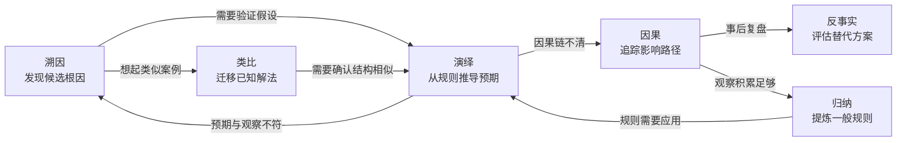

# 推理模式——不只是"什么时候调工具"

> **Evidence Status** — mixed. 推理模式分类来自逻辑学和认知科学，与 LLM Agent 任务类型的映射为实践观察总结。

## 1. 为什么需要这篇

`paradigms/reasoning-paradigms.md` 回答的是"用 ReAct 还是 Plan-Execute"——这是推理的**组织方式**。但一个 ReAct 循环内部，Agent 具体在做什么类型的推理？当 Agent 看到一个错误日志时，它是在做演绎（从规则推结论）还是溯因（从结果推原因）？这个区分直接影响 prompt 设计、evidence 要求和错误倾向。

## 2. 六种推理模式

> **注**：下文"LLM 表现"评估基于 2024-2025 年 frontier 模型（GPT-4 级别及以上）的实践观察，不代表所有模型。小参数模型或微调模型的表现可能显著不同。

### 2.1 演绎推理（Deduction）

从一般规则到具体结论。

```text
前提：所有 Python 3.12+ 的项目应使用 type hints
观察：这个项目使用 Python 3.13
结论：这个项目应使用 type hints
```

- 特征：结论的可靠性取决于前提的正确性
- LLM 表现：较强——frontier 模型在训练数据中见过大量规则应用场景
- 风险：前提可能过时或不适用于当前上下文

### 2.2 归纳推理（Induction）

从具体观察到一般规则。

```text
观察：这 5 个 API endpoint 都返回 JSON
推断：这个服务的 API 可能都返回 JSON
```

- 特征：结论是概率性的，样本量影响可靠性
- LLM 表现：中等——模型能做模式识别，但容易过度泛化
- 风险：少量观察就跳到结论（hasty generalization）

### 2.3 溯因推理（Abduction）

从结果推最佳解释（inference to the best explanation）。

```text
观察：CI 在 lint 阶段失败，错误是 "import not found"
候选解释：(a) 包未安装 (b) import 路径错误 (c) 包名拼写错误
最佳解释：检查 requirements.txt 发现包确实缺失 → 选 (a)
```

- 特征：可能有多个解释，需要通过证据排除
- LLM 表现：偏弱——模型倾向于跳到第一个看似合理的解释，而非系统枚举候选
- 风险：confirmation bias，过早锁定一个假设
- **这是 Debug 的核心推理模式**

### 2.4 类比推理（Analogy）

从相似情境迁移知识。

```text
已知：上次 React 组件渲染空白是因为 useEffect 依赖数组遗漏
当前：这个 React 组件也渲染空白
迁移：检查 useEffect 依赖数组
```

- 特征：依赖于正确识别两个情境的结构性相似
- LLM 表现：较强——大量训练数据提供了丰富的类比基础，但对领域特异性类比可能失效
- 风险：表面相似但结构不同（false analogy）——模型尤其容易在跨领域类比中犯此错误

### 2.5 因果推理（Causal）

理解和追踪因果关系。

```text
修改：在 config.yaml 中更改了数据库连接池大小
效果：API 响应时间从 200ms 降到 50ms
因果：连接池增大 → 减少连接等待 → 响应加快
```

- 特征：区分相关性和因果性
- LLM 表现：中等——模型能描述因果关系，但容易混淆相关性和因果性
- 风险：post hoc ergo propter hoc（在此之后因此因为此）

### 2.6 反事实推理（Counterfactual）

如果当时做了不同选择会怎样。

```text
实际：Agent 基于过期的 World State 做了决策，导致冲突
反事实：如果当时先刷新了 World State，就不会基于过期数据决策
教训：高风险操作前应 refresh World State
```

- 特征：用于事后分析和策略改进
- LLM 表现：中偏强——模型善于生成替代场景，但难以评估其可行性
- 风险：反事实场景可能不可验证

## 3. 推理模式与任务类型的关系

| 任务类型 | 主要推理模式 | 次要推理模式 | 说明 |
|---|---|---|---|
| Debug / Troubleshoot | 溯因 + 因果 | 类比 | 从症状推原因，沿因果链定位 |
| Code Review | 演绎 + 归纳 | 类比 | 规则检查 + 模式识别 |
| Architecture Design | 类比 + 因果 + 反事实 | 演绎 | 参考已有架构 + 预判变更影响 |
| Research / 信息收集 | 归纳 + 溯因 | 演绎 | 从多个来源归纳 + 寻找最佳解释 |
| Recovery / 故障恢复 | 反事实 + 因果 | 溯因 | 分析什么出错了 + 如何避免 |
| Testing | 演绎 + 反事实 | 归纳 | 从规格推用例 + 探索边界 |

## 4. 与 reasoning-paradigms.md 的互补

```text
reasoning-paradigms.md     本文
"推理怎么组织"             "推理的内容是什么"
ReAct / Plan-Execute       演绎 / 溯因 / 类比 / ...
选择循环结构               选择推理策略
```

实际执行中，推理模式之间存在典型的切换路径——某种模式的输出往往触发下一种模式：



一个 ReAct 循环中可能同时包含多种推理模式：

```text
Thought: 测试失败了，错误是 NullPointerException    ← 观察
         上次类似错误是因为依赖注入缺失              ← 类比推理
         如果是依赖注入问题，应该在 @Autowired 处报错 ← 演绎推理
         但实际错误在 service 层，不是注入层          ← 溯因推理（排除假设）
         检查 service 方法的输入参数                  ← 新行动方向
Action:  Read ServiceImpl.java
```

## 5. 对 Prompt 设计的影响

不同推理模式需要不同的 prompt 策略：

| 推理模式 | Prompt 策略 | Evidence 要求 |
|---|---|---|
| 演绎 | 明确给出规则和前提 | 前提的来源和适用范围 |
| 归纳 | 提供足够多样的样本 | 样本的代表性和数量 |
| 溯因 | 要求列出多个候选假设再逐一排除 | 每个假设的支持/反对证据 |
| 类比 | 提供参考案例和关键差异点 | 类比的结构性相似度 |
| 因果 | 要求追踪因果链，区分相关和因果 | 干预实验或逻辑推导 |
| 反事实 | 明确区分"已发生"和"假设场景" | 反事实前提的合理性 |

### 5.1 常见 Prompt 反模式

- **强迫演绎**：给 Agent 不完整的规则却要求确定结论 → 应该切换到溯因
- **跳过假设列举**：Debug 时直接要求"找到根因" → 应该先列出候选解释
- **忽略类比局限**：引用先例时不检查结构差异 → 应该要求说明差异
- **混淆相关和因果**："上次改了 A 后 B 好了，所以 A 导致了 B" → 应该要求因果链

## 6. 检查清单

```text
当前任务主要需要什么类型的推理？
Prompt 是否提供了该推理模式所需的 evidence？
Agent 是否在混用推理模式时保持了清晰的标记？
溯因推理是否列举了多个假设而不是直接跳到结论？
归纳推理的样本量是否足够？
因果推理是否区分了相关性和因果性？
```

## 7. 对运行时 Plane 的设计影响

### Prompting Plane
- 演绎推理 → prompt 中需要明确的规则和前提（Coding Agent 的代码规范注入）
- 溯因推理 → prompt 中需要"从症状到原因"的推理模板（Security/Ops Agent）
- 类比推理 → prompt 中需要跨域示例库（Creative Agent）

### Tools Plane
- 因果推理 → 需要"干预"类工具（修改变量观察效果）
- 反事实推理 → 需要"假设"类工具（sandbox 试运行）
- 项目映射：Claude Code 的 worktree 隔离 = 反事实推理的物理实现

### Execution Plane
- 推理深度 ↔ 执行深度的对应：
  * 浅推理（直觉/模式匹配）→ D1-D2
  * 中推理（Plan-Execute）→ D3-D4
  * 深推理（多步溯因/反事实）→ D5-D6

## 8. 推理技术的工程选择

本文描述推理的认知基础（what）。LLM 推理技术的工程选择（how）——CoT、ToT、ReAct、PAL、CoD、GoD、MASS 等技术的适用场景和决策树——详见 `reasoning-technique-selection.md`。

两者关系：
- 演绎推理 → 适合 CoT（线性步骤链）
- 溯因推理 → 适合 ToT（需要回溯和多路径探索）
- 因果推理 → 适合 PAL（需要精确干预和计算）
- 多视角验证 → 适合 CoD/GoD（多 Agent 辩论）

**Scaling Inference Law**：模型性能随推理时计算资源增加而可预测提升（更长 CoT → 更准确推导；更多 ToT 分支 → 更高概率最优路径），但受成本线性增长约束。

## 9. 延伸阅读

- Peirce, C. S. (1903). "Pragmatism as a Principle and Method of Right Thinking" -- 溯因推理的哲学基础
- Gentner, D. (1983). "Structure-Mapping: A Theoretical Framework for Analogy" -- 类比推理的结构映射理论
- Kahneman, D. (2011). *Thinking, Fast and Slow* -- 系统 1 / 系统 2 与推理模式的关联
- `reasoning-technique-selection.md` -- 推理技术的工程选择和决策树
- `paradigms/reasoning-paradigms.md` -- 推理的组织方式（ReAct / Plan-Execute 等）
- `paradigms/paradigm-routing.md` -- 范式路由和切换
- `design-space/frontier/reasoning-tool-coupling.md` -- 推理与工具耦合
